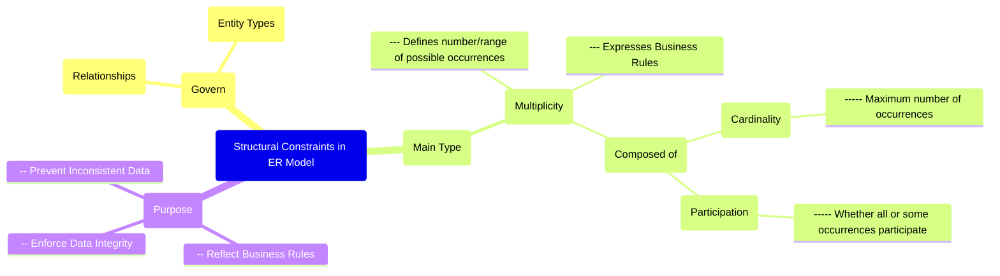

# Definition
Before proceeding, ensure you master [[Multiplicity_in_ER_Model]] and [[Relationship_Types]].
**Structural Constraints** in the Entity-Relationship (ER) Model are rules that govern the relationships between [[Entity_Types]]. They define the limits on how entities can be related to each other, specifically dictating the number of possible occurrences of an entity type that may relate to a single occurrence of an associated entity type through a particular relationship. These constraints essentially represent the **business rules** established by the user or organization. The main type of structural constraint is [[Multiplicity_in_ER_Model]], which is further broken down into [[Cardinality_in_ER_Model]] and [[Participation_in_ER_Model]]. Think of them as the "rules of engagement" for how different groups of people (entities) can interact with each other.

# The Mental Model
Imagine you're a bouncer at an exclusive club. The **Structural Constraints** are your rules for who can enter and how many people they can bring with them. For example, "one member can bring up to two guests" is a structural constraint. It governs the relationship between a `Member` entity and a `Guest` entity.

*Note: This `mindmap` centers `Structural Constraints in ER Model`, illustrating their purpose, what they govern, and their main components: Multiplicity, Cardinality, and Participation.*

# Context & Framework
### Where Does it Live? (The Map)
[[Structural_Constraints_in_ER_Model]] are an essential element of the [[Entity_Relationship_ER_Model]], defining the semantic integrity of how [[Entity_Types]] relate to one another through [[Relationship_Types]]. They are crucial for accurately capturing the business rules of an organization during [[Conceptual_Database_Design]]. The overarching concept is [[Multiplicity_in_ER_Model]], which describes the quantitative aspects of a relationship, broken down into [[Cardinality_in_ER_Model]] (the maximum number of relationships) and [[Participation_in_ER_Model]] (whether involvement is mandatory or optional).

# The Mastery Deep Dive
### Opening the Hood: What's Inside?
Structural constraints are vital because they directly enforce the rules that govern data. Without them, a database could easily store invalid or inconsistent information. For binary relationships (the most common degree), these constraints are expressed as:
*   **One-to-One (1:1)**: Each occurrence in one entity type relates to at most one occurrence in the other entity type. (e.g., `Employee` `Manages` `Department`, where one employee manages one department, and one department is managed by one employee).
*   **One-to-Many (1:*)**: Each occurrence in the first entity type relates to one or more occurrences in the second entity type, but each occurrence in the second entity type relates to at most one in the first. (e.g., `Department` `Has` `Employees`).
*   **Many-to-Many (*:*)**: Each occurrence in one entity type can relate to many occurrences in the other, and vice-versa. (e.g., `Student` `Enrolls_In` `Courses`).
These define the fundamental "allowed connections" between entities, reflecting real-world business policies.

### The Translator: Hacker Slang to Exam Terms
When a business rule states "every employee *must* belong to a department" (Hacker Slang), this translates to a **total participation constraint** (Exam Term) for the `Employee` entity in the `Works_For` relationship with `Department`. Similarly, "a project can have *many* employees working on it" (Hacker Slang) translates to a **many-to-many cardinality** (Exam Term) between `Project` and `Employee`. This formalized language ensures that subjective business needs are precisely captured in the database design.

# Constraints & Limitations
### The Hard Choice: Option A or Option B?
A common dilemma arises when business rules are ambiguous or change frequently. For example, if a "customer may or may not have an order," that implies optional participation. But what if the rule is "a customer must have at least one order to be considered active"? This changes the participation constraint. The trade-off is between **flexibility for future changes** (designing for looser constraints) and **strict data integrity** (enforcing current, tight constraints). Overly strict constraints might break the system if business rules evolve, while overly loose constraints risk allowing invalid data. The designer must strike a balance and communicate these implications.

# Significance & Application
Structural Constraints are academically significant as they provide the formal mechanisms for representing business rules directly within the data model. In the real world, it's an indispensable skill for **Database Designers**, **Business Analysts**, and **Data Architects**. They are applied in virtually every database design to ensure that the data accurately reflects the real-world rules it is meant to model. For example, ensuring that an `Order` *must* be placed by an existing `Customer` (mandatory participation) or that a `Product` can be in `Many` `Orders` (many-to-many cardinality) prevents inconsistent data, enforces business logic, and guarantees the integrity of the information system.

# The Worked Example
*Test your mastery. Cover the solutions below to test yourself first.*

Consider a simplified database for a company that tracks `Employees` and `Departments`.

### Level 1: The Sanity Check (Verification)
**The Question:** For the relationship `Employee Works_For Department`, if every employee must belong to exactly one department, what is the cardinality from `Employee` to `Department`?
> **Solution:** The cardinality from `Employee` to `Department` is **one** (1).

### Level 2: The Crucible (Mastery & Edge Cases)
**The Scenario:** A designer initially models the relationship `Department Has Employee` with a cardinality of "one-to-many" (1:*) from `Department` to `Employee`. However, the business rule states that a department *must* have at least one employee, and an employee *must* belong to a department.
**The Challenge:**
(a) Based on the business rule, describe the specific participation constraint for the `Department` entity in the `Has` relationship.
(b) Explain why a simple "one-to-many" cardinality with default optional participation would fail to capture both aspects of the business rule.
(c) How would the participation constraint for `Employee` be defined in this scenario?
> **Solution:**
> (a) The specific participation constraint for the `Department` entity in the `Has` relationship is **total participation** (or mandatory participation), with a minimum cardinality of one (1). This means a `Department` occurrence *must* participate in the `Has` relationship with at least one `Employee`.
> (b) A simple "one-to-many" cardinality with default optional participation would fail to capture both aspects because:
>    1.  **Department Participation:** Default optional participation would allow a `Department` to exist without any `Employee`s, which violates the rule that a department *must* have at least one employee.
>    2.  **Employee Participation:** Default optional participation would also allow an `Employee` to exist without a `Department`, which violates the rule that an employee *must* belong to a department.
> (c) The participation constraint for `Employee` in the `Works_For` (or `Has`) relationship would also be **total participation** (mandatory participation), with a minimum cardinality of one (1).

# Key Takeaways
*   Structural constraints are rules in the ER Model that govern relationships between entity types, reflecting business rules.
*   [[Multiplicity_in_ER_Model]] is the main type, defining the number or range of possible related occurrences, encompassing cardinality (maximum) and participation (mandatory/optional).
*   These constraints are vital for enforcing data integrity, preventing inconsistencies, and ensuring the database accurately models real-world interactions and policies.

# Knowledge Graph Connections
| Concept                     | Connection / Relationship                                                                   |
| :
-------------------------- | :
------------------------------------------------------------------------------------------ |
| [[Multiplicity_in_ER_Model]] | This is the main type of structural constraint, defining quantitative limits on relationships. |
| [[Relationship_Types]]      | Structural constraints explicitly govern how these associations between entities operate.     |
| [[Entity_Types]]            | Structural constraints define the interaction rules for occurrences of these classifications. |
| [[Cardinality_in_ER_Model]] | This is a component of multiplicity, defining the maximum number of relationship occurrences. |
| [[Participation_in_ER_Model]] | This is a component of multiplicity, determining whether all or some entities participate in a relationship. |
| [[Entity_Relationship_ER_Model]] | Structural constraints are a critical part of the ER model for representing business rules. |
---