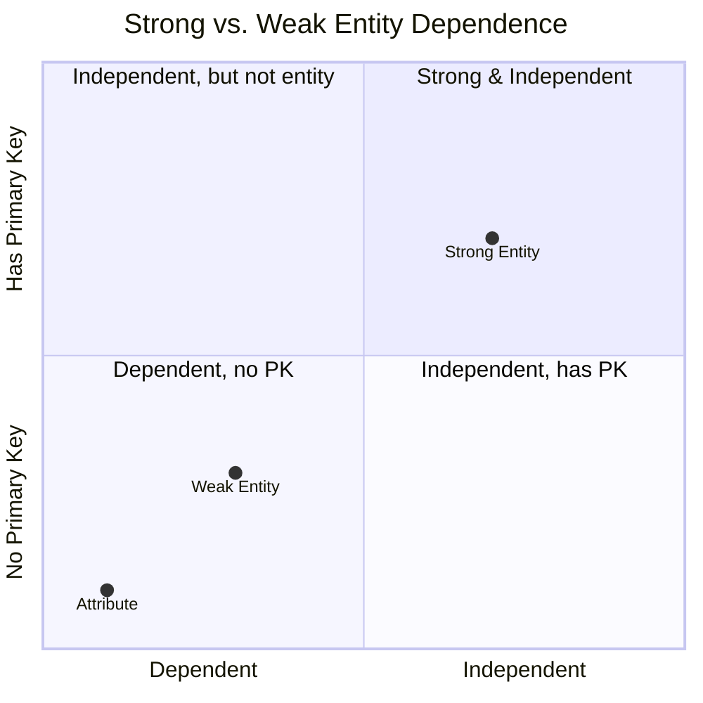

# Definition
Before proceeding, ensure you master [[Strong_Entity_Type]] and [[Composite_Key]].
A **Weak Entity Type** is an entity type that is **existence-dependent** on some other entity type. This means that an occurrence of a weak entity type cannot exist in the database without an occurrence of its owner entity type. Furthermore, a weak entity type does not possess its own [[Primary_Key]]; its identification relies on the primary key of its owner (a [[Strong_Entity_Type]]) combined with its own **partial discriminator key**. In an Entity-Relationship (ER) Diagram, a weak entity type is represented by a double rectangle, and its identifying relationship with the strong entity is represented by a double diamond. Think of it like a specific apartment unit within an apartment building: it cannot exist without the building itself, and its unit number (`#101`) is only unique within that particular building, not globally.

# The Mental Model
Imagine a **Weak Entity Type** as a province or state within a country. It has some local characteristics (its **partial discriminator key**), but its full identity and existence are fundamentally tied to, and dependent on, the larger country (the [[Strong_Entity_Type]]). If the country ceases to exist, so too does the province in that context.

*Note: This `quadrantChart` visually differentiates Strong and Weak Entity Types based on their independence and primary key ownership.*

# Context & Framework
### The Family Tree
Within the hierarchy of [[Entity_Types]], the weak entity type is a specialized category that expresses a crucial form of dependence. Its existence is always contingent on a [[Strong_Entity_Type]], often called its **owner entity** or **parent entity**. The relationship between a strong entity and its weak entity is known as an **identifying relationship**. Understanding this relationship is vital for correctly modeling how composite keys are formed for weak entities, which combine the owner's primary key with the weak entity's partial discriminator.

# The Mastery Deep Dive
### Opening the Hood: What's Inside?
The core anatomy of a weak entity involves two key elements:
*   **Existence Dependency**: A weak entity literally cannot exist without its owner entity. For example, a `Dependent` record (for an employee's family member) cannot exist without the `Employee` record itself. If the employee leaves, their dependents' records, in that context, cease to be relevant.
*   **Partial Discriminator Key**: While a weak entity doesn't have a *full* primary key of its own, it possesses a **partial key** (also called a discriminator) that uniquely identifies weak entity occurrences *within the context of a particular owner entity*. For instance, a `Room_Number` (e.g., '101') is only unique within a specific `Building`. The combination of the `Building`'s primary key and `Room_Number` then forms the `Room`'s full [[Composite_Key]].
This dual nature of dependence and contextual uniqueness is fundamental to weak entities.

### Spot the Impostor: Addressing the reliance of weak entities on strong entities for their existence and identification.
A common "impostor" scenario is misidentifying an entity as weak when it actually has a perfectly good, independent primary key of its own. If an entity like `Course_Section` has a globally unique `Section_ID` (e.g., a UUID), even if it relates to a `Course`, it would be a strong entity. Its identity is independent. A true weak entity *must* rely on its owner's primary key for its full identification. If it can be identified purely by its own attributes, it's a strong entity, regardless of other relationships.

# Constraints & Limitations
### The Devil's Advocate: Why might this be wrong?
Modeling an entity as weak can sometimes introduce unnecessary complexity if the "weak" entity could genuinely exist independently with its own unique identifier. For example, while `Dependent` might typically be weak, if the database needed to track `Dependent`s even after the `Employee` leaves (e.g., for alumni network), then `Dependent` might warrant its own `Dependent_ID` and thus become a strong entity. The trade-off is between representing true existence dependency accurately versus simplifying the model by making all entities strong (and possibly losing some semantic information) for ease of implementation. Over-using weak entities when not strictly necessary can also lead to more complex querying.

# Significance & Application
Understanding Weak Entity Types is academically significant as it highlights important nuances in modeling data with dependencies and introduces the concept of identifying relationships. In the real world, it's a valuable skill for **Database Designers** when dealing with hierarchical or part-of relationships where entities truly rely on others for their existence. Common applications include modeling `Dependents` of employees, `Rooms` within a building, `Line_Items` within an order, or `Sections` of a course. Correctly identifying and modeling weak entities ensures data integrity by enforcing existence dependencies and accurately representing complex real-world associations.

# The Worked Example
*Test your mastery. Cover the solutions below to test yourself first.*

Consider a university database that tracks `Departments` and the various `Courses` offered within each department. Each `Course` has a unique `Course_Number` (e.g., "101", "205") that is only unique *within* a particular `Department`.

### Level 1: The Sanity Check (Verification)
**The Question:** Is the `Course` entity type, as described, a strong or weak entity type?
> **Solution:** `Course` is a [[Weak_Entity_Type]].

### Level 2: The Crucible (Mastery & Edge Cases)
**The Scenario:** To uniquely identify a `Course` occurrence (e.g., "CS 101" vs. "MATH 101"), the designer decides to combine `Department_Name` (from the `Department` entity) with `Course_Number` (from the `Course` entity).
**The Challenge:**
(a) Explain why `Course_Number` alone is insufficient to uniquely identify a `Course` occurrence in this context.
(b) How is `Course_Number` referred to in the context of a weak entity type?
(c) Describe the full primary key for the `Course` entity type, using the terms `Department_ID` (primary key of `Department`) and `Course_Number`.
> **Solution:**
> (a) `Course_Number` alone is insufficient because it is only unique *within* a particular `Department`. For instance, both the Computer Science department and the Mathematics department could offer a "101" course. To distinguish "CS 101" from "MATH 101", the `Department` context is required.
> (b) In the context of a weak entity type, `Course_Number` is referred to as a **partial discriminator key**.
> (c) The full primary key for the `Course` entity type would be a [[Composite_Key]] formed by `Department_ID` (the primary key of the owner `Department` entity) combined with `Course_Number` (the partial discriminator key of the `Course` entity).

# Key Takeaways
*   A weak entity type is existence-dependent on a strong entity type and cannot exist without its owner.
*   It does not have its own primary key; instead, its identification relies on the primary key of its owner combined with its own partial discriminator key.
*   Weak entities are commonly used to model components of a whole or dependent entities in hierarchical relationships, enforcing critical data integrity constraints.

# Knowledge Graph Connections
| Concept                     | Connection / Relationship                                                                   |
| :
-------------------------- | :
------------------------------------------------------------------------------------------ |
| [[Entity_Types]]            | This is a specific classification of entity types based on their dependence.                  |
| [[Strong_Entity_Type]]      | This is the owner entity that a weak entity type is existence-dependent on.                   |
| [[Primary_Key]]             | The primary key of the strong entity is a component of the weak entity's composite key.       |
| [[Composite_Key]]           | The full unique identifier for a weak entity is always a composite key.                       |
| [[Entity_Relationship_ER_Model]] | Weak entities are a core concept for representing dependent objects in ER diagrams.           |
---