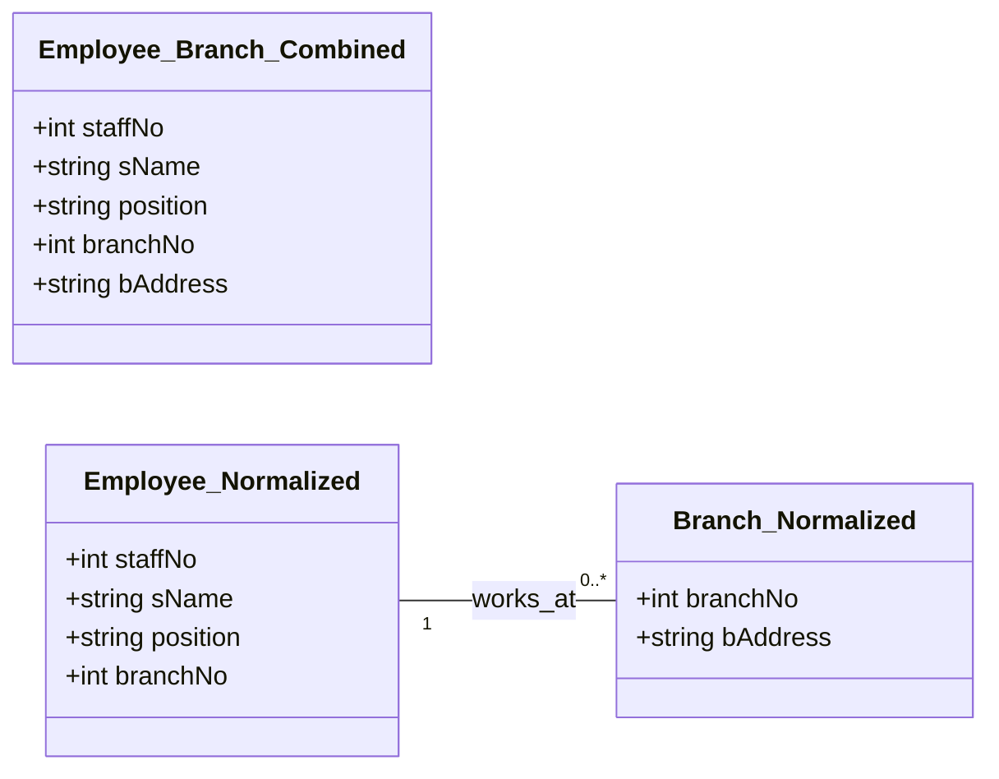

# Definition
Before proceeding, ensure you master [[Normalization_in_Database_Design]] and Relational_Tables.
Data redundancy refers to the undesirable situation in a database where the same piece of information is stored multiple times in multiple places. While some redundancy is necessary (e.g., foreign keys), excessive and uncontrolled redundancy can lead to significant problems known as update anomalies. Update anomalies are inconsistencies or errors that can arise when data in a redundant database is inserted, deleted, or modified, because not all copies of the redundant data are updated consistently. Think of it like having the same phone number written on three different contact lists; if you change your number on one list but forget the others, you now have inconsistent information.

# The Mental Model
Imagine you have a company's staff list printed out. If each employee's record includes their branch's full address (e.g., "Main Street, City A"), and 50 employees work at that branch, the address "Main Street, City A" is written 50 times. This is `Data Redundancy`. Now, what if the branch moves to a new address? You'd have to find and update all 50 employee records. If you miss even one, you have an `Update Anomaly` – some employees point to the old address, some to the new. This is why normalization breaks this into two lists: one for "Employees" and one for "Branches," with Employees just having a "Branch ID" to link them.

*Note: This `classDiagram` illustrates the concept of data redundancy and how normalization addresses it. `Employee_Branch_Combined` shows an unnormalized scenario where branch details are repeated for each employee. `Employee_Normalized` and `Branch_Normalized` demonstrate the normalized approach, where `branchNo` acts as a foreign key in `Employee_Normalized`, minimizing redundancy.*

# Context & Framework
### How to Break It (The Villain's Plan)
Data redundancy lays the perfect groundwork for update anomalies, which can be thought of as "the villain's plan" to undermine data integrity. When information is duplicated, any operation (insert, delete, modify) that affects one copy but not all copies introduces inconsistency. This framework explains why a database designer's major aim is to group attributes into relations to minimize this redundancy. The consequences of these anomalies range from inaccurate reporting to application failures, making the elimination of redundancy a critical goal in database design.

### The Engineering Trade-off
Implementing a database with minimal data redundancy (achieved through normalization) offers substantial engineering benefits. It drastically reduces the number of operations required to update data, which in turn significantly lowers the opportunities for data inconsistencies. This translates directly to more reliable data and simplified application logic. Furthermore, by storing each piece of unique information only once, the database requires less file storage space, leading to minimized costs and more efficient resource utilization. This trade-off prioritizes data integrity and long-term maintainability over potentially faster (but risky) denormalized read operations.

# The Mastery Deep Dive
### The Villain's Plan: How Data Redundancy Leads to Anomalies
Data redundancy, while seemingly benign, is the root cause of **update anomalies**, which are inconsistencies arising from operations on a database. There are three main types:

1.  **Insertion Anomaly:**
    *   **The Problem:** Occurs when you cannot insert a new record without also inserting information about another, unrelated entity. Or, conversely, you cannot add information about one entity without having complete information about another.
    *   **Example:** In a `StaffBranch` table (`staffNo, sName, branchNo, bAddress`), you cannot add a new `Branch` (`branchNo, bAddress`) unless there is at least one `Staff` member to assign to it. If you try to add a new branch with no staff, you'd have to insert null values for staff attributes, which is problematic if `staffNo` is part of the primary key.
    *   **Consequence:** Impossibility of recording certain facts, or forced (and potentially invalid) data entry.

2.  **Deletion Anomaly:**
    *   **The Problem:** Occurs when deleting a record results in the unintended loss of other, crucial data that was associated with the deleted record.
    *   **Example:** In the `StaffBranch` table, if the last `Staff` member assigned to a specific `Branch` is deleted, all information about that `Branch` (`branchNo, bAddress`) might also be inadvertently deleted, even if the branch still exists and is important.
    *   **Consequence:** Loss of dependent data, resulting in incomplete information.

3.  **Modification Anomaly (Update Anomaly):**
    *   **The Problem:** Occurs when updating a piece of data requires multiple changes across different records, and if even one change is missed, it leads to inconsistencies.
    *   **Example:** In the `StaffBranch` table, if the `bAddress` for `branchNo 'B001'` needs to be changed, and there are 20 staff members assigned to `B001`, you would have to update `bAddress` in all 20 staff records. If you only update 19, the database now contains two different addresses for `branchNo 'B001'`.
    *   **Consequence:** Data inconsistency, which means different parts of the database (or different reports) will show conflicting information.

### The Shield: How Normalization Stops the Villain
Normalization is the "shield" against these anomalies. By systematically decomposing relations into smaller, well-structured relations, it ensures that each non-key attribute is fully functionally dependent on the primary key, and no non-key attribute is transitively dependent on the primary key. This process ensures:
*   Each piece of information is stored in only one place (or as part of a foreign key for linking).
*   New information about one entity can be added without needing data about another (solving insertion anomalies).
*   Deleting information about one entity does not accidentally delete information about another (solving deletion anomalies).
*   Updating information only requires a single change in one location (solving modification anomalies).
This decomposition maintains the lossless-join and dependency preservation properties, ensuring that the original information can always be accurately reconstructed from the normalized tables.

# Constraints & Limitations
### The Engineering Trade-off
While normalization effectively eliminates data redundancy and update anomalies, a perceived limitation or engineering trade-off is the potential for increased complexity in querying. Retrieving comprehensive information that spans multiple entities (e.g., "all staff members and their branch addresses") requires joining several tables, which can sometimes be more complex to write and potentially slightly slower than querying a single, denormalized table. However, this trade-off is generally accepted because the benefits of data integrity, reduced storage, and ease of maintenance far outweigh the minor performance implications for most transactional databases.

# Significance & Application
Understanding data redundancy and update anomalies is foundational to database design. Academically, it motivates the need for normalization. Professionally, it guides designers to create robust systems where data is reliable and consistent. In real-world applications (e.g., banking, healthcare, e-commerce), preventing these anomalies is critical to avoid financial errors, incorrect patient diagnoses, or failed transactions, directly impacting business operations and user trust.

# The Worked Example
Consider a simplified `ORDERS_PRODUCTS` table:
`ORDERS_PRODUCTS(OrderID, CustomerID, CustomerName, OrderDate, ProductID, ProductName, ProductPrice, Quantity)`

Assume the following:
*   `OrderID, ProductID` is the primary key (PK).
*   `OrderID` -> `CustomerID`, `CustomerName`, `OrderDate`
*   `CustomerID` -> `CustomerName`
*   `ProductID` -> `ProductName`, `ProductPrice`

**Data Redundancy:**
*   `CustomerName` is repeated for every order placed by the same `CustomerID`.
*   `OrderDate` is repeated for every product within the same `OrderID`.
*   `ProductName` and `ProductPrice` are repeated for every `ProductID` in an `ORDER`.

**Update Anomalies Illustration:**

1.  **Insertion Anomaly:**
    *   You cannot add a new `Product` (`ProductID, ProductName, ProductPrice`) to the database unless it is part of an existing `OrderID`. If a new product is added to inventory but hasn't been ordered yet, it cannot be recorded.

2.  **Deletion Anomaly:**
    *   If `OrderID='100'` is deleted because the customer canceled, and `ProductID='P1'` was only in `OrderID='100'`, then all information about `P1` (`ProductName`, `ProductPrice`) is lost from the database.

3.  **Modification Anomaly:**
    *   If `CustomerName` for `CustomerID='C1'` needs to be changed (e.g., due to a marriage), you would have to update `CustomerName` in every record where `CustomerID='C1'` appears. Forgetting to update even one record would lead to `C1` having two different names in the database.

# The Proving Ground
*Test your mastery. Cover the solutions below to test yourself first.*

### Level 1: The Fact Check (Verification)
**The Question:** Define data redundancy in the context of relational databases.
> **Solution:** Data redundancy is the storage of the same piece of information multiple times in different places within a database.

### Level 2: The Trade-off (Mastery & Edge Cases)
**The Scenario:** Describe the three main types of update anomalies (insertion, deletion, modification) and provide a small example for each that illustrates the problem.
> **Solution:**
> 1.  **Insertion Anomaly:** The inability to insert a new record without simultaneously entering information about another, unrelated entity. *Example: In a combined `Employee_Department` table where `Department_Name` repeats for each employee, you cannot add a new department until an employee is assigned to it (if `EmployeeID` is part of the primary key).*
> 2.  **Deletion Anomaly:** The unintended loss of critical data when a record is deleted because other, dependent data was stored redundantly within that record. *Example: If the last employee in a `Department` is deleted from a `Employee_Department` table, all information about that `Department` (e.g., `Department_Location`) might also be lost.*
> 3.  **Modification Anomaly:** The need to make multiple changes across different records to update a single piece of information, leading to inconsistencies if all copies are not updated. *Example: If a `Project` title is stored with every `Employee` assigned to it, and the `Project` title changes, every employee's record for that project needs to be updated. Missing one update leads to inconsistent project titles.*

### Level 3: The Lose-Lose Scenario (Mastery & Edge Cases)
**The Scenario:** Your team has inherited an existing database with significant data redundancy. The lead developer suggests ignoring it to meet a tight deadline for a new feature. Explain how proceeding with this redundancy could lead to a "lose-lose" situation for future development and data reliability.
> **Solution:** Proceeding with significant data redundancy to meet a deadline is a "lose-lose" for future development and data reliability due to:
> 1.  **Increased Future Development Costs (Lose for Productivity):** Any new feature requiring data modification will encounter the update anomaly problem. Developers will constantly have to write complex, error-prone code to ensure all redundant copies of data are updated consistently, or risk data integrity issues. This means simple changes become difficult, time-consuming, and expensive, *losing* valuable development time on maintenance rather than new features.
> 2.  **Unreliable Data (Lose for Trust and Decision-Making):** The inherent risk of modification anomalies means that data inconsistencies are highly likely. Different reports or parts of the application could show conflicting information (e.g., a customer's address being different in their order history vs. their profile). This directly impacts data reliability, leading to bad business decisions, customer dissatisfaction, and a *loss* of trust in the system's data, making any "fast reads" effectively worthless if the information itself is incorrect.

# Key Takeaways
*   Data redundancy is the undesirable duplication of information.
*   It leads to update anomalies: insertion, deletion, and modification.
*   These anomalies cause data inconsistencies, loss of data, and difficulty in maintaining the database.
*   Minimizing redundancy is a primary goal of relational database design, achieved through normalization.

# Knowledge Graph Connections
| Concept                     | Connection / Relationship                                                                                                               |
| :
-------------------------- | :
-------------------------------------------------------------------------------------------------------------------------------------- |
| [[Normalization_in_Database_Design]] | Normalization is the technique explicitly designed to minimize data redundancy and prevent update anomalies.                                |
| Relational_Tables       | Update anomalies manifest as problems within unnormalized or poorly designed relational tables.                                           |
| [[First_Normal_Form_1NF]]   | 1NF addresses issues related to repeating groups, which contribute to redundancy.                                                       |
| [[Second_Normal_Form_2NF]]  | 2NF tackles partial functional dependencies, which are a source of redundancy leading to anomalies.                                       |
| [[Third_Normal_Form_3NF]]   | 3NF eliminates transitive functional dependencies, further reducing redundancy and avoiding anomalies.                                  |
---