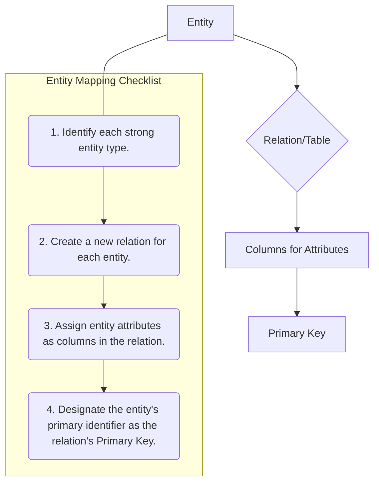

# Definition
Before proceeding, ensure you master [[Entity_Types]] and Relational_Tables.
Mapping entities to relations is the foundational step in transforming an E-R model into a logical database design. It involves taking each entity type identified in the conceptual E-R model and converting it into a corresponding relation (or table) in the relational schema. During this process, the entity's attributes become columns in the table, and its unique identifier (primary key) is established. Think of this as defining the main "containers" in your database, where each container represents a distinct type of object or concept.

# The Mental Model
Imagine you're sorting a collection of LEGO bricks. Each distinct type of brick (e.g., a "2x4 brick," a "minifigure," a "wheel") is an `Entity`. Mapping these entities to relations is like deciding that for each unique type, you'll create a dedicated box (`Relation`/`Table`) labeled with its type. Inside each box, you'll list its characteristics (like color, size, number of studs) as `Columns`. The unique ID for each brick type, like its part number, becomes the `Primary Key`.

*Note: This `graph TD` diagram provides a "Pilot's Checklist" for mapping entities to relations, detailing the sequential steps involved. It shows the logical flow from an Entity to its corresponding Relation with columns and a Primary Key.*

# Context & Framework
### System Architecture & Dependencies
The mapping of entities to relations forms the architectural backbone of the logical data model. Every other component, such as attributes and relationships, depends on these base relations. Correctly identifying and translating strong entities ensures that core data structures are stable and accurately reflect the real-world objects they represent. Weak entities are also mapped to relations, but their primary key is partially or fully dependent on an owner strong entity, creating a direct dependency in the schema.

# The Mastery Deep Dive
### The "Pilot's Checklist" (Do Not Skip)
Mapping entities to relations is a straightforward, checklist-driven process.
- [ ] **Identify all Strong Entity Types:** Scan your E-R diagram for every entity that has its own unique identifier (primary key).
- [ ] **Create a New Relation:** For each identified strong entity, create a new relational table. The name of the relation should typically be the plural form of the entity name (e.g., `EMPLOYEE` entity becomes `Employees` table, or simply `EMPLOYEE` if following specific naming conventions).
- [ ] **Map Attributes to Columns:** All simple, single-valued attributes of the entity are directly included as columns in the newly created relation.
- [ ] **Designate the Primary Key:** The entity's primary identifier (the attribute or set of attributes that uniquely identifies each entity instance) becomes the primary key of the new relation. This primary key will also be used to link to other relations.
- [ ] **Handle Weak Entities (Special Case):** For each weak entity, a new relation is also created. Its primary key will be a composite key consisting of its partial key and the primary key of its owner (identifying) entity, which is posted as a foreign key.

### Opening the Hood: What's Inside?
When an entity like `CUSTOMER` (with attributes `CustomerID`, `Name`, `Address`) is mapped, the "Engine Block" (`CUSTOMER` entity) transforms into a `CUSTOMER` table. The `CustomerID` becomes the unique `Primary Key`. `Name` and `Address` become regular `Columns`. If `Address` was initially a composite attribute, it would be further decomposed (e.g., `Street`, `City`, `PostalCode`), adhering to atomicity principles within the relational model. This detailed view ensures that all data properties are preserved and structured for storage.

# Constraints & Limitations
### The Engineering Trade-off
A key engineering trade-off in entity mapping arises with weak entities and how their existence is contingent on a strong entity. While a separate table is typically created for weak entities, deciding on their primary key involves incorporating the owner entity's primary key. This design decision directly impacts how instances of the weak entity can be uniquely identified and how referential integrity is maintained. Incorrectly defining the primary key for a weak entity can lead to data integrity issues or difficulty in uniquely referencing its instances.

# Significance & Application
Correctly mapping entities to relations is the cornerstone of logical database design. It directly impacts data organization, integrity, and future query efficiency. In academic settings, it's the fundamental skill taught for relational database design. In real-world applications, robust entity mapping ensures that the core business objects are accurately represented, providing a solid, non-redundant foundation for the entire database system.

# The Worked Example
Let's map two entities:
1.  **Strong Entity: `COURSE`**
    *   Attributes: `CourseID` (PK), `CourseName`, `Credits`
    *   Mapping:
        *   Create relation: `COURSE`
        *   Columns: `CourseID`, `CourseName`, `Credits`
        *   Primary Key: `CourseID`
    *   Resulting Relation: `COURSE(CourseID, CourseName, Credits)`

2.  **Weak Entity: `DEPENDENT`**
    *   Attributes: `DependentName` (Partial Key), `Relationship`
    *   Owner Entity: `EMPLOYEE` (Strong Entity, with PK `EmployeeID`)
    *   Mapping:
        *   Create relation: `DEPENDENT`
        *   Columns: `DependentName`, `Relationship`, plus the `EmployeeID` from the owner.
        *   Primary Key: Composite key of `(EmployeeID, DependentName)`
        *   Foreign Key: `EmployeeID` references `EMPLOYEE(EmployeeID)`
    *   Resulting Relation: `DEPENDENT(EmployeeID, DependentName, Relationship)`

# The Proving Ground
*Test your mastery. Cover the solutions below to test yourself first.*

### Level 1: The Tool Check (Verification)
**The Question:** When mapping an entity from a conceptual E-R model to a logical data model, what is the direct equivalent in the relational model?
> **Solution:** A relation (or table).

### Level 2: The Routine Run (Mastery & Edge Cases)
**The Scenario:** List the key steps involved in mapping a strong entity `DEPARTMENT` (with attributes `DepartmentID`, `DepartmentName`) to a relation, ensuring its primary key is correctly identified.
> **Solution:**
> 1.  Identify `DEPARTMENT` as a strong entity.
> 2.  Create a new relation (table) named `DEPARTMENT`.
> 3.  Add `DepartmentID` and `DepartmentName` as columns.
> 4.  Designate `DepartmentID` as the primary key of the `DEPARTMENT` relation.

### Level 3: The Disaster Drill (Mastery & Edge Cases)
**The Scenario:** A database designer forgot to assign a primary key during the mapping of the `PRODUCT` entity, instead only listing `ProductName` and `Description` as attributes. What immediate issues would arise if this design were implemented, and what is the crucial recovery step?
> **Solution:** If `PRODUCT` is created without a primary key, immediate issues would include:
> 1.  **No unique identification:** It would be impossible to uniquely identify individual products, leading to ambiguity.
> 2.  **Referential integrity violations:** Other tables could not reliably reference specific products, breaking relationships.
> 3.  **Data redundancy:** It becomes harder to prevent duplicate `ProductName` and `Description` entries without a unique identifier.
>
> The crucial recovery step is to **add a suitable primary key attribute** (e.g., `ProductID` with an auto-incrementing integer or UUID) to the `PRODUCT` relation and ensure it is designated as the primary key.

# Key Takeaways
*   Each strong E-R entity translates directly into a distinct relation (table) in the logical data model.
*   Attributes of the entity become columns in the relation, and the entity's identifier becomes the relation's primary key.
*   Weak entities also become relations, but their primary key is composite, including the primary key of their owning entity.

# Knowledge Graph Connections
| Concept                     | Connection / Relationship                                                                                                       |
| :
-------------------------- | :
-------------------------------------------------------------------------------------------------------------------------------------- |
| [[Translating_E_R_to_Logical_Model]] | This is a fundamental component of the overall E-R to logical model translation process.                                                |
| [[Entity_Types]]            | Entities, particularly strong entities, are the conceptual source for creating relations in the logical model.                            |
| Relational_Tables       | Relations (tables) are the direct output of mapping entities from the E-R model.                                                        |
| Primary_Keys            | The primary key of an entity is directly translated to the primary key of the corresponding relation.                                   |
| [[Weak_Entity_Types]]       | Weak entities have a specific mapping rule that incorporates their owner entity's primary key into their own relation.                    |
---