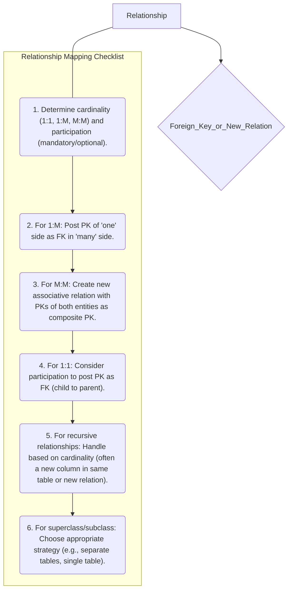

# Definition
Before proceeding, ensure you master [[Relationship_Types]] and Foreign_Keys.
Mapping relationships to relations is the intricate process of representing the associations between entities from an E-R model within a relational database schema. This involves translating various relationship cardinalities (one-to-one, one-to-many, many-to-many) and participation constraints (mandatory, optional) into foreign key constraints or, in some cases, the creation of new relations (associative tables). The goal is to preserve the conceptual links between entities in a structurally sound and referentially integrated manner within the logical data model. Think of it as creating the "bridges" or "links" between your database tables, allowing them to communicate and share related information.

# The Mental Model
Imagine you have a collection of recipe cards (`Entities`) and a collection of ingredient labels (`Entities`). A "Recipe Uses Ingredient" is a `Relationship`. Mapping this relationship means deciding how to connect your `Recipe` tables to your `Ingredient` tables. If one recipe uses many ingredients, you might add a foreign key to the `Ingredient` table that points back to the `Recipe` table. If many recipes use many ingredients, you'd create a separate "Recipe_Ingredients" table to link them all, acting as a bridge between the two.

*Note: This `graph TD` diagram provides a "Pilot's Checklist" for mapping various types of relationships to relations. It highlights the decision points based on cardinality and suggests the general approach for each relationship type, leading to either a foreign key or a new associative relation.*

# Context & Framework
### System Architecture & Dependencies
Relationships are the glue that binds the entity-relations together in the logical data model, forming a cohesive system architecture. The mapping process establishes explicit dependencies between tables through foreign key constraints, which are vital for maintaining referential integrity. For example, a foreign key in the `ORDER` table referencing the `CUSTOMER` table implies that an order cannot exist without a corresponding customer. This framework ensures that data across different tables remains consistent and valid, preventing orphaned records or illogical data states.

# The Mastery Deep Dive
### The "Pilot's Checklist" (Do Not Skip)
Mapping relationships is often the most complex part of E-R to relational translation due to the variety of cardinalities and participation constraints.
- [ ] **One-to-Many (1:M) Binary Relationships:**
    - [ ] Identify the 'one side' (parent entity) and the 'many side' (child entity).
    - [ ] Post a copy of the primary key (PK) attribute(s) of the **parent entity** into the relation representing the **child entity**. This copied PK acts as a foreign key (FK).
    - [ ] Any attributes of the relationship itself are also posted to the 'many side' (child entity's relation).
    *Example*: `DEPARTMENT` (one) `HAS` `EMPLOYEE` (many). `DeptID` (PK of `DEPARTMENT`) is posted as `DeptID` (FK) in `EMPLOYEE` relation.
- [ ] **Many-to-Many (M:M) Binary Relationships:**
    - [ ] Create a **new, separate relation** (often called an associative entity or bridge table) to represent the M:M relationship.
    - [ ] Post a copy of the PK attribute(s) of **both participating entities** into this new relation. These become foreign keys.
    - [ ] These foreign keys, in combination, form the **composite primary key** of the new relation.
    - [ ] Any attributes of the relationship itself are also included as columns in this new relation.
    *Example*: `STUDENT` `ENROLLS_IN` `COURSE`. Create `ENROLLMENT(StudentID, CourseID, Grade)`. `(StudentID, CourseID)` is PK, `StudentID` is FK to `STUDENT`, `CourseID` is FK to `COURSE`.
- [ ] **One-to-One (1:1) Binary Relationships:**
    - [ ] This is more flexible. The choice depends on participation constraints.
    - [ ] **Mandatory on both sides:** Combine entities into one relation, choosing one PK as the new relation's PK and the other as an alternate key.
    - [ ] **Mandatory on one side, optional on other:** Post PK of the optional side (parent) as FK into the mandatory side (child).
    - [ ] **Optional on both sides:** Create a new relation with both PKs as FKs (forming a composite PK), or choose one arbitrarily to post as an FK to the other.
- [ ] **Recursive Relationships:**
    - [ ] Handled similarly to binary relationships based on their cardinality (1:1, 1:M, M:M) but involve linking to the same entity.
    - [ ] Often involves adding a foreign key to the entity's own table (e.g., `ManagerID` in `EMPLOYEE` referencing `EmployeeID` in `EMPLOYEE`).
- [ ] **Superclass/Subclass Relationships:**
    - [ ] Multiple strategies exist (e.g., single table, multiple tables with shared primary key, or separate tables with foreign keys). The choice depends on disjointness, participation, and frequency of access.
    - [ ] The general approach is to identify the superclass as the parent and subclass as the child.

### How the Parts Talk to Each Other
Relationships define how information flows and is linked across different parts of the database. When `CUSTOMER` `PLACES` `ORDER` (1:M), the `CustomerID` in the `ORDER` table acts as the "bridge" that connects each order record back to the specific customer who placed it. This foreign key is the mechanism through which the parts (tables) talk to each other, allowing you to retrieve a customer's details when looking at their order, or list all orders for a given customer. This ensures that the logical schema maintains the intended associations defined in the E-R model.

# Constraints & Limitations
### The Engineering Trade-off
The primary engineering trade-off in mapping relationships, especially for 1:1 and superclass/subclass types, lies in choosing between consolidating data into fewer tables versus maintaining separate, distinct tables. Consolidating might reduce the number of joins needed for queries, potentially improving performance but could lead to a higher prevalence of null values if data is sparse. Conversely, keeping entities in separate tables increases the number of joins but might offer better flexibility and clearer semantic separation. The decision often balances perceived query complexity against data sparsity and future maintenance.

# Significance & Application
Accurate relationship mapping is paramount for the integrity and functionality of any relational database. It ensures that the database reflects the real-world connections between entities, preventing inconsistent data and enabling complex queries. In an academic context, mastering these rules is fundamental to database design. Professionally, database developers rely on precise relationship mapping to build robust, referentially sound systems that power applications requiring interconnected data, such as inventory management, human resources, and financial systems.

# The Worked Example
Let's map a few relationship types:

1.  **One-to-Many (1:M): `DEPARTMENT` (one) `HAS` `EMPLOYEE` (many)**
    *   `DEPARTMENT` (PK: `DeptID`)
    *   `EMPLOYEE` (PK: `EmpID`)
    *   Mapping: Post `DeptID` from `DEPARTMENT` into `EMPLOYEE`.
    *   Result: `DEPARTMENT(DeptID, DeptName)`
              `EMPLOYEE(EmpID, EmpName, DeptID (FK))`

2.  **Many-to-Many (M:M): `STUDENT` (many) `ENROLLS_IN` `COURSE` (many) with `Grade` attribute**
    *   `STUDENT` (PK: `StudentID`)
    *   `COURSE` (PK: `CourseID`)
    *   Mapping: Create a new associative table `ENROLLMENT`.
    *   Result: `STUDENT(StudentID, StudentName)`
              `COURSE(CourseID, CourseName)`
              `ENROLLMENT(StudentID (FK), CourseID (FK), Grade)`
              *(PK of ENROLLMENT is (StudentID, CourseID))*

3.  **One-to-One (1:1): `EMPLOYEE` (optional) `MANAGES` `DEPARTMENT` (mandatory)**
    *   `EMPLOYEE` (PK: `EmpID`)
    *   `DEPARTMENT` (PK: `DeptID`)
    *   Mapping: Post `EmpID` from `EMPLOYEE` (optional side/parent) into `DEPARTMENT` (mandatory side/child).
    *   Result: `EMPLOYEE(EmpID, EmpName)`
              `DEPARTMENT(DeptID, DeptName, EmpID (FK))`

# The Proving Ground
*Test your mastery. Cover the solutions below to test yourself first.*

### Level 1: The Tool Check (Verification)
**The Question:** What general principle guides the mapping of relationships between entities to relations in a logical data model?
> **Solution:** Relationships are primarily mapped by introducing foreign key constraints between existing tables or by creating new associative tables for many-to-many relationships.

### Level 2: The Routine Run (Mastery & Edge Cases)
**The Scenario:** Outline the primary steps for mapping a 1:M (one-to-many) relationship named `WORKS_FOR` between `DEPARTMENT` (one side) and `EMPLOYEE` (many side). Include how primary and foreign keys are handled.
> **Solution:**
> 1.  Identify `DEPARTMENT` as the 'one side' (parent entity) and `EMPLOYEE` as the 'many side' (child entity).
> 2.  Take the primary key of the `DEPARTMENT` entity (e.g., `DeptID`).
> 3.  Post a copy of this `DeptID` into the `EMPLOYEE` relation. This copied attribute becomes a foreign key in the `EMPLOYEE` relation, referencing the `DeptID` in the `DEPARTMENT` relation.
> 4.  The `DeptID` in the `DEPARTMENT` relation remains its primary key, and the `EmpID` (or similar) in the `EMPLOYEE` relation remains its primary key.

### Level 3: The Disaster Drill (Mastery & Edge Cases)
**The Scenario:** A database for a university mistakenly mapped a M:M (many-to-many) relationship between `STUDENT` and `COURSE` by simply posting the primary key of `STUDENT` into the `COURSE` relation. Describe why this is incorrect and what the correct mapping strategy should be, assuming the relationship itself has an attribute `Grade`.
> **Solution:**
> **Why it's Incorrect:**
> 1.  **Redundancy:** If `StudentID` is posted into the `COURSE` relation, and a course has many students, `CourseID`, `CourseName`, and other course details would be duplicated for every student enrolled in that course.
> 2.  **Atomicity/Multi-valued Issue:** Conversely, if `CourseID` is posted into the `STUDENT` relation, a student taking multiple courses would require the `CourseID` column to hold multiple values, violating 1NF (atomicity).
> 3.  **Loss of Relationship Attribute:** The `Grade` attribute, which belongs to the specific enrollment of a student in a course, cannot be meaningfully placed in either the `STUDENT` or `COURSE` relation without causing redundancy or data loss.
>
> **Correct Mapping Strategy:**
> 1.  Create a **new associative relation**, typically named `ENROLLMENT` (or `STUDENT_COURSE`).
> 2.  This `ENROLLMENT` relation will include the primary key of `STUDENT` (`StudentID`) and the primary key of `COURSE` (`CourseID`) as **foreign keys**.
> 3.  These two foreign keys (`StudentID`, `CourseID`) will collectively form the **composite primary key** of the `ENROLLMENT` relation, uniquely identifying each student-course pairing.
> 4.  The relationship attribute `Grade` is also included as a column in the `ENROLLMENT` relation.
>
> **Resulting Relations (example):**
> *   `STUDENT(StudentID, StudentName)`
> *   `COURSE(CourseID, CourseName)`
> *   `ENROLLMENT(StudentID (FK), CourseID (FK), Grade)`

# Key Takeaways
*   1:M relationships are mapped by posting the PK of the 'one' side as an FK in the 'many' side.
*   M:M relationships require a new associative relation (bridge table) with the PKs of both entities forming its composite PK.
*   1:1 relationships depend on participation constraints to determine the FK placement.
*   Special handling is required for recursive and superclass/subclass relationships.

# Knowledge Graph Connections
| Concept                     | Connection / Relationship                                                                                                               |
| :
-------------------------- | :
-------------------------------------------------------------------------------------------------------------------------------------- |
| [[Translating_E_R_to_Logical_Model]] | This is a fundamental component of the overall E-R to logical model translation process.                                                |
| [[Relationship_Types]]      | Understanding different relationship types (1:1, 1:M, M:M) is crucial for applying the correct mapping rules.                             |
| Foreign_Keys            | Foreign keys are the primary mechanism for representing relationships between tables in the relational model.                             |
| Associative_Entities    | M:M relationships often translate into associative entities (new relations) in the logical model.                                       |
| Cardinality             | The cardinality of a relationship directly dictates the mapping strategy (e.g., where a foreign key is placed).                           |
| Participation_Constraints | Participation constraints influence the optimal mapping strategy, especially for 1:1 and superclass/subclass relationships.             |
---