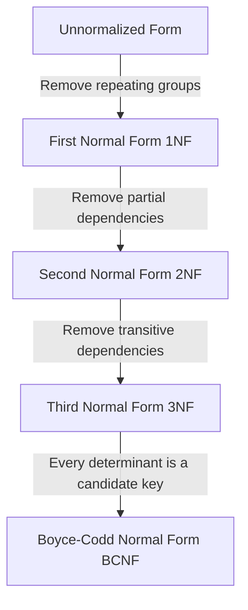

# Definition
Before proceeding, ensure you master [[Data_Redundancy_and_Update_Anomalies]] and [[Functional_Dependencies]].
Normalization is a systematic technique for creating a set of relations (tables) that effectively support the data requirements of an enterprise, primarily by minimizing data redundancy and preventing update anomalies. It involves a series of steps, each corresponding to a specific "normal form" (1NF, 2NF, 3NF, BCNF), which progressively refine the database schema to achieve a structurally sound and efficient design. Think of normalization as a rigorous cleaning and organizing process for your database tables, ensuring everything is in its proper place and nothing is unnecessarily duplicated.

# The Mental Model
Imagine you've just moved into a new house, and all your belongings are in a giant pile in the living room (`Unnormalized Form`). Normalization is like organizing these items. First, you put all items of the same type together (`First Normal Form`). Then, you make sure each box only contains things that truly belong there and aren't just there because they're part of a larger, mixed group (`Second Normal Form`). Finally, you ensure that nothing in a box can be determined by something *else* in that same box that isn't the box's main label (`Third Normal Form`). The goal is to make everything easy to find, update, and prevent clutter.

*Note: This `graph TD` diagram visually traces a relation through the stages of normalization, starting from an Unnormalized Form (UNF) and progressing through First Normal Form (1NF), Second Normal Form (2NF), Third Normal Form (3NF), and ultimately to Boyce-Codd Normal Form (BCNF). Each arrow indicates the specific type of dependency removed to achieve the next normal form.*

# Context & Framework
### System Architecture & Dependencies
Normalization plays a critical role in shaping the internal architecture of a relational database. It ensures that attributes with a close logical relationship are grouped into the same relation, leading to a minimal number of attributes necessary to support data requirements. This process directly influences how tables are structured, how data is distributed across them, and how foreign key dependencies are established. The outcome is a database that is easier to maintain, takes up minimal storage space, and reduces the opportunities for data inconsistencies, thereby supporting robust application development.

# The Mastery Deep Dive
### Follow the Ball: A Slow-Motion Trace
Let's trace a hypothetical relation, `StudentCourseInstructor`, through the normalization process.
**Initial State: `StudentCourseInstructor` (UNF)**
Imagine a single table containing all student, course, and instructor information, where a student can take multiple courses, and each course has an instructor. This table likely has repeating groups (e.g., student name and address repeated for every course they take), or all course details (title, credits) repeated for every student in it.
`STUDENT_COURSE_INSTRUCTOR(StudentID, StudentName, CourseID, CourseName, InstructorID, InstructorName)` (Where `CourseID`, `CourseName`, `InstructorID`, `InstructorName` is a repeating group for each `StudentID`).

1.  **To 1NF (Remove Repeating Groups):**
    We break out the repeating group into a new table or flatten the existing one. Let's flatten for simplicity here.
    `STUDENT_COURSE_INSTRUCTOR(StudentID, StudentName, CourseID, CourseName, InstructorID, InstructorName)`
    *   **Primary Key:** `(StudentID, CourseID)`
    *   *Problem:* This is 1NF, but `StudentName` depends only on `StudentID`, and `CourseName`, `InstructorID`, `InstructorName` depend only on `CourseID`. These are **partial dependencies**.

2.  **To 2NF (Remove Partial Dependencies):**
    We decompose the `STUDENT_COURSE_INSTRUCTOR` table into relations where non-primary-key attributes are fully functionally dependent on the primary key.
    *   `STUDENT(StudentID, StudentName)`
        *   PK: `StudentID`
    *   `COURSE_INSTRUCTOR(CourseID, CourseName, InstructorID, InstructorName)`
        *   PK: `CourseID`
    *   `ENROLLMENT(StudentID, CourseID)`
        *   PK: `(StudentID, CourseID)`
        *   FKs: `StudentID` references `STUDENT`, `CourseID` references `COURSE_INSTRUCTOR`
    *   *Problem:* `COURSE_INSTRUCTOR` is in 2NF, but `InstructorID` and `InstructorName` depend only on `CourseID`. Also, `InstructorName` depends on `InstructorID`. This reveals a **transitive dependency** (`CourseID → InstructorID → InstructorName`).

3.  **To 3NF (Remove Transitive Dependencies):**
    We decompose `COURSE_INSTRUCTOR` to remove the transitive dependency `CourseID → InstructorID → InstructorName`.
    *   `STUDENT(StudentID, StudentName)`
        *   PK: `StudentID`
    *   `COURSE(CourseID, CourseName, InstructorID)`
        *   PK: `CourseID`
        *   FK: `InstructorID` references `INSTRUCTOR`
    *   `INSTRUCTOR(InstructorID, InstructorName)`
        *   PK: `InstructorID`
    *   `ENROLLMENT(StudentID, CourseID)`
        *   PK: `(StudentID, CourseID)`
        *   FKs: `StudentID` references `STUDENT`, `CourseID` references `COURSE`
    *   *Result:* All relations are now in 3NF. They are minimal, attributes are logically grouped, and redundancy is minimized.

### The Transformation: Before and After
Before normalization, we had a single, complex `STUDENT_COURSE_INSTRUCTOR` table with issues like `StudentName` repeating for every course a student took, and `CourseName` repeating for every student taking that course. After normalization to 3NF, we have multiple smaller, focused tables: `STUDENT`, `COURSE`, `INSTRUCTOR`, and `ENROLLMENT`. Each table manages a distinct set of facts, linking through foreign keys. This transformation reduces redundancy, simplifies data updates, and ensures the integrity of the data model.

# Constraints & Limitations
### The Engineering Trade-off
While normalization is highly beneficial for data integrity and redundancy reduction, an engineering trade-off exists regarding query performance. A highly normalized database, particularly one reaching BCNF or higher, often results in many smaller tables. Retrieving comprehensive information might then require numerous JOIN operations, which can sometimes be computationally expensive. In scenarios like data warehousing or reporting systems, where read performance is paramount and updates are infrequent, designers may strategically choose to *denormalize* certain tables to reduce joins, accepting a controlled amount of redundancy for faster query execution.

# Significance & Application
Normalization is a cornerstone of relational database design, both academically and professionally. It provides a formal framework for designing robust, efficient, and consistent databases, preventing common data anomalies. In the real world, virtually every well-designed relational database, from banking systems to e-commerce platforms, utilizes normalization principles to ensure data accuracy, reduce storage costs, and simplify maintenance, leading to more reliable and scalable applications.

# The Worked Example
Consider an `ORDER_DETAILS` table:
`ORDER_DETAILS(OrderID, OrderDate, CustomerID, CustomerName, ProductID, ProductName, Price, Quantity)`
Assumed functional dependencies:
*   `OrderID` → `OrderDate`, `CustomerID`, `CustomerName`
*   `CustomerID` → `CustomerName` (transitive via `OrderID` if `OrderID` is PK)
*   `ProductID` → `ProductName`, `Price`
*   `OrderID, ProductID` → `Quantity` (composite PK for order items)

**Normalization Steps:**

1.  **UNF to 1NF:** Assume `OrderID, ProductID` is the initial key. If `ProductName` or `Price` were repeating for multiple `Quantity` values, we'd flatten or create new tables. Here, it seems already flattened.
    `ORDER_DETAILS` is in 1NF (all attributes are atomic, no repeating groups).

2.  **1NF to 2NF:** Check for partial dependencies on the primary key `(OrderID, ProductID)`.
    *   `OrderID` → `OrderDate`, `CustomerID`, `CustomerName` (Partial dependency, depends only on `OrderID`)
    *   `ProductID` → `ProductName`, `Price` (Partial dependency, depends only on `ProductID`)
    *   Remove these partial dependencies:
        *   Create `ORDERS(OrderID, OrderDate, CustomerID, CustomerName)`
        *   Create `PRODUCTS(ProductID, ProductName, Price)`
        *   Remaining: `ORDER_ITEMS(OrderID, ProductID, Quantity)`
    *   `ORDER_ITEMS` is 2NF, `ORDERS` and `PRODUCTS` are 2NF.

3.  **2NF to 3NF:** Check for transitive dependencies (non-key attributes dependent on other non-key attributes) in the 2NF relations.
    *   In `ORDERS(OrderID, OrderDate, CustomerID, CustomerName)`:
        *   `CustomerID` → `CustomerName` (Transitive dependency: `OrderID` → `CustomerID` → `CustomerName`)
    *   Remove this transitive dependency:
        *   Create `CUSTOMERS(CustomerID, CustomerName)`
        *   Update `ORDERS(OrderID, OrderDate, CustomerID)` (FK `CustomerID` references `CUSTOMERS`)
    *   Result: All tables are now in 3NF.

**Final 3NF Relations:**
*   `CUSTOMERS(CustomerID, CustomerName)`
*   `ORDERS(OrderID, OrderDate, CustomerID (FK))`
*   `PRODUCTS(ProductID, ProductName, Price)`
*   `ORDER_ITEMS(OrderID (FK), ProductID (FK), Quantity)`

# The Proving Ground
*Test your mastery. Cover the solutions below to test yourself first.*

### Level 1: The Fact Check (Verification)
**The Question:** What is the primary purpose of normalization in database design?
> **Solution:** To produce a set of suitable relations that support the data requirements of an enterprise by minimizing data redundancy and preventing update anomalies.

### Level 2: The Trade-off (Mastery & Edge Cases)
**The Scenario:** Explain two distinct benefits of a well-normalized database design in terms of data management.
> **Solution:**
> 1.  **Reduced Data Redundancy:** Normalization ensures that each piece of information is stored in only one place (with the exception of foreign keys), significantly reducing duplication. This minimizes storage space and ensures consistency across the database.
> 2.  **Prevention of Update Anomalies:** By eliminating redundancy, normalization removes the possibility of insertion, deletion, and modification anomalies. This makes the database easier to maintain, as updates require a minimal number of operations and are less prone to inconsistencies.

### Level 3: The Lose-Lose Scenario (Mastery & Edge Cases)
**The Scenario:** A project manager insists on a completely unnormalized database for a new application, arguing it simplifies development and speeds up reads. As a database designer, how would you counter this argument by highlighting the long-term "lose-lose" consequences, balancing development ease with data integrity and maintenance costs?
> **Solution:** You would counter by explaining the long-term "lose-lose" consequences:
> 1.  **Data Inconsistency (Lose-Lose for Reliability):** While initial reads might seem faster (fewer joins), an unnormalized database inevitably leads to massive data redundancy. If the same piece of information is stored in multiple places, updating it in one location but not another (which is very common in complex systems) will lead to inconsistent data. This makes the data unreliable, eroding trust in the application and leading to faulty decisions, ultimately *losing* the benefit of "fast reads" if the data itself is questionable.
> 2.  **Maintenance Nightmares & Development Overhead (Lose-Lose for Productivity):** The "simplified development" argument is short-sighted. Without normalization, every update or deletion operation becomes incredibly complex and error-prone, as developers must meticulously track and modify every instance of redundant data. This leads to significantly increased development time for maintenance, bug fixing, and adding new features, *losing* valuable development time on maintenance rather than new features. Furthermore, wasted storage space and slower write operations for redundant data will eventually *lose* any perceived performance gains.
> 3.  **Scalability Challenges (Lose-Lose for Future Growth):** An unnormalized schema is difficult to scale and evolve. Adding new data types or extending functionality often requires massive schema changes and complex refactoring, incurring significant technical debt and stifling future growth, which is a *lose-lose* for the business's long-term vision.

# Key Takeaways
*   Normalization is a formal process to refine database schema, reducing redundancy and anomalies.
*   It involves stages: UNF, 1NF, 2NF, 3NF, and sometimes BCNF.
*   The primary benefits include minimizing data redundancy and preventing insertion, deletion, and modification anomalies.
*   While promoting integrity, over-normalization can sometimes lead to more complex joins, which is an engineering trade-off.

# Knowledge Graph Connections
| Concept                     | Connection / Relationship                                                                                                               |
| :
-------------------------- | :
-------------------------------------------------------------------------------------------------------------------------------------- |
| [[Data_Redundancy_and_Update_Anomalies]] | Normalization is the primary technique used to eliminate data redundancy and prevent update anomalies.                                  |
| [[Functional_Dependencies]] | Functional dependencies are the theoretical basis and primary tool used to analyze and decompose relations during normalization.           |
| [[Unnormalized_Form_UNF]]   | UNF is the starting point of the normalization process, from which a relation is progressively refined.                                   |
| [[First_Normal_Form_1NF]]   | 1NF is the first step in normalization, addressing repeating groups and atomic attributes.                                            |
| [[Second_Normal_Form_2NF]]  | 2NF builds upon 1NF by addressing partial functional dependencies.                                                                    |
| [[Third_Normal_Form_3NF]]   | 3NF builds upon 2NF by addressing transitive functional dependencies.                                                                 |
| [[Boyce_Codd_Normal_Form_BCNF]] | BCNF is a stricter form of 3NF, ensuring that every determinant is a candidate key.                                                   |
| [[Lossless_Join_and_Dependency_Preservation]] | These are critical properties that must be maintained when decomposing relations during normalization.                                |
---