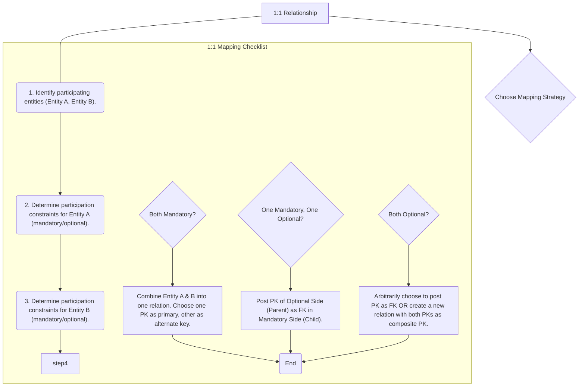

# Definition
Before proceeding, ensure you master Binary_Relationships and Participation_Constraints.
One-to-one (1:1) binary relationships represent an association between two entities where each instance of the first entity is related to at most one instance of the second entity, and vice-versa. When mapping these to a relational model, the strategy for introducing a foreign key is crucial and depends heavily on the participation constraints (mandatory or optional) of each entity in the relationship. This ensures that the unique, singular connection between instances is accurately preserved in the database schema. Think of it as a marriage: one person (usually) to one other person.

# The Mental Model
Imagine you have a single key that opens a single lock. This is a 1:1 relationship. If every key *must* have a lock, and every lock *must* have a key, they are both `mandatory`. If a key can exist without a lock, or a lock without a key, there's `optional` participation. When mapping, you decide whether to put the key's ID on the lock, or the lock's ID on the key, or even a separate "Key_Lock_Pairing" list, based on who *needs* whom.

*Note: This `graph TD` diagram provides a "Pilot's Checklist" for mapping one-to-one (1:1) binary relationships. It guides the decision-making process based on the participation constraints (mandatory/optional) of the participating entities, leading to different mapping strategies.*

# Context & Framework
### System Architecture & Dependencies
The mapping of 1:1 relationships influences the overall database architecture by determining whether two conceptually distinct entities are combined into a single table or remain separate with a direct foreign key link. This decision impacts query complexity and data sparsity. For instance, if an `EMPLOYEE` is related 1:1 to a `PARKING_SPOT`, and both are mandatory, combining them reduces joins. However, if `PARKING_SPOT` is optional for `EMPLOYEE`, keeping them separate and linking via a foreign key in `PARKING_SPOT` (referencing `EMPLOYEE`) might be more appropriate.

# The Mastery Deep Dive
### The "Pilot's Checklist" (Do Not Skip)
Mapping 1:1 relationships requires careful consideration of the participation constraints to make the most appropriate design choice.
- [ ] **1. Identify Participating Entities:** Clearly define Entity A and Entity B, along with their respective primary keys.
- [ ] **2. Determine Participation Constraints:** For each entity, specify if its participation in the relationship is mandatory (every instance *must* participate) or optional (an instance *may* or *may not* participate).

- [ ] **Scenario A: Mandatory participation on both sides of a 1:1 relationship**
    - [ ] **Strategy:** Combine the entities involved into **one single relation**.
    - [ ] Choose one of the primary keys of the original entities to be the primary key of the new combined relation. The other (if it exists as a separate identifier) is used as an alternate key.
    - *Example:* `EMPLOYEE` and `EMPLOYEE_PROFILE` are 1:1 and both mandatory. Combine into `EMPLOYEE(EmployeeID, Name, ProfileDetails, ...)` where `EmployeeID` is PK.

- [ ] **Scenario B: Mandatory participation on one side of a 1:1 relationship**
    - [ ] **Strategy:** Identify the parent and child entities. The entity with **optional participation** is designated as the **parent entity**. The entity with **mandatory participation** is designated as the **child entity**.
    - [ ] Post a copy of the primary key of the **parent entity** into the relation representing the **child entity**. This copied PK acts as a foreign key.
    - [ ] If the relationship has attributes, these attributes should follow the primary key to the child relation.
    - *Example:* `EMPLOYEE` (optional) `HAS_CAR` `COMPANY_CAR` (mandatory). `EmployeeID` (PK of `EMPLOYEE`) is posted as `EmployeeID` (FK) in `COMPANY_CAR` relation.

- [ ] **Scenario C: Optional participation on both sides of a 1:1 relationship**
    - [ ] **Strategy 1 (Arbitrary Posting):** The designation of parent and child entities is arbitrary. You can choose to post the primary key of one entity as a foreign key into the other.
    - [ ] **Strategy 2 (New Relation):** Create a new relation to represent the relationship itself. This new relation would contain the primary keys of both participating entities as foreign keys, and these two foreign keys would together form the composite primary key of the new relation.
    - *Example:* `EMPLOYEE` (optional) `HAS` `KEY_CARD` (optional). Can post `EmployeeID` to `KEY_CARD` or `KeyCardID` to `EMPLOYEE`, or create `EMPLOYEE_KEY_CARD(EmployeeID, KeyCardID)` with composite PK.

### Opening the Hood: What's Inside?
When dissecting a 1:1 relationship, we're essentially looking for who "owns" the relationship or who is more dependent. If `EMPLOYEE` (optional) `MANAGES` `DEPARTMENT` (mandatory), it means every `DEPARTMENT` *must* have a `MANAGER` (an `EMPLOYEE`), but an `EMPLOYEE` doesn't *have* to manage a `DEPARTMENT`. So, the `DEPARTMENT` is the "child" that needs to point to its "parent" (`EMPLOYEE`). Therefore, the `EmployeeID` from `EMPLOYEE` is copied into the `DEPARTMENT` table as a foreign key. This ensures that every `DEPARTMENT` record correctly links to an existing `EMPLOYEE` record.

# Constraints & Limitations
### The Engineering Trade-off
The critical engineering trade-off with 1:1 relationships, particularly when both sides are optional, is choosing between combining relations or creating a separate relation for the relationship. Combining can reduce joins but may lead to a large table with many nulls if the relationship is sparse. Creating a separate table adds a join but keeps the base entities cleaner and avoids nulls in the main tables. The decision balances performance needs (fewer joins) against data storage efficiency and semantic clarity.

# Significance & Application
Understanding how to map 1:1 relationships is important for database designers to create efficient and logically sound schemas. In academic settings, it highlights the importance of cardinality and participation in design choices. In practice, proper 1:1 mapping ensures that unique entity associations are correctly maintained, which is crucial for systems managing specialized roles (e.g., `EMPLOYEE` and `CEO_DETAILS`), exclusive assignments (e.g., `STUDENT` and `DORM_ROOM`), or system configurations where a single item is linked to a single setting.

# The Worked Example
Let's map a 1:1 relationship:

**Scenario:** `PROFESSOR` (attributes: `ProfID` (PK), `Name`) `HEADS` `DEPARTMENT` (attributes: `DeptID` (PK), `DeptName`):
*   A `PROFESSOR` may or may not head a `DEPARTMENT` (Optional participation).
*   A `DEPARTMENT` must have exactly one `PROFESSOR` as its head (Mandatory participation).

**Mapping Steps:**

1.  **Identify Entities and Participation:**
    *   `PROFESSOR`: Optional
    *   `DEPARTMENT`: Mandatory
2.  **Apply Rule:** Mandatory on one side, optional on the other. The optional side (`PROFESSOR`) is the parent, and the mandatory side (`DEPARTMENT`) is the child.
3.  **Post Primary Key:** Post the primary key of the parent (`ProfID` from `PROFESSOR`) as a foreign key into the child relation (`DEPARTMENT`).

**Resulting Relations:**
*   `PROFESSOR(ProfID, Name)`
*   `DEPARTMENT(DeptID, DeptName, ProfID (FK))`

# The Proving Ground
*Test your mastery. Cover the solutions below to test yourself first.*

### Level 1: The Tool Check (Verification)
**The Question:** What is the primary factor used to decide how to map a 1:1 binary relationship to relations?
> **Solution:** The participation constraints (mandatory or optional) of each entity in the relationship.

### Level 2: The Routine Run (Mastery & Edge Cases)
**The Scenario:** Describe the mapping strategy for a 1:1 relationship between `MANAGER` and `DEPARTMENT` where `MANAGER` has optional participation and `DEPARTMENT` has mandatory participation in the relationship.
> **Solution:** In this scenario, `MANAGER` is the parent entity (optional participation), and `DEPARTMENT` is the child entity (mandatory participation). The primary key of the `MANAGER` entity (e.g., `ManagerID`) would be posted as a foreign key into the `DEPARTMENT` relation.

### Level 3: The Disaster Drill (Mastery & Edge Cases)
**The Scenario:** Two entities, `EMPLOYEE` and `COMPANY_CAR`, have a 1:1 relationship with optional participation on both sides. A designer combined them into one relation `EMPLOYEE_CAR` with `EmployeeID` as PK and `CarID` as an alternate key. Explain why this might not be the most flexible solution and suggest an alternative mapping.
> **Solution:**
> **Why it might not be the most flexible solution:**
> 1.  **Data Sparsity:** If many employees do *not* have a company car, and many company cars are currently unassigned, the `EMPLOYEE_CAR` table would contain many null values in the `CarID` (if `EmployeeID` is PK) or `EmployeeID` (if `CarID` is PK) columns, leading to wasted storage and potentially complex queries to find assigned items.
> 2.  **Semantic Overload:** Combining two distinct entities (Employee and Car) into one relation, especially when their association is optional, can reduce the clarity of the database schema.
>
> **Alternative Mapping:**
> A more flexible solution would be to create a **separate relation (table) specifically for the `HAS_CAR` relationship**. This `EMPLOYEE_HAS_CAR` relation would contain the primary key of `EMPLOYEE` (`EmployeeID`) and the primary key of `COMPANY_CAR` (`CarID`), both serving as foreign keys. Their combination `(EmployeeID, CarID)` would form the primary key of this new relationship table. This approach ensures that only assigned cars and employees are recorded, avoiding nulls and maintaining semantic clarity.
> *Example Relations:*
> *   `EMPLOYEE(EmployeeID, EmpName)`
> *   `COMPANY_CAR(CarID, Make, Model)`
> *   `EMPLOYEE_HAS_CAR(EmployeeID (FK), CarID (FK))` (PK is `(EmployeeID, CarID)`)

# Key Takeaways
*   1:1 relationships require careful consideration of participation constraints (mandatory vs. optional) for proper mapping.
*   If both sides are mandatory, entities can often be combined into a single relation.
*   If one side is mandatory and the other optional, the PK of the optional (parent) entity is posted as an FK in the mandatory (child) entity.
*   If both sides are optional, either one PK can be arbitrarily posted as an FK in the other table, or a new relation for the relationship itself can be created.

# Knowledge Graph Connections
| Concept                     | Connection / Relationship                                                                                                       |
| :
-------------------------- | :
-------------------------------------------------------------------------------------------------------------------------------------- |
| [[Mapping_Relationships_to_Relations]] | This is a specific type of relationship mapping within the broader E-R to logical model translation.                                |
| Binary_Relationships    | 1:1 relationships are a fundamental type of binary relationship.                                                                        |
| Participation_Constraints | Participation constraints are the key determinant for choosing the correct mapping strategy for 1:1 relationships.                        |
| Foreign_Keys            | Foreign keys are the primary mechanism used to represent the connection between entities in a 1:1 mapping.                              |
| Primary_Keys            | Involved in both the selection of the foreign key and the potential creation of alternate keys.                                         |
---