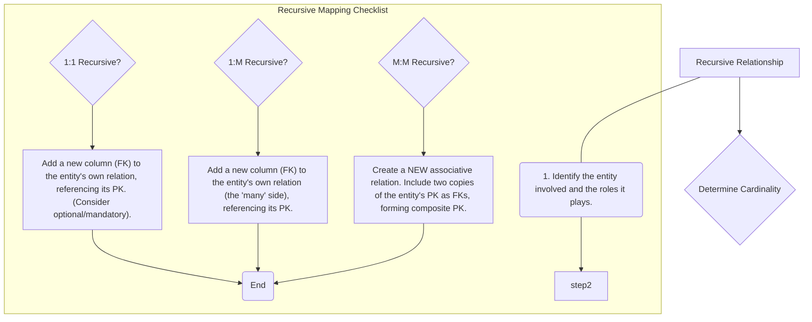

# Definition
Before proceeding, ensure you master [[Relationship_Types]] and Self_Referencing_Tables.
Recursive relationships are a special type of relationship where an entity type is related to itself. This means instances of the same entity type can play different roles in an association. For example, an `Employee` can `manage` other `Employees`. When mapping recursive relationships to a relational model, the strategy depends on the cardinality (1:1, 1:M, M:M) and participation (mandatory, optional) of the relationship, similar to binary relationships, but often involves adding a foreign key to the entity's own table or creating a new associative table for many-to-many recursive relationships. Think of a family tree where `Person` is related to `Person` (e.g., parent-child).

# The Mental Model
Imagine a stack of books, where each "Book" (`Entity`) might have a "Prequel Book" (`Relationship`). Each book is an entity, but it refers to *another* book. You don't create a separate "Prequel_Book" entity. Instead, in your `BOOK` table, you add a `PrequelBookID` column. This `PrequelBookID` is a `Foreign Key` that points back to the `BookID` *within the same `BOOK` table*. This way, a book record can "refer to itself" or another instance of itself.

*Note: This `graph TD` diagram provides a "Pilot's Checklist" for mapping recursive relationships. It guides the decision-making process based on the cardinality of the recursive relationship, leading to different mapping strategies within the same entity's relation or the creation of a new associative relation.*

# Context & Framework
### System Architecture & Dependencies
Recursive relationships create self-referencing dependencies within a single table or by linking a table to an associative table of itself. For example, an `EMPLOYEE` table might have a `ManagerID` column that is a foreign key referencing the `EmployeeID` within the *same* `EMPLOYEE` table. This architectural pattern allows for hierarchical structures (e.g., organizational charts, bill of materials) to be modeled effectively. It ensures that any `ManagerID` (if present) must correspond to an existing `EmployeeID`, thus maintaining referential integrity within the self-referencing structure.

# The Mastery Deep Dive
### The "Pilot's Checklist" (Do Not Skip)
Mapping recursive relationships follows similar principles to binary relationships, but the foreign key always refers back to the same entity.
- [ ] **1. Identify the Entity and its Roles:** Determine the entity type that participates in the relationship with itself (e.g., `EMPLOYEE`) and the two roles it plays (e.g., `manager` and `subordinate`).
- [ ] **2. Determine Cardinality of the Recursive Relationship:**
    - [ ] **One-to-One (1:1) Recursive:**
        - [ ] Add a new column to the entity's own relation (e.g., `SupervisorID` in `EMPLOYEE`).
        - [ ] This new column acts as a foreign key referencing the primary key of the same relation (e.g., `EmployeeID`).
        - [ ] Consider participation: If mandatory on both sides, it might be integrated. If optional, the FK can be null.
        *Example*: `PERSON` `IS_MARRIED_TO` `PERSON` (1:1, optional). `PERSON(PersonID, Name, SpouseID (FK))`
    - [ ] **One-to-Many (1:M) Recursive:**
        - [ ] This is the most common. The 'one' side (e.g., `manager`) defines the primary key, and the 'many' side (e.g., `subordinate`) receives the foreign key.
        - [ ] Add a new column to the entity's own relation (the 'many' side), which is a foreign key referencing the primary key of the same relation (e.g., `ManagerID` in `EMPLOYEE` referencing `EmployeeID`).
        *Example*: `EMPLOYEE` `MANAGES` `EMPLOYEE` (1:M). `EMPLOYEE(EmployeeID, Name, ManagerID (FK))`
    - [ ] **Many-to-Many (M:M) Recursive:**
        - [ ] Similar to a regular M:M relationship, a **new associative relation** must be created.
        - [ ] This new relation will contain two copies of the entity's primary key, each acting as a foreign key, referring back to the original entity.
        - [ ] These two foreign keys will together form the composite primary key of the associative relation.
        *Example*: `PART` `IS_COMPOSED_OF` `PART` (M:M, for Bill of Materials). Create `PART_COMPOSITION(ComponentID (FK), SubcomponentID (FK), Quantity)`. PK is `(ComponentID, SubcomponentID)`.

### How the Parts Talk to Each Other
In a recursive relationship like `Employee` `manages` `Employee`, the `ManagerID` column in the `EMPLOYEE` table is the mechanism by which employees "talk" to their managers (who are also employees). If `ManagerID` is `null`, that employee has no manager (or is the top-level manager). If `ManagerID` contains an `EmployeeID`, that employee directly reports to the employee identified by that `ManagerID`. This internal referencing allows for the dynamic creation of organizational hierarchies or complex self-referential structures within a single set of employee data.

# Constraints & Limitations
### The Engineering Trade-off
The primary engineering trade-off for recursive relationships, particularly 1:M, is the potential for managing hierarchical queries. While a single foreign key can model the immediate parent-child relationship, querying the entire hierarchy (e.g., "all subordinates of a given manager, no matter how deep") requires specialized recursive SQL queries (e.g., Common Table Expressions - CTEs) which can be more complex to write and less performant than simple joins for shallow hierarchies. However, this is inherent to modeling hierarchies within a relational database.

# Significance & Application
Recursive relationships are vital for modeling hierarchical structures in databases, common in areas such as organizational charts (`EMPLOYEE` manages `EMPLOYEE`), bill of materials (`PART` composed of `PART`), or prerequisites (`COURSE` requires `COURSE`). Academically, they challenge the understanding of foreign keys. Professionally, they enable the construction of dynamic, self-referential data structures that efficiently represent complex, nested dependencies within a single entity type.

# The Worked Example
Let's map a 1:M recursive relationship:

**Scenario:** `EMPLOYEE` (attributes: `EmployeeID` (PK), `Name`) `MANAGES` `EMPLOYEE`:
*   An `EMPLOYEE` can `MANAGE` many other `EMPLOYEE`s.
*   An `EMPLOYEE` is `MANAGED` by at most one other `EMPLOYEE`.
*   The top-level manager has no manager.

**Mapping Steps:**

1.  **Identify Entity:** `EMPLOYEE`
    *   **Cardinality:** 1:M (one manager to many subordinates)
2.  **Add Foreign Key to Same Relation:** Add a new column `ManagerID` to the `EMPLOYEE` table.
3.  **Designate as FK:** `ManagerID` is a foreign key referencing `EmployeeID` within the `EMPLOYEE` table itself. This column can be null for top-level managers.

**Resulting Relation:**
*   `EMPLOYEE(EmployeeID, Name, ManagerID (FK))`

# The Proving Ground
*Test your mastery. Cover the solutions below to test yourself first.*

### Level 1: The Tool Check (Verification)
**The Question:** What is a recursive relationship in the context of an E-R model?
> **Solution:** A relationship where an entity type is related to itself, meaning instances of the same entity type can play different roles in an association.

### Level 2: The Routine Run (Mastery & Edge Cases)
**The Scenario:** Describe two different ways to represent a 1:1 recursive relationship where `EMPLOYEE` 'manages' `EMPLOYEE`, considering optional participation on both sides.
> **Solution:**
> 1.  **Adding a Foreign Key to the Same Table:** Add a new column, for example, `ReportsToEmployeeID`, to the `EMPLOYEE` table. This `ReportsToEmployeeID` would be a foreign key referencing the `EmployeeID` within the `EMPLOYEE` table itself. Since participation is optional on both sides, this `ReportsToEmployeeID` column would be nullable.
>     *Example:* `EMPLOYEE(EmployeeID, Name, ReportsToEmployeeID (FK))`
> 2.  **Creating a New Associative Relation:** Create a new table, for example, `EMPLOYEE_MANAGEMENT`. This table would contain two columns, `Employee1ID` and `Employee2ID`, both foreign keys referencing `EmployeeID` in the `EMPLOYEE` table. Their combination `(Employee1ID, Employee2ID)` would form the primary key. This approach is more common for M:M recursive, but can be used for 1:1 optional, albeit with more overhead.

### Level 3: The Disaster Drill (Mastery & Edge Cases)
**The Scenario:** A 1:M recursive relationship `SUPERVISES` exists on the `EMPLOYEE` entity. A designer created a `SUPERVISOR` table and linked it back to `EMPLOYEE` with a foreign key. Identify the flaw and explain the simpler, more effective mapping strategy.
> **Solution:**
> **Flaw:** Creating a separate `SUPERVISOR` table is redundant and unnecessarily complex. In a recursive relationship, the 'supervisor' is simply another `EMPLOYEE` instance. Creating a separate table duplicates employee information and breaks the natural hierarchy that can be modeled within a single table. It also makes querying for supervisors or subordinates more cumbersome.
>
> **Simpler, More Effective Mapping Strategy:** For a 1:M recursive relationship like `SUPERVISES`, the most effective strategy is to **add a foreign key column directly to the `EMPLOYEE` table itself**. This column, often named `SupervisorID` (or `ReportsToID`), would store the `EmployeeID` of the employee's supervisor. This `SupervisorID` is a foreign key that references the `EmployeeID` column within the *same* `EMPLOYEE` table. This allows for clear hierarchical representation without creating redundant tables. The `SupervisorID` would be nullable for employees who are at the top of the hierarchy.

# Key Takeaways
*   Recursive relationships involve an entity relating to itself.
*   Mapping strategy depends on cardinality (1:1, 1:M, M:M) and participation.
*   For 1:M recursive, a foreign key is added to the entity's own table, referencing its own primary key.
*   For M:M recursive, a new associative relation is created, similar to regular M:M mapping.

# Knowledge Graph Connections
| Concept                     | Connection / Relationship                                                                                                       |
| :
-------------------------- | :
-------------------------------------------------------------------------------------------------------------------------------------- |
| [[Mapping_Relationships_to_Relations]] | This is a specific mapping technique for self-referential associations within the broader E-R to relational translation.           |
| [[Relationship_Types]]      | Recursive relationships are a unique subtype of relationship that describes self-associations.                                          |
| Self_Referencing_Tables | Recursive relationships are directly implemented using self-referencing foreign keys within a single table or an associative table.     |
| Foreign_Keys            | Foreign keys are used to link instances within the same table or to an associative table in recursive mappings.                           |
| Primary_Keys            | The entity's primary key is referenced by the foreign key within the self-referencing structure.                                        |
| Cardinality             | The cardinality of the recursive relationship (1:1, 1:M, M:M) determines the specific mapping strategy to be used.                       |
---