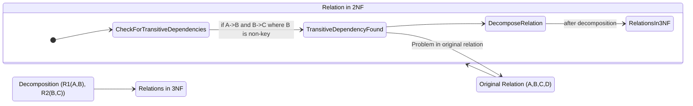

# Definition
Before proceeding, ensure you master [[Second_Normal_Form_2NF]] and [[Transitive_Dependencies]].
Third Normal Form (3NF) is a level of database normalization that builds upon 2NF. A relation (table) is in 3NF if and only if it is in **Second Normal Form (2NF)** AND in which no non-primary-key attribute is **transitively dependent** on the primary key. This means that if `A → B` and `B → C` exist in a relation, then `B` must be a superkey (or candidate key) for `A`, or `C` must be part of the primary key, effectively eliminating situations where a non-key attribute determines another non-key attribute. Achieving 3NF further reduces data redundancy and prevents update anomalies, especially modification anomalies associated with transitive dependencies. Think of it as ensuring every detail in a report directly relates to the main subject, not indirectly through another detail.

# The Mental Model
Imagine you have a class roster that lists `StudentID`, `StudentName`, `AdvisorID`, `AdvisorName`, and `AdvisorOfficeNumber`. `StudentID` is the key. `StudentID` determines `AdvisorID`, and `AdvisorID` determines `AdvisorName` and `AdvisorOfficeNumber`. This means `AdvisorName` and `AdvisorOfficeNumber` are `transitively dependent` on `StudentID` (through `AdvisorID`). To reach `3NF`, you'd split this: one list for `Students` (with their `AdvisorID`), and another list for `Advisors` (with their `AdvisorName` and `AdvisorOfficeNumber`). Now, if an advisor changes their office, you only update it once in the `Advisor` list.

*Note: This `stateDiagram-v2` visualizes the process of achieving Third Normal Form (3NF) from a 2NF relation. It highlights the crucial step of "CheckForTransitiveDependencies" and shows that if a transitive dependency is found, the relation is decomposed to produce relations in 3NF. This diagram adheres strictly to Mermaid syntax, including proper state declarations and transitions.*

# Context & Framework
### How the Parts Talk to Each Other
Third Normal Form enforces an even stricter conversation within relations: non-key attributes must only "talk" directly to the primary key, not to other non-key attributes. This eliminates indirect dependencies, which often manifest as `Transitive_Dependencies`. The framework of 3NF ensures that the database architecture is highly cohesive, with each table representing a single subject, and all its non-key attributes describing that subject directly. This structural clarity is a foundational dependency for building robust, anomaly-free relational database systems.

### The Engineering Trade-off
Recognizing and eliminating transitive dependencies is a critical engineering trade-off. While it means decomposing a table into two or more smaller tables, potentially requiring an extra JOIN operation for certain queries, the benefits are substantial. This trade-off prioritizes data integrity and ease of maintenance over a slight increase in query complexity. The resulting 3NF tables are less prone to update anomalies, reducing the risk of inconsistent data and making the database significantly more reliable and easier to manage in the long run.

# The Mastery Deep Dive
### The "Pilot's Checklist" (Do Not Skip)
Achieving Third Normal Form is about eliminating transitive dependencies to further streamline relations.

- [ ] **1. Ensure the Relation is in 2NF:** 3NF is built upon 2NF, so all partial functional dependencies must already be removed.
- [ ] **2. Identify the Primary Key:** Understand the primary key (PK) of the 2NF relation.
- [ ] **3. Identify All Functional Dependencies (FDs):** List all FDs within the relation.
- [ ] **4. Check for Transitive Dependencies:** Look for FDs of the form `A → B` and `B → C`, where `A` is the primary key (or part of it), `B` is a non-key attribute (or set of non-key attributes), and `C` is also a non-key attribute. Crucially, `B` must not be a superkey (candidate key) of the original relation.
- [ ] **5. Remove Transitive Dependencies (Decomposition):**
    *   For each transitive dependency `A → B → C` identified:
        *   Create a **new relation** with `B` as its primary key and `C` as its non-key attribute(s).
        *   Remove `C` from the **original relation**.
        *   `B` (the determinant of `C`) remains in the original relation but now acts as a foreign key, referencing the primary key `B` in the new relation.

**Example:**
Consider a 2NF relation `BOOK_DETAILS(BookID, Title, PublisherID, PublisherName, PublisherCity)`.
Assume `BookID` is the primary key.

**Functional Dependencies:**
*   `BookID` → `Title`, `PublisherID`, `PublisherName`, `PublisherCity`
*   `PublisherID` → `PublisherName`, `PublisherCity` (This is the transitive dependency)

Here:
*   `A = BookID` (Primary Key)
*   `B = PublisherID` (Non-key attribute)
*   `C = PublisherName, PublisherCity` (Non-key attributes)

We have `BookID → PublisherID` and `PublisherID → PublisherName, PublisherCity`.
Thus, `PublisherName` and `PublisherCity` are transitively dependent on `BookID` via `PublisherID`.

**Conversion to 3NF:**

1.  **Create a new relation for the transitive dependency:**
    *   `PUBLISHER(PublisherID, PublisherName, PublisherCity)`
    *   `PublisherID` is the primary key of `PUBLISHER`.
2.  **Remove the transitively dependent attributes from the original relation:**
    *   Remove `PublisherName` and `PublisherCity` from `BOOK_DETAILS`.
3.  **Ensure the determinant remains as a foreign key:**
    *   `PublisherID` remains in the `BOOK_DETAILS` relation as a foreign key, referencing `PUBLISHER(PublisherID)`.

**Resulting 3NF Relations:**
*   `BOOK(BookID, Title, PublisherID (FK))`
*   `PUBLISHER(PublisherID, PublisherName, PublisherCity)`

# Constraints & Limitations
### The Engineering Trade-off
The primary "limitation" of 3NF is that it does not completely eliminate all types of redundancy in certain specific, rare cases (addressed by Boyce-Codd Normal Form - BCNF). Specifically, if a relation has multiple overlapping candidate keys and one of them is a determinant for a non-key attribute, 3NF might still allow some redundancy. However, for most practical database designs, 3NF is considered a highly robust and sufficient level of normalization, balancing data integrity with query performance.

# Significance & Application
Third Normal Form (3NF) is widely considered the gold standard for relational database design in most transactional systems. Academically, it formalizes the removal of transitive dependencies, which are a common source of redundancy. Professionally, achieving 3NF is critical for building highly maintainable, consistent, and anomaly-free databases. It ensures data is organized logically, simplifying updates, preventing inconsistencies, and forming a robust foundation for applications.

# The Worked Example
Let's convert a 2NF relation to 3NF.

**2NF Relation:** `COURSE_INSTRUCTOR(CourseID, CourseName, InstructorID, InstructorName)`
Primary Key: `CourseID`

Functional Dependencies:
1.  `CourseID` → `CourseName, InstructorID, InstructorName`
2.  `InstructorID` → `InstructorName` (Transitive dependency: `CourseID` → `InstructorID` → `InstructorName`)

Here:
*   `A = CourseID` (Primary Key)
*   `B = InstructorID` (Non-key attribute)
*   `C = InstructorName` (Non-key attribute)

**Conversion to 3NF:**

1.  **Create a new relation for the transitive dependency:**
    *   `INSTRUCTORS(InstructorID, InstructorName)`
    *   `InstructorID` is the primary key of `INSTRUCTORS`.
2.  **Remove `InstructorName` from `COURSE_INSTRUCTOR`.**
3.  **`InstructorID` remains in `COURSE_INSTRUCTOR` as a foreign key.**

**Resulting 3NF Relations:**
*   `COURSE(CourseID, CourseName, InstructorID (FK))`
*   `INSTRUCTORS(InstructorID, InstructorName)`

# The Proving Ground
*Test your mastery. Cover the solutions below to test yourself first.*

### Level 1: The Tool Check (Verification)
**The Question:** What three conditions must a relation satisfy to be in Third Normal Form (3NF)?
> **Solution:** A relation must be in First Normal Form (1NF), Second Normal Form (2NF), and no non-primary-key attribute is transitively dependent on the primary key.

### Level 2: The Routine Run (Mastery & Edge Cases)
**The Scenario:** Take a 2NF relation `BOOK_PUBLISHER(BookID, Title, PublisherID, PublisherName, PublisherCity)`. Assume `BookID` is the primary key and `PublisherID → PublisherName, PublisherCity`. Demonstrate the steps to convert this relation to 3NF.
> **Solution:**
> **Initial 2NF Relation and FDs:**
> `BOOK_PUBLISHER(BookID, Title, PublisherID, PublisherName, PublisherCity)`
> Primary Key: `BookID`
> Functional Dependencies:
> 1.  `BookID` → `Title`, `PublisherID`, `PublisherName`, `PublisherCity`
> 2.  `PublisherID` → `PublisherName`, `PublisherCity` (Transitive dependency via `PublisherID`)
>
> **Steps to Convert to 3NF:**
> 1.  **Identify Transitive Dependency:** `PublisherName` and `PublisherCity` are transitively dependent on `BookID` via `PublisherID`.
> 2.  **Create a new relation for `PublisherID` and its determined attributes:**
>     *   `PUBLISHERS(PublisherID, PublisherName, PublisherCity)`
>     *   `PublisherID` is the primary key of `PUBLISHERS`.
> 3.  **Remove `PublisherName` and `PublisherCity` from the original `BOOK_PUBLISHER` relation.**
> 4.  **`PublisherID` remains in the `BOOK_PUBLISHER` relation as a foreign key**, referencing `PUBLISHERS(PublisherID)`.
>
> **Resulting 3NF Relations:**
> *   `BOOK(BookID, Title, PublisherID (FK))`
> *   `PUBLISHERS(PublisherID, PublisherName, PublisherCity)`

### Level 3: The Disaster Drill (Mastery & Edge Cases)
**The Scenario:** A `COURSE_SCHEDULE` table is in 2NF with `(CourseID, SectionNo)` as its primary key. It includes `CourseName`, `InstructorID`, `InstructorName`, `InstructorOffice`. Functional dependencies are `CourseID → CourseName` and `InstructorID → InstructorName, InstructorOffice`. Explain why this table violates 3NF and detail the decomposition steps to achieve 3NF.
> **Solution:**
> **Why the table violates 3NF:**
> The table `COURSE_SCHEDULE` violates 3NF because it contains **transitive dependencies**.
> 1.  The primary key is `(CourseID, SectionNo)`.
> 2.  We have the dependency `(CourseID, SectionNo) → InstructorID` (implicitly, as an instructor is assigned to a course section).
> 3.  We also have `InstructorID → InstructorName, InstructorOffice`.
>
> Therefore, `InstructorName` and `InstructorOffice` are transitively dependent on the primary key `(CourseID, SectionNo)` via `InstructorID` (a non-key attribute). This is the definition of a 3NF violation.
>
> **Decomposition Steps to Achieve 3NF:**
> 1.  **For the transitive dependency `InstructorID → InstructorName, InstructorOffice`:**
>     *   Create a new relation named `INSTRUCTORS`.
>     *   `INSTRUCTORS` will have `InstructorID` as its primary key and `InstructorName` and `InstructorOffice` as its non-key attributes.
>     *   Remove `InstructorName` and `InstructorOffice` from the `COURSE_SCHEDULE` table.
> 2.  **The `InstructorID` attribute remains in the `COURSE_SCHEDULE` table as a foreign key**, referencing `INSTRUCTORS(InstructorID)`.
>
> **Resulting 3NF Relations:**
> *   `COURSE_SCHEDULE(CourseID, SectionNo, CourseName, InstructorID (FK))`
>     *   Primary Key: `(CourseID, SectionNo)`
>     *   Foreign Key: `InstructorID` references `INSTRUCTORS(InstructorID)`
> *   `INSTRUCTORS(InstructorID, InstructorName, InstructorOffice)`
>     *   Primary Key: `InstructorID`

# Key Takeaways
*   3NF builds on 2NF by eliminating transitive dependencies.
*   A transitive dependency exists when a non-key attribute depends on another non-key attribute, which in turn depends on the primary key.
*   Removing transitive dependencies involves decomposing the relation into smaller tables, ensuring `Lossless_Join_and_Dependency_Preservation`.
*   3NF is a widely adopted standard for reducing redundancy and preventing update anomalies.

# Knowledge Graph Connections
| Concept                     | Connection / Relationship                                                                                                               |
| :
-------------------------- | :
-------------------------------------------------------------------------------------------------------------------------------------- |
| [[Second_Normal_Form_2NF]]  | A relation must be in 2NF as a prerequisite to being in 3NF.                                                                          |
| [[Normalization_in_Database_Design]] | 3NF is the third step in the hierarchical process of database normalization, aiming to reduce redundancy further.                       |
| [[Transitive_Dependencies]] | The primary goal of 3NF is to identify and eliminate transitive dependencies from a relation.                                           |
| [[Functional_Dependencies]] | Transitive dependencies are a specific type of functional dependency that violates 3NF and is addressed by decomposition.                 |
| [[Data_Redundancy_and_Update_Anomalies]] | By removing transitive dependencies, 3NF significantly reduces data redundancy and prevents modification anomalies.                   |
| [[Lossless_Join_and_Dependency_Preservation]] | When decomposing to achieve 3NF, these properties must be maintained to ensure the integrity and reconstructability of data.        |
| [[Boyce_Codd_Normal_Form_BCNF]] | BCNF is a stricter normal form that addresses some subtle issues not fully covered by 3NF, particularly regarding candidate keys.         |
---