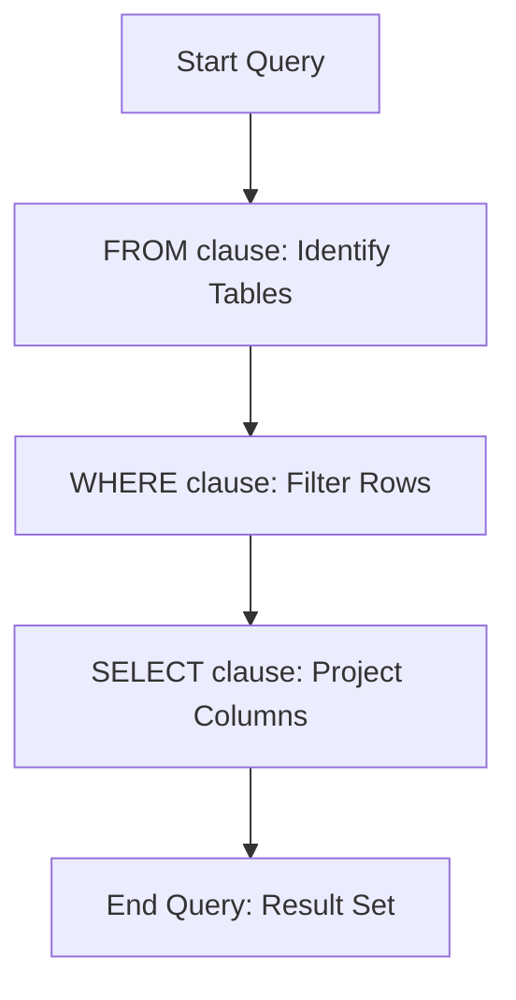

# Definition
Before proceeding, ensure you master [[SQL_Data_Manipulation_Language_(DML)]] and Relational_Database_Model because SQL retrieval queries, primarily using the `SELECT` statement, are the cornerstone of DML for extracting specific information from a database, forming the basis of nearly all data interaction.
SQL retrieval queries are statements used to fetch data from one or more tables in a database. The fundamental command for this is the `SELECT` statement, often combined with `FROM` to specify the source tables and `WHERE` to filter the rows based on conditions. This combination is known as a `SELECT-FROM-WHERE` block. A simpler way to think about it is like searching for specific information in a digital library: you tell the librarian (`SELECT`) *what* information you want (e.g., author, title), *where* to look for it (`FROM` a specific section like 'Fiction'), and *under what conditions* (`WHERE` the genre is 'Mystery').

# The Mental Model
Imagine a giant filing cabinet filled with countless employee records. `SELECT` is the instruction you give to a diligent assistant to find specific information. You tell them: "Find me the `FirstName` and `LastName` (`SELECT` columns) `FROM` the `Employees` section (`FROM` clause) `WHERE` their `Department` is 'Sales' (`WHERE` clause)." The assistant then efficiently sifts through the records and brings back only the requested names from the sales department.

# Context & Framework
### Follow the Ball: A Slow-Motion Trace
The `SELECT` statement is the most frequently used `SQL_Data_Manipulation_Language_(DML)` command. It's a declarative command, meaning you describe *what* data you want, not *how* the database should retrieve it. The database's query optimizer then figures out the most efficient execution plan. The basic `SELECT-FROM-WHERE` block forms the core of most queries:
*   **`SELECT`**: Specifies the columns (attributes) you want to see in the result set. This is like projecting specific attributes in relational algebra.
*   **`FROM`**: Identifies the tables (relations) from which the data will be retrieved. If multiple tables are listed, it implies a Cartesian product, which is then typically narrowed by join conditions.
*   **`WHERE`**: Filters the rows (tuples) based on a specified condition. This is analogous to the selection operation in relational algebra.

# The Mastery Deep Dive
### The Transformation: Before and After
A `SELECT` query goes through a logical processing order, even if the physical execution might be optimized differently. This order is crucial for understanding how data is filtered and transformed.

**Logical Query Processing Order (Simplified):**
1.  **`FROM`**: The `FROM` clause is evaluated first, determining the source tables and creating a Cartesian product if multiple tables are listed without join conditions. This generates a conceptual "intermediate table."
2.  **`WHERE`**: The `WHERE` clause is applied next, filtering rows from the intermediate table based on specified conditions. Only rows that satisfy the condition are passed on.
3.  **`SELECT`**: Finally, the `SELECT` clause projects the specified columns from the filtered rows, creating the final result set.

**Basic `SELECT-FROM-WHERE` Diagram:**

```text
-- Scenario 1: Conceptual flow of a SELECT-FROM-WHERE query
-- Output:
-- (A visual flow showing query execution steps.)
-- 1. FROM clause determines source tables.
-- 2. WHERE clause filters rows based on conditions.
-- 3. SELECT clause projects the desired columns from the filtered rows.
-- 4. Final result set is generated.
```
*Note: This `graph TD` illustrates the logical processing order of a basic `SELECT-FROM-WHERE` query.*

**Key Rules:**
*   **`attribute list`**: Can be `*` (to select all columns), specific column names, or expressions (`column1 + column2`).
*   **`table list`**: Can be a single table name or a comma-separated list of table names (implying a Cartesian product, usually followed by `JOIN` conditions in the `WHERE` clause).
*   **`condition`**: A Boolean expression (true/false) used to filter rows. It can involve `SQL_NULL_Values_and_Comparison`, comparison operators (`=`, `<`, `>`, `LIKE`), and logical operators (`AND`, `OR`, `NOT`).

# Constraints & Limitations
### The "Unseen Crack": Common Structural Flaws
A major pitfall in `SQL_Retrieval_Queries_(SELECT)` is the absence of appropriate `WHERE` clause conditions when querying multiple tables. If you list multiple tables in the `FROM` clause without a join condition in the `WHERE` clause, the database will perform a **Cartesian product** (also known as a cross join), combining every row from the first table with every row from the second table. This usually results in an enormous, meaningless, and performance-heavy result set, often consuming excessive resources. For example, selecting from `Employees, Departments` without a `JOIN` condition might yield millions of rows if both tables are large, instead of matching employees to their correct department.

# Significance & Application
SQL retrieval queries are the most fundamental interaction with any database. They allow users and applications to extract precisely the information needed from vast datasets, powering everything from simple data displays to complex analytical reports. Academically, `SELECT` statements are the practical embodiment of relational algebra's projection and selection operators. In industry, every data-driven application, from basic CRUD (Create, Read, Update, Delete) operations to business intelligence dashboards, relies heavily on `SELECT` queries to "read" data. Mastery of `SELECT` is therefore crucial for any database professional or developer.

# The Worked Example
This example demonstrates basic `SELECT` statements, including selecting all columns, specific columns, and using a `WHERE` clause.

1.  **Initial `Employees` Table Creation and Data:**
    ```sql
```sql
    CREATE TABLE Employees (
        EmployeeID INT PRIMARY KEY,
        FirstName VARCHAR(50) NOT NULL,
        LastName VARCHAR(50) NOT NULL,
        Department VARCHAR(50),
        Salary DECIMAL(10, 2)
    );

    INSERT INTO Employees (EmployeeID, FirstName, LastName, Department, Salary)
    VALUES (1, 'Alice', 'Smith', 'HR', 60000.00),
           (2, 'Bob', 'Johnson', 'IT', 75000.00),
           (3, 'Charlie', 'Brown', 'HR', 55000.00),
           (4, 'Diana', 'Prince', 'Marketing', 80000.00);
```
```text
    -- Scenario 1: Successful table creation and initial data insertion
    -- Output:
    -- 'Table created.'
    -- '4 row(s) affected.'
    --
    -- Scenario 2: Initial table content
    -- EmployeeID | FirstName | LastName | Department | Salary
    -- ---------- | --------- | -------- | ---------- | --------
    -- 1          | Alice     | Smith    | HR         | 60000.00
    -- 2          | Bob       | Johnson  | IT         | 75000.00
    -- 3          | Charlie   | Brown    | HR         | 55000.00
    -- 4          | Diana     | Prince   | Marketing  | 80000.00
```

2.  **`SELECT` All Columns (`*`):**
    ```sql
```sql
    SELECT *
    FROM Employees;
```
```text
    -- Scenario 1: Selecting all columns from the table
    -- Output:
    -- EmployeeID | FirstName | LastName | Department | Salary
    -- ---------- | --------- | -------- | ---------- | --------
    -- 1          | Alice     | Smith    | HR         | 60000.00
    -- 2          | Bob       | Johnson  | IT         | 75000.00
    -- 3          | Charlie   | Brown    | HR         | 55000.00
    -- 4          | Diana     | Prince   | Marketing  | 80000.00
    -- Retrieves all data for all rows.
```

3.  **`SELECT` Specific Columns:**
    ```sql
```sql
    SELECT FirstName, LastName, Salary
    FROM Employees;
```
```text
    -- Scenario 1: Selecting only specific columns
    -- Output:
    -- FirstName | LastName | Salary
    -- --------- | -------- | --------
    -- Alice     | Smith    | 60000.00
    -- Bob       | Johnson  | 75000.00
    -- Charlie   | Brown    | 55000.00
    -- Diana     | Prince   | 80000.00
    -- Retrieves only the FirstName, LastName, and Salary for all rows.
```

4.  **`SELECT` with `WHERE` Clause (Filtering Rows):**
    ```sql
```sql
    SELECT FirstName, LastName
    FROM Employees
    WHERE Department = 'HR' AND Salary > 50000.00;
```
```text
    -- Scenario 1: Filtering rows based on multiple conditions
    -- Output:
    -- FirstName | LastName
    -- --------- | --------
    -- Alice     | Smith
    -- Retrieves only employees from the 'HR' department who earn more than 50000.00.
```

# The Proving Ground
*Test your mastery. Cover the solutions below to test yourself first.*

### Level 1: The Sanity Check (Verification)
**The Question:** What are the three basic clauses that constitute a `SELECT-FROM-WHERE` block in SQL, and what is the primary role of each clause?
> **Solution:** The three basic clauses are `SELECT` (specifies the columns to retrieve), `FROM` (identifies the tables to query), and `WHERE` (filters the rows based on conditions).

### Level 2: The Crucible (Mastery & Edge Cases)
**The Scenario:** You need to retrieve the `product_name` and `price` of all products from a `Products` table. However, you are also interested in seeing the `supplier_name` from a separate `Suppliers` table for each product. You write the query as `SELECT P.product_name, P.price, S.supplier_name FROM Products P, Suppliers S;`
**The Question:** Explain why this query, as written, is fundamentally flawed and will produce an incorrect (and likely massive) result. What crucial clause and condition are missing to link the `Products` and `Suppliers` tables correctly?
> **Solution:** This query is fundamentally flawed because it performs a **Cartesian product** (or cross join) between the `Products` and `Suppliers` tables. By listing both tables in the `FROM` clause without a `JOIN` condition in the `WHERE` clause, every row from the `Products` table will be combined with every row from the `Suppliers` table. This results in an incorrect and likely massive dataset where each product is associated with *every single supplier*, not just its actual supplier. The crucial missing elements are a **`WHERE` clause with a `JOIN` condition** (e.g., `WHERE P.supplier_id = S.supplier_id`) or an explicit `INNER JOIN` in the `FROM` clause (`FROM Products P INNER JOIN Suppliers S ON P.supplier_id = S.supplier_id`). This condition is needed to correctly link products to their respective suppliers based on a common attribute (like `supplier_id`).

# Key Takeaways
*   The `SELECT` statement, with `FROM` and `WHERE` clauses, is the primary command for retrieving data from a database.
*   `SELECT` projects columns, `FROM` identifies source tables, and `WHERE` filters rows based on conditions.
*   Omitting join conditions when querying multiple tables results in a Cartesian product, leading to incorrect and inefficient results.

# Knowledge Graph Connections
| Concept                     | Connection / Relationship                                                                   |
| :
-------------------------- | :
------------------------------------------------------------------------------------------ |
| [[SQL_Data_Manipulation_Language_(DML)]]| `SELECT` is the most commonly used DML command for reading data.                      |
| Relational_Database_Model| `SELECT` operates on relations (tables) to project attributes and select tuples.            |
| [[SQL_NULL_Values_and_Comparison]]| `WHERE` clauses can filter rows based on `NULL` values using `IS NULL` or `IS NOT NULL`.|
| [[Aliases_and_Wildcards_in_SQL]]| `SELECT` statements frequently use aliases for clarity and `*` for all columns.         |
| [[Nested_SQL_Queries]]      | `SELECT` statements can be nested within other `SELECT` statements' `WHERE` clauses.        |
| [[SQL_Set_Operations]]      | `SELECT` statements can be combined using set operations like `UNION`, `INTERSECT`, `MINUS`.|
| [[SQL_Aggregate_Functions]] | `SELECT` clauses can include aggregate functions to summarize data.                         |
| [[Grouping_Data_in_SQL_(GROUP_BY)]]| `SELECT` statements are used with `GROUP BY` to summarize data in groups.             |
| [[Ordering_Query_Results_(ORDER_BY)]]| `SELECT` results can be sorted using the `ORDER BY` clause.                           |
| [[SQL_Join_Operations]]     | `SELECT` statements combine data from multiple tables using various `JOIN` types.           |
---