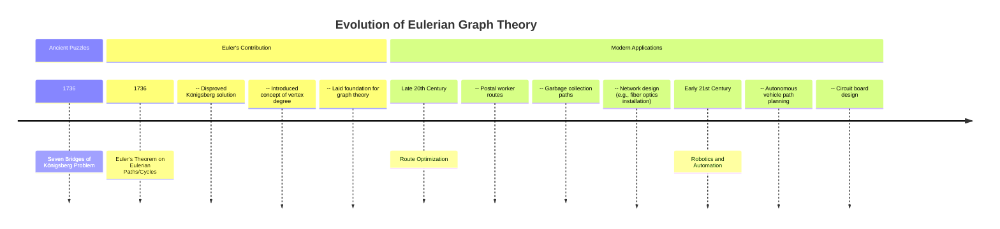

# Definition
Before proceeding, ensure you master [[Paths_and_Connectivity_in_Graphs]] and [[Cycles_and_Circuits_in_Graphs]] because Eulerian graphs are defined by the existence of specific types of closed walks or paths that traverse every edge exactly once.
An **Eulerian path** (or **Euler path**) is a path that traverses every edge of a graph exactly once. An **Eulerian cycle** (or **Euler tour/circuit**) is an Eulerian path that begins and ends at the same vertex. A graph that contains an Eulerian cycle is called an **Eulerian graph**.
The problem of finding an Eulerian path or cycle was famously posed in the 18th century by the "Seven Bridges of Königsberg" puzzle. Think of it as a postal worker's route: they need to deliver mail down every street exactly once, either starting and ending at the same depot (cycle) or ending at a different one (path).

# The Mental Model
Imagine you have to draw a complex figure with a single, continuous pen stroke, without lifting your pen or tracing any line twice. If you can start and end at the same point, you've found an **Eulerian cycle**. If you can complete the drawing by starting at one point and ending at another, you've found an **Eulerian path**. If you can't draw the figure without lifting your pen or retracing a line, then no Eulerian path or cycle exists.

# Context & Framework
### The Problem: Why Did We Invent This?
The concept of Eulerian paths and cycles originated from the famous "Seven Bridges of Königsberg" problem. The citizens of Königsberg (now Kaliningrad, Russia) wanted to know if it was possible to take a walk that crossed each of the city's seven bridges exactly once and return to the starting point. This seemingly simple recreational puzzle led Leonhard Euler to develop the foundational concepts of graph theory, including the notion of vertex degrees. He proved that such a walk was impossible, establishing the first major theorem in graph theory and effectively "inventing" the field to solve a real-world problem.

# The Mastery Deep Dive
### Timeline

```text
// Scenario 1: Historical Evolution of Eulerian Graph Theory
// Output:
// A timeline charting the "Evolution of Eulerian Graph Theory".
// Sections include "Ancient Puzzles" (1736: Seven Bridges of Königsberg Problem) and "Euler's Contribution" (1736: Euler's Theorem, detailing its impact).
// "Modern Applications" follows with "Late 20th Century" (Route Optimization examples) and "Early 21st Century" (Robotics and Automation examples).
// This timeline visualizes the historical context and ongoing relevance of Eulerian graph theory.
```
*Note: This `timeline` illustrates the historical development and modern applications of Eulerian graph theory, stemming from the Königsberg bridge problem.*

# Constraints & Limitations
### The "Oops!" List: Where Everyone Fails
A very common mistake is misapplying the conditions for Eulerian paths/cycles, especially regarding disconnected graphs. An Eulerian path or cycle *can only exist in a connected graph* (ignoring isolated vertices). If a graph is disconnected, no such path can traverse all edges. Another trap is miscalculating degrees; remember that loops contribute 2 to a vertex's degree, which is crucial for determining if all degrees are even. Many fail to correctly count degrees for multigraphs.

# Significance & Application
Eulerian graphs are immensely significant due to Euler's theorem, which provides simple, direct conditions for their existence:
*   **Necessary and Sufficient Condition (Euler's Theorem):**
    1.  A connected graph `G` has an **Eulerian cycle** if and only if every vertex in `G` has an **even degree**.
    2.  A connected graph `G` has an **Eulerian path** (but not an Eulerian cycle) if and only if it has exactly **two vertices of odd degree**. These two vertices must be the start and end points of the path.
*   **Route Optimization:** Directly applicable to problems requiring every road/path to be traveled exactly once, such as:
    *   Mail delivery routes.
    *   Garbage collection routes.
    *   Snowplow routes.
    *   Inspection tours (e.g., power lines, pipelines).
*   **Network Design:** Planning efficient single-sweep operations in networks.
*   **Academic Relevance:** A cornerstone of graph theory, demonstrating how simple properties (vertex degrees) can determine complex global traversal capabilities.

# The Worked Example
Consider the graph `G` below:
(Diagram from page 41 of the source - a cube graph with a diagonal through each face, forming a highly connected 6-vertex graph. Vertices labeled U, V, W, X, Y, Z.)
Let's analyze its degrees:
*   `deg(U) = 4` (edges to V, Z, X, Y)
*   `deg(V) = 4` (edges to U, W, Y, Z)
*   `deg(W) = 4` (edges to V, X, Y, Z)
*   `deg(X) = 4` (edges to U, W, Y, Z)
*   `deg(Y) = 4` (edges to U, V, W, X)
*   `deg(Z) = 4` (edges to U, V, W, X)

**Step-by-Step Determination for Eulerian Cycle/Path:**

1.  **Check Connectivity:** The graph `G` is clearly connected.
2.  **Check Vertex Degrees:** All vertices (`U, V, W, X, Y, Z`) have a degree of 4, which is an even number.
3.  **Apply Euler's Theorem:** Since `G` is connected and all its vertices have even degrees, it must contain an **Eulerian cycle**.

**Example of an Eulerian cycle starting and ending at U:**
`U - V - Z - X - W - Y - U` (This is one possible cycle, traversing all edges exactly once and returning to U).

# The Proving Ground
*Test your mastery. Cover the solutions below to test yourself first.*

### Level 1: The Sanity Check (Verification)
**The Question:** What is the maximum number of odd-degree vertices an Eulerian graph can have?
> **Solution:** An Eulerian graph (one containing an Eulerian cycle) can have **zero** odd-degree vertices. A graph with an Eulerian path (but not a cycle) has exactly two odd-degree vertices.

### Level 2: The Crucible (Mastery & Edge Cases)
**The Scenario:** A new delivery drone needs to inspect every street in a small square district exactly once. The district can be modeled as a graph where intersections are vertices and streets are edges.
**Graph G:** A square with vertices `V1, V2, V3, V4` and edges `(V1,V2), (V2,V3), (V3,V4), (V4,V1)`. Additionally, there is a diagonal street `(V1,V3)`.
**The Challenge:**
(a) Determine the degree of each vertex in Graph G.
(b) Is it possible for the drone to start at `V1`, inspect every street exactly once, and return to `V1`? Justify your answer.
(c) Is it possible for the drone to start at `V1`, inspect every street exactly once, and end at `V2`? Justify your answer.
> **Solution:**
> (a) **Degrees:**
>     *   `deg(V1)`: Edges `(V1,V2), (V1,V4), (V1,V3)`. So, `deg(V1) = 3`.
>     *   `deg(V2)`: Edges `(V1,V2), (V2,V3)`. So, `deg(V2) = 2`.
>     *   `deg(V3)`: Edges `(V2,V3), (V3,V4), (V1,V3)`. So, `deg(V3) = 3`.
>     *   `deg(V4)`: Edges `(V3,V4), (V4,V1)`. So, `deg(V4) = 2`.
>
> (b) No, it is **not possible** for the drone to start at `V1`, inspect every street exactly once, and return to `V1`. For an Eulerian cycle to exist, all vertices must have an even degree. In Graph G, `V1` and `V3` both have odd degrees (3).
>
> (c) No, it is **not possible** for the drone to start at `V1`, inspect every street exactly once, and end at `V2`. For an Eulerian path to exist, there must be exactly two vertices with odd degrees, and these must be the start and end points. While `V1` and `V3` have odd degrees, the desired end point is `V2` (which has an even degree), making this impossible.

# Key Takeaways
*   Eulerian paths traverse every edge once; Eulerian cycles start and end at the same vertex while doing so.
*   A connected graph has an Eulerian cycle iff all vertices have even degrees.
*   A connected graph has an Eulerian path (but not a cycle) iff it has exactly two odd-degree vertices.
*   These concepts are crucial for route optimization and network traversal problems.

# Knowledge Graph Connections
| Concept                     | Connection / Relationship                                         |
| :
-------------------------- | :
---------------------------------------------------------------- |
| [[Paths_and_Connectivity_in_Graphs]] | Eulerian paths and cycles are specific types of graph traversals that rely on connectivity. |
| [[Cycles_and_Circuits_in_Graphs]] | Eulerian cycles are a form of circuit that uses every edge exactly once. |
| [[Degree_of_a_Vertex]]      | The existence of Eulerian paths/cycles is determined by the parity of vertex degrees. |
| [[Connected_Graphs]]        | Eulerian paths and cycles can only exist in connected graphs (ignoring isolated vertices). |
| [[Handshaking_Lemma]]       | The Handshaking Lemma indirectly supports Euler's theorem by showing the sum of degrees is always even. |
---