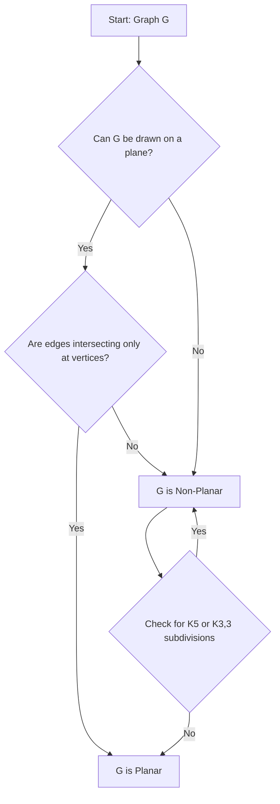

# Definition
Before proceeding, ensure you master [[Advanced_Graph_Properties]] and [[Graph_Definitions]] because planar graphs describe a fundamental topological property of graphs related to how they can be drawn or "embedded" in a two-dimensional plane.
A graph `G` is called a **planar graph** if it can be drawn in a plane (a 2D surface) such that its edges intersect only at their common vertices. In simpler terms, you can draw the graph on a piece of paper without any edges crossing over each other, except where they meet at a node. A graph that has no such plane representation (or depiction) is called a **non-planar graph**. Think of it like a perfectly designed circuit board where no wires cross, avoiding short circuits.

# The Mental Model
Imagine you have a handful of elastic bands (edges) and pushpins (vertices) on a flat corkboard. If you can arrange all the pushpins and stretch the elastic bands between them *without any elastic bands crossing over each other*, then that arrangement forms a **planar graph**. If, no matter how you move the pushpins, the elastic bands *always* cross, then it's a **non-planar graph**.

# Context & Framework
### Where do Users Get Stuck?
The concept of planarity is often challenging because a graph's planarity is an inherent property, independent of its specific drawing. A graph might appear non-planar in one drawing (with many edge crossings), but still be planar if an alternative drawing exists without crossings. This is where users often get stuck: visually determining planarity can be deceptive. Formal criteria, like Kuratowski's Theorem (which identifies specific non-planar subgraphs like `K_5` and `K_{3,3}`), are needed to definitively prove planarity or non-planarity, as simple visual inspection is unreliable.

# The Mastery Deep Dive
### Flowchart (TD)

```text
// Scenario 1: Decision Flow for Planar Graph Identification
// Output:
// A flowchart titled "Decision Flow for Planar Graph Identification".
// The flow starts with "Graph G".
// The first decision is "Can G be drawn on a plane?".
// If Yes, then "Are edges intersecting only at vertices?".
// If Yes, then "G is Planar".
// If No (to either question), then "G is Non-Planar".
// From "G is Non-Planar", an arrow goes to "Check for K5 or K3,3 subdivisions".
// If Yes, then back to "G is Non-Planar".
// If No, then to "G is Planar".
// This flowchart guides the user through the logical steps to determine if a graph is planar.
```
*Note: This `flowchart TD` illustrates the decision-making process for identifying whether a graph is planar, including the crucial check for `K_5` or `K_{3,3}` subdivisions.*

# Constraints & Limitations
### The "Grandma Test"
The term "planar" itself might be confusing, as it's not immediately obvious why the ability to draw something on a flat surface without crossings is a special graph property. For a non-technical person, a tangled mess of lines might just be a messy drawing, not an intrinsically non-planar graph. The "trap" here is that `K_5` (5 vertices, every pair connected) and `K_{3,3}` (3 vertices in one set, 3 in another, every vertex in one set connected to every vertex in the other) are the two fundamental non-planar graphs, but they don't always *look* non-planar in complex drawings. You might need to redraw them.

# Significance & Application
Planar graphs are highly significant in several practical domains:
*   **Circuit Board Design:** A critical area where wires (edges) cannot cross without creating a short circuit. Planar graph theory helps in designing multi-layered circuit boards or optimizing chip layouts.
*   **Network Visualization:** Creating clear, aesthetically pleasing diagrams of networks (e.g., organizational charts, data flow diagrams) often aims for planar representations.
*   **Map Design:** Ensuring that lines on a map (e.g., subway lines, road networks) don't cross unnecessarily.
*   **Academic Relevance:** Planarity is a fundamental topological property of graphs, leading to deep theorems like Euler's Formula for planar graphs and Kuratowski's Theorem, which provides a definitive characterization of planar graphs.

# The Worked Example
**Question:** Is `K4` a planar graph? The graph `K4` has planar depictions shown in figures a, b, and c (from page 54 of the source).

**Step-by-Step Verification of Planarity for `K4`:**

1.  **Recall `K4` definition:** `K4` is a [[Complete_Graphs]] with 4 vertices, meaning every vertex is connected to every other vertex.
2.  **Number of vertices and edges:** `n=4` vertices, `|E| = 4(4-1)/2 = 6` edges.
3.  **Attempt a planar drawing:**
    *   Draw the 4 vertices in a square (or any convex shape).
    *   Connect the vertices around the perimeter (4 edges).
    *   Now, connect the diagonals (2 more edges). These diagonals will cross in the middle.
4.  **Redraw to avoid crossings:**
    *   Place 3 vertices in a triangle. Connect them (3 edges).
    *   Place the 4th vertex inside the triangle. Connect this inner vertex to all 3 outer vertices. These connections will not cross. This forms a planar drawing.
    *   (Refer to figures a, b, c on page 54 of the source, which show different ways to draw `K4` without edge crossings).

5.  **Conclusion:** Yes, `K4` is a **planar graph** because it can be drawn on a plane without any edges crossing, except at common vertices.

**Example: `K5` and `K_{3,3}` are non-planar.**
*   `K5` (5 vertices, 10 edges): As derived in [[Advanced_Graph_Properties]], `|E| <= 3|V| - 6` (for simple connected planar graphs) gives `10 <= 3(5) - 6 = 9`, which is false. So `K5` is non-planar.
*   `K_{3,3}` (3 vertices in one set, 3 in another, all connected): `n=6` vertices, `|E| = 3*3 = 9` edges. `9 <= 3(6) - 6 = 12`. This formula doesn't *disprove* planarity. However, it's a known fundamental non-planar graph (from Kuratowski's theorem). It's impossible to draw without crossings.

# The Proving Ground
*Test your mastery. Cover the solutions below to test yourself first.*

### Level 1: The Sanity Check (Verification)
**The Question:** Is every graph that has no loops and no multiple edges (a simple graph) also a planar graph?
> **Solution:** No. A simple graph is not necessarily planar. For example, [[Complete_Graphs]] `K_5` is a simple graph but it is **not** planar.

### Level 2: The Crucible (Mastery & Edge Cases)
**The Scenario:** You are designing a simple computer chip with 4 components (`A, B, C, D`). Each component needs to be connected to every other component with a dedicated wire. You can only lay wires on a single layer of the chip.
**The Challenge:**
(a) What graph (`K_n` or `K_{m,n}`) represents this network of components?
(b) Can you lay all the wires on a single layer without any wires crossing each other (except at the components)? Justify your answer.
(c) If you had 6 components, and each component needed to be connected to every *other* component, would a single-layer wiring without crossings be possible?
> **Solution:**
> (a) This network represents a **complete graph** `K_4` (since every component is connected to every *other* component).
>
> (b) Yes, you can lay all the wires on a single layer without any wires crossing. `K_4` is a **planar graph**, as demonstrated in the worked example. You can draw it as a triangle with the fourth vertex inside, connected to all three outer vertices, without crossings.
>
> (c) If you had 6 components, and each needed to be connected to every *other* component, this would form a **complete graph `K_6`**. `K_6` has 6 vertices and `6(5)/2 = 15` edges. Using the formula `|E| <= 3|V| - 6` for simple connected planar graphs:
>     *   `15 <= 3(6) - 6`
>     *   `15 <= 18 - 6`
>     *   `15 <= 12` (This is false).
>     Therefore, `K_6` is **not a planar graph**, so a single-layer wiring without crossings would **not be possible**.

# Key Takeaways
*   Planar graphs are graphs that can be drawn on a plane without edges crossing (except at common vertices).
*   Non-planar graphs cannot be drawn in this manner.
*   Kuratowski's Theorem identifies `K_5` and `K_{3,3}` (and their subdivisions) as the fundamental non-planar graphs.
*   Planarity is crucial in design applications like circuit boards and network visualization.

# Knowledge Graph Connections
| Concept                     | Connection / Relationship                                         |
| :
-------------------------- | :
---------------------------------------------------------------- |
| [[Advanced_Graph_Properties]] | Planar graphs are a key advanced structural property of graphs. |
| [[Graph_Definitions]]       | The concept is applied to graph structures defined by vertices and edges. |
| [[Complete_Graphs]]         | `K_5` is a fundamental example of a non-planar complete graph. |
| [[Complete_Bipartite_Graphs]] | `K_{3,3}` is a fundamental example of a non-planar complete bipartite graph. |
| [[Euler_Formula_for_Planar_Graphs]] | Euler's formula provides a numerical relationship for planar graphs (vertices, edges, faces). |
---