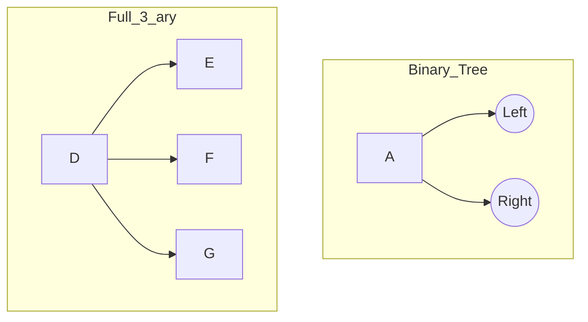

# Definition
Before proceeding, ensure you master [[Rooted_Tree_Structures]].
These are specific classifications of rooted trees based on the number of children a node can have.
*   **m-ary Tree:** Every internal vertex has *at most* $m$ children.
*   **Full m-ary Tree:** Every internal vertex has *exactly* $m$ children.
*   **Binary Tree ($m=2$):** A special case where every node has at most 2 children (Left Child, Right Child).

# The Mental Model
*   **Binary Tree:** A decision path where every question is Yes/No (2 branches).
*   **Full 3-ary Tree:** A hierarchy where every manager *must* hire exactly 3 employees.
*   **Balanced Tree:** A tree that is "bushy" and full, not stringy like a line. All leaves are at roughly the same depth ($h$ or $h-1$).


```text
// Scenario: Comparing Tree Types
// Output:
// Binary Tree: Node A splits into B and C. (Max 2 children).
// Full 3-ary: Node D splits into E, F, G. (Exactly 3 children).
```
*Note: In a Binary Search Tree, the "Left" and "Right" positions carry specific meaning (Left < Parent < Right).*

# Context & Framework
### Binary Search Tree (BST)
A crucial data structure.
*   **Structure:** Binary Tree.
*   **Rule:** For any node $N$: Values in Left Subtree < Value of $N$ < Values in Right Subtree.
*   **Uniqueness:** Data values must be unique.

### Balanced Tree
A tree of height $h$ is balanced if all leaves are at level $h$ or $h-1$. This ensures operations (search, insert) remain efficient ($O(\log n)$) rather than degrading to a linked list ($O(n)$).

# The Mastery Deep Dive
### The "Taxonomy" Check
1.  **Is it a Tree?** (Connected, No cycles, 1 Root).
2.  **Count Max Children ($k$):** It is a $k$-ary tree.
3.  **Check Internal Nodes:** Do they ALL have exactly $k$ children? $\implies$ **Full** $k$-ary.
4.  **Check Leaves:** Are they all at the bottom 2 levels? $\implies$ **Balanced**.

# Constraints & Limitations
### The "Skewed" Trap
A binary tree where every node has only a right child is essentially a **Linked List**. It is a tree by definition, but it is **Unbalanced** and loses the efficiency benefits of a tree structure.

# Significance & Application
*   **Binary Search Trees:** Efficient data storage and retrieval.
*   **Heaps:** Complete binary trees used for priority queues.
*   **B-Trees:** m-ary trees used in Database indexing.

# The Worked Example
**Tree T:** Root $A$. Children of $A$: $B, C$. Child of $B$: $D$.
**Analysis:**
1.  **Max Children:** $A$ has 2. $B$ has 1. Max is 2. $\implies$ Binary Tree.
2.  **Full?** Internal nodes are $A, B$. $A$ has 2 children. $B$ has 1 child. Since $B$ does not have 2, it is **NOT** a Full Binary Tree.
3.  **Balanced?** Height $h=2$ (Leaf $D$ at level 2). Leaf $C$ is at level 1. Leaves are at $h$ and $h-1$. $\implies$ **Balanced**.

# The Proving Ground
*Test your mastery. Cover the solutions below to test yourself first.*

### Level 1: The Sanity Check (Verification)
**The Question:** In a Full Binary Tree, can an internal node have 1 child?
> **Solution:** No. In a **Full** Binary Tree, every internal node must have exactly 2 children.

### Level 2: The Crucible (Mastery & Edge Cases)
**The Scenario:** Construct a tree that is a Binary Tree but **NOT** a Full Binary Tree and **NOT** Balanced.
> **Solution:**
> Nodes: Root $\to$ A $\to$ B $\to$ C.
> *   Binary? Yes, max children is 1 (which is $\le 2$).
> *   Full? No. Root has 1 child (needs 2).
> *   Balanced? Height is 3 (C is at level 3). Leaf C is at level 3. Wait, is there another leaf? No. Wait, usually unbalanced implies leaves at very different levels. A linear chain is technically balanced by the definition "leaves at h or h-1" if there is only 1 leaf!
> *   **Correction:** To be Unbalanced, we need a leaf at level $h$ and a leaf at level $< h-1$.
> *   **Better Example:** Root $\to$ Left (Leaf). Root $\to$ Right $\to$ R1 $\to$ R2 (Leaf).
> *   Left Leaf is at Level 1. Right Leaf (R2) is at Level 3.
> *   Difference is 2. $\implies$ Not Balanced.

# Key Takeaways
*   **m-ary:** Limit on children.
*   **Full:** Strict count of children.
*   **Balanced:** Compact height (efficient).

# Knowledge Graph Connections
| Concept | Connection / Relationship |
| :
--- | :
--- |
| [[Rooted_Tree_Structures]] | The parent category for all these tree types. |
| [[Directed_Graph_Fundamentals]] | The underlying rules of nodes/edges still apply. |

---