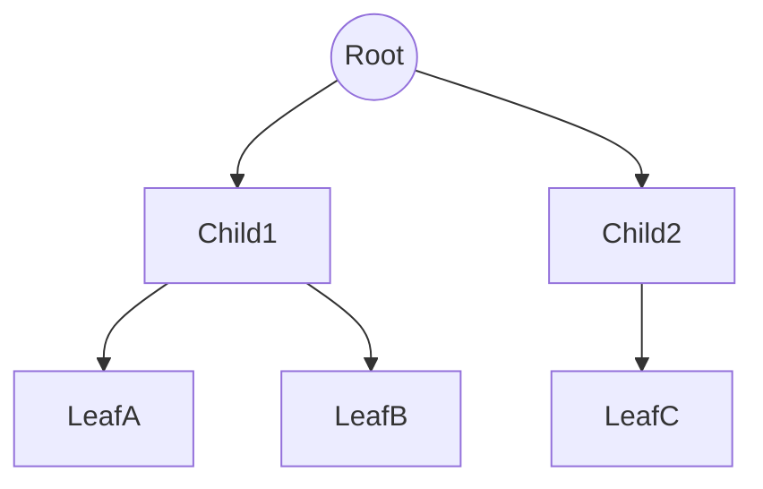

# Definition
Before proceeding, ensure you master [[Directed_Graph_Fundamentals]] and [[Connectivity_in_Directed_Graphs]] as trees are specific types of connected digraphs without cycles.
A **Rooted Tree** is a connected digraph with **no cycles** and a unique vertex called the **Root** which has an **In-Degree of 0**. All other vertices have an In-Degree of exactly 1. It represents a strict hierarchical relationship.

# The Mental Model
Think of a **Family Tree** (Descendants chart).
*   **Root:** The Ancestor.
*   **Children:** Direct descendants.
*   **Leaves:** The youngest generation (no children yet).
*   **Arrows:** Point from Parent to Child.


```text
// Scenario: Visualizing Tree Hierarchy
// Output:
// Level 0: Root.
// Level 1: Child1, Child2 (Siblings).
// Level 2: LeafA, LeafB, LeafC (Leaves).
// Arrows flow strictly Down. No cycles.
```
*Note: In CS trees, the Root is at the top.*

# Context & Framework
### Terminology
*   **Parent/Child:** If $u \to v$, $u$ is parent, $v$ is child.
*   **Siblings:** Vertices sharing the same parent.
*   **Leaf:** Vertex with **Out-Degree = 0** (No children).
*   **Internal Vertex:** Vertex with **Out-Degree > 0** (Has children).
*   **Branch:** A directed path from the root to a leaf.

# The Mastery Deep Dive
### Measurement: Level vs. Depth vs. Height
*   **Level of $u$:** Length of path from Root to $u$. (Root is Level 0).
*   **Depth of $u$:** Same as Level. The distance *down* from the root.
*   **Height of Tree:** The maximum depth (level) of any node in the tree.

### The "One Parent" Rule
In a valid rooted tree (except the root), every node must have **exactly one parent**.
*   If a node has 2 parents, it's not a tree (it's a general DAG - Directed Acyclic Graph).
*   If the root has a parent, it's not a root.

# Constraints & Limitations
### The "No Cycle" Rule
A tree cannot have a back-link. If a child points back to a parent or ancestor, the hierarchy breaks, and it ceases to be a tree.

# Significance & Application
*   **File Systems:** Folders (Directories) are internal nodes, Files are leaves.
*   **HTML DOM:** The document structure of a webpage is a tree.
*   **Organization Charts:** CEO (Root) $\to$ Managers $\to$ Employees.

# The Worked Example
**Tree:** $R \to A$, $R \to B$, $A \to C$.
**Analysis:**
*   **Root:** $R$ (In-degree 0).
*   **Leaves:** $B, C$ (Out-degree 0).
*   **Internal:** $R, A$.
*   **Level of C:** Path $R \to A \to C$ is length 2. Level = 2.
*   **Siblings:** $A$ and $B$ (share parent $R$). $C$ has no siblings.

# The Proving Ground
*Test your mastery. Cover the solutions below to test yourself first.*

### Level 1: The Sanity Check (Verification)
**The Question:** If Node X is at Level 3, how many edges are in the path from the Root to X?
> **Solution:** 3 edges.

### Level 2: The Crucible (Mastery & Edge Cases)
**The Scenario:** You have a graph $A \to B$, $A \to C$, $C \to B$. Is this a rooted tree?
> **Solution:** No.
> Check B: B has edges coming from A AND C. In-Degree of B is 2.
> Rule violation: In a tree, every node (except Root) must have In-Degree 1. This is a DAG, not a tree.

# Key Takeaways
*   **Root:** Unique start, In-degree 0.
*   **Leaf:** End point, Out-degree 0.
*   **Unique Path:** There is exactly one path from Root to any node.

# Knowledge Graph Connections
| Concept | Connection / Relationship |
| :
--- | :
--- |
| [[Directed_Graph_Fundamentals]] | Trees are a restricted subset of digraphs. |
| [[Binary_and_M_ary_Tree_Properties]] | Defines specific structural constraints on trees (max children). |
| [[Connectivity_in_Directed_Graphs]] | Trees are weakly connected and unilaterally connected (from root down). |

---