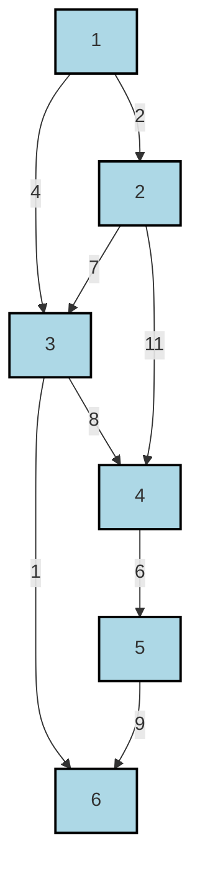

# Definition
Before proceeding, ensure you master [[Minimal_Spanning_Trees]] and [[Weighted_Graphs]] because Kruskal's algorithm is specifically designed to construct MSTs within weighted graphs.
**Kruskal's Algorithm** is a greedy algorithm used to find a [[Minimal_Spanning_Trees]] for a connected, weighted, undirected graph. It works by iteratively adding the smallest-weight edges to a growing forest (a collection of trees) until all vertices are connected, ensuring that no cycles are formed. Think of it like building a network by always choosing the cheapest available connection, as long as it doesn't create a loop.

# The Mental Model
Imagine you're laying tracks for a new railway system to connect several cities, and you want to use the minimum total length of track. Kruskal's algorithm tells you to list all possible track segments between cities, along with their lengths. Then, you simply pick the shortest segment, then the next shortest, and so on. The only rule is: don't pick a segment if it would connect two cities that are *already* connected by the tracks you've already laid (because that would create a wasteful loop). You keep going until all cities are connected.

# Context & Framework
### The Pilot's Checklist
Kruskal's algorithm belongs to the class of **greedy algorithms**, meaning it makes the locally optimal choice at each step with the hope of finding a global optimum. Its efficiency in detecting cycles is often managed using a Disjoint_Set_Data_Structure (also known as Union-Find). The algorithm's effectiveness stems from the **cut property**, which states that for any cut (a partition of the vertices into two disjoint sets), if an edge has strictly smaller weight than any other edge crossing the cut, then this edge must be part of *every* MST. Kruskal's algorithm implicitly leverages this property.

# The Mastery Deep Dive
### The Pilot's Checklist (Do Not Skip)
Given a connected graph $G = (V, E)$ with vertices $v_1, v_2, \dots, v_n$ and edges $(v_i, v_j)$ having length $l_{ij} > 0$, Kruskal's algorithm determines a shortest spanning tree $T$ in $G$ as follows:

1.  **Order Edges**: **Sort all edges of $G$ in ascending order of their length (weight).** This is the crucial first step that enables the greedy approach.
2.  **Initialize MST**: Start with an empty set of edges, $T = \emptyset$. This set will eventually become your MST. Also, treat each vertex as a separate component (a forest of single-node trees).
3.  **Iterate and Add**: Go through the sorted edges one by one, from smallest weight to largest.
    *   For each edge $(u, v)$:
        *   **Check for Cycles**: If adding this edge $(u, v)$ to $T$ would **form a cycle** with the edges already in $T$, then **reject** this edge. (A cycle is formed if $u$ and $v$ are already in the same connected component).
        *   **Add to MST**: If adding $(u, v)$ does **not** form a cycle, then **include** this edge in $T$. Also, merge the connected components of $u$ and $v$.
4.  **Termination**: Continue until $n-1$ edges have been chosen (where $n$ is the number of vertices). At this point, $T$ will contain an MST. Output $T$. Stop.

### The Disaster Drill
A critical aspect of Kruskal's algorithm is the cycle detection step. If this step is flawed or skipped, the resulting subgraph will not be a tree but a Graph_Cycles, and therefore not a spanning tree, let alone an MST. The Union-Find data structure is highly efficient for this, as it can quickly determine if two vertices belong to the same component and merge components when an edge is added.

# Constraints & Limitations
### The Warning Lights: Signs of Trouble
Kruskal's algorithm relies on sorting all edges, which can be computationally expensive for very dense graphs (graphs with many edges). Its time complexity is typically $O(E \log E)$ or $O(E \log V)$ (where $E$ is the number of edges and $V$ is the number of vertices), primarily driven by the sorting step and Union-Find operations. For sparse graphs, where $E$ is relatively small, it performs very well. However, for applications where the graph is constantly changing or edges are added dynamically, re-sorting can be inefficient.

# Significance & Application
Kruskal's algorithm is widely used in network design and infrastructure planning. It's particularly useful for problems where the connections (edges) are numerous and can be easily sorted by cost. Examples include:
*   **Laying down telecommunication cables or power lines** to connect multiple locations with minimal total cable/line length.
*   **Designing pipelines** for water or gas distribution to minimize material cost.
*   In **image processing**, for segmentation tasks where pixels are nodes and edge weights represent similarity.
*   **Cluster analysis**, where it can form a basis for grouping similar data points.

# The Worked Example
Using Kruskal's algorithm, determine the minimum spanning tree for the following weighted graph.


```text
// Scenario 1: Initial Graph with edge weights.
// Output:
// (Visual representation of the graph with 6 nodes (1-6) and edges labeled with their weights.)
//
// Edges and Weights (from diagram):
// (3,6): 1
// (1,2): 2
// (1,3): 4
// (4,5): 6
// (2,3): 7
// (3,4): 8
// (5,6): 9
// (2,4): 11
```

**Step-by-step application:**

1.  **Edges Sorted by Length/Weight:**
    *   (3,6): 1
    *   (1,2): 2
    *   (1,3): 4
    *   (4,5): 6
    *   (2,3): 7
    *   (3,4): 8
    *   (5,6): 9
    *   (2,4): 11

2.  **MST Construction:**
    *   **Choose (3,6) (weight 1):** Add to MST. Current MST: {(3,6)}. (Nodes: {3,6}, {1}, {2}, {4}, {5})
    *   **Choose (1,2) (weight 2):** Add to MST. Current MST: {(3,6), (1,2)}. (Nodes: {3,6}, {1,2}, {4}, {5})
    *   **Choose (1,3) (weight 4):** Add to MST (does not form a cycle with (1,2) and (3,6)). Current MST: {(3,6), (1,2), (1,3)}. (Nodes: {1,2,3,6}, {4}, {5})
    *   **Choose (4,5) (weight 6):** Add to MST. Current MST: {(3,6), (1,2), (1,3), (4,5)}. (Nodes: {1,2,3,6}, {4,5})
    *   **Choose (2,3) (weight 7):** Reject. Adding (2,3) would form a cycle (2-1-3-2). Nodes 2 and 3 are already connected via edge (1,3) and (1,2).
    *   **Choose (3,4) (weight 8):** Add to MST (connects component {1,2,3,6} with {4,5}). Current MST: {(3,6), (1,2), (1,3), (4,5), (3,4)}. (Nodes: {1,2,3,4,5,6})
    *   We have chosen $n-1 = 6-1=5$ edges, and all vertices are connected. Stop.

The edges in the MST are {(3,6), (1,2), (1,3), (4,5), (3,4)}.
The minimum weight of the spanning tree is $1 + 2 + 4 + 6 + 8 = 21$.

# The Proving Ground
*Test your mastery. Cover the solutions below to test yourself first.*

### Level 1: Understanding (The Basics)
**The Tool Check:** What is the primary data structure or concept that Kruskal's algorithm prioritizes when selecting edges to build an MST?
> **Solution:** Kruskal's algorithm prioritizes edges based on their **weight (length)**, always selecting the smallest available weight first.

### Level 2: Competence (Application)
**The Routine Run:** Outline the precise sequence of steps Kruskal's algorithm would take to find an MST for a graph, assuming you have already been given a sorted list of all edges by weight.
> **Solution:**
    1.  Initialize an empty set for the MST and consider each vertex as its own separate component.
    2.  Iterate through the sorted list of edges, from the smallest weight to the largest.
    3.  For each edge, check if its two endpoints are already in the same connected component.
    4.  If the endpoints are in different components, add the edge to the MST set and merge their components.
    5.  If the endpoints are in the same component, skip the edge to avoid forming a cycle.
    6.  Stop when the MST set contains `n-1` edges, where `n` is the number of vertices.

### Level 3: Mastery (The Disaster Drill)
**The Disaster Drill:** During the execution of Kruskal's algorithm, a network administrator accidentally merges two distinct components by adding an edge that forms a cycle. Describe the exact step in the algorithm where this error would be detected and how the algorithm is designed to recover from it.
> **Solution:** This error would be detected at **Step 3 ("Iterate and Add"), specifically in the "Check for Cycles" sub-step**. When Kruskal's algorithm considers an edge $(u, v)$, it checks if $u$ and $v$ are already in the same connected component using a data structure like Union-Find. If they are, it means that adding $(u, v)$ would create a cycle. The algorithm is designed to **recover by simply rejecting that edge and moving on to the next smallest-weight edge**. It does not need to backtrack or undo previous decisions, as the greedy approach guarantees that any other valid MST edges will still be considered in their sorted order.

# Key Takeaways
*   Kruskal's algorithm is a greedy approach to find an MST by sorting all edges by weight and adding them if they do not form a cycle.
*   The algorithm prioritizes smaller edge weights and typically uses a Disjoint Set (Union-Find) data structure for efficient cycle detection.
*   It terminates when `n-1` edges have been selected, where `n` is the number of vertices, forming a connected, acyclic graph with minimal total weight.

# Knowledge Graph Connections
| Concept                     | Connection / Relationship                                                                   |
| :
-------------------------- | :
------------------------------------------------------------------------------------------ |
| [[Minimal_Spanning_Trees]]  | Kruskal's algorithm is a method for constructing an MST.                                    |
| [[Weighted_Graphs]]         | Kruskal's algorithm operates on weighted graphs.                                            |
| Prims_Algorithm        | Prim's algorithm is an alternative to Kruskal's for finding MSTs.                           |
| Graph_Cycles            | Kruskal's algorithm actively avoids creating cycles.                                        |
---