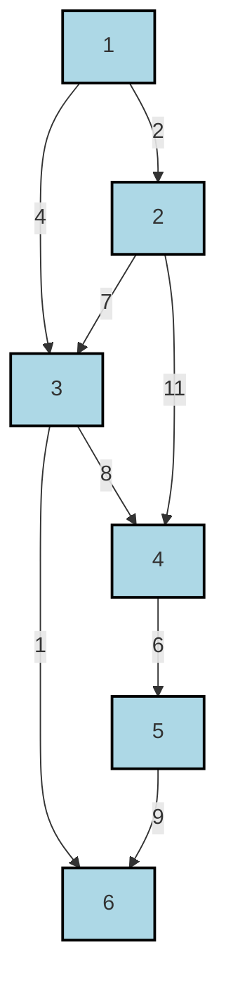

# Definition
Before proceeding, ensure you master [[Minimal_Spanning_Trees]] and [[Weighted_Graphs]] because Prim's algorithm, like Kruskal's, is a method for constructing MSTs on weighted graphs.
**Prim's Algorithm** is another greedy algorithm that finds a [[Minimal_Spanning_Trees]] for a connected, weighted, undirected graph. Unlike Kruskal's, which builds a forest of trees, Prim's algorithm builds a single tree, starting from an arbitrary initial vertex and growing it by adding the cheapest edge that connects a vertex in the tree to a vertex outside the tree, until all vertices are included. Think of it like a single blob of growth expanding outwards, always taking the shortest "bridge" to an unreached island.

# The Mental Model
Imagine you're building a communication network starting from your main office (a chosen vertex). Prim's algorithm tells you to look at all the available connections from your current network (your growing tree) to any city *not yet in your network*. You always pick the shortest (cheapest) connection among these. Once you pick a connection, that new city becomes part of your network, and you repeat the process. This ensures your network expands efficiently and all cities are eventually connected with minimum total cost.

# Context & Framework
### The Pilot's Checklist
Prim's algorithm also falls into the category of **greedy algorithms**. It is often more efficient for dense graphs (where the number of edges is much larger than the number of vertices) than Kruskal's, especially when implemented with a Priority_Queue (e.g., a min-heap) to efficiently select the next cheapest edge. The algorithm implicitly relies on the same **cut property** as Kruskal's: at each step, it identifies a "cut" between the vertices already in the growing MST and those outside it, then selects the minimum-weight edge that crosses this cut. This local optimization guarantees a global optimum.

# The Mastery Deep Dive
### The Pilot's Checklist (Do Not Skip)
Given a connected graph $G = (V, E)$ with vertices $v_1, v_2, \dots, v_n$ and edges $(v_i, v_j)$ having length $l_{ij} > 0$, Prim's algorithm determines a shortest spanning tree $T$ in $G$ and its length $L(T)$ as follows:

1.  **Initialization**:
    *   Choose an arbitrary starting vertex, say $v_1$.
    *   Initialize a set $U = \{v_1\}$ (vertices already in the MST) and an empty edge set $S = \emptyset$ (edges forming the MST).
    *   For every other vertex $v_k$ (where $k = 2, \dots, n$), assign a temporary label $\lambda_k = l_{1k}$ if there's an edge $(v_1, v_k)$, otherwise $\lambda_k = \infty$. Also, record $i(k)=1$ meaning $v_k$ can be reached from $v_1$.
2.  **Add Edge to Tree**:
    *   Find the vertex $v_j$ not in $U$ that has the smallest temporary label $\lambda_j$. This represents the cheapest edge connecting $U$ to a vertex outside $U$.
    *   Include $v_j$ in $U$ (add the vertex to the MST).
    *   Add the edge $(v_{i(j)}, v_j)$ to $S$ (add the edge to the MST).
    *   Update the total length of the MST, $L(T)$, by adding $\lambda_j$.
3.  **Update Labels (Relaxation)**:
    *   For every vertex $v_k$ that is still not in $U$:
        *   If the weight of the new edge $(v_j, v_k)$ is less than its current temporary label $\lambda_k$, then update $\lambda_k = l_{jk}$ and set $i(k) = j$ (meaning $v_k$ can now be reached more cheaply via $v_j$).
4.  **Loop or Terminate**:
    *   Repeat steps 2 and 3 until $U$ includes all vertices (i.e., $U = V$).
    *   Once $U=V$, output $S$ (the set of MST edges) and $L(T)$ (the total weight). Stop.

### The Disaster Drill
Proper implementation of the temporary labels and their updates (often called "relaxation") is crucial. If a temporary label is not correctly updated, or if an already "permanent" vertex's label is reconsidered, the algorithm will fail to find the MST. The use of a priority queue ensures that the selection of the minimum temporary label in step 2 is efficient, leading to an overall time complexity of $O(E \log V)$ or $O(V^2)$ depending on the priority queue implementation.

# Constraints & Limitations
### The Warning Lights: Signs of Trouble
Prim's algorithm, like Kruskal's, requires the graph to be connected and undirected. It also works best when all edge weights are non-negative. While it can theoretically handle negative edge weights, doing so without specific adaptations can lead to incorrect results or infinite loops if negative cycles are present (though MSTs are not defined for graphs with negative cycles). The algorithm's performance can degrade significantly for very sparse graphs if a basic (non-priority queue) implementation is used, as scanning all unvisited vertices to find the minimum edge becomes slow.

# Significance & Application
Prim's algorithm is widely applied in scenarios where building a network from a single starting point is a natural fit. Its "grow-from-a-single-tree" approach makes it intuitive for:
*   **Building communication networks** from a central hub.
*   **Designing cluster analysis** algorithms, especially for single-linkage clustering.
*   **Routing in computer networks** for certain protocols, where a centralized decision-making process is suitable.
*   **Circuit board design**, to connect components with minimal wire length.
Its strength lies in its ability to grow the MST organically from a seed, maintaining connectivity throughout the process.

# The Worked Example
Using Prim's algorithm, determine the minimum spanning tree for the following weighted graph.


```text
// Scenario 1: Initial Graph with edge weights.
// Output:
// (Visual representation of the graph with 6 nodes (1-6) and edges labeled with their weights.)
//
// Edges and Weights (from diagram):
// (1,2): 2, (1,3): 4, (2,3): 7, (2,4): 11, (3,4): 8, (3,6): 1, (4,5): 6, (5,6): 9
```

**Step-by-step application (Starting with vertex 1):**

1.  **Initial Step:**
    *   $U = \{1\}$, $S = \emptyset$.
    *   $\lambda_2 = l_{1,2} = 2$, $i(2)=1$.
    *   $\lambda_3 = l_{1,3} = 4$, $i(3)=1$.
    *   $\lambda_4 = \infty$, $\lambda_5 = \infty$, $\lambda_6 = \infty$.

2.  **Iteration 1:**
    *   Smallest $\lambda_k$ for $v_k \notin U$ is $\lambda_2 = 2$ (for vertex 2).
    *   Add 2 to $U$: $U = \{1, 2\}$.
    *   Add edge (1,2) to $S$: $S = \{(1,2)\}$.
    *   Update labels for neighbors of 2 not in $U$:
        *   For 3: $l_{2,3} = 7$. Current $\lambda_3 = 4$. $7 \not< 4$. No update.
        *   For 4: $l_{2,4} = 11$. Current $\lambda_4 = \infty$. $11 < \infty$. Update $\lambda_4 = 11$, $i(4)=2$.

3.  **Iteration 2:**
    *   Current $\lambda$ values for $v_k \notin U$: $\lambda_3 = 4$, $\lambda_4 = 11$, $\lambda_5 = \infty$, $\lambda_6 = \infty$.
    *   Smallest is $\lambda_3 = 4$ (for vertex 3).
    *   Add 3 to $U$: $U = \{1, 2, 3\}$.
    *   Add edge (1,3) to $S$: $S = \{(1,2), (1,3)\}$.
    *   Update labels for neighbors of 3 not in $U$:
        *   For 4: $l_{3,4} = 8$. Current $\lambda_4 = 11$. $8 < 11$. Update $\lambda_4 = 8$, $i(4)=3$.
        *   For 6: $l_{3,6} = 1$. Current $\lambda_6 = \infty$. $1 < \infty$. Update $\lambda_6 = 1$, $i(6)=3$.

4.  **Iteration 3:**
    *   Current $\lambda$ values for $v_k \notin U$: $\lambda_4 = 8$, $\lambda_5 = \infty$, $\lambda_6 = 1$.
    *   Smallest is $\lambda_6 = 1$ (for vertex 6).
    *   Add 6 to $U$: $U = \{1, 2, 3, 6\}$.
    *   Add edge (3,6) to $S$: $S = \{(1,2), (1,3), (3,6)\}$.
    *   Update labels for neighbors of 6 not in $U$:
        *   For 5: $l_{6,5} = 9$. Current $\lambda_5 = \infty$. $9 < \infty$. Update $\lambda_5 = 9$, $i(5)=6$.

5.  **Iteration 4:**
    *   Current $\lambda$ values for $v_k \notin U$: $\lambda_4 = 8$, $\lambda_5 = 9$.
    *   Smallest is $\lambda_4 = 8$ (for vertex 4).
    *   Add 4 to $U$: $U = \{1, 2, 3, 6, 4\}$.
    *   Add edge (3,4) to $S$: $S = \{(1,2), (1,3), (3,6), (3,4)\}$.
    *   Update labels for neighbors of 4 not in $U$:
        *   For 5: $l_{4,5} = 6$. Current $\lambda_5 = 9$. $6 < 9$. Update $\lambda_5 = 6$, $i(5)=4$.

6.  **Iteration 5:**
    *   Current $\lambda$ values for $v_k \notin U$: $\lambda_5 = 6$.
    *   Smallest is $\lambda_5 = 6$ (for vertex 5).
    *   Add 5 to $U$: $U = \{1, 2, 3, 6, 4, 5\}$.
    *   Add edge (4,5) to $S$: $S = \{(1,2), (1,3), (3,6), (3,4), (4,5)\}$.
    *   All vertices are in $U$. Stop.

The MST edges are {(1,2), (1,3), (3,6), (3,4), (4,5)}.
The minimum total weight is $2 + 4 + 1 + 8 + 6 = 21$. This matches Kruskal's algorithm.

# The Proving Ground
*Test your mastery. Cover the solutions below to test yourself first.*

### Level 1: Understanding (The Basics)
**The Tool Check:** What initial element does Prim's algorithm always start with to begin constructing an MST?
> **Solution:** Prim's algorithm always starts with an **arbitrary single vertex**.

### Level 2: Competence (Application)
**The Routine Run:** Describe the iterative process by which Prim's algorithm expands its growing MST from a single starting vertex until all vertices are included.
> **Solution:** Prim's algorithm starts with a single vertex in its MST set. In each iteration, it examines all edges connecting a vertex *already in the MST* to a vertex *not yet in the MST*. It then selects the edge with the minimum weight among these, adds it to the MST, and includes the new vertex it connects. This process is repeated until all vertices are part of the MST.

### Level 3: Mastery (The Disaster Drill)
**The Disaster Drill:** If Prim's algorithm were being run on a large power grid, and an external event (e.g., a fallen tree) suddenly increased the weight of an edge that had already been permanently labeled, how would this affect the algorithm's current state and its ability to guarantee an optimal MST?
> **Solution:** If an edge's weight *increases* after it has already been "permanently labeled" (meaning its incident vertex has been added to the MST via that edge, and the label finalized), this would **not affect the current execution or outcome of Prim's algorithm for that specific run**. The algorithm is greedy and makes decisions based on the weights *at the time of evaluation*. Once a vertex is added and its connecting edge is chosen, that decision is final for the current MST construction. Therefore, the algorithm would **still produce an MST based on the weights it had at the time of its calculations**, but this MST would no longer be optimal for the *new, changed* graph. A **re-run of the algorithm** from scratch would be necessary to find the true MST for the updated power grid.

# Key Takeaways
*   Prim's algorithm is a greedy algorithm that builds an MST by expanding a single tree from a starting vertex.
*   It iteratively adds the cheapest edge connecting a vertex in the growing MST to a vertex outside it, using temporary labels for efficiency.
*   Prim's algorithm is particularly effective for dense graphs and applications requiring growth from a central point.

# Knowledge Graph Connections
| Concept                     | Connection / Relationship                                                                   |
| :
-------------------------- | :
------------------------------------------------------------------------------------------ |
| [[Minimal_Spanning_Trees]]  | Prim's algorithm is a method for constructing an MST.                                       |
| [[Weighted_Graphs]]         | Prim's algorithm operates on weighted graphs.                                               |
| Kruskals_Algorithm     | Prim's algorithm is an alternative to Kruskal's for finding MSTs.                           |
| Priority_Queue          | Efficient implementations of Prim's algorithm often utilize priority queues.                |
---