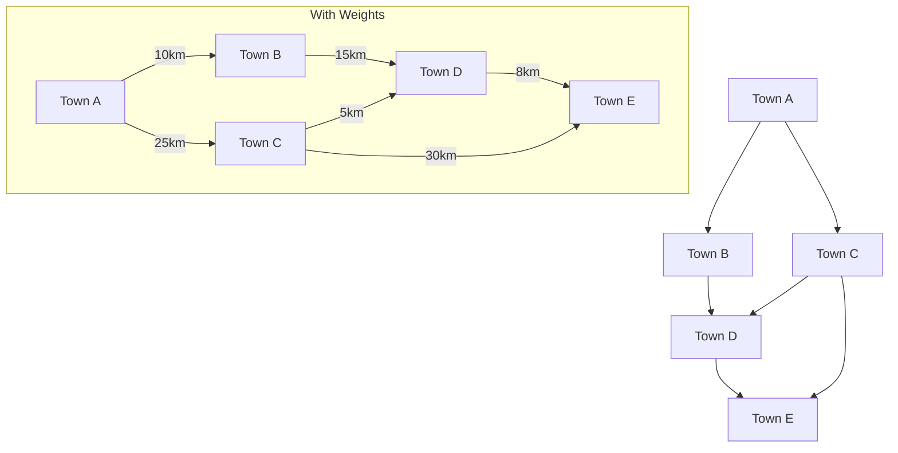
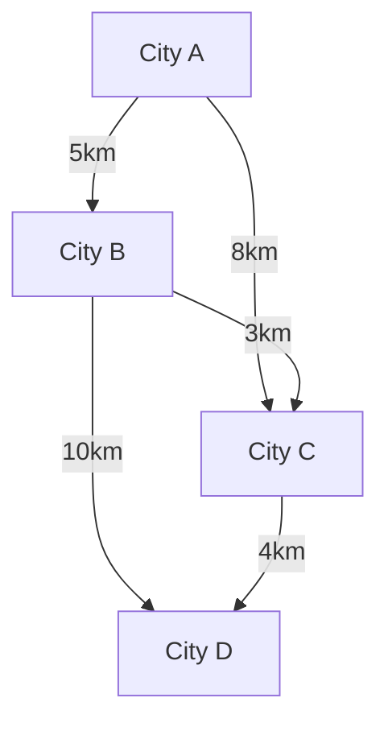

# Definition
Before proceeding, ensure you master Elements_Of_Graph_Theory and Directed_Graphs because weighted graphs build upon the fundamental concepts of nodes, edges, and graph types.
A **Weighted Graph** is a type of graph where each edge is assigned a numerical value, often called a "weight." These weights can represent various real-world attributes such as cost, distance, capacity, or time, making weighted graphs incredibly useful for modeling optimization problems. Think of it like a map where each road (edge) has a number indicating how long it takes to travel that road.

# The Mental Model
Imagine you're trying to choose a flight route. The cities are the "nodes" and the flights are the "edges." If you just look at connections, you might pick a route with many stops. A weighted graph, however, assigns a "weight" (like price or flight duration) to each flight. This allows you to pick the cheapest or fastest route, not just any route. It's like adding context to the connections.


```text
// Scenario 1: Unweighted Graph (connections only)
// Output:
// (Visual representation of a simple graph showing nodes A, B, C, D, E and their connections. All connections appear equal.)
//
// Scenario 2: Weighted Graph (connections with associated values)
// Output:
// (Visual representation of the same graph, but with numerical labels on each edge, e.g., "10km", "25km", clearly indicating varying costs/distances.)
```
*Note: The first part shows an unweighted graph, where connections are just present or absent. The 'With Weights' subgraph shows the same connections, but each edge now carries a specific numerical value representing a 'weight', like distance in kilometers.*

# Context & Framework
### The Family Tree
Weighted graphs are a direct extension of standard graphs, falling under the broader umbrella of **Graph Theory**. They are foundational for understanding more complex network models and optimization problems. Unweighted graphs are a special case of weighted graphs where all edge weights are implicitly considered to be 1 (or any constant value). This conceptual relationship means that algorithms developed for weighted graphs can often be adapted for unweighted ones, but the reverse is not always true due to the additional information provided by weights. They also relate to Network_Flow_Problems where edge capacities act as weights.

# The Mastery Deep Dive
### Opening the Hood: What's Inside?
Formally, a weighted graph is defined as a 3-tuple $G = (V, E, w)$, where:
*   $V$ is the set of **nodes** (or vertices). These represent the entities in the graph (e.g., cities, people, computers).
*   $E$ is the set of **edges**. These represent the connections between the nodes. Each edge is an ordered pair $(u, v)$ for a directed graph or an unordered pair $\{u, v\}$ for an undirected graph.
*   $w$ is a **weight function** $w: E \to \mathbb{R}$. This function assigns a real numerical value (the weight) to each edge in $E$. The set $\mathbb{R}$ indicates that weights can be any real number.
This definition applies universally to both directed and undirected graphs, meaning a directed edge can also carry a weight.

### How the Parts Talk to Each Other
The weight function $w$ is the key component that allows edges to carry meaning beyond mere connectivity. When an algorithm processes a weighted graph, it uses these weights to make decisions. For example, in a shortest path algorithm, the sum of weights along a path determines its total "cost," influencing which path is chosen. In a minimal spanning tree algorithm, edge weights dictate which connections are prioritized to minimize the overall cost of connecting all nodes. The ability to assign and interpret these weights allows for the modeling of complex systems where resources, distances, or capacities are critical factors.

# Constraints & Limitations
### The "Oops!" List: Where Everyone Fails
A common error is confusing the weight of an edge with its visual length in a drawing. A diagram might show a 'short' line for an edge with a high weight (e.g., a short, busy road with heavy traffic), and a 'long' line for an edge with a low weight (e.g., a long, empty highway). It's crucial to remember that the diagram is a representation, and the numerical weight is the sole determinant of its value for algorithmic purposes. Another pitfall is forgetting that weights can sometimes be negative, which has significant implications for certain algorithms, such as Dijkstra's algorithm.

# Significance & Application
Weighted graphs are fundamental in computer science, operations research, and various engineering disciplines. They are essential for **network optimization**, including finding optimal routes in GPS systems, designing efficient telecommunication networks, and planning logistical supply chains. In **resource management**, they help in allocating tasks, managing project dependencies with time costs, and optimizing material flow. Their ability to quantitatively represent relationships makes them a powerful tool for solving real-world problems that involve finding the "best" or "most efficient" solution under given constraints.

# The Worked Example
Consider a simple road network between cities A, B, C, and D. The distances (weights) between them are: A-B (5 km), A-C (8 km), B-C (3 km), B-D (10 km), C-D (4 km). We want to visualize this as a weighted graph.


```text
// Scenario 1: Displaying the weighted graph.
// Output:
// (Visual representation of cities A, B, C, D as nodes, connected by edges labeled with their respective distances (weights).
// For instance: "City A -- 5km --> City B".)
```
This diagram clearly shows the cities as nodes and the roads as edges, with the distances explicitly marked as weights. This allows us to visually understand the costs associated with traveling between different cities. For example, traveling from City A to City B costs 5km, while City A to City C costs 8km.

# The Proving Ground
*Test your mastery. Cover the solutions below to test yourself first.*

### Level 1: Understanding (The Basics)
**The Neighbor Check:** List three distinct real-world scenarios where edge weights in a graph could represent 'capacity'.
> **Solution:** Examples include: (1) Maximum data throughput of a network cable, (2) Carrying capacity of a bridge for vehicles, (3) Storage capacity of a warehouse connected by a supply route.

### Level 2: Competence (Application)
**The Sort:** Given a social network graph where edge weights represent the number of shared interests, categorize the following connections into 'Strong' (weight > 5) or 'Weak' (weight <= 5): (A,B)=7, (A,C)=3, (B,D)=6, (C,E)=2, (D,F)=9.
> **Solution:** Strong connections: (A,B), (B,D), (D,F). Weak connections: (A,C), (C,E).

### Level 3: Mastery (The Impostor)
**The Impostor:** You are presented with a graph representing flight routes between cities, where edges are colored (red for direct, blue for connecting flights). A colleague argues this is a weighted graph because the colors add 'value' to the connections. Explain why this is a 'False Friend' and not a true weighted graph, referring to the fundamental definition of weights.
> **Solution:** This is a 'False Friend' because colors (red, blue) are **categorical attributes**, not numerical values from a real number set ($\mathbb{R}$). A true weighted graph requires that each edge be assigned a *numerical value* (a weight) that can be used for mathematical operations like summation (e.g., adding distances or costs) or comparison. While colors provide information, they don't allow for such quantitative analysis, which is central to the concept of edge weights in graph theory.

# Key Takeaways
*   Weighted graphs assign numerical values (weights) to edges, representing attributes like cost, distance, or capacity, which enables the modeling of real-world optimization problems.
*   Formally defined as $G = (V, E, w)$, where $w: E \to \mathbb{R}$ is the weight function, applicable to both directed and undirected graphs.
*   The distinction between visual representation and actual numerical weight is crucial, and the choice of algorithm often depends on whether weights can be negative or positive.

# Knowledge Graph Connections
| Concept                     | Connection / Relationship                                                                   |
| :
-------------------------- | :
------------------------------------------------------------------------------------------ |
| Elements_Of_Graph_Theory | Weighted graphs are a fundamental type of graph theory.                                     |
| Directed_Graphs         | Weighted graphs can be either directed or undirected.                                       |
| [[Minimal_Spanning_Trees]]  | Weighted graphs are the foundation for finding minimal spanning trees.                      |
| [[Shortest_Path_Problem]]   | Weighted graphs are essential for solving shortest path problems.                           |
---