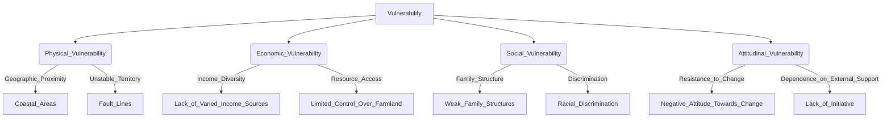

# Definition
Before proceeding, ensure you master [[Vulnerability]].
[[Categories_of_Vulnerability]] refers to the classification system used to delineate the different dimensions or types through which individuals or communities can be exposed to harm or disadvantage. These categories include Physical, Economic, Social, and Attitudinal Vulnerability, each representing a distinct set of factors that contribute to susceptibility. Understanding these categories is crucial for a comprehensive analysis of [[Vulnerability]] and for developing targeted interventions. A simpler way to think about it is like different types of weaknesses a shield might have: one part might be weak against fire (physical), another against blunt force (economic), and so on.

# The Mental Model
Imagine a fortress with several different walls, each protecting against a specific type of attack. If one wall is weak against a physical assault, that's physical vulnerability. If another wall is weak against siege (resource depletion), that's economic vulnerability. If internal discord makes the garrison inefficient, that's social vulnerability. And if the defenders simply refuse to adapt to new siege tactics, that's attitudinal vulnerability. These distinct weaknesses (categories) define the fortress's overall susceptibility.

*Note: This `graph TD` illustrates the main categories of vulnerability branching out from the core concept of Vulnerability, with examples of contributing factors for each category, showing a clear hierarchical classification.*

# Context & Framework
### The Family Tree
[[Categories_of_Vulnerability]] form a "family tree" where the overarching concept of [[Vulnerability]] branches into distinct, yet often interconnected, types. This hierarchical classification helps to systematically identify and address the specific factors that make individuals or communities susceptible to harm. For instance, `Physical_Vulnerability` (like living near a fault line) might exacerbate `Economic_Vulnerability` if a disaster destroys livelihoods, demonstrating how branches can interact.

# The Mastery Deep Dive
### The Exhaustive List of Vulnerability Types
The four primary [[Categories_of_Vulnerability]] provide an exhaustive framework for analysis:
1.  **Physical Vulnerability:** Determined by geographic proximity to disaster sources (e.g., coastlines, fault lines) or exposure to hazardous environments.
2.  **Economic Vulnerability:** Assessed by the diversity of income sources, access to means of production (e.g., land, capital), and the adequacy of economic fallback mechanisms.
3.  **Social Vulnerability:** Characterized by weak family structures, lack of leadership, unequal participation in decision-making, and discrimination based on race, ethnicity, language, or religion.
4.  **Attitudinal Vulnerability:** Reflects a community's negative attitude towards change, lack of initiative, and resultant dependence on external support, leading to disunity, hopelessness, and reduced coping capacity.

### The "Wikipedia One-Liner" (The rigorous exam definition)
Categories of vulnerability are systematic groupings that delineate the various contributing factors and dimensions through which individuals, communities, or systems are susceptible to damage, stress, or the adverse impacts of hazards, encompassing physical, economic, social, and attitudinal dimensions.

# Constraints & Limitations
### The Interconnected Web: No Category Stands Alone
A significant trap in analyzing [[Categories_of_Vulnerability]] is treating each category in isolation. While useful for classification, in reality, these vulnerabilities are often deeply interconnected and mutually reinforcing. For example, a community's `Physical_Vulnerability` to floods might be exacerbated by `Economic_Vulnerability` (lack of funds for resilient housing) and `Social_Vulnerability` (weak community organization for disaster response). Failing to recognize this interconnected web can lead to incomplete or ineffective interventions.

# Significance & Application
Understanding [[Categories_of_Vulnerability]] is fundamental for disaster risk reduction, development planning, and social protection programs. It enables policymakers and practitioners to conduct comprehensive vulnerability assessments, identify specific risk factors, and design multi-sectoral interventions that address the root causes of susceptibility.

# The Worked Example
Consider a community heavily reliant on fishing, located in a coastal area frequently hit by typhoons.

**Step 1: Identify Physical Vulnerability.**
*   **Geographic proximity:** The community is located on the coastline, directly exposed to typhoons and storm surges.
*   **Infrastructure:** Housing might be traditional and not built to withstand severe weather.

**Step 2: Identify Economic Vulnerability.**
*   **Lack of varied income sources:** Heavy reliance on fishing means that a single disaster can devastate the primary livelihood of the entire community.
*   **Limited fallback mechanisms:** Few savings, lack of insurance, and limited alternative employment opportunities.

**Step 3: Identify Social Vulnerability (if applicable).**
*   If the community has weak local leadership or poor communication channels, it may struggle to organize effective evacuation or relief efforts.

**Step 4: Identify Attitudinal Vulnerability (if applicable).**
*   If the community resists adopting new, typhoon-resistant housing designs due to tradition or mistrust of external aid, this can increase their long-term vulnerability.

# The Proving Ground
*Test your mastery. Cover the solutions below to test yourself first.*

### Level 1: The Sanity Check (Verification)
**The Neighbor Check:** Name two of the four primary categories of vulnerability.
> **Solution:** Physical Vulnerability and Economic Vulnerability (or Social, Attitudinal).

### Level 2: The Crucible (Mastery & Edge Cases)
**The Sort:** A community experiences a severe drought, leading to crop failures and widespread food shortages. The local government has ineffective early warning systems, and community members often distrust official communications. While the drought is an environmental event, categorize the most prominent forms of *human* vulnerability at play here, and explain how the government's shortcomings contribute to them.
> **Solution:** The most prominent forms of human vulnerability here are **Economic Vulnerability** (due to crop failures and food shortages directly impacting livelihoods and food security) and **Social Vulnerability** (due to weak family structures, lack of leadership for decision making and conflict resolution, unequal participation in decision making, weak or no community organizations, and the one in which people are discriminated on racial, ethnic, linguistic or religious basis). The government's ineffective early warning systems and the community's distrust of official communications directly contribute to `Social_Vulnerability` by eroding the social fabric, hindering coordinated response efforts, and limiting access to vital information for decision-making. This amplifies the economic impacts of the drought, making the community more susceptible to harm.

# Key Takeaways
*   Vulnerability is classified into four categories: Physical, Economic, Social, and Attitudinal.
*   Each category represents distinct factors contributing to exposure and susceptibility to harm.
*   Understanding these categories is crucial for comprehensive analysis and targeted interventions in disaster risk reduction and development.

# Knowledge Graph Connections
| Concept                     | Connection / Relationship                                                                   |
| :
-------------------------- | :
------------------------------------------------------------------------------------------ |
| [[Vulnerability]]           | These categories provide a detailed classification of the broader concept of vulnerability.  |
| [[Causes_of_Vulnerability]] | The causes of vulnerability often manifest across these various categories.                 |
| [[Vulnerable_Groups_and_Characteristics]] | Specific vulnerable groups often experience multiple, overlapping categories of vulnerability. |
---