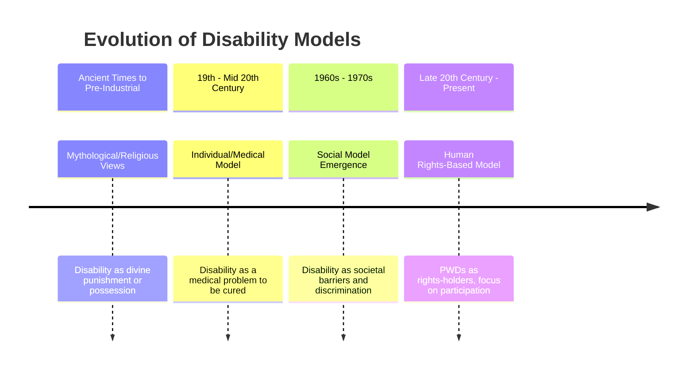

# Definition
Before proceeding, ensure you master [[Disability_Models]].
The Evolution of Disability Models refers to the historical progression of conceptual frameworks used to understand and address [[Disability]]. These models have shifted from religiously or mythologically based interpretations to medical, and eventually, social and human rights-based perspectives. This evolution reflects changing societal values, scientific understanding, and the advocacy efforts of persons with disabilities themselves. A simpler way to think about it is like upgrading software: each new version (model) tries to fix the bugs and improve the functionality of the previous one in how we perceive and respond to disability.

# The Mental Model
Imagine a pendulum swinging through history. Initially, it swings towards supernatural explanations, then to individual medical problems, and finally, towards a societal issue. Each swing represents a major shift in how society "sees" and "treats" [[Disability]]. The pendulum's journey shows that our understanding is not static but constantly evolving as we learn more and challenge existing norms.

*Note: This `timeline` illustrates the historical progression of understanding disability, from early mythological interpretations to modern human rights-based approaches, highlighting key shifts in perspective.*

# Context & Framework
### The Problem: Why Did We Invent This?
Historically, [[Disability]] was often viewed through a lens of fear, superstition, or pity, leading to exclusion and institutionalization. The initial "invention" of formal models was an attempt to rationalize and respond to disability, even if the early approaches were flawed. The driving problem was the need to integrate or manage individuals with impairments within society, albeit with varying degrees of success and humaneness depending on the prevailing model.

# The Mastery Deep Dive
### Version 1.0 vs. Today
The journey from the earliest understandings of [[Disability]] to contemporary views is marked by significant shifts. Version 1.0, represented by the Traditional/Charity Model, saw disability as a curse or punishment, eliciting pity and charity rather than rights. The subsequent Individual/Medical Model (Version 2.0) framed disability as a medical problem requiring cure, rehabilitation, and professional intervention. Today's understanding, anchored in the Social and Human Rights-Based Models, is a radical departure, emphasizing societal responsibility to remove barriers and ensure equal participation for persons with disabilities. This "today" version recognizes persons with disabilities as rights-holders rather than objects of charity or medical intervention.

### The "Same Story, Different Setting" (Connect historical event to modern tech pattern)
The evolution of disability models can be likened to the development of software standards. Early "standards" (Traditional/Charity Model) were rudimentary and often punitive. The "Medical Model" was like a bug fix, attempting to rationalize and treat the "issue" at an individual level. However, it soon became apparent that the "system" (society) itself had design flaws that created incompatibility for certain "users" (persons with disabilities). The "Social Model" then emerged as a major architectural refactor, shifting the focus from fixing the user to redesigning the system to be universally compatible and inclusive, akin to adopting universal design principles in modern technology.

# Constraints & Limitations
### The Echoes of the Past: Resurgent Old Models
Despite significant progress, a major constraint is the persistent influence and occasional resurgence of older disability models, even within contemporary societies. The "echoes" of the Traditional/Charity Model can be seen in paternalistic attitudes or reliance on charity rather than rights. Similarly, the Individual/Medical Model can constrain progress by focusing excessively on medical "fixes" without adequately addressing systemic barriers. This intellectual inertia means that societies often struggle to fully adopt the paradigm shift offered by the social and human rights models.

# Significance & Application
Understanding the Evolution of Disability Models is crucial for recognizing the progress made and the challenges that remain in achieving full inclusion. It provides a historical context for current policies and advocacy efforts, emphasizing the shift from a deficit-based view to a rights-based perspective. This knowledge informs the development of more effective and equitable approaches to disability.

# The Worked Example
Consider the shift in focus regarding education for children with disabilities over the past century.

**Step 1: Early 20th Century (Traditional/Charity and early Medical Model influence).**
*   **Approach:** Specialized or residential schools were established, often segregating children with disabilities from mainstream education. The focus was on "caring for" or "treating" them in separate environments.
*   **Underlying Model:** Reflects the charity model (separate provisions out of pity) and early medical model (segregation for specialized "treatment" and education).

**Step 2: Mid-20th Century (Mainstreaming and Integration).**
*   **Approach:** Special needs education classes were introduced in public schools (mainstreaming), or students with disabilities were placed in general classes (integration), but the system largely remained unchanged. The expectation was for the child to "fit the system."
*   **Underlying Model:** A transitional phase, still heavily influenced by the medical model's focus on adapting the child, but with a nascent recognition of access.

**Step 3: Late 20th Century to Present (Inclusive Education).**
*   **Approach:** Inclusive education emerged, advocating for the regular education system to change and adapt to fit the diverse needs of all students, including those with disabilities. The emphasis is on a flexible system and the belief that all children can learn.
*   **Underlying Model:** Strongly aligns with the Social and Human Rights-Based Models, where the system is responsible for removing barriers to participation.

# The Proving Ground
*Test your mastery. Cover the solutions below to test yourself first.*

### Level 1: The Sanity Check (Verification)
**The Fact Check:** Which historical model viewed disability primarily in mythological or religious terms?
> **Solution:** The Traditional/Charity Model.

### Level 2: The Crucible (Mastery & Edge Cases)
**The Lose-Lose Scenario:** A developing country's education ministry is debating how to best support children with disabilities. One faction proposes building more specialized schools with dedicated resources (echoing earlier models), while another advocates for investing in teacher training and classroom modifications in mainstream schools (aligned with current inclusive approaches). Given limited funds and a large population of children with disabilities, justify why the latter approach, despite its initial perceived complexities, aligns better with the current global understanding reflected in the `Evolution_of_Disability_Models`.
> **Solution:** The latter approach (investing in teacher training and mainstream classroom modifications) aligns better with the current global understanding of disability, which has evolved towards the Social and Human Rights-Based Models. Building specialized schools, while seemingly dedicated, reinforces segregation and the idea that children with disabilities need separate "fixes" (Medical Model), thus perpetuating the idea of disability as an individual problem. The inclusive approach, by contrast, seeks to change the system to fit the child, removing environmental and attitudinal barriers within mainstream education. This promotes full participation, challenges discrimination, and ultimately provides a more sustainable and equitable solution for long-term societal inclusion, recognizing persons with disabilities as rights-holders.

# Key Takeaways
*   Disability models have evolved from mythological/religious views to medical, and most recently, to social and human rights-based perspectives.
*   The shift represents a fundamental change from seeing disability as an individual flaw to recognizing it as a societal issue created by barriers.
*   Understanding this evolution is crucial for informing contemporary inclusive policies and practices.

# Knowledge Graph Connections
| Concept                     | Connection / Relationship                                                                   |
| :
-------------------------- | :
------------------------------------------------------------------------------------------ |
| [[Disability]]              | The understanding of disability is shaped by these evolving models.                         |
| [[Disability_Models]]       | This concept outlines the historical progression of specific disability models.             |
| [[Educational_Approaches_Towards_Inclusion]] | The evolution of disability models directly influenced educational strategies.      |
---