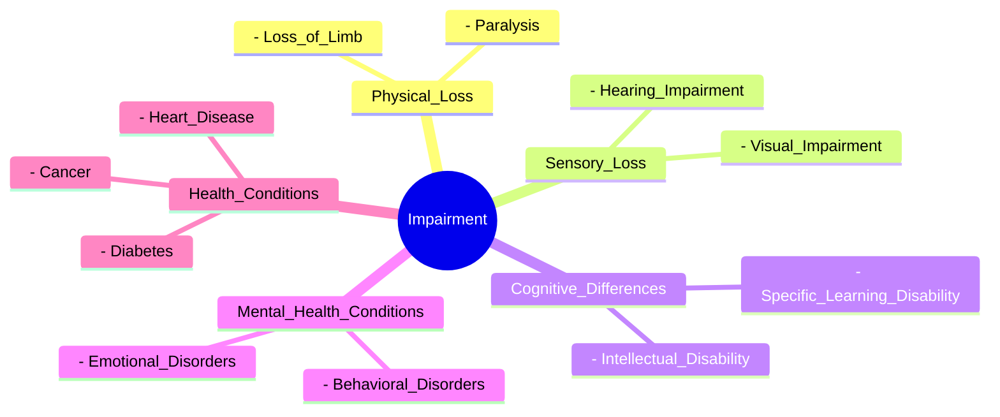

# Definition
Before proceeding, ensure you master [[Disability]].
Impairment is defined as the "purely factual absence of or loss of functioning in a body part". It refers to the physical or mental condition itself, such as visual, physical, hearing, or intellectual conditions. An impairment may lead to activity limitation, depending on its severity, type, and onset. It is a medical or biological reality, distinct from the broader concept of [[Disability]]. For instance, having a hearing loss is an impairment.

# The Mental Model
Imagine your body as a finely tuned machine. An "impairment" is like a specific part of that machine having a malfunction – a gear is missing, a circuit is broken, or a sensor isn't working correctly. This malfunction is a factual aspect of the machine's internal state. It's not about how the machine interacts with its environment (which would be [[Disability]]), but purely about an internal component not performing its intended function. For example, a car engine having a faulty spark plug is an impairment of the car.

*Note: This `mindmap` visually represents Impairment as the root concept, with branches extending to various categories and specific examples of impairments, highlighting their diverse nature.*

# Context & Framework
### Where Does it Live? (The Map)
[[Impairment]] is fundamentally a biological or physiological reality residing within an individual. It is a medical phenomenon that can be objectively identified, even if its causes are sometimes complex or unknown. Understanding where [[Impairment]] "lives" helps distinguish it from [[Disability]], which "lives" in the interaction between the individual and their environment. An impairment is part of human diversity, affecting a significant portion of the global population.

# The Mastery Deep Dive
### The "Purely Factual" Nature of Impairment
The definition of [[Impairment]] as a "purely factual absence of or loss of functioning" is crucial. This emphasizes its objective, observable, and measurable characteristics. It's about what is, physiologically speaking, rather than societal interpretations or environmental barriers. This factual basis allows for medical diagnosis and intervention targeting the impairment itself. For example, a diagnosis of diabetes identifies an impairment in the body's ability to regulate blood sugar.

### Who are the Neighbors?
[[Impairment]] is closely linked to [[Causes_of_Impairment]], as understanding the origins (biological or environmental) helps in prevention or management. It is also connected to [[Specific_Types_of_Impairments]], which categorize the various forms an impairment can take. Crucially, while distinct, [[Impairment]] is the precursor to [[Disability]], as the latter arises when an impairment interacts with disabling barriers.

# Constraints & Limitations
### The Blurred Lines: When "Impairment" Gets Confused
A significant constraint in the common understanding of [[Impairment]] is its frequent confusion with [[Disability]]. This overlap hinders effective intervention, as focusing solely on "curing" or "treating" the impairment often overlooks the necessity of removing societal barriers that create disability. For instance, providing a hearing aid (addressing impairment) is valuable, but it does not fully address the disability if public spaces lack accessible communication methods beyond spoken language.

# Significance & Application
Accurate identification of [[Impairment]] is vital for medical diagnosis, rehabilitation, and the development of assistive technologies. It informs healthcare strategies and early intervention programs. However, it must be balanced with the understanding of [[Disability]] to ensure a holistic approach that addresses both individual needs and societal responsibilities.

# The Worked Example
Consider an individual diagnosed with glaucoma, a condition that damages the optic nerve and can lead to vision loss.

**Step 1: Identify the Impairment.**
The individual has glaucoma, which is causing damage to the optic nerve. This is a purely factual loss of functioning in a body part (the eyes/optic nerve). The specific impairment is "visual impairment."

**Step 2: Understand the Cause.**
The cause of this impairment is biological (a disease affecting the optic nerve).

**Step 3: Recognize Potential Activity Limitation.**
Depending on the severity of the glaucoma, the individual may experience limitations in activities such as reading, driving, or recognizing faces.

# The Proving Ground
*Test your mastery. Cover the solutions below to test yourself first.*

### Level 1: The Sanity Check (Verification)
**The Neighbor Check:** In the context of the definition provided, what is one key characteristic of an impairment?
> **Solution:** It is a "purely factual absence of or loss of functioning in a body part."

### Level 2: The Crucible (Mastery & Edge Cases)
**The Sort:** A person has a chronic back condition that causes persistent pain and limits their ability to lift heavy objects. Categorize this situation as either primarily an [[Impairment]] or a [[Disability]], and justify your choice based on the definition of impairment.
> **Solution:** This is primarily an [[Impairment]]. The chronic back condition causing pain and limiting the ability to lift is a "purely factual absence of or loss of functioning in a body part" (the back's normal movement and strength). The pain and physical limitation are internal, physiological realities, aligning directly with the definition of impairment. While this impairment *could* lead to disability if societal barriers (e.g., jobs requiring heavy lifting without accommodation) are present, the condition itself is the impairment.

# Key Takeaways
*   Impairment is a factual absence or loss of functioning in a body part, such as visual, hearing, or physical conditions.
*   It is a biological or medical reality, distinct from disability, which arises from the interaction of impairment with societal barriers.
*   Understanding impairment is crucial for medical diagnosis and intervention, but must be contextualized within the broader understanding of disability.

# Knowledge Graph Connections
| Concept                     | Connection / Relationship                                                                   |
| :
-------------------------- | :
------------------------------------------------------------------------------------------ |
| [[Disability]]              | Impairment is a precursor to disability, which is the interaction with barriers.            |
| [[Causes_of_Impairment]]    | Specific biological and environmental factors lead to various types of impairments.         |
| [[Specific_Types_of_Impairments]] | Impairment encompasses a wide range of categories, such as sensory, physical, and intellectual. |
---