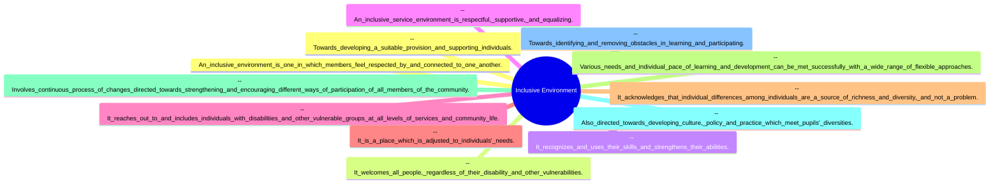

# Definition
Before proceeding, ensure you master [[Rationale_for_Inclusion]].
Features of an Inclusive Environment refer to the defining characteristics and qualities that create an accommodative and barrier-free atmosphere, ensuring all individuals feel respected, connected, and are able to participate fully, regardless of their disability or vulnerability. It is an environment that actively recognizes, uses, and strengthens the diverse skills and abilities of all its members.

# The Mental Model
Imagine a perfectly designed, universally accessible park. This park would be the [[Features_of_Inclusive_Environment]]. It wouldn't just have ramps; it would have sensory gardens, varied seating options, clear signage in multiple formats, and pathways designed for everyone. Every element is deliberately crafted to make individuals feel welcome, respected, and able to engage freely and equally. It's a place where differences are seen as enriching, not problematic.

# Context & Framework
### Defining the Accommodative Atmosphere
An inclusive environment is intrinsically linked to the formation of an accommodative and barrier-free atmosphere. It welcomes all people, respects their individual differences as a source of richness, and actively strives to meet diverse needs through flexible approaches. Such an environment goes beyond mere tolerance, actively reaching out to and including individuals with disabilities and other vulnerable groups at all levels of services and community life.

# The Mastery Deep Dive
### Who are the Neighbors?: Contextual Relationships

*Note: This `mindmap` illustrates the various interconnected features that define a truly inclusive environment.*

An inclusive environment doesn't exist in isolation; it "neighbors" and interacts with several key aspects of societal function. Its fundamental characteristic is fostering mutual respect and connection among members. This is adjacent to welcoming all people irrespective of vulnerability, which in turn leads to recognizing and leveraging diverse skills. A supportive and equalizing service environment directly influences how an inclusive space "reaches out" and actively engages marginalized groups. Furthermore, the acknowledgment of individual differences as a source of richness is closely linked to the environment's ability to adjust to individual needs, employing flexible approaches for learning and development. This entire system is continually evolving, driven by changes in culture, policy, and practice, all directed towards identifying and removing obstacles.

### Key Features of Inclusive Environments
1.  **Mutual Respect and Connection:** Members feel respected by and connected to one another, fostering a sense of belonging.
2.  **Universal Welcome:** It welcomes all people, irrespective of disability or other vulnerabilities.
3.  **Skill Recognition and Development:** It actively recognizes, utilizes, and strengthens the skills and abilities of all individuals.
4.  **Supportive and Equalizing Services:** Service environments are inherently respectful, supportive, and designed to provide equal opportunities.
5.  **Proactive Outreach and Inclusion:** It actively reaches out to and includes individuals with disabilities and other vulnerable groups at all levels of services and community life.
6.  **Individualized Adjustment:** The environment is adjusted to meet individual needs, moving beyond a one-size-fits-all approach.
7.  **Diversity as Richness:** It acknowledges individual differences as a source of richness and diversity, rather than a problem.
8.  **Flexible Approaches:** Various needs and individual paces of learning and development are met successfully with a wide range of flexible approaches.
9.  **Continuous Evolution:** It involves a continuous process of changes directed towards strengthening and encouraging different ways of participation for all community members.
10. **Policy and Practice Development:** It is also directed towards developing culture, policy, and practice that meet diverse needs, identify obstacles, and provide suitable support.

# Constraints & Limitations
### The "Don't Make Me Think" Rule: Hidden Cognitive Barriers
Even a physically accessible environment can create subtle "cognitive barriers" if it's not intuitively designed or requires excessive mental effort to navigate. This is a crucial trap in assessing inclusivity. For example, a website might be technically screen-reader compatible (addressing a physical barrier), but if its layout is chaotic, navigation is illogical, or instructions are overly complex, it imposes a cognitive burden that excludes individuals with certain learning differences or cognitive disabilities. An inclusive environment adheres to the "Don't Make Me Think" rule, striving for clarity and ease of use for all, and avoiding hidden friction points that force extra mental processing.

# Significance & Application
Understanding the features of an inclusive environment is essential for professionals in architecture, urban planning, software development, and service design. It guides the creation of physical spaces, digital platforms, and social programs that are inherently accessible and welcoming. In education, it informs the design of learning spaces and pedagogical approaches. Its application ensures that environments are not merely compliant but genuinely foster a sense of belonging and enable full participation for every individual, transforming diverse communities into vibrant, functional ecosystems.

# The Worked Example
*Test your mastery. Cover the solutions below to test yourself first.*

### Level 1: The Sanity Check (Verification)
**The Question:** Identify three characteristics that define an inclusive environment.
> **Solution:** Three characteristics are: members feel respected and connected; it welcomes all people regardless of disability; and it recognizes and uses individuals' skills and abilities.

### Level 2: The Crucible (Mastery & Edge Cases)
**The Scenario:** A new public library is designed with ramps, automatic doors, and adjustable-height desks. However, the library's cataloging system is exclusively text-based, with no visual cues or audio descriptions for book covers, and the library staff exclusively use spoken announcements without accompanying written or visual information on new events.
**The Question:** While the library has addressed some physical accessibility, explain two distinct ways this scenario demonstrates a failure to fully embody the [[Features_of_Inclusive_Environment]], particularly concerning how it recognizes individual differences as a source of richness and adjusts to individual needs.
> **Solution:**
> 1.  **Failure to Acknowledge Diversity as Richness (Sensory Needs):** The library's text-only catalog and lack of visual/audio information for events fails to acknowledge that individual differences among individuals are a source of richness and diversity, and not a problem. It neglects individuals with visual impairments or certain cognitive differences who may benefit from non-textual cues, and deaf or hard-of-hearing individuals who require visual communication. The library is not seeing these diverse needs as an opportunity to enrich its services.
> 2.  **Failure to Adjust to Individual Needs (Flexible Approaches):** By relying solely on text or spoken announcements, the library fails to meet various needs and the individual pace of learning and development with a wide range of flexible approaches. An inclusive environment would offer multimodal information (e.g., audio descriptions, tactile books, visual schedules, sign language interpreters) to genuinely adjust to the diverse needs of its patrons.

# Key Takeaways
*   An inclusive environment is defined by mutual respect, universal welcome, and the active recognition and strengthening of all individuals' skills and abilities.
*   It is characterized by supportive, equalizing services, proactive outreach, and a continuous adjustment to individual needs through flexible approaches.
*   Crucially, it views individual differences not as problems, but as a valuable source of richness and diversity, driving ongoing cultural, policy, and practical changes.

# Knowledge Graph Connections
| Concept                          | Connection / Relationship                                                                 |
| :
------------------------------- | :
---------------------------------------------------------------------------------------- |
| [[Rationale_for_Inclusion]]      | The features are the practical manifestations that fulfill the underlying rationales.     |
| [[Barriers_to_Inclusive_Environment]] | The features directly address and aim to overcome these obstacles to participation.      |
| [[Dimensions_for_Effective_Inclusive_Services]] | Features contribute to creating the optimal physical and social environments for these services. |
| [[WHO_Environmental_Analysis_in_Disability]] | The features are largely a response to the environmental aspects identified by WHO.     |
---