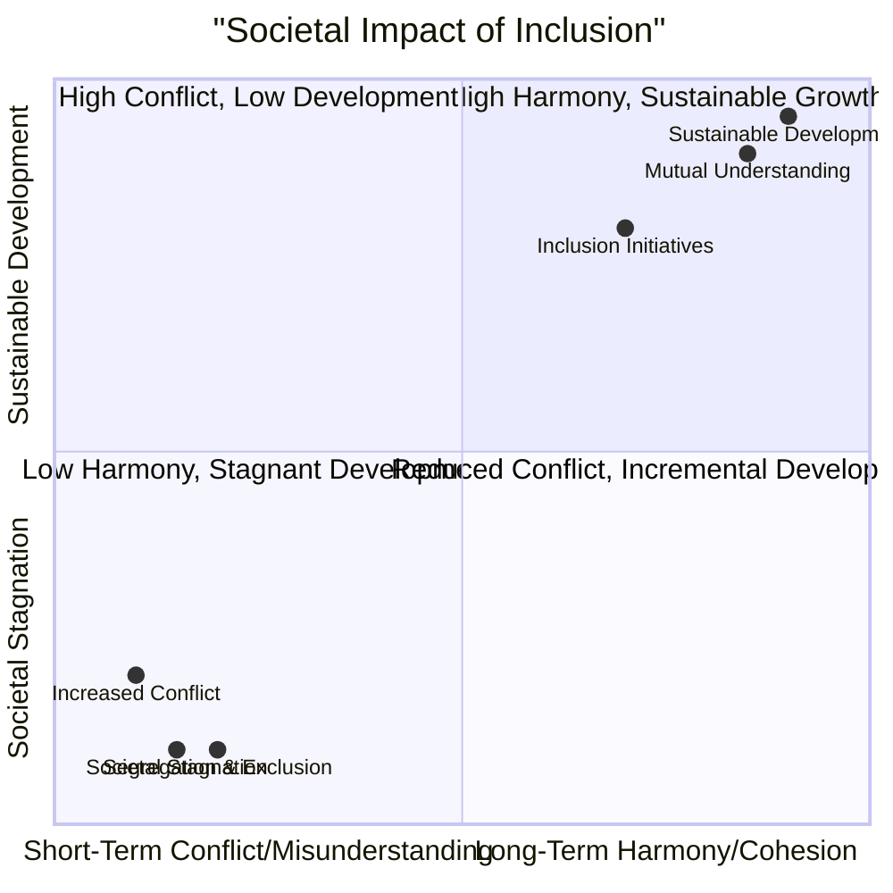

# Definition
Before proceeding, ensure you master [[Rationale_for_Inclusion]].
Foundations for Building Inclusive Society refer to the overarching societal values and transformative outcomes that inclusion cultivates, extending beyond individual benefits to reshape the very fabric of communities. These foundations emphasize that inclusion is a cornerstone for fostering mutual understanding, empathy, tolerance, cooperation, and ultimately, achieving sustainable development within a diverse and interconnected world.

# The Mental Model
Imagine a complex, vibrant ecosystem. The [[Foundations_for_Building_Inclusive_Society]] are the underlying ecological principles (biodiversity, symbiosis, resource sharing) that make the entire system resilient, productive, and adaptable. If these principles are ignored, the ecosystem becomes fragile and unbalanced. Similarly, if a society neglects mutual understanding, empathy, and cooperation, it becomes unstable and incapable of achieving sustainable development. Inclusion builds these foundational 'ecological' principles for human society.

# Context & Framework
### Cultivating a Harmonious and Sustainable Future
The ultimate rationale for inclusion extends to the very construction of society itself. It serves as a bedrock for cultivating mutual understanding and a profound appreciation of diversity among all citizens. By actively promoting inclusion, societies foster essential values such as empathy, tolerance, and cooperation. These attributes are not merely desirable; they are critical enablers for the broader objective of promoting sustainable development, ensuring that progress benefits all members and is resilient over time.

# The Mastery Deep Dive
### The Crystal Ball: What Happens Next?

*Note: This `quadrantChart` illustrates the long-term societal outcomes based on the level of inclusion, predicting a future of harmony and sustainable development when inclusion is embraced.*

When societies actively embrace the [[Foundations_for_Building_Inclusive_Society]], the "Crystal Ball" predicts a future characterized by enhanced social cohesion and sustainable progress. Inclusion initiates a virtuous cycle:
*   **Mutual understanding and appreciation of diversity** leads to greater empathy.
*   **Empathy fosters tolerance and cooperation**, breaking down social divisions.
*   **Increased cooperation and shared values** pave the way for more effective collective action.
*   This collective action, combined with the full participation of all citizens, becomes a powerful engine for **sustainable development**.
Conversely, neglecting these foundations through exclusion and segregation leads to a predicted future of societal fragmentation, increased conflict, and hampered development, as the full potential and contribution of all members are suppressed.

### Pillars of an Inclusive Society
1.  **Formation of Mutual Understanding and Appreciation of Diversity:** Inclusion directly cultivates a deeper understanding and respect for the diverse backgrounds, perspectives, and abilities within a community. It moves beyond mere tolerance to genuine appreciation.
2.  **Building up Empathy, Tolerance, and Cooperation:** Through regular interaction and shared experiences in inclusive environments, individuals develop greater empathy for others' challenges, foster tolerance for differences, and learn to cooperate effectively towards common goals.
3.  **Promotion of Sustainable Development:** An inclusive society, by leveraging the full potential of all its members and operating with mutual understanding and cooperation, is inherently better equipped to achieve sustainable development. It ensures that progress is equitable, resilient, and benefits everyone in the long term.

# Constraints & Limitations
### The Crystal Ball: What Happens Next? - The "Forced Assimilation" Trap
A significant trap, often disguised as inclusion, is "forced assimilation," where the dominant culture expects marginalized groups to shed their unique identities and conform entirely to existing norms to be "included." While aiming for "mutual understanding and appreciation," this approach subtly undermines genuine diversity by valuing conformity over true acceptance. The "Crystal Ball" predicts that forced assimilation leads to resentment, loss of cultural identity, and ultimately, a superficial form of inclusion that fails to build authentic empathy, tolerance, or cooperation. True inclusion, as a foundation for society, celebrates and accommodates diversity, rather than seeking to erase it.

# Significance & Application
These foundations are crucial for national leaders, international organizations, community developers, and civil society groups. They provide the normative framework for shaping national visions, international development goals, and grassroots initiatives aimed at fostering cohesive and just societies. They underscore that inclusion is not merely about accommodating differences but about actively leveraging diversity as a strength for collective well-being and long-term prosperity. Professionally, understanding these foundations inspires a commitment to building a world where every individual contributes to a shared, sustainable future.

# The Worked Example
*Test your mastery. Cover the solutions below to test yourself first.*

### Level 1: The Sanity Check (Verification)
**The Question:** List three key societal values or outcomes that are promoted through the foundations for building an inclusive society.
> **Solution:** Three key societal values/outcomes are: formation of mutual understanding and appreciation of diversity; building up empathy, tolerance and cooperation; and promotion of sustainable development.

### Level 2: The Crucible (Mastery & Edge Cases)
**The Scenario:** A diverse urban community launches a "Unity Festival" designed to celebrate all cultures and promote inclusion. The festival features a central stage for performances, food stalls representing various cuisines, and craft workshops. However, all instructions, announcements, and cultural information are provided exclusively in the dominant local language, with no multilingual support, sign language interpreters, or visual communication aids.
**The Question:** Explain how this "Unity Festival," despite its name and stated intention, fails to adequately fulfill the [[Foundations_for_Building_Inclusive_Society]], particularly concerning the formation of mutual understanding and the building of empathy, tolerance, and cooperation.
> **Solution:** This "Unity Festival" fails to adequately fulfill the [[Foundations_for_Building_Inclusive_Society]] because:
> 1.  **Hinders Mutual Understanding and Appreciation of Diversity:** By providing all communication exclusively in the dominant local language, the festival inadvertently excludes those who do not speak that language, those who are deaf/hard of hearing, or those who rely on visual communication. This prevents non-dominant language speakers and deaf individuals from fully accessing and appreciating the diverse cultural information, performances, and workshops. It creates a linguistic and communication barrier that contradicts the goal of fostering "mutual understanding and appreciation of diversity" across *all* groups.
> 2.  **Limits Empathy, Tolerance, and Cooperation:** When a significant portion of the community cannot fully participate or understand, opportunities to build "empathy, tolerance and cooperation" are severely limited. The exclusion prevents meaningful interaction and shared experiences among all participants. Instead of fostering unity, it risks creating a sense of alienation for those who cannot engage, thereby hindering the very social cohesion and understanding that inclusive societies aim to build.

# Key Takeaways
*   Foundations for building an inclusive society emphasize cultivating mutual understanding, appreciation of diversity, empathy, tolerance, and cooperation.
*   These social values are critical for fostering cohesive communities and achieving sustainable development.
*   True inclusion celebrates and accommodates diversity, rejecting "forced assimilation" where marginalized groups are expected to conform entirely to dominant norms.

# Knowledge Graph Connections
| Concept                          | Connection / Relationship                                                                 |
| :
------------------------------- | :
---------------------------------------------------------------------------------------- |
| [[Rationale_for_Inclusion]]      | This is one of the core foundational arguments for the overall rationale of inclusion.      |
| [[Social_Foundations_of_Inclusion]] | These foundations are closely linked, as strong social foundations are crucial for an inclusive society. |
| [[Economic_Foundations_of_Inclusion]] | An inclusive society, with its full human capital, is better positioned for sustainable economic development. |
| [[Legal_Foundations_of_Inclusion]] | Legal frameworks often aim to establish the rights and structures necessary for these societal foundations. |
---