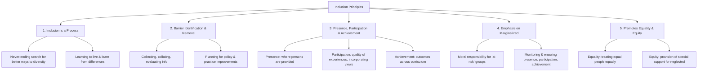

# Definition
Before proceeding, ensure you master [[Definition_of_Inclusion]].
The Principles of Inclusion are the foundational tenets that guide the implementation and evaluation of inclusive practices within society. They articulate the core values and objectives that must be upheld to ensure genuine participation and belonging for all individuals, particularly those at risk of marginalization. These principles move beyond the simple definition of inclusion by outlining *how* inclusion is achieved and sustained.

# The Mental Model
Imagine a sturdy, interconnected tree. The trunk is the core [[Definition_of_Inclusion]]. The major branches are the [[Principles_of_Inclusion]], each supporting and extending from the trunk, providing structure and direction for growth. Smaller twigs and leaves represent specific actions and policies. If any major branch is weak or missing, the tree's overall health and ability to provide shade (inclusion) for all are compromised. All parts of the tree are vital and work together.

# Context & Framework
### The UNESCO Framework for Inclusive Practices
According to UNESCO (2005), four major principles form the bedrock of inclusion: (1) Inclusion is a process, (2) Inclusion is concerned with the identification and removal of barriers, (3) Inclusion is about the presence, participation, and achievement of all persons, and (4) Inclusion invokes a particular emphasis on those who may be at risk of marginalization, exclusion, or underachievement. These principles provide a comprehensive framework for understanding and implementing inclusive approaches across various sectors, from education to community development.

# The Mastery Deep Dive
### The Family Tree: Interconnected Principles

*Note: This `graph TD` illustrates the hierarchical relationship between the overarching principles of inclusion and their core characteristics.*

The principles of inclusion are not isolated but form an interconnected "family tree" where each principle supports and reinforces the others. For example, recognizing inclusion as a continuous *process* (Principle 1) necessitates the ongoing *identification and removal of barriers* (Principle 2). This removal of barriers, in turn, facilitates the *presence, participation, and achievement* of all individuals (Principle 3), with a particular *emphasis on those at risk of marginalization* (Principle 4). Finally, the entire framework is underpinned by the promotion of both *equality and equity* (Principle 5), ensuring fair treatment and necessary support.

### Unpacking the Core Principles
1.  **Inclusion is a process:** This principle emphasizes that inclusion is a never-ending journey to better respond to diversity. It's about learning from differences and seeing them as a stimulus for growth among all individuals, rather than a problem to be solved.
2.  **Barrier identification and removal:** This involves systematically gathering and evaluating information to pinpoint obstacles that hinder the development of persons with disabilities. It's about proactive problem-solving to improve policies and practices.
3.  **Presence, participation, and achievement:** This tripartite focus ensures that individuals are not just physically present, but actively engaged (quality of experience, incorporating their views), and achieving meaningful outcomes across all aspects of life, beyond just standardized test results.
4.  **Emphasis on those at risk of marginalization:** This principle highlights a moral responsibility to vigilantly monitor and implement steps to guarantee the presence, participation, and achievement of vulnerable groups, ensuring no one is left behind.
5.  **Promotes equality and equity:** Inclusion inherently champions both [[Equality_and_Equity_in_Inclusion]]. Equality means treating equals equally, while equity refers to providing specific support to those who have been historically neglected, to enable their full participation.

# Constraints & Limitations
### The "Empty Checklist" Trap: Confusing Compliance with Culture
A common trap is to treat the principles of inclusion as a simple checklist for compliance, rather than a guide for fostering a truly inclusive culture. For instance, an institution might claim to "identify and remove barriers" (Principle 2) by installing a ramp, but fail to address underlying attitudinal barriers. This "empty checklist" approach neglects the spirit of inclusion as a process (Principle 1) and its emphasis on genuine participation (Principle 3). It mistakenly assumes that fulfilling superficial requirements equates to achieving deep-seated cultural change, leaving many still feeling marginalized.

# Significance & Application
Understanding these principles is vital for anyone involved in designing policies, programs, or environments aimed at inclusion. In education, they guide curriculum development and teaching methodologies. In public policy, they inform legislation for accessibility and non-discrimination. Professionally, they provide a moral and practical compass for fostering diverse and equitable workplaces and communities. The principles are fundamental to the global movement for disability rights and social justice.

# The Worked Example
*Test your mastery. Cover the solutions below to test yourself first.*

### Level 1: The Sanity Check (Verification)
**The Question:** Name two of UNESCO's major principles of inclusion and briefly explain what each entails.
> **Solution:**
> 1.  **Inclusion is a process:** This means it's a continuous, never-ending effort to find better ways to respond to diversity, rather than a fixed goal or one-time project. It involves learning from differences.
> 2.  **Inclusion is concerned with the identification and removal of barriers:** This principle focuses on actively finding and eliminating obstacles that prevent individuals with disabilities from developing and participating fully. It requires evaluating information and planning improvements.

### Level 2: The Crucible (Mastery & Edge Cases)
**The Scenario:** A non-profit organization launches a new program for youth with disabilities. They ensure all physical spaces are accessible, provide a diverse range of activities, and meticulously track attendance. However, they struggle to gain feedback from the participants themselves, and engagement levels during activities remain low, despite good attendance.
**The Question:** Identify which two of UNESCO's principles of inclusion are *most clearly being neglected* in this scenario, and explain why.
> **Solution:** The two principles most clearly being neglected are:
> 1.  **Inclusion is about the presence, participation, and achievement of all persons (specifically "participation"):** While "presence" (tracking attendance) is met, "participation" is failing because the quality of experiences is low and the organization is not incorporating the views of learners. Genuine participation requires active engagement and feeling valued, not just being physically present.
> 2.  **Inclusion is a process:** The organization appears to view inclusion as a static goal (accessible spaces, diverse activities) rather than a continuous search for better ways to respond to diversity. The lack of feedback mechanisms indicates a failure in the "never-ending search to find better ways of responding to diversity" and "learning how to learn from differences." The low engagement suggests the process needs refinement based on learner experiences.

# Key Takeaways
*   The principles of inclusion, as outlined by UNESCO, provide a comprehensive framework for guiding inclusive practices, emphasizing continuous improvement, barrier removal, and full participation.
*   Key principles include viewing inclusion as a process, actively identifying and eliminating barriers, focusing on presence, participation, and achievement, and prioritizing those at risk of marginalization.
*   An integral principle is the promotion of both equality (treating equals equally) and equity (providing necessary support to overcome historical disadvantages).

# Knowledge Graph Connections
| Concept                          | Connection / Relationship                                                                 |
| :
------------------------------- | :
---------------------------------------------------------------------------------------- |
| [[Definition_of_Inclusion]]      | These principles elaborate on the foundational definition of inclusion.                    |
| [[WHO_Environmental_Analysis_in_Disability]] | The principles inform the understanding of environmental factors in inclusion.          |
| [[Equality_and_Equity_in_Inclusion]] | This concept is explicitly integrated as the fifth principle of inclusion.                |
| [[Rationale_for_Inclusion]]      | The principles provide the operational 'how' to the 'why' of inclusive rationales.        |
| [[Features_of_Inclusive_Environment]] | The principles dictate the characteristics and requirements of inclusive environments.    |
| [[Barriers_to_Inclusive_Environment]] | The second principle explicitly mandates the identification and removal of these barriers. |
---