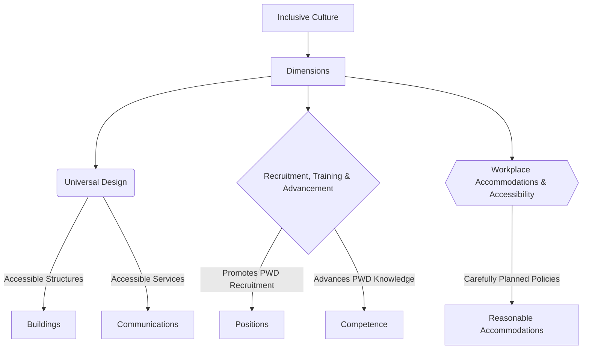

# Definition
Before proceeding, ensure you master [[Definition_of_Inclusive_Culture]] and Concept_Of_Inclusion because understanding the dimensions of inclusive culture requires a clear grasp of what inclusion means and how it is broadly defined. The dimensions of inclusive culture refer to the **fundamental elements or pillars that collectively contribute to its formation and sustenance**. These dimensions move beyond theoretical definitions to outline the practical areas where inclusivity must be actively built and maintained. Think of it like building a house: you need a strong foundation (the definition), but then you need specific walls, a roof, and doors (the dimensions) to make it functional and livable for everyone.

# The Mental Model
Imagine a company striving to be truly inclusive. The "Dimensions of Inclusive Culture" are like the different departments or strategic initiatives they must focus on. One department handles making sure their office buildings are physically accessible (Universal Design). Another focuses on how they hire and promote people (Recruitment, Training, and Advancement). A third ensures that everyone in the company has the tools and adjustments they need to do their best work (Workplace Accommodations and Accessibility). All these "dimensions" work together to create an inclusive environment.


```text
// Scenario 1: Overview of Inclusive Culture Dimensions
// Output:
// (A flowchart showing "Inclusive Culture" leading to "Dimensions", which then branches into "Universal Design", "Recruitment, Training & Advancement", and "Workplace Accommodations & Accessibility".
// "Universal Design" further branches into "Accessible Structures" (leading to "Buildings") and "Accessible Services" (leading to "Communications").
// "Recruitment, Training & Advancement" branches into "Promotes PWD Recruitment" (leading to "Positions") and "Advances PWD Knowledge" (leading to "Competence").
// "Workplace Accommodations & Accessibility" branches into "Carefully Planned Policies" (leading to "Reasonable Accommodations").)
```
*Note: This `graph TD` illustrates the three primary dimensions of an inclusive culture and their key components.*

# Context & Framework
### The Family Tree
The dimensions of inclusive culture form a hierarchical structure, where the overarching concept of inclusive culture branches into specific, actionable areas. This structure helps organizations and communities systematically approach inclusivity, ensuring that no critical aspect is overlooked. Each dimension supports the others, creating a robust framework for fostering belongingness and equity.

# The Mastery Deep Dive
### The Cheat Code: How to Remember This
To remember the three dimensions of inclusive culture, think of the acronym **"URA"**:
*   **U**niversal Design: Designing things from the start to be accessible for everyone.
*   **R**ecruitment, Training, and Advancement: Ensuring equitable opportunities for professional growth.
*   **A**ccommodations and Accessibility (Workplace): Providing necessary adjustments for meaningful participation.
This mnemonic helps to quickly recall the broad categories of action required to build an inclusive environment.

### The "Wikipedia One-Liner"
The dimensions of inclusive culture are defined as: **Universal Design**, which focuses on creating environments and resources organically accessible to all; **Recruitment, Training, and Advancement Opportunities**, promoting the professional growth of persons with disabilities; and **Workplace Accommodations and Accessibility**, ensuring policies and practices facilitate meaningful inclusion. These three elements are integral to the full and successful integration of diverse individuals within society.

# Constraints & Limitations
### Spot the Impostor (Don't be Fooled)
A common pitfall is to focus on only one dimension while neglecting the others, creating an "impostor" of true inclusivity. For instance, a company might implement a stunning Universal Design in its new office (e.g., ramps, wide doors) but then fail to actively recruit persons with disabilities or provide necessary workplace accommodations. This selective application creates an environment that *looks* inclusive but falls short in practice, as it addresses only a single aspect of the multi-dimensional challenge. All three dimensions must be addressed comprehensively for genuine inclusion.

# Significance & Application
Understanding the dimensions of inclusive culture provides a roadmap for practical implementation. In education, it guides curriculum development and facility design. In corporate settings, it shapes HR policies and workplace infrastructure. For urban planners, it influences public space design. By recognizing and addressing each dimension, societies can move beyond symbolic gestures to create environments where inclusion is not an afterthought but an inherent characteristic.

# The Worked Example
This lecture slides focus on definitions and conceptual understanding. A worked example here would be a detailed case study illustrating the implementation of these dimensions in a real-world setting.

**Scenario:** A large tech company, "InnovateCo," aims to become a leader in inclusive workplace culture. They decide to tackle all three dimensions systematically.

**Step 1: Implementing Universal Design for New Infrastructure**
InnovateCo is building a new headquarters. They consult with accessibility experts to ensure the building's blueprint incorporates [[Universal_Design]] principles from the outset. This includes not just ramps and automatic doors, but also height-adjustable workstations, tactile paving for navigation, clear visual and auditory alerts for emergencies, and diverse seating options in communal areas. The goal is that the default design works for the widest possible range of users without needing retrofitting.

**Step 2: Reforming Recruitment, Training, and Advancement Protocols**
Next, InnovateCo revamps its HR processes to explicitly promote [[Recruitment_Training_and_Advancement]] for Persons With Disabilities (PWDs). They partner with disability employment agencies, offer internships specifically for PWDs, and ensure job descriptions are free of unintentional biases. Internal training programs are adapted to be accessible, and mentorship programs are established to support PWDs in advancing their professional knowledge and competence to leadership roles.

**Step 3: Enhancing Workplace Accommodations and Accessibility**
Finally, InnovateCo develops robust policies for [[Workplace_Accommodations_and_Accessibility]]. They establish a dedicated fund for reasonable accommodations, ranging from specialized software and assistive devices to flexible work schedules and quiet zones. An "accessibility task force" is created to review existing practices and proactively identify areas for improvement. This ensures that current employees with disabilities have the necessary support to perform effectively and thrive.

By addressing all three dimensions concurrently, InnovateCo creates a comprehensive and genuinely inclusive workplace culture, rather than just isolated initiatives.

# The Proving Ground
*Test your mastery. Cover the solutions below to test yourself first.*

### Level 1: The Sanity Check (Verification)
**The Fact Check:** What is the primary focus of "Universal Design" as a dimension of inclusive culture?
> **Solution:** Universal design refers to the construction of structures, spaces, services, communications, and resources that are organically accessible to a range of people with and without disabilities, without further need for modification or accommodation.

### Level 2: The Crucible (Mastery & Edge Cases)
**The Impostor:** A community initiative focuses heavily on providing accessible transportation (e.g., wheelchair-friendly buses, clear schedules) for people with disabilities to attend local events. While commendable, a critique is raised that the *events themselves* are often held in buildings with narrow doorways, lack sign language interpreters, and involve activities that require high physical stamina. Which dimension of inclusive culture is being adequately addressed, and which is being neglected, potentially creating an "impostor" of full inclusivity?
> **Solution:** The initiative is adequately addressing the "Workplace Accommodations and Accessibility" dimension by focusing on accessible transportation, which helps with the practical provision of services. However, it is neglecting the "Universal Design" dimension regarding the event venues and activities themselves. By having narrow doorways, no interpreters, and high-stamina activities, the events are not "organically accessible to a range of people with and without disabilities," thus requiring further modification or creating barriers. This creates an "impostor" of full inclusivity because while access *to* the event is facilitated, inclusion *within* the event is compromised due to a lack of universally designed spaces and activities.

# Key Takeaways
*   Inclusive culture is built upon three primary dimensions: Universal Design, Recruitment/Training/Advancement, and Workplace Accommodations/Accessibility.
*   Universal Design focuses on proactive accessibility in structures and services, eliminating the need for later modifications.
*   Recruitment, training, and advancement ensure equitable professional growth for persons with disabilities, while workplace accommodations provide necessary adjustments for participation.

# Knowledge Graph Connections
| Concept                                | Connection / Relationship                                                          |
| :
------------------------------------- | :
--------------------------------------------------------------------------------- |
| [[Definition_of_Inclusive_Culture]]    | The dimensions provide the practical framework for realizing an inclusive culture. |
| [[Universal_Design]]                   | Is one of the three core dimensions ensuring organic accessibility.                |
| [[Recruitment_Training_and_Advancement]] | Is a dimension focused on equitable career opportunities for PWDs.                 |
| [[Workplace_Accommodations_and_Accessibility]] | Is a dimension ensuring supportive environments for people with disabilities.      |
---