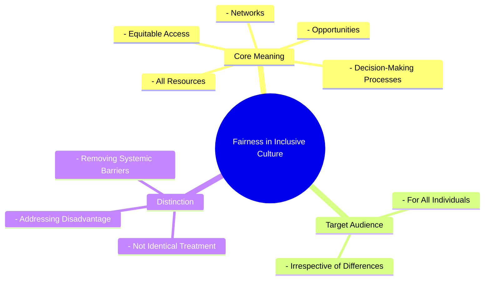

# Definition
Before proceeding, ensure you master [[Definition_of_Inclusive_Culture]] and Concept_Of_Inclusion because fairness is a core value of an inclusive culture, requiring a clear understanding of what that culture strives to achieve. Fairness in inclusive culture refers to the **principle of equitable access to all resources, opportunities, networks, and decision-making processes for every individual, irrespective of their differences**. It is not about treating everyone identically, but rather about providing what each person needs to participate fully and thrive, addressing historical disadvantages and systemic barriers. Think of it like a race where some runners start with obstacles: fairness means removing those obstacles or giving them a head start, so everyone has a genuine chance to reach the finish line, rather than just starting everyone from the same, unequal position.

# The Mental Model
Imagine a game where everyone needs to reach a treasure. "Fairness" in an inclusive culture means that the rules are set up so that everyone, no matter their abilities or starting point, has a genuine chance to play and win. If someone uses a wheelchair, there are ramps. If someone speaks a different language, there are interpreters. It's about ensuring equal access to the game's resources (clues, tools) and having an equal say in how the game is played, so everyone feels like a valued participant, and no one is excluded due to factors beyond their control.


```text
// Scenario 1: Basic understanding of Fairness in Inclusive Culture
// Output:
// (A visual mindmap showing "Fairness in Inclusive Culture" at the root, branching into "Core Meaning", "Target Audience", and "Distinction".
// "Core Meaning" branches into "Equitable Access", "All Resources", "Opportunities", "Networks", "Decision-Making Processes".
// "Target Audience" branches into "For All Individuals", "Irrespective of Differences".
// "Distinction" branches into "Not Identical Treatment", "Addressing Disadvantage", "Removing Systemic Barriers".)
```
*Note: This `mindmap` visualizes the core meaning, target audience, and distinctions of fairness within an inclusive culture.*

# Context & Framework
### Where Does it Live? (The Map)
Fairness in inclusive culture manifests in the design of public services, the policies of educational institutions, the hiring practices of corporations, and the governance structures of community organizations. It is found in anti-discrimination laws, affirmative action programs, and the allocation of support resources. This concept directly confronts historical and systemic inequalities by insisting on proactive measures to ensure that opportunities are genuinely accessible and equitable for all, rather than perpetuating existing power dynamics.

# The Mastery Deep Dive
### Who are the Neighbors?
Fairness is a critical neighbor to [[Representation_in_Inclusive_Culture]], as the presence of diverse voices is fundamental to understanding what constitutes equitable access and how to remove barriers. It is also deeply intertwined with [[Receptivity_in_Inclusive_Culture]], as an open-mindedness to different needs is essential for designing truly fair systems. Furthermore, fairness is a cornerstone of [[Building_Inclusive_Community]], ensuring that all citizens have full access to resources and participate equitably in decision-making. Without fairness, the aspirations of an inclusive culture cannot be realized, becoming merely symbolic.

### The "Wikipedia One-Liner"
Fairness in inclusive culture is the core principle ensuring equitable access to all resources, opportunities, networks, and decision-making processes for every individual, regardless of their differences. This involves actively addressing historical disadvantages and systemic barriers through differentiated support, rather than merely treating everyone identically, thereby fostering genuine participation and belonging.

# Constraints & Limitations
### Spot the Impostor (Don't be Fooled)
A common "impostor" of true fairness is the principle of **"treating everyone the same."** While seemingly egalitarian, this approach often fails to account for existing systemic disadvantages or diverse needs, thereby perpetuating inequity. For example, if a job application process is identical for all candidates, but some have disabilities that make standard interview formats inaccessible, treating them "the same" is not fair. True fairness requires understanding and accommodating differences to ensure equitable outcomes, often through customized support, rather than a blanket application of uniformity that ignores varied starting points.

# Significance & Application
Fairness is indispensable for achieving social justice, promoting human rights, and building legitimate institutions. Academically, it is a core concept in ethics, law, and political philosophy, exploring theories of justice and equality. Practically, it guides the development of anti-discrimination legislation, informs policies for reasonable accommodation, and influences equitable resource allocation. Upholding fairness builds trust, reduces social stratification, and ensures that everyone has the chance to contribute their full potential to society.

# The Worked Example
This lecture slides focus on definitions and conceptual understanding. A worked example here would be a detailed case study illustrating the implementation of fairness in an inclusive culture.

**Scenario:** A large public university, "Apex University," is committed to upholding `Fairness_in_Inclusive_Culture` in its admissions process, especially for students with diverse backgrounds and needs.

**Step 1: Addressing Systemic Barriers to Access**
Apex University revises its application forms to be fully accessible online and offers alternative formats (e.g., large print, audio). They also remove mandatory standardized test scores for certain programs, recognizing that these tests can create barriers for students from under-resourced schools or those with specific learning disabilities. This directly addresses ensuring "equitable access to all resources" by dismantling systemic barriers that might disadvantage certain groups.

**Step 2: Providing Equitable Opportunities through Differentiated Support**
The university introduces a robust program for "contextualized admissions," where applicants' socio-economic backgrounds, family responsibilities, and unique life challenges are considered alongside academic performance. They also establish a dedicated support office to provide reasonable accommodations during the application and interview stages for students with disabilities, ensuring they have an "equitable opportunity" to showcase their abilities. This reflects the principle that fairness is "not about treating everyone identically, but rather about providing what each person needs."

**Step 3: Ensuring Fair Representation in Decision-Making**
The admissions committee is diversified to include faculty members from various ethnic backgrounds, staff from the disability services office, and alumni who represent a wide range of experiences. This ensures that diverse perspectives inform the "decision-making processes," helping to identify and mitigate unconscious biases that might inadvertently lead to unfair outcomes. The presence of diverse members fosters `Representation_in_Inclusive_Culture`.

**Step 4: Continuous Review and Feedback**
Apex University establishes an anonymous feedback mechanism for applicants and an annual review process for its admissions policies, specifically looking at equity metrics across different demographic groups. If disparities are identified, the policies are re-evaluated and adjusted, demonstrating a commitment to continuous improvement in achieving `Fairness_in_Inclusive_Culture`.

Through these measures, Apex University moves beyond a simplistic "treat everyone the same" approach to genuinely embed fairness into its admissions culture, ensuring that all deserving students have an equitable chance to succeed.

# The Proving Ground
*Test your mastery. Cover the solutions below to test yourself first.*

### Level 1: The Sanity Check (Verification)
**The Fact Check:** In the context of an inclusive culture, what specific areas should exhibit "equitable access" as part of fairness?
> **Solution:** Equitable access should extend to all resources, opportunities, networks, and decision-making processes.

### Level 2: The Crucible (Mastery & Edge Cases)
**The Impostor:** A popular online gaming platform implements a new anti-cheat system designed to "treat all players equally" by automatically banning anyone detected using third-party software. While the intention is to ensure fair play, the system, due to a bug, disproportionately flags and bans players using certain legitimate accessibility software designed for gamers with motor impairments. The platform argues it's "fair" because the rule applies to everyone. Analyze why this platform's approach, despite its claims of equality, is an "impostor" for genuine fairness in an inclusive culture, referencing the core definition and distinctions of fairness.
> **Solution:** This platform's approach is an "impostor" for genuine fairness because it fails to provide "equitable access to all resources [the game] and opportunities" for players with motor impairments. While the rule "applies to everyone," this identical treatment overlooks the fact that some players require "legitimate accessibility software" to participate equally. True fairness is "not about treating everyone identically" but about "addressing historical disadvantages and systemic barriers." The buggy anti-cheat system creates a systemic barrier for a specific group, directly contradicting the goal of equitable access. A genuinely fair system would distinguish between malicious third-party software and legitimate accessibility tools, thereby providing what each person needs to participate fully, rather than penalizing those who require accommodations.

# Key Takeaways
*   Fairness in inclusive culture ensures equitable access to resources, opportunities, networks, and decision-making for all individuals.
*   It emphasizes providing what each person needs to thrive, addressing historical disadvantages and systemic barriers.
*   Genuine fairness goes beyond treating everyone identically, often requiring differentiated approaches to ensure equitable outcomes.

# Knowledge Graph Connections
| Concept                         | Connection / Relationship                                                          |
| :
------------------------------ | :
--------------------------------------------------------------------------------- |
| [[Definition_of_Inclusive_Culture]] | Fairness is a foundational core value that defines an inclusive culture.           |
| [[Representation_in_Inclusive_Culture]] | Fairness is achieved through effective representation, ensuring all voices have influence. |
| [[Receptivity_in_Inclusive_Culture]] | A receptive culture is essential for understanding diverse needs to implement fair policies. |
| [[Building_Inclusive_Community]]  | Fairness is a key component in establishing an inclusive community that respects all citizens. |
---