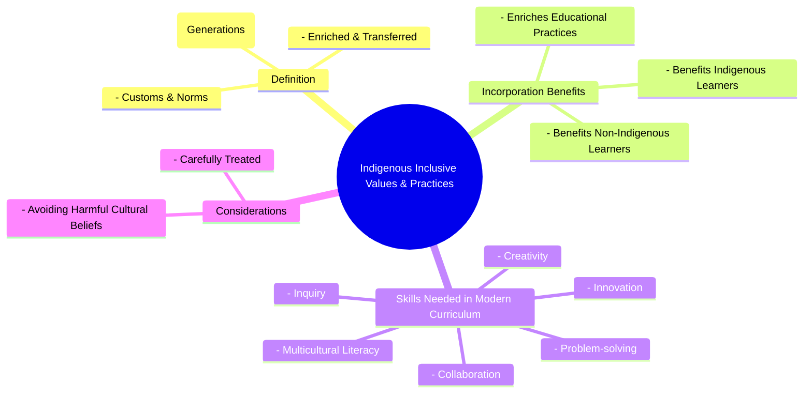

# Definition
Before proceeding, ensure you master [[Inclusive_Values_in_Cultural_Norms]] and Concept_Of_Inclusion because understanding indigenous inclusive values and practices requires a background in how inclusive values integrate into cultural norms generally, and a clear grasp of the core concept of inclusion. Indigenous inclusive values and practices refer to the **customs, norms, and traditional ways of learning developed by indigenous societies over generations, which intrinsically promote collective well-being, respect for diversity (including human and ecological), and community-centric approaches to knowledge and participation**. Incorporating these into educational practices holds significant potential to benefit all learners, fostering a more holistic and culturally sensitive approach to inclusion. Think of it as a deep-rooted tree whose traditional wisdom nourishes the entire forest, offering unique insights into harmonious coexistence.

# The Mental Model
Imagine a wise elder sharing stories and lessons around a campfire. "Indigenous Inclusive Values and Practices" are like the ways this elder teaches: not just through words, but through respect for nature, listening to everyone, sharing resources, and learning by doing. It's about how the community has always learned and lived together in a way that includes everyone and respects the earth. Incorporating this into a modern school is like bringing the wisdom of that campfire circle into the classroom, enriching everyone's learning journey.


```text
// Scenario 1: Overview of Indigenous Inclusive Values and Practices
// Output:
// (A visual mindmap showing "Indigenous Inclusive Values & Practices" at the root, branching into "Definition", "Incorporation Benefits", "Skills Needed in Modern Curriculum", and "Considerations".
// "Definition" branches into "Customs & Norms", "Developed Culturally (Generations)", "Enriched & Transferred".
// "Incorporation Benefits" branches into "Benefits Indigenous Learners", "Benefits Non-Indigenous Learners", "Enriches Educational Practices".
// "Skills Needed in Modern Curriculum" branches into "Collaboration", "Creativity", "Innovation", "Problem-solving", "Inquiry", "Multicultural Literacy".
// "Considerations" branches into "Carefully Treated", "Avoiding Harmful Cultural Beliefs".)
```
*Note: This `mindmap` illustrates the definition, benefits of incorporation, and considerations for indigenous inclusive values and practices.*

# Context & Framework
### Where Does it Live? (The Map)
Indigenous inclusive values and practices are deeply embedded within the historical narratives, traditional governance structures, spiritual beliefs, and educational methodologies of indigenous communities worldwide. They represent a wealth of knowledge developed in specific ecological and social contexts. Mapping their "location" means acknowledging the diverse global tapestry of indigenous cultures and understanding that these values are living, evolving systems of knowledge. Their integration into broader systems is a process of respectful cross-cultural exchange and learning.

# The Mastery Deep Dive
### Who are the Neighbors?
Indigenous inclusive values and practices are closely related to Multicultural_Literacy (a skill needed in modern curriculum), which promotes understanding and appreciation of diverse cultures. They enrich the broader framework of [[Inclusive_Values_in_Cultural_Norms]] by offering unique perspectives on community, sustainability, and interconnectedness. Furthermore, their incorporation directly impacts Educational_Practices, aligning with the goals of creating curricula that are relevant and beneficial for all learners, both indigenous and non-indigenous. The principles of Collaboration_In_Modern_Curriculum and Problem_Solving_In_Modern_Curriculum (as critical skills) are often inherently present in indigenous learning approaches.

### The "Wikipedia One-Liner"
Indigenous inclusive values and practices are the intergenerational customs and norms of indigenous societies that inherently foster comprehensive inclusion through community-centric learning, respect for all life, and sustainable coexistence. Their integration into contemporary educational practices enriches curricula by cultivating essential skills such as collaboration, creativity, and multicultural literacy, benefiting both indigenous and non-indigenous learners while carefully navigating potentially harmful traditional beliefs.

# Constraints & Limitations
### Spot the Impostor (Don't be Fooled)
A significant "impostor" of genuine incorporation of indigenous inclusive values is **tokenism** or superficial integration. Simply adding a single "Native American history month" or a ceremonial land acknowledgment without deeply embedding indigenous pedagogies, knowledge systems, or community involvement into the curriculum is a shallow gesture. True integration requires authentic partnership, critical self-reflection to avoid perpetuating stereotypes, and careful treatment to ensure harmful cultural beliefs are not inadvertently promoted. Without this depth, it risks becoming an "impostor" that appears inclusive but fails to provide meaningful benefit or respect.

# Significance & Application
The significance of indigenous inclusive values and practices lies in their potential to decolonize education, enrich curricula, and foster a more holistic understanding of inclusion. Academically, this area contributes to indigenous studies, intercultural education, and sustainable development. Practically, it guides the development of culturally responsive pedagogies, promotes reconciliation, and equips learners with critical skills for a globalized world, such as Multicultural_Literacy_In_Education and [[Inquiry-Based_Learning]]. It offers alternative paradigms for education and community building that prioritize collective well-being and ecological wisdom.

# The Worked Example
This lecture slides focus on definitions and conceptual understanding. A worked example here would be a detailed case study illustrating the incorporation of indigenous inclusive values and practices in a modern educational setting.

**Scenario:** A national education board decides to overhaul its curriculum to genuinely incorporate indigenous inclusive values and practices, moving beyond token gestures.

**Step 1: Curriculum Development with Indigenous Knowledge Holders**
The board establishes a co-creation committee composed equally of curriculum developers and indigenous knowledge holders from various communities. They work together to identify key indigenous pedagogies (e.g., storytelling, experiential learning, place-based education) and content that aligns with modern learning objectives while preserving cultural integrity. This ensures that indigenous ways of learning are truly integrated, not just appended.

**Step 2: Fostering Skills for Modern Curriculum**
The revised curriculum emphasizes skills like Collaboration_In_Modern_Curriculum through group projects that mirror indigenous community practices, Creativity_In_Modern_Curriculum through artistic expressions tied to cultural narratives, and Problem_Solving_In_Modern_Curriculum by addressing local ecological challenges with traditional solutions. [[Inquiry-Based_Learning]] is encouraged by exploring indigenous perspectives on scientific phenomena. This aligns with the explicit need for these skills in a modern curriculum.

**Step 3: Teacher Training and Resource Development**
Teachers undergo mandatory professional development led by indigenous educators, focusing on culturally responsive teaching methods and understanding the historical and contemporary contexts of indigenous peoples. The board also develops new learning resources, including digital stories, interactive maps of traditional territories, and partnerships with indigenous cultural centers, ensuring accuracy and authenticity.

**Step 4: Continuous Evaluation and Adaptation**
An ongoing process of feedback and evaluation is established with indigenous communities to ensure the curriculum remains relevant, respectful, and effective. Mechanisms are put in place to address any concerns about **avoiding harmful cultural beliefs** and to ensure the practices truly benefit both indigenous and non-indigenous learners.

This comprehensive approach moves beyond superficial inclusion to a deep, respectful integration of indigenous values and practices, enriching the educational experience for all.

# The Proving Ground
*Test your mastery. Cover the solutions below to test yourself first.*

### Level 1: The Sanity Check (Verification)
**The Fact Check:** According to the source, how do indigenous values originate and how are they maintained?
> **Solution:** Indigenous values are customs and norms of a society developed in the course of past cultural practices, and are enriched and transferred from generation to generation.

### Level 2: The Crucible (Mastery & Edge Cases)
**The Impostor:** A primary school implements an "Indigenous Story Time" once a month where volunteers read translated traditional stories. The school proudly states this is how they are incorporating indigenous inclusive values into their curriculum. Analyze why this approach, while well-intentioned, is an "impostor" for genuine incorporation of indigenous inclusive values and practices, referencing specific aspects of the definition and benefits.
> **Solution:** This approach is an "impostor" for genuine incorporation because it is superficial and lacks depth. Firstly, "Indigenous Story Time" primarily benefits non-indigenous learners by exposing them to stories, but it may not fully "benefit both Indigenous and non-Indigenous learners" if indigenous children do not see their broader culture reflected or participate meaningfully in its sharing beyond being passive recipients. Secondly, genuine incorporation involves "Indigenous ways of learning" and a deep integration into "educational practices," not just a singular activity. It fails to cultivate essential skills like Collaboration_In_Modern_Curriculum or Problem_Solving_In_Modern_Curriculum that indigenous pedagogies often emphasize. Without active engagement, curriculum reform, and addressing the need for Multicultural_Literacy_In_Education through deeper practices, it remains a token gesture that misses the transformative potential of truly embedding indigenous inclusive values.

# Key Takeaways
*   Indigenous inclusive values and practices are traditional customs and norms fostering collective well-being, diversity respect, and community-centric learning.
*   Incorporating these into education benefits all learners by enriching practices and cultivating skills like collaboration, creativity, and multicultural literacy.
*   Careful treatment is required to avoid harmful cultural beliefs, ensuring authentic and respectful integration.

# Knowledge Graph Connections
| Concept                               | Connection / Relationship                                                          |
| :
------------------------------------ | :
--------------------------------------------------------------------------------- |
| [[Inclusive_Values_in_Cultural_Norms]] | Indigenous values represent a rich source of specific inclusive values for cultural norms. |
| Concept_Of_Inclusion              | Indigenous practices offer historical and holistic approaches to achieving inclusion. |
| Multicultural_Literacy_In_Education | Incorporating indigenous practices directly contributes to developing multicultural literacy. |
| Collaboration_In_Modern_Curriculum | Indigenous learning often emphasizes collaborative approaches, directly enriching modern curriculum skills. |
---