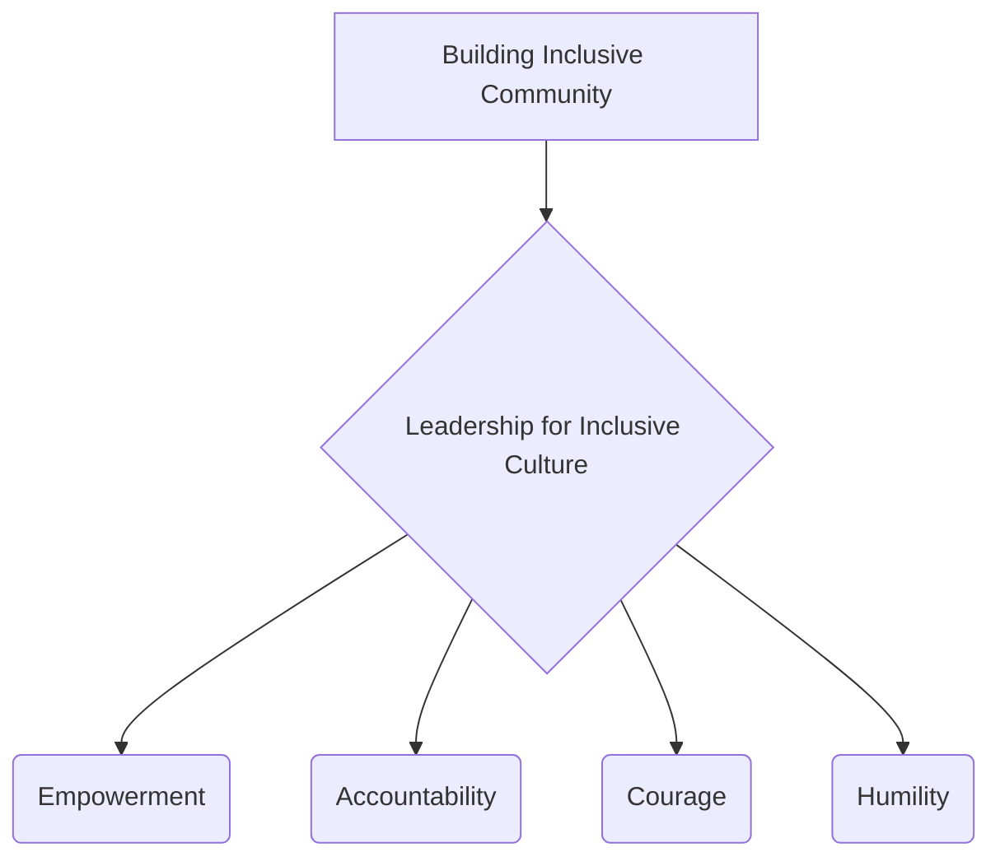

# Definition
Before proceeding, ensure you master [[Building_Inclusive_Community]] and [[Definition_of_Inclusive_Culture]] because effective leadership is crucial for actively cultivating and sustaining an inclusive culture within any community or institution. Leadership for inclusive culture refers to the **demonstration of specific behaviors and traits by individuals in positions of influence that actively champion, promote, and embed inclusive values and practices throughout an organization or society**. These behaviors include Empowerment, Accountability, Courage, and Humility. Such leadership is not just about managing diversity, but about actively creating an environment where every voice is heard, respected, and contributes to collective success. Think of it like a conductor leading a diverse orchestra: they don't just tell people what to play, but empower each musician, hold them accountable, have the courage to try new arrangements, and approach the music with humility, ensuring a harmonious and inclusive performance.

# The Mental Model
Imagine a ship's captain. A captain focused on "Leadership for Inclusive Culture" doesn't just bark orders. This captain **Empowers** the crew by trusting them with responsibilities. They instill **Accountability** so everyone takes ownership. They show **Courage** by navigating through storms and admitting mistakes. And they lead with **Humility**, valuing every crew member's experience, from the deckhand to the first mate. This leadership style ensures everyone feels valued, contributes their best, and the ship sails effectively together.


```text
// Scenario 1: Overview of Leadership behaviors for Inclusive Culture
// Output:
// (A flowchart showing "Building Inclusive Community" leading to "Leadership for Inclusive Culture", which then branches into "Empowerment", "Accountability", "Courage", "Humility".)
```
*Note: This `graph TD` illustrates the key behaviors expected of leaders fostering an inclusive culture.*

# Context & Framework
### The Family Tree
Leadership for Inclusive Culture resides within the overarching concept of [[Building_Inclusive_Community]], serving as the driving force for its realization. These leadership behaviors are also instrumental in translating [[Inclusive_Values_in_Cultural_Norms]] (such as Equality, Respect for Diversity) into daily practice. Effective inclusive leadership ensures that the [[Characteristics_of_Inclusive_Community]] (like being participatory, equitable, and safe) are not just aspirational but are actively cultivated and sustained. Without strong, principled leadership, efforts to build an inclusive culture often falter, highlighting its critical role in the broader framework of inclusion.

# The Mastery Deep Dive
### The Cheat Code: How to Remember This
To remember the key behaviors of inclusive leaders, think of the acronym **"EACH"**:
*   **E**mpowerment: Delegating authority and trusting team members.
*   **A**ccountability: Taking responsibility and holding others to standards.
*   **C**ourage: Speaking up against injustice and embracing difficult conversations.
*   **H**umility: Acknowledging mistakes and valuing all contributions.

This mnemonic provides a simple way to recall the essential qualities of leadership that champion inclusion.

### The "Wikipedia One-Liner"
Leadership for inclusive culture entails the consistent demonstration of behaviors such as Empowerment, Accountability, Courage, and Humility by individuals in positions of influence, actively promoting inclusive values and practices to create environments where all voices are respected, contributions are valued, and systemic barriers are dismantled. This dynamic leadership is essential for fostering a truly equitable and participatory community or institution.

# Constraints & Limitations
### Spot the Impostor (Don't be Fooled)
A common "impostor" of genuine inclusive leadership is **"performative allyship"** or **"lip service."** A leader might frequently *speak* about diversity and inclusion (e.g., in public statements) but fail to demonstrate the actual behaviors. For example, if a leader talks about "Empowerment" but micromanages their team, or preaches "Accountability" but ignores instances of discrimination within their ranks, they are acting as an impostor. Similarly, a lack of "Courage" to challenge the status quo or a lack of "Humility" to admit when they don't know something undermines their claims. True inclusive leadership requires consistent alignment between rhetoric and action, ensuring that stated values are genuinely embodied in daily practice and decision-making.

# Significance & Application
Inclusive leadership is vital for driving organizational change, fostering positive work cultures, and building resilient communities. Academically, it is a key area of study in organizational leadership, public administration, and social psychology, exploring its impact on employee engagement, innovation, and social equity. Practically, it guides leadership development programs, shapes corporate governance, and influences public policy aimed at promoting diversity. By embodying empowerment, accountability, courage, and humility, leaders can create environments where every individual feels respected, heard, and motivated to contribute their unique talents.

# The Worked Example
This lecture slides focus on definitions and conceptual understanding. A worked example here would be a detailed case study illustrating the qualities of leadership for inclusive culture.

**Scenario:** The CEO of "Global Horizons," Ms. Anya Sharma, decides to transform the company's culture into a model of inclusion, personally embodying `Leadership_for_Inclusive_Culture`.

**Step 1: Empowering Teams and Delegating Authority**
Ms. Sharma actively delegates decision-making power to diverse cross-functional teams, trusting them to develop and implement new initiatives. She provides resources and support but avoids micromanaging, instead fostering a sense of ownership and autonomy. For example, she empowers an employee resource group for Persons With Disabilities to lead the design of new accessibility features for their products. This demonstrates `Empowerment`.

**Step 2: Fostering Accountability at All Levels**
Ms. Sharma implements a transparent accountability framework where all managers are responsible for diversity and inclusion metrics within their teams, which are tied to performance reviews. She herself takes public responsibility for any failures in inclusion initiatives and communicates corrective actions. When an employee raises a concern about a discriminatory practice, she ensures a thorough investigation and visible action, demonstrating `Accountability`.

**Step 3: Demonstrating Courage in Challenging Norms**
During a tense board meeting, when a long-standing discriminatory hiring practice is brought up, Ms. Sharma bravely challenges senior executives who resist change, articulating the ethical and business imperative for inclusive practices. She also encourages employees to speak up against microaggressions without fear of reprisal. This showcases `Courage`.

**Step 4: Leading with Humility and Continuous Learning**
Ms. Sharma publicly acknowledges that she is still learning about various facets of inclusion and regularly seeks feedback from employees, particularly from marginalized groups. She participates in empathy-building workshops alongside her staff and actively listens to diverse perspectives, adapting her approach based on new insights. This consistent demonstration of `Humility` fosters trust and encourages a culture of continuous improvement.

Through Ms. Sharma's consistent demonstration of these leadership behaviors, Global Horizons successfully transforms into a genuinely inclusive organization where every employee feels valued and empowered.

# The Proving Ground
*Test your mastery. Cover the solutions below to test yourself first.*

### Level 1: The Sanity Check (Verification)
**The Fact Check:** Name two of the key behaviors that leaders for an inclusive culture should demonstrate.
> **Solution:** Empowerment, Accountability, Courage, Humility (any two).

### Level 2: The Crucible (Mastery & Edge Cases)
**The Impostor:** The CEO of "InnovateCorp" frequently appears in public campaigns promoting diversity and inclusion, stating that their company "empowers" every voice. However, internally, decision-making remains highly centralized, dissenting opinions from junior staff are often ignored, and the CEO rarely acknowledges mistakes or takes responsibility when diversity initiatives fail. When faced with criticism, the CEO tends to deflect blame. Analyze why this CEO, despite their public image, is an "impostor" for genuine `Leadership_for_Inclusive_Culture`, referencing the specified behaviors.
> **Solution:** This CEO is an "impostor" for genuine `Leadership_for_Inclusive_Culture` because their actions contradict their public statements, specifically failing on multiple key behaviors. While claiming to "empower" every voice, the "highly centralized" decision-making and ignoring "dissenting opinions from junior staff" directly undermine **Empowerment**. The CEO's failure to "acknowledge mistakes or take responsibility when diversity initiatives fail," and tendency to "deflect blame," indicates a severe lack of **Accountability**. Furthermore, the absence of publicly addressing failures and the reluctance to genuinely engage with diverse viewpoints suggest a lack of **Courage** to confront uncomfortable truths or challenge the status quo, and a definite absence of **Humility** to learn and adapt. True inclusive leadership requires consistent embodiment of these behaviors, not just rhetoric, to build a culture where all feel genuinely valued and respected.

# Key Takeaways
*   Leadership for inclusive culture involves specific behaviors: Empowerment, Accountability, Courage, and Humility.
*   These leaders actively champion and embed inclusive values, creating environments where all voices are heard and respected.
*   Genuine inclusive leadership requires consistent alignment between rhetoric and action, fostering trust and driving systemic change.

# Knowledge Graph Connections
| Concept                               | Connection / Relationship                                                          |
| :
------------------------------------ | :
--------------------------------------------------------------------------------- |
| [[Building_Inclusive_Community]]      | Strong leadership is essential for cultivating and sustaining an inclusive community. |
| [[Inclusive_Values_in_Cultural_Norms]] | Leaders champion the integration of inclusive values into cultural norms through their behaviors. |
| [[Characteristics_of_Inclusive_Community]] | Leadership directly influences whether a community exhibits characteristics like being participatory and equitable. |
| [[Definition_of_Inclusive_Culture]]   | Inclusive leadership is a driving force in establishing and maintaining an inclusive culture. |
---