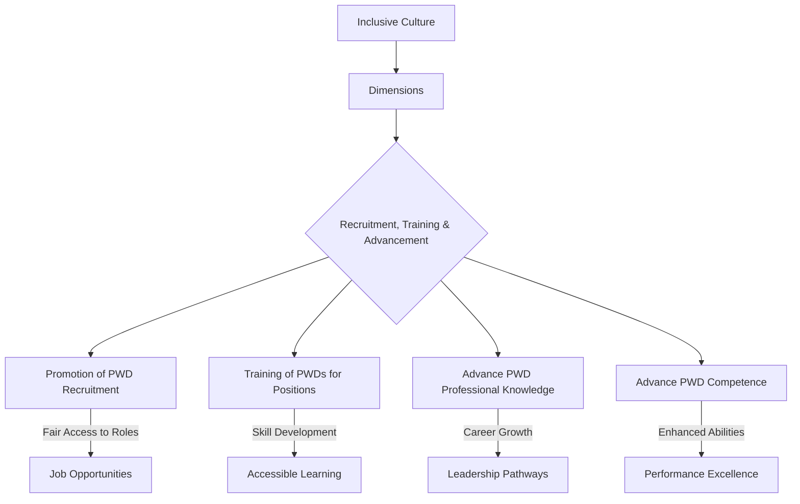

# Definition
Before proceeding, ensure you master [[Dimensions_of_Inclusive_Culture]] and Concept_Of_Inclusion because recruitment, training, and advancement constitute a critical dimension of an inclusive culture, highlighting how inclusion is practically applied in professional development. Recruitment, training, and advancement refer to the **systematic promotion of equitable opportunities for Persons With Disabilities (PWDs) in all stages of their professional journey**, from initial hiring to continuous skill development and career progression. This dimension actively works to dismantle barriers in employment practices, ensuring that PWDs have fair access to positions, can enhance their professional knowledge and competence through accessible training, and are supported in advancing to leadership roles. Think of it like a carefully cultivated career path where every individual, regardless of their disability, has clearly marked trails, supportive guides, and opportunities to reach the summit of their potential.

# The Mental Model
Imagine a ladder in a workplace. "Recruitment, Training, and Advancement" is about making sure that not only is the ladder accessible (e.g., with handrails and wide rungs for everyone, including those with mobility aids), but also that everyone knows *how* to climb it. This means active efforts to invite diverse people to *start* climbing (recruitment), providing the right coaching and tools to help them *learn* new skills (training), and ensuring they have clear paths and support to *move up* the ladder (advancement). It's a holistic approach to career growth that explicitly addresses historical inequalities.


```text
// Scenario 1: Overview of Recruitment, Training, and Advancement in Inclusive Culture
// Output:
// (A flowchart showing "Inclusive Culture" leading to "Dimensions", which then branches into "Recruitment, Training & Advancement".
// "Recruitment, Training & Advancement" further branches into "Promotion of PWD Recruitment" (leading to "Job Opportunities"), "Training of PWDs for Positions" (leading to "Accessible Learning"), "Advance PWD Professional Knowledge" (leading to "Leadership Pathways"), and "Advance PWD Competence" (leading to "Performance Excellence").)
```
*Note: This `graph TD` illustrates the components of the "Recruitment, Training, and Advancement" dimension and their objectives within an inclusive culture.*

# Context & Framework
### The Family Tree
Recruitment, training, and advancement sit within the broader "Dimensions of Inclusive Culture" as a critical branch related to human capital and organizational development. This dimension further breaks down into specific processes: talent acquisition (recruitment), skill enhancement (training), and career progression (advancement). It is deeply intertwined with organizational policies, HR practices, and legal compliance, forming a systemic approach to ensuring equitable opportunities throughout an individual's professional life cycle.

# The Mastery Deep Dive
### The Cheat Code: How to Remember This
To remember the components of this dimension, think of the career journey: **R**ecruit (get them in), **T**rain (skill them up), and **A**dvance (move them up). The **"RTA Cycle"** emphasizes that inclusion isn't a one-time event (like just hiring) but a continuous process throughout an employee's career. Each stage builds on the previous, ensuring sustained support and growth.

### The "Wikipedia One-Liner"
Recruitment, training, and advancement, as a dimension of inclusive culture, refers to the active promotion of recruitment and training opportunities for Persons With Disabilities (PWDs) for suitable positions, coupled with initiatives to advance their professional knowledge and competence, thereby ensuring equitable career progression and full integration within the workforce. This holistic approach addresses systemic barriers across the entire employment lifecycle.

# Constraints & Limitations
### Spot the Impostor (Don't be Fooled)
A common "impostor" of genuine recruitment, training, and advancement is **"hire and forget."** An organization might make efforts to recruit PWDs (recruitment) but then fail to provide accessible training opportunities or clear paths for career advancement. This creates a ceiling for PWDs, preventing them from enhancing their professional knowledge or competence and progressing to leadership roles. Such a selective approach, focusing only on the initial hiring, undermines the full spirit of this dimension, creating an illusion of inclusion without real equity in career growth. True inclusion demands support throughout the entire "RTA Cycle."

# Significance & Application
This dimension is crucial for building diverse, skilled, and innovative workforces. Academically, it is studied in human resources management, organizational behavior, and disability studies, informing best practices for equitable employment. Practically, it guides the development of inclusive hiring strategies, accessible learning platforms, mentorship programs, and succession planning. By prioritizing the RTA of PWDs, organizations benefit from a wider talent pool, enhanced creativity, and a stronger commitment to social responsibility, while individuals gain economic empowerment and professional fulfillment.

# The Worked Example
This lecture slides focus on definitions and conceptual understanding. A worked example here would be a detailed case study illustrating the implementation of recruitment, training, and advancement in an inclusive culture.

**Scenario:** A financial services firm, "CapitalGrowth," recognizes its lack of diversity, particularly regarding Persons With Disabilities (PWDs), and decides to implement a comprehensive strategy focusing on `Recruitment_Training_and_Advancement` to build a more inclusive workforce.

**Step 1: Overhauling Recruitment Practices**
CapitalGrowth partners with specialist disability recruitment agencies and reviews all job descriptions to ensure they are inclusive and highlight the firm's commitment to accessibility. During interviews, they offer flexible formats (e.g., video interviews, alternative testing methods) and provide accommodations upon request. They also actively source candidates from universities with strong disability support programs. This directly aligns with the "promotion of recruitment of PWDs for a certain position."

**Step 2: Developing Accessible Training Programs**
Once PWDs are hired, CapitalGrowth ensures all mandatory and elective training programs are universally accessible. This includes providing materials in multiple formats (e.g., large print, digital text for screen readers), offering sign language interpreters or captioning for virtual sessions, and utilizing accessible learning management systems. They also offer mentorship programs specifically designed to help new PWD employees integrate and acquire new skills, ensuring they can "advance their professional knowledge."

**Step 3: Creating Clear Advancement Pathways**
CapitalGrowth establishes clear career progression paths for all employees, with a focus on eliminating biases in promotion decisions. They implement blind resume reviews for internal promotions and require managers to undergo unconscious bias training. Individual development plans are co-created with PWD employees, identifying opportunities for skill development and leadership roles, explicitly aiming to "advance their professional knowledge and competence." A senior executive champions disability inclusion, actively seeking out and mentoring PWDs for advancement.

**Step 4: Measuring Impact and Accountability**
The firm sets measurable targets for PWD representation at all levels and tracks retention and promotion rates. These metrics are regularly reviewed by the executive board, and managers are held accountable for their teams' diversity and inclusion outcomes. This ensures the "systematic promotion of equitable opportunities" is continuously monitored and improved.

Through this integrated approach to recruitment, training, and advancement, CapitalGrowth fosters a genuinely inclusive culture where PWDs are not just hired but are empowered to build successful and fulfilling careers.

# The Proving Ground
*Test your mastery. Cover the solutions below to test yourself first.*

### Level 1: The Sanity Check (Verification)
**The Fact Check:** What is the specific aim of the "Recruitment, Training, and Advancement" dimension of inclusive culture regarding PWDs?
> **Solution:** This dimension refers to the promotion of recruitment and training of PWDs for a certain position and to advance their professional knowledge and competence.

### Level 2: The Crucible (Mastery & Edge Cases)
**The Impostor:** A government agency proudly announces a new initiative where 10% of all new hires will be Persons With Disabilities (PWDs). However, the agency's internal professional development courses are only available in a format inaccessible to visually impaired employees, and all promotion decisions are based solely on years of service rather than demonstrated competence or growth. Analyze why this agency, despite its hiring quota, is an "impostor" for genuinely implementing the "Recruitment, Training, and Advancement" dimension of an inclusive culture.
> **Solution:** This agency is an "impostor" for genuinely implementing the "Recruitment, Training, and Advancement" dimension because it fails to address the "training" and "advancement" components. While it successfully "promotes of recruitment of PWDs" with a hiring quota, the inaccessibility of "professional development courses" directly hinders PWDs from "advanc[ing] their professional knowledge and competence." Furthermore, basing "promotion decisions solely on years of service" rather than merit or skill development creates an arbitrary barrier to genuine "advancement," effectively blocking career progression for many PWDs who might otherwise be highly competent. True implementation requires equitable access to *all three stages*: getting hired, developing skills, and moving up, ensuring that PWDs are not just employed but empowered to thrive professionally.

# Key Takeaways
*   Recruitment, Training, and Advancement focuses on equitable opportunities for PWDs from hiring through career progression.
*   It involves dismantling employment barriers, ensuring accessible training, and supporting advancement to leadership roles.
*   Genuine implementation requires a holistic approach throughout the entire professional journey, not just initial hiring.

# Knowledge Graph Connections
| Concept                         | Connection / Relationship                                                          |
| :
------------------------------ | :
--------------------------------------------------------------------------------- |
| [[Dimensions_of_Inclusive_Culture]] | Is a critical dimension for building an inclusive culture, specifically in the workforce. |
| [[Universal_Design]]              | Ensures that training materials and workplaces are accessible, supporting this dimension. |
| [[Workplace_Accommodations_and_Accessibility]] | Provides the necessary adjustments to enable PWDs to benefit from training and advancement. |
| [[Fairness_in_Inclusive_Culture]] | This dimension promotes fairness by ensuring equitable access to career opportunities. |
---