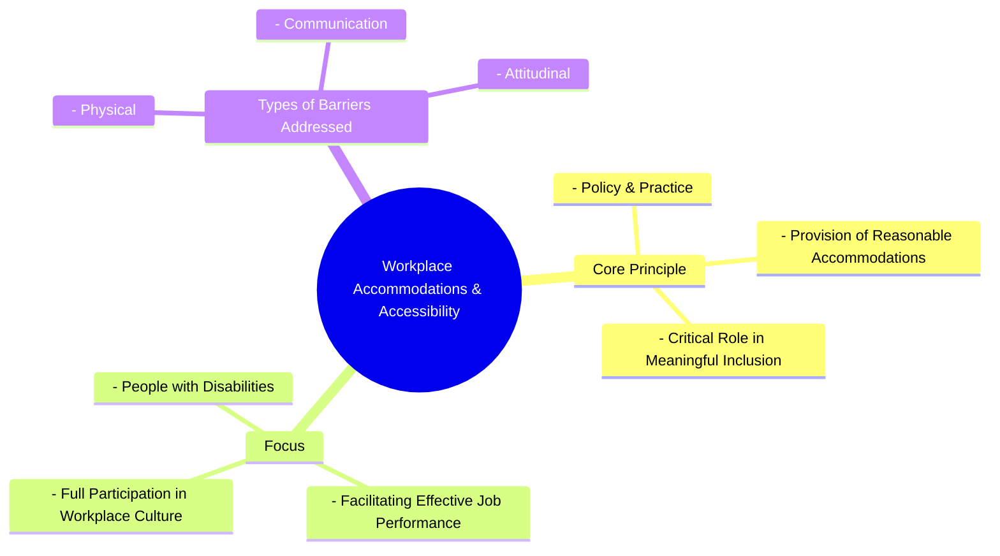

# Definition
Before proceeding, ensure you master [[Dimensions_of_Inclusive_Culture]] and Concept_Of_Inclusion because workplace accommodations and accessibility represent a core dimension of an inclusive culture, detailing how environments are adapted for effective inclusion. Workplace accommodations and accessibility refers to the **deliberate and systematic implementation of policies and practices designed to provide reasonable adjustments and ensure an accessible environment for people with disabilities**, thereby facilitating their full and meaningful inclusion in the workforce. This involves removing physical, communication, and attitudinal barriers that might prevent individuals from performing their jobs effectively and participating fully in the workplace culture. Think of it like tailoring a uniform: instead of a single, rigid size, accommodations ensure that each garment is adjusted to fit the individual perfectly, enabling them to move and perform their duties comfortably and effectively.

# The Mental Model
Imagine a diverse group of gardeners tending a shared plot. "Workplace Accommodations and Accessibility" means providing each gardener with the specific tools and adjustments they need to work effectively. If one gardener uses a wheelchair, they get a raised garden bed. If another has low vision, they get larger labels and brighter lighting. It's about ensuring the physical space and the available tools are adapted so that everyone can perform their tasks and contribute their best to the shared garden, making their inclusion meaningful and productive.


```text
// Scenario 1: Basic understanding of Workplace Accommodations & Accessibility
// Output:
// (A visual mindmap showing "Workplace Accommodations & Accessibility" at the root, branching into "Core Principle", "Focus", and "Types of Barriers Addressed".
// "Core Principle" branches into "Policy & Practice", "Provision of Reasonable Accommodations", "Critical Role in Meaningful Inclusion".
// "Focus" branches into "People with Disabilities", "Facilitating Effective Job Performance", "Full Participation in Workplace Culture".
// "Types of Barriers Addressed" branches into "Physical", "Communication", "Attitudinal".)
```
*Note: This `mindmap` visualizes the core principle, focus, and types of barriers addressed by workplace accommodations and accessibility.*

# Context & Framework
### Where Does it Live? (The Map)
Workplace accommodations and accessibility are found in HR policies, facility management guidelines, IT department protocols, and organizational culture statements. It is mandated by anti-discrimination laws and often overseen by diversity and inclusion committees. This concept directly supports the broader aim of [[Building_Inclusive_Community]] within an organizational context, ensuring that economic participation and professional development are truly open to all, and that the work environment itself is designed to empower every individual.

# The Mastery Deep Dive
### Who are the Neighbors?
Workplace accommodations and accessibility are intimately linked to [[Universal_Design]], which seeks to proactively design environments accessible to all, thereby reducing the need for individual accommodations. It is also a critical complement to [[Recruitment_Training_and_Advancement]] as it ensures that once hired, trained, or promoted, Persons With Disabilities (PWDs) have the necessary support to perform effectively in their roles. Furthermore, it embodies the spirit of [[Fairness_in_Inclusive_Culture]] by guaranteeing equitable access to the work environment and job functions. This dimension is crucial for translating inclusive policies into tangible, supportive practices.

### The "Wikipedia One-Liner"
Workplace accommodations and accessibility, as a dimension of inclusive culture, refers to the systematic planning and provision of reasonable adjustments and an accessible physical and digital environment to enable people with disabilities to perform their jobs effectively and participate meaningfully in all aspects of the workplace. This includes carefully planned policies that remove barriers to employment and foster full integration.

# Constraints & Limitations
### Spot the Impostor (Don't be Fooled)
A common "impostor" of genuine workplace accommodations and accessibility is **"reactive compliance."** This occurs when accommodations are only provided grudgingly or after significant struggle, solely to meet minimal legal requirements, rather than proactively integrating accessibility into policies and practices. If accommodations are seen as an "extra cost" or a "favor," rather than an inherent part of an inclusive workplace, it fosters a culture where people with disabilities feel burdensome or excluded. True accessibility and accommodations are integrated into organizational planning and are seen as essential for maximizing the potential of all employees.

# Significance & Application
This dimension is fundamental for creating equitable employment opportunities, enhancing productivity, and fostering a positive work environment for all. Academically, it is studied in disability employment research, organizational psychology, and human rights law, informing legislative frameworks and best practices. Practically, it guides employers in providing assistive technologies, modifying work schedules, adjusting job duties, and redesigning physical spaces. By ensuring meaningful inclusion, organizations benefit from diverse talents, improved morale, and reduced turnover, while PWDs gain economic independence and professional fulfillment.

# The Worked Example
This lecture slides focus on definitions and conceptual understanding. A worked example here would be a detailed case study illustrating the implementation of workplace accommodations and accessibility.

**Scenario:** A marketing agency, "CreativeFlow," is growing rapidly and wants to ensure its new office space and operational policies fully support `Workplace_Accommodations_and_Accessibility` for all employees, especially those with disabilities.

**Step 1: Proactive Accessibility Audit of New Office Design**
Before construction begins, CreativeFlow hires an accessibility consultant to review the blueprints for their new office. They ensure not just basic ramp access, but also automatic doors, height-adjustable desks for all employees, clear visual and auditory fire alarms, non-glare lighting, and accessible restroom stalls that exceed minimum requirements. This proactive approach aims to reduce the need for later "reasonable accommodations" by integrating `Universal_Design` from the start.

**Step 2: Developing Comprehensive Accommodation Policies**
CreativeFlow develops a clear, confidential process for employees to request accommodations. The policy outlines a range of possible adjustments, from assistive technology (e.g., screen readers, voice recognition software), modified workstations, and ergonomic equipment, to flexible work arrangements (e.g., modified hours, remote work options) and communication support (e.g., sign language interpreters for meetings). This provides a framework for "carefully planned policies for the provision of reasonable accommodations."

**Step 3: Training Management and Staff on Inclusive Practices**
All managers undergo mandatory training on disability awareness, the accommodations process, and inclusive communication strategies. They learn to identify potential barriers and proactively engage with employees to understand their needs. General staff also receive training to foster an inclusive culture that removes attitudinal barriers, making them more receptive and supportive of diverse colleagues. This addresses the "in addition to recruitment, training and advancement" aspect by fostering a supportive environment.

**Step 4: Integrating Accessibility into Digital Tools and Communication**
The IT department ensures all internal software, communication platforms, and company websites comply with accessibility standards (e.g., WCAG guidelines). Documents are created in accessible formats, and virtual meetings offer live captioning. This provides `Accessible_Communications` and ensures everyone can fully participate in information flow and collaborate effectively, enabling "meaningful inclusion of people with disabilities."

By integrating these policies and practices, CreativeFlow establishes a workplace where accommodations and accessibility are not just a legal requirement but a fundamental aspect of its inclusive culture, empowering all employees to contribute their best.

# The Proving Ground
*Test your mastery. Cover the solutions below to test yourself first.*

### Level 1: The Sanity Check (Verification)
**The Fact Check:** What is the critical role that workplace accommodations and accessibility play in relation to people with disabilities?
> **Solution:** They play a critical role in generating meaningful inclusion of people with disabilities.

### Level 2: The Crucible (Mastery & Edge Cases)
**The Impostor:** A large manufacturing company installs a single ramp at its main entrance and designates one accessible parking spot, then declares itself fully "accessible" for its employees with disabilities. However, within the factory floor, heavy machinery is operated with controls that require fine motor skills, safety briefings are delivered only verbally in a noisy environment, and break rooms are located on a second floor with no elevator. Analyze why this company, despite its initial efforts, is an "impostor" for genuinely implementing "Workplace Accommodations and Accessibility" for meaningful inclusion.
> **Solution:** This company is an "impostor" for genuinely implementing "Workplace Accommodations and Accessibility" because its efforts are superficial and fail to address comprehensive accessibility. While the ramp and parking spot address *some* physical access (and are perhaps a basic form of `Universal_Design`), they neglect the need for "reasonable accommodations" and a truly accessible environment within the actual "work place." The machinery controls requiring fine motor skills, verbal-only safety briefings in a noisy setting (a communication barrier), and inaccessible break rooms (a physical barrier) all prevent "meaningful inclusion of people with disabilities." Effective implementation requires "carefully planned policies" that cover all aspects of the work environment and job functions, not just minimal, isolated improvements. The company's claims are an "impostor" because it fails to address the systemic barriers within the core work environment itself.

# Key Takeaways
*   Workplace accommodations and accessibility involve policies and practices providing reasonable adjustments for people with disabilities.
*   Their critical role is to ensure meaningful inclusion by removing physical, communication, and attitudinal barriers.
*   Genuine implementation requires systematic planning and a proactive approach, rather than reactive compliance.

# Knowledge Graph Connections
| Concept                         | Connection / Relationship                                                          |
| :
------------------------------ | :
--------------------------------------------------------------------------------- |
| [[Dimensions_of_Inclusive_Culture]] | This dimension is vital for creating an inclusive workplace within the broader culture. |
| [[Universal_Design]]              | Proactive Universal Design reduces the need for extensive workplace accommodations. |
| [[Recruitment_Training_and_Advancement]] | Accommodations ensure PWDs can access and benefit from training and career advancement. |
| [[Fairness_in_Inclusive_Culture]] | Workplace accommodations promote fairness by providing equitable access to employment opportunities. |
---