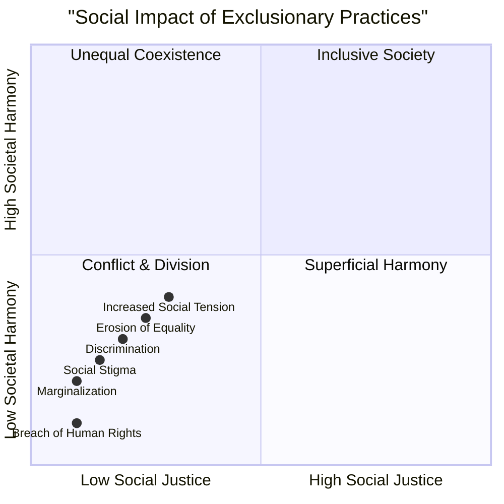

# Definition
Before proceeding, ensure you master [[Sources_of_Conflict_Absence_of_Inclusiveness]] and [[Peace_in_Inclusiveness]] because exclusionary practices and their link to conflict are direct outcomes of unchecked negative individual characteristics and antithetical to a peaceful society.
Exclusionary practices are actions, policies, or behaviors that actively marginalize, discriminate against, or stigmatize individuals or groups, thereby preventing their full participation and equal access to societal resources, opportunities, and recognition. These practices are direct manifestations of underlying individual characteristics (like prejudice) and directly lead to conflict by eroding social justice and equality. A simpler way to think about it is like building a wall around a group: exclusionary practices are the bricks and mortar that separate people, leading to resentment and eventually, a breakdown of peace.

# The Mental Model
Imagine a playground where some children actively prevent others from joining their game, perhaps due to differences in appearance or skill. These actions are "Exclusionary Practices." The children who are left out feel hurt, angry, and resentful, leading to arguments, fights, and a general breakdown of fun and cooperation—that's the "Conflict." The lack of an inclusive environment allows these acts to fester and escalate.


```text
// Scenario 1: Impact of various exclusionary practices on society
// Output:
// A visual representation of the quadrant chart showing multiple data points clustered in the "Conflict & Division" quadrant (bottom-left).
// Each data point (e.g., "Discrimination", "Marginalization", "Social Stigma") will be positioned based on its X and Y coordinates, indicating its strong negative contribution to both social justice and societal harmony.
// The overall visual indicates that exclusionary practices severely undermine both social justice and societal harmony, leading to conflict.
```
*Note: This `quadrantChart` qualitatively visualizes how different exclusionary practices lead to low social justice and low societal harmony, placing them firmly in the "Conflict & Division" quadrant.*

# Context & Framework
### The Destructive Cycle of Exclusion
Exclusionary practices are not merely unfortunate side effects of societal differences; they are direct, active drivers of conflict. They manifest in various forms—discrimination, marginalization, and social stigma—and are inherently linked to the individual characteristics (e.g., prejudice, exploitation) that thrive in the absence of inclusiveness. These practices directly undermine social justice and equality, which are fundamental pillars of peace. When individuals or groups are systematically excluded, their rights are violated, their voices silenced, and their opportunities curtailed, creating deep-seated resentment and grievances. This systemic erosion of fairness inevitably leads to tension, unrest, and overt conflict, making the fight against exclusionary practices a central tenet of peace-building.

# The Mastery Deep Dive
### Qualitative Analysis: Social Impact of Exclusion
The social impact of exclusionary practices is profound and directly correlated with the escalation of conflict. This can be analyzed qualitatively across several critical dimensions:

*   **Discrimination:** This involves the unjust or prejudicial treatment of different categories of people or things, especially on the grounds of race, age, or sex. When discrimination is widespread, it systematically denies opportunities (e.g., education, employment, housing) and resources, creating a class of disadvantaged individuals. This disparity fuels resentment and a sense of injustice.
*   **Marginalization:** This is the process whereby individuals or groups are pushed to the fringes of society, often stripped of their power and voice. Marginalized communities experience systemic disadvantage, lacking representation and influence in decision-making processes. Their needs are unmet, and their suffering often unseen, leading to feelings of alienation and hopelessness that can easily ignite into protests or resistance.
*   **Social Stigma:** This refers to the disapproval of, or discrimination against, an individual based on perceivable social characteristics that serve to distinguish them from other members of a society. Stigma strips individuals of dignity and belonging, leading to psychological distress and social isolation. When entire groups are stigmatized, it creates a "us vs. them" mentality, dehumanizes the 'other,' and justifies discriminatory actions, thereby making conflict more likely and harder to resolve.

Collectively, these practices erode the social fabric, breed mistrust, and dismantle the conditions necessary for peaceful coexistence. They directly violate human rights and create an environment ripe for unrest, underscoring why peace is the ultimate remedy for such injustices.

# Constraints & Limitations
### The "Invisible Wall" Trap
A subtle but potent trap in dealing with exclusionary practices is the "invisible wall" trap. This occurs when exclusion is not overt or legally codified, but manifests through subtle biases, microaggressions, or systemic barriers that are difficult to pinpoint and challenge. For example, a workplace might claim to be inclusive, yet a minority group consistently finds itself excluded from informal networking opportunities or mentorship, leading to slower career progression. This "invisible wall" is insidious because it creates marginalization and social stigma without obvious, attributable acts of discrimination. It makes identifying the source of conflict challenging and can lead to a sense of "gaslighting" for those affected, fostering deep resentment and conflict that is hard to articulate or address, as no one is overtly "to blame."

# Significance & Application
Understanding exclusionary practices is crucial for recognizing the active drivers of conflict and designing effective interventions for peace-building. This knowledge informs social policy, educational programs, and community initiatives aimed at fostering justice, equality, and genuine inclusion.

# The Worked Example
This section details how social stigma (an exclusionary practice) leads to conflict within a community.

Consider a community where individuals with certain types of mental health conditions face **social stigma**, being unfairly stereotyped as unreliable or dangerous.

**The Application:**
1.  **Exclusionary Practice:** **Social stigma** against individuals with mental health conditions. This leads to them being viewed negatively and unfairly by other community members.
2.  **Manifestation:** This stigma results in **discrimination** (e.g., landlords refusing to rent apartments, employers hesitating to hire, social services being less responsive). It also causes **marginalization** (individuals with mental health conditions are isolated from community activities, their voices ignored).
3.  **Resulting Conflict:** The cumulative effect of discrimination, marginalization, and stigma leads to:
    *   **Interpersonal Conflict:** Arguments and confrontations arising from prejudiced interactions.
    *   **Internal Conflict:** Individuals with mental health conditions experiencing increased stress, anxiety, and a sense of injustice.
    *   **Societal Conflict:** Advocacy groups forming to protest discriminatory policies, leading to public debates, legal challenges, and community division over mental health support services.

This example demonstrates how an exclusionary practice like social stigma, rooted in individual biases, systematically undermines social justice and equality, inevitably leading to various forms of conflict within the community. Peace, in this context, requires actively dismantling such stigma and promoting genuine inclusion.

# The Proving Ground
*Test your mastery. Cover the solutions below to test yourself first.*

### Level 1: The Sanity Check (Verification)
**The Fact Check:** Name two ways exclusionary practices may be manifested in communities.
> **Solution:** Discrimination, marginalization, and social stigma. (Any two are acceptable).

### Level 2: The Crucible (Mastery & Edge Cases)
**The Trade-off:** A community leader must choose between implementing a quick, top-down policy to address an immediate conflict (Option A, e.g., deploying police to separate protestors) or investing in long-term inclusive education programs to prevent future exclusionary practices (Option B, e.g., funding workshops on diversity and empathy). Justify which option is more sustainable for addressing the root causes of conflict stemming from exclusionary practices.
> **Solution:** Option B, investing in long-term inclusive education programs, is more sustainable. While Option A might temporarily quell an immediate conflict, it fails to address the underlying "sources of conflict" (like prejudice and selfishness) that manifest as exclusionary practices. Inclusive education (Option B) targets these root causes by fostering understanding, empathy, and respect for diversity, thereby preventing discrimination, marginalization, and social stigma from recurring in the long run. The unit emphasizes that peace is the remedy for these social injustices, and education is the primary vehicle for that remedy.

### Level 3: Mastery (The Crucible)
**The Lose-Lose Scenario:** A highly effective, but exclusionary, community program is bringing economic benefits to a majority, but actively marginalizing a minority group through its criteria. If forced to choose, what is the 'least bad' immediate action to take to minimize harm and mitigate future conflict, considering the link between exclusionary practices and conflict?
> **Solution:** The 'least bad' immediate action, despite the loss of some short-term economic benefits for the majority, would be to immediately suspend or fundamentally redesign the exclusionary criteria of the program to ensure equitable access and benefits for the minority group. While this might cause initial disruption or even a decrease in the program's overall "effectiveness" as measured by pure economic output for the majority, it is crucial to prevent the escalation of deep-seated resentment, social stigma, and marginalization. Continuing the exclusionary program would inevitably lead to greater social tension and conflict, as clearly articulated in the "Qualitative Analysis: Social Impact of Exclusion" section, ultimately undermining the very stability and development the program was ostensibly meant to foster. This sacrifice, though difficult, is essential to prevent a far greater societal cost in the form of widespread conflict and breakdown of social justice.

# Key Takeaways
*   Exclusionary practices manifest as discrimination, marginalization, and social stigma, actively undermining social justice and equality.
*   These practices are direct outcomes of negative individual characteristics (e.g., prejudice) and are primary drivers of conflict within diverse communities.
*   Addressing exclusionary practices is fundamental for peace-building, as they erode social fabric and create environments ripe for unrest.

# Knowledge Graph Connections
| Concept                                          | Connection / Relationship                                                                                                           |
| :
----------------------------------------------- | :
---------------------------------------------------------------------------------------------------------------------------------- |
| [[Sources_of_Conflict_Absence_of_Inclusiveness]] | Exclusionary practices are the direct behavioral and systemic manifestations of individual sources of conflict.                     |
| [[Peace_in_Inclusiveness]]                       | These practices are antithetical to peace, as they destroy mutual understanding and positive relationships.                         |
| [[Democratic_Principles_for_Inclusive_Practices]] | Exclusionary practices directly contradict the democratic values of justice, equality, and self-determination for all.            |
| [[Valuing_Diversity_and_Multicultural_Education]] | Actively valuing diversity and promoting multicultural education are direct countermeasures to exclusionary practices.              |
| [[Role_of_Inclusive_Education_in_Peace]]         | Inclusive education is crucial for fostering values and skills that prevent and combat exclusionary practices.                      |
---