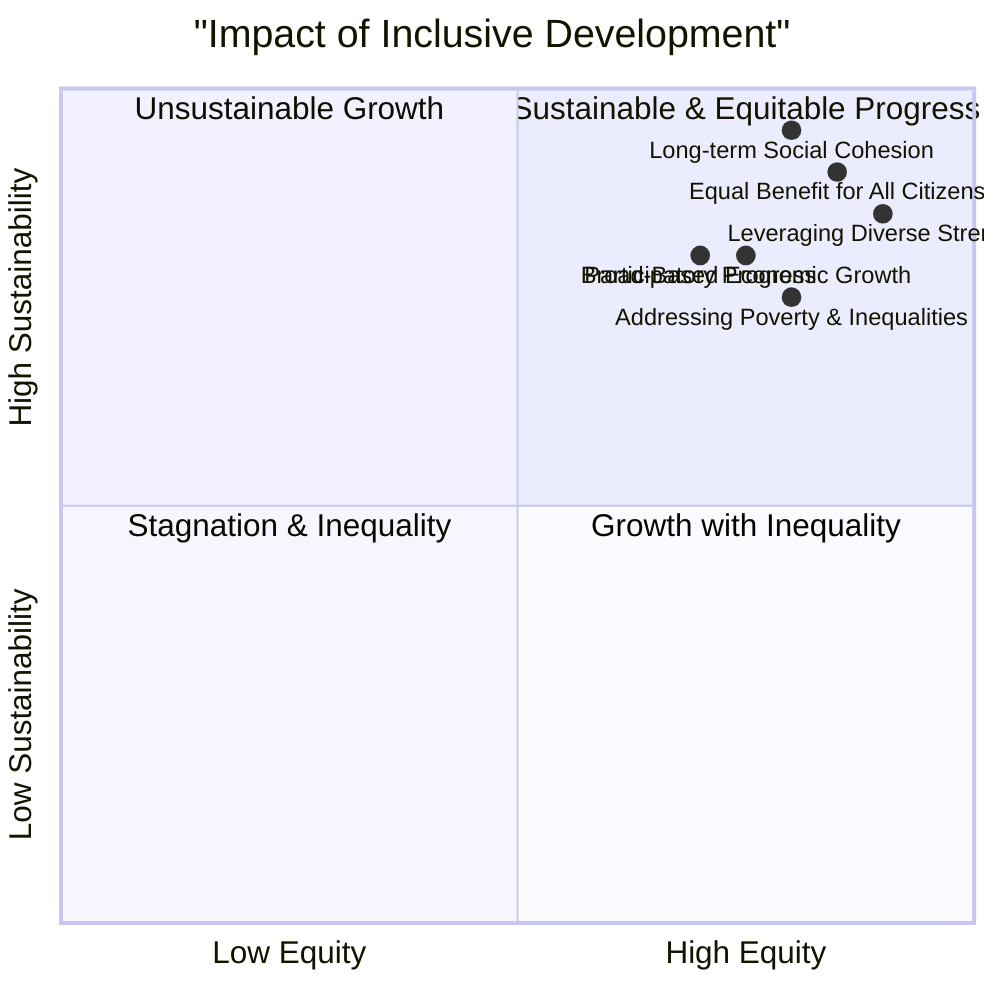

# Definition
Before proceeding, ensure you master Concept_Of_Inclusion and [[Democratic_Principles_for_Inclusive_Practices]] because inclusive development is the practical application of inclusive principles within a democratic framework to achieve progress for all.
Inclusive development refers to a comprehensive approach to economic, social, and political progress that is designed to be all-encompassing and participatory, actively promoting equal benefit for all citizens from the heritage of prosperity earned by society, regardless of their diversities. It is necessary for sustainable progress because it ensures no one is left behind, leveraging the strengths of [[Types_of_Diversities]] to achieve equitable outcomes and shared prosperity. A simpler way to think about it is like building a communal home: inclusive development ensures that every member of the family contributes to its construction and equally benefits from its shelter, resources, and growth, regardless of their individual roles or needs.

# The Mental Model
Imagine a large, intricate irrigation system for an entire agricultural region. "Inclusive Development" is like designing this system so that water (representing resources, opportunities, and benefits) reaches every single farm and every single crop, from the largest estates to the smallest family plots, ensuring equitable distribution and enabling all parts of the region to flourish sustainably. If any area is cut off, the entire system eventually suffers.


```text
// Scenario 1: Comprehensive impact of inclusive development
// Output:
// A visual representation of the quadrant chart showing multiple data points clustered in the "Sustainable & Equitable Progress" quadrant (top-right).
// Each data point (e.g., "Equal Benefit for All Citizens", "Participatory Progress") will be positioned based on its X and Y coordinates, indicating its strong positive contribution to both equity and sustainability.
// The overall visual indicates that inclusive development significantly enhances both equity and sustainability, leading to sustainable and equitable progress.
```
*Note: This `quadrantChart` qualitatively visualizes the positive impact of inclusive development across two axes: equity and sustainability, demonstrating its role in achieving sustainable and equitable progress.*

# Context & Framework
### Prosperity for All, By All
Inclusive development represents a paradigm shift from traditional growth models that often prioritize aggregate economic indicators while overlooking widening disparities. This framework firmly positions development as a process that must be "all inclusive and participatory," ensuring that the benefits of progress—the "heritage of prosperity"—are equitably shared among all citizens. It recognizes that sustainable economic, social, and political progress is unattainable if significant segments of the population are marginalized or excluded. This approach is not simply about charity; it's a strategic imperative that leverages the full potential of a diverse populace, fostering social cohesion and preventing the [[Sources_of_Conflict_Absence_of_Inclusiveness]] that can derail progress. It is inherently linked to [[Democratic_Principles_for_Inclusive_Practices]] and the active promotion of [[Valuing_Diversity_and_Multicultural_Education]].

# The Mastery Deep Dive
### Qualitative Analysis: Impact of Inclusive Development
The impact of inclusive development on societal progress is profound and multi-dimensional:

*   **Equal Benefit for All Citizens:** This is the cornerstone of inclusive development, ensuring that economic growth, social services, and political opportunities are accessible and beneficial to every individual, regardless of their background or identity. It actively works to close gaps in wealth, health, and education.
*   **Participatory Progress:** Inclusive development emphasizes that all citizens, especially those from marginalized groups, must have a voice and a role in shaping development agendas and processes. This ensures that development initiatives are relevant, responsive, and truly reflective of diverse needs, fostering ownership and sustainability.
*   **Leveraging Diverse Strengths:** By actively including all [[Types_of_Diversities]], inclusive development harnesses a broader range of skills, perspectives, and innovative ideas. This leads to more robust and creative solutions to complex societal challenges, boosting overall productivity and resilience.
*   **Addressing Poverty and Social Inequalities:** A core objective is to systematically reduce poverty and dismantle social inequalities that exclude certain groups from opportunities. This includes targeted interventions in education, healthcare, employment, and infrastructure to ensure equitable access.
*   **Long-term Social Cohesion:** By ensuring equitable benefits and participation, inclusive development builds trust, reduces grievances, and strengthens the social fabric. This leads to more stable and cohesive societies, less prone to internal conflict and more resilient to external shocks.
*   **Sustainable Economic, Social, and Political Progress:** Ultimately, by including everyone, development becomes more sustainable. Economic growth is broad-based, social progress is deep-rooted, and political stability is enhanced through universal participation and perceived fairness. This is crucial for achieving long-term [[Peace_in_Inclusiveness]].

This qualitative impact highlights why inclusive development is not an optional add-on but an essential, transformative approach to societal progress.

# Constraints & Limitations
### The "Top-Down" Trap
A significant trap in implementing inclusive development is the "top-down" trap, where development initiatives are conceived and mandated by central authorities without genuine, participatory input from the diverse communities they aim to serve. While central planning can offer efficiency, if it lacks authentic consultation and local ownership, it often fails to address the actual needs, priorities, or cultural contexts of marginalized groups. This "top-down" approach can inadvertently perpetuate exclusion by imposing solutions that are irrelevant or even detrimental to certain populations, undermining the very essence of "participatory progress" and "equal benefit for all citizens." Such initiatives, despite good intentions, can lead to resentment, resistance, and ultimately, unsustainable outcomes, as they fail to leverage the "diverse strengths" of the entire populace.

# Significance & Application
Inclusive development is crucial for creating just, equitable, and sustainable societies. It guides national development strategies, international aid programs, and local community projects, ensuring that economic growth and social progress benefit all segments of the population.

# The Worked Example
This section details how a national government implements an inclusive development strategy for its rural communities.

Consider a national government launching a comprehensive rural development program aimed at improving living standards and economic opportunities in diverse, often marginalized, rural communities.

**The Application:**
1.  **Participatory Needs Assessment:**
    *   Instead of making decisions centrally, the government dispatches multi-disciplinary teams to conduct extensive consultations and workshops in each rural community. These teams engage with farmers, women's groups, ethnic minority representatives, and local leaders to identify their specific needs and priorities, ensuring "participatory progress."
    *   This includes understanding the unique [[Types_of_Diversities]] present in each community to tailor interventions.
2.  **Tailored Economic Opportunities:**
    *   Based on local input, the program funds diverse economic initiatives. In one region, this might be agricultural cooperatives with training in sustainable farming; in another, it could be supporting artisan crafts for export, or investing in rural tourism. This ensures "equal benefit for all citizens" by leveraging local strengths.
    *   Training programs are provided in local languages and adapted to varying literacy levels, directly linking to [[Respecting_Diverse_Needs_in_Inclusive_Education]].
3.  **Equitable Infrastructure Development:**
    *   Investments in infrastructure (e.g., roads, clean water, schools, healthcare facilities) are prioritized based on indices of poverty and marginalization, ensuring that previously underserved areas receive focused attention, thereby "addressing poverty and social inequalities."
    *   Access to these services is made universal, with cultural and linguistic considerations taken into account (e.g., culturally sensitive healthcare services).
4.  **Strengthening Local Governance:**
    *   The program includes components to strengthen local governance structures, empowering community councils and ensuring transparent allocation of resources, aligning with "good governance" (a [[Democratic_Principles_for_Inclusive_Practices]]).

Through these integrated and participatory approaches, the national government implements inclusive development, ensuring that progress reaches and benefits all its citizens, leading to more sustainable and equitable outcomes across the nation.

# The Proving Ground
*Test your mastery. Cover the solutions below to test yourself first.*

### Level 1: The Sanity Check (Verification)
**The Fact Check:** Why is inclusive development considered necessary for sustainable progress?
> **Solution:** Because it should be all inclusive and participatory that promotes equal benefit for all citizens from the heritage of prosperity earned by the society.

### Level 2: Competence (Application)
**The Trade-off:** A development project is proposed for a rural community. Option A maximizes economic output (e.g., large-scale monoculture farming) but primarily benefits a select few landowners. Option B aims for equitable distribution of benefits (e.g., smallholder cooperatives, diversified local markets) but with slower, more localized economic growth. Justify which option aligns with the principles of inclusive development.
> **Solution:** Option B, which aims for equitable distribution of benefits through smallholder cooperatives and diversified local markets, aligns better with the principles of inclusive development. While Option A might show higher aggregate economic output, it exacerbates inequality and marginalization, failing to provide "equal benefit for all citizens." Inclusive development, as defined in the unit, emphasizes being "all inclusive and participatory," ensuring broad-based prosperity. Option B, despite potentially slower initial growth, fosters long-term social cohesion, leverages diverse strengths, and addresses poverty and social inequalities, making it a truly sustainable and inclusive approach to development.

### Level 3: Mastery (The Crucible)
**The Lose-Lose Scenario:** A country must rapidly industrialize (Option X) to compete globally, which might initially exacerbate existing inequalities and displace marginalized communities. Alternatively, a slower, more equitable development path (Option Y) risks falling behind economically and delaying improvements in living standards. How can a nation choose the 'least bad' development strategy that still aims for inclusive development, given such high stakes?
> **Solution:** In this "lose-lose" scenario, the nation should choose a modified version of the slower, more equitable development path (Option Y), but with strategic, targeted investments to mitigate economic lag. While rapid industrialization (Option X) might offer short-term global competitiveness, the "Qualitative Analysis: Impact of Inclusive Development" clearly shows that development that exacerbates inequalities is "Unsustainable Growth" and ultimately leads to "Stagnation & Inequality" in the long run. The 'least bad' path for inclusive development would be to prioritize broad-based benefits and participation, even if it's slower, while simultaneously seeking international partnerships, technological transfers, or specific niche market development that allows for competitive gains without sacrificing equity. This approach would involve strong social safety nets, robust educational investments (linking to [[Importance_of_Democratic_Inclusive_Education]]), and empowerment of marginalized communities to ensure their participation and benefit, preventing the "top-down" trap and ensuring development is genuinely "all inclusive and participatory."

# Key Takeaways
*   Inclusive development is a comprehensive, participatory approach to progress that promotes equal benefit for all citizens, regardless of diversities.
*   It is necessary for sustainable progress by addressing poverty, inequality, and leveraging diverse strengths.
*   The "top-down" trap, where initiatives lack local input, can undermine participatory progress and lead to unsustainable outcomes.

# Knowledge Graph Connections
| Concept                                          | Connection / Relationship                                                                                                           |
| :
----------------------------------------------- | :
---------------------------------------------------------------------------------------------------------------------------------- |
| [[Types_of_Diversities]]                         | Inclusive development ensures that benefits are equitably distributed across all these diverse categories of people.                 |
| [[Democratic_Principles_for_Inclusive_Practices]] | This concept is a practical application of democratic principles, emphasizing participation and good governance for all.            |
| [[Valuing_Diversity_and_Multicultural_Education]] | Inclusive development is strengthened by actively valuing diversity and promoting multicultural understanding.                      |
| [[Achieving_Unity_in_Diversity]]                 | By ensuring equitable benefits and participation, inclusive development significantly contributes to achieving unity in diversity. |
| [[Peace_in_Inclusiveness]]                       | Inclusive development contributes to long-term peace by fostering social cohesion and reducing grievances arising from inequality. |
---