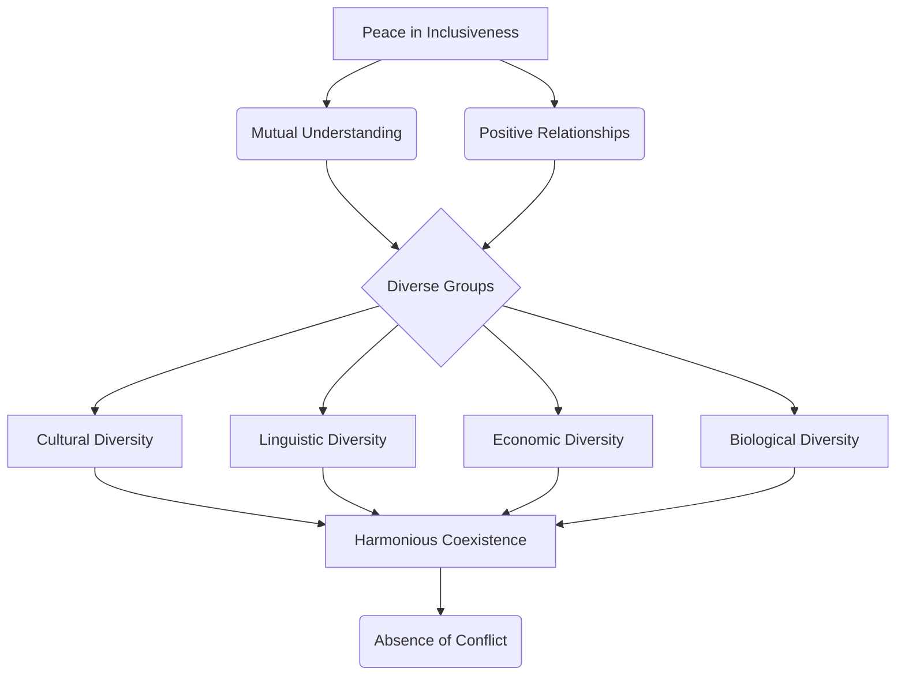

# Definition
Before proceeding, ensure you master Understanding_Disability_And_Vulnerability and Concept_Of_Inclusion because peace in inclusiveness builds upon the foundation of recognizing and valuing all individuals.
Peace, within the perspective of inclusiveness, is defined as the active creation of mutual understanding and positive relationships among individuals and diverse groups. These groups encompass a wide array of cultural, linguistic, economic, and biological differences, emphasizing harmonious coexistence without conflict. A simpler way to think about it is like a diverse orchestra: each musician (individual/group) plays their part, understanding and respecting the others, to create a beautiful, unified sound (peace).

# The Mental Model
Imagine a vibrant community garden. Each type of plant, from the tallest sunflower to the smallest herb, represents a different individual or group with unique characteristics. "Peace in Inclusiveness" is like ensuring all these plants can grow side by side, receiving the sunlight and water they need, respecting each other's space, and collectively contributing to the beauty and bounty of the garden.


```text
// Scenario 1: Basic Definition of Peace in Inclusiveness
// Output:
// A visual representation of the graph diagram:
// "Peace in Inclusiveness" leads to "Mutual Understanding" and "Positive Relationships".
// Both "Mutual Understanding" and "Positive Relationships" contribute to "Diverse Groups".
// "Diverse Groups" include "Cultural Diversity", "Linguistic Diversity", "Economic Diversity", and "Biological Diversity".
// All forms of diversity lead to "Harmonious Coexistence".
// "Harmonious Coexistence" results in "Absence of Conflict".
```
*Note: This `graph TD` illustrates the hierarchical breakdown of the core elements that constitute peace from an inclusiveness perspective, starting from the central concept and branching out to its foundational components.*

# Context & Framework
### Defining Peace Beyond Absence of War
Traditionally, peace is often understood as merely the absence of war or overt conflict. However, from the perspective of inclusiveness, peace is an active and dynamic state that requires continuous effort. It's about cultivating deep respect, justice, tolerance, and cooperation among all persons, ensuring human beings are free from negative forces like fear, hatred, tension, and violence. This broader definition moves beyond simply not fighting, to actively building interpersonal harmony and societal friendship across all forms of diversity.

# The Mastery Deep Dive
### The Family Tree: Elements of Peace
Peace, within the inclusive framework, is not a monolithic concept but a composite of several interconnected elements, forming a 'family tree' of principles. At its root is the recognition of human interconnectedness, meaning no individual exists in isolation. Branching from this are mutual understanding and positive relationships, which are cultivated by deep respect for others, a commitment to justice, and a practice of tolerance and cooperation. This intricate structure ensures that harmony extends beyond mere coexistence to a genuine appreciation of reciprocal respect among all diverse groups—culturally, linguistically, economically, and biologically.

# Constraints & Limitations
### The Cognitive Trap: Surface-Level Peace
A significant trap in understanding peace from an inclusiveness perspective is mistaking superficial tranquility for genuine harmony. A society might appear peaceful on the surface, with no overt conflicts, but still harbor deep-seated prejudices, discrimination, or systemic inequalities. This is a form of "surface-level peace" that lacks the crucial elements of mutual understanding, deep respect, justice, and active cooperation across diverse groups. Such a state is fragile and susceptible to conflict, as it fails to address the underlying causes of division and exclusion.

# Significance & Application
Peace, as defined by inclusiveness, is fundamental for societal well-being and progress. It ensures that diverse populations can coexist and thrive, contributing their unique strengths to collective development. This concept is vital in education, policymaking, and community building, promoting justice and preventing social unrest.

# The Worked Example
This section will detail the application of inclusive peace in a community setting.

Consider a community where various ethnic groups coexist but largely keep to themselves, with minimal intergroup interaction. While there's no overt conflict, there isn't deep mutual understanding or strong positive relationships.

**The Application:**
1.  **Identify the Gap:** The community lacks active mutual understanding and positive intergroup relationships.
2.  **Inclusive Education Intervention:** Implement formal and informal inclusive education programs.
    *   **Formal:** Introduce school curricula that teach cultural diversity, promote empathy, and include historical narratives from all ethnic groups. This fosters [[Role_of_Inclusive_Education_in_Peace]].
    *   **Informal:** Organize community-wide cultural festivals, intergroup dialogues, and joint development projects.
3.  **Promote Competencies:** Focus on developing competencies like "respect for different points of view" and "skills to resolve conflict in non-violent ways" (as detailed in [[Mechanisms_for_Sustainable_Peace]]).
4.  **Monitor & Evaluate:** Observe increased intergroup interaction, shared activities, and a reduction in stereotypes. The goal is to move beyond mere coexistence to genuine societal friendship and active mutual understanding, where individuals are free from fear and tension.

This example illustrates how actively building mutual understanding and positive relationships through inclusive education shifts a community from passive coexistence to active, inclusive peace.

# The Proving Ground
*Test your mastery. Cover the solutions below to test yourself first.*

### Level 1: The Sanity Check (Verification)
**The Fact Check:** For the purpose of this course, what are the two primary components that define peace from the perspective of inclusiveness?
> **Solution:** Mutual understanding and positive relationships between individuals and groups.

### Level 2: The Crucible (Mastery & Edge Cases)
**The Impostor:** A neighborhood boasts a low crime rate and residents rarely interact, each living quietly in their own homes without disturbance. While no conflicts are reported, why might this scenario *not* fully embody peace from an inclusiveness perspective according to the course's definition?
> **Solution:** This scenario might not fully embody peace in inclusiveness because, while there is an absence of overt conflict, it lacks the active components of "mutual understanding" and "positive relationships between individuals and groups." The residents are merely coexisting without active engagement or deep respect for one another's diversities. The unit emphasizes developed interpersonal peace through justice, tolerance, and cooperation, which are not demonstrated by passive non-interaction.

# Key Takeaways
*   Peace in inclusiveness is an active state characterized by mutual understanding and positive relationships among diverse groups, moving beyond the mere absence of conflict.
*   This form of peace requires deep respect, justice, tolerance, and cooperation, liberating individuals from negative forces like fear and hatred.
*   It is crucial for fostering harmonious coexistence and ensuring all members of society, regardless of their differences, can thrive and contribute.

# Knowledge Graph Connections
| Concept                                          | Connection / Relationship                                                                                                           |
| :
----------------------------------------------- | :
---------------------------------------------------------------------------------------------------------------------------------- |
| [[Role_of_Inclusive_Education_in_Peace]]         | Inclusive education is crucial for fostering the values and attitudes inherent in a culture of peace.                               |
| [[Mechanisms_for_Sustainable_Peace]]             | The foundation of sustainable peace involves the expansion of formal and informal inclusive education.                              |
| [[Sources_of_Conflict_Absence_of_Inclusiveness]] | Conflict arises from the absence of inclusiveness, highlighting the antithesis of peace in diverse groups.                          |
| [[Democratic_Principles_for_Inclusive_Practices]] | Democracy promotes inclusion and good governance, aligning with the principles of peace.                                            |
| [[Valuing_Diversity_and_Multicultural_Education]] | Valuing diversities is essential for sustaining peace, development, and democracy.                                                  |
---