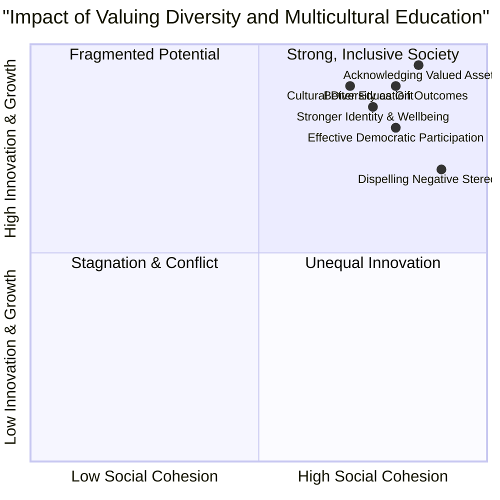

# Definition
Before proceeding, ensure you master [[Respecting_Diverse_Needs_in_Inclusive_Education]] and [[Types_of_Diversities]] because valuing diversity and multicultural education are critical actions that stem from recognizing and respecting varied human attributes.
Valuing diversity and multicultural education refer to the active recognition, appreciation, and leveraging of human differences as assets that strengthen communities, foster a stronger sense of identity and well-being, and lead to better educational and career outcomes. Multicultural education, as a key component, actively teaches respect for diversity while preparing all children and youth to become effective and participating members of a democratic society. A simpler way to think about it is like a robust ecosystem: just as a biodiverse ecosystem is healthier and more resilient, a society that actively values its human diversity through multicultural education is stronger, more innovative, and better equipped for sustainable peace and development.

# The Mental Model
Imagine a complex musical symphony. "Valuing Diversity" is like understanding that each instrument (representing a different culture, ability, or background) brings a unique and essential sound to the piece. "Multicultural Education" is the rigorous training that teaches every musician (student) not only how to play their own instrument perfectly but also how to listen to, harmonize with, and appreciate the contributions of all other instruments, creating a rich, unified, and powerful performance (society).


```text
// Scenario 1: Comprehensive impact of valuing diversity and multicultural education
// Output:
// A visual representation of the quadrant chart showing multiple data points clustered in the "Strong, Inclusive Society" quadrant (top-right).
// Each data point (e.g., "Stronger Identity & Wellbeing", "Better Education Outcomes") will be positioned based on its X and Y coordinates, indicating its strong positive contribution to both social cohesion and innovation/growth.
// The overall visual indicates that valuing diversity and multicultural education significantly enhances both social cohesion and innovation/growth, leading to a strong, inclusive society.
```
*Note: This `quadrantChart` qualitatively visualizes the positive impact of valuing diversity and multicultural education on social cohesion and innovation, demonstrating its role in building a strong, inclusive society.*

# Context & Framework
### The Engine of Societal Enrichment
Valuing diversity is not merely a moral imperative but a pragmatic necessity for robust societal development. This framework asserts that recognizing differences as a valued asset fundamentally strengthens communities, fostering a deeper sense of identity and well-being among all members. Multicultural education serves as the direct operational arm of this value, actively teaching children and youth to respect diversity and equipping them with the skills to become effective participants in a democratic society. It counters the notion that cultural diversity is a source of conflict, instead reframing it as a "blessing gift" for development. This intentional educational approach is critical for dispelling negative stereotypes and personal biases, thereby laying the groundwork for [[Achieving_Unity_in_Diversity]].

# The Mastery Deep Dive
### Qualitative Analysis: Impact of Valuing Diversity
The impact of valuing diversity, amplified by multicultural education, can be qualitatively analyzed across several key areas:

*   **Stronger Identity and Wellbeing:** When diverse strengths, abilities, interests, and perspectives are understood and supported, individuals build a stronger sense of self and overall wellbeing. This affirmation reduces feelings of marginalization and fosters psychological safety.
*   **Better Education and Career Outcomes:** Inclusive environments, where diversity is valued, lead to improved educational experiences and opportunities. Students from varied backgrounds benefit from diverse teaching methods and feel more engaged, which translates into better academic and, subsequently, career achievements.
*   **Dispelling Negative Stereotypes and Personal Biases:** Active engagement with and appreciation of different cultures and perspectives directly challenges and breaks down preconceived notions. Multicultural education explicitly addresses biases, promoting a more accurate and empathetic understanding of 'the other.'
*   **Acknowledging Differences as a Valued Asset:** This core shift in mindset recognizes that differences are not deficits but sources of innovation, varied problem-solving approaches, and broader societal wisdom. It moves beyond tolerance to an active celebration of what each unique perspective brings.
*   **Effective and Participating Members of a Democratic Society:** Multicultural education teaches children and youth how to interact respectfully across differences, engage in constructive dialogue, and contribute actively to decision-making processes. This is vital for [[Democratic_Principles_for_Inclusive_Practices]], ensuring that all voices are heard and valued.
*   **Cultural Diversity as a "Blessing Gift" for Development:** Instead of being a source of conflict, cultural diversity becomes a powerful driver for innovation, creativity, and robust problem-solving, contributing directly to sustainable economic, social, and political progress.

This multifaceted impact highlights why valuing diversity is a cornerstone of a healthy, dynamic, and peaceful society.

# Constraints & Limitations
### The "Cultural Tourism" Trap
A significant trap in valuing diversity and multicultural education is the "cultural tourism" trap. This occurs when multicultural education is reduced to superficial celebrations of different cultures (e.g., occasional ethnic food days, single events showcasing traditional dances) without genuinely integrating diverse perspectives, histories, and voices into the core curriculum and daily school life. This approach, while well-intentioned, fails to challenge systemic biases, address power imbalances, or empower marginalized voices within the educational structure. It can inadvertently reinforce stereotypes by exoticizing cultures rather than fostering deep understanding and critical engagement, thereby failing to equip students to become "effective and participating members of a democratic society" who actively "respect diversity." True multicultural education requires profound, sustained pedagogical and institutional transformation.

# Significance & Application
This concept is fundamental for fostering social cohesion, promoting equitable outcomes in education and employment, and building resilience against prejudice. It guides educational policy, curriculum design, and community initiatives aimed at celebrating differences and leveraging diversity for collective progress.

# The Worked Example
This section details how a university implements multicultural education to value diversity.

Consider a university aiming to create a truly inclusive academic environment that values its diverse student body.

**The Application:**
1.  **Curriculum Integration:**
    *   **Mandatory Diversity Course:** Introduce a mandatory foundational course that explores different [[Types_of_Diversities]], their historical contexts, and their impact on society.
    *   **Interdisciplinary Studies:** Encourage and fund interdisciplinary programs that integrate diverse cultural perspectives into various fields (e.g., "Global Perspectives in Engineering," "Multicultural Literature").
2.  **Dispelling Stereotypes and Biases:**
    *   **Bias Training for Faculty:** Implement regular workshops for faculty and staff on unconscious bias and inclusive teaching practices to "help dispel negative stereotypes and personal biases."
    *   **Student-Led Dialogue:** Support student organizations in hosting facilitated dialogues on sensitive topics related to race, gender, and religion, creating safe spaces for open discussion and understanding.
3.  **Acknowledging Differences as an Asset:**
    *   **Diverse Representation:** Ensure diverse representation in university leadership, faculty, and administrative staff, reflecting the student body.
    *   **Culturally Responsive Pedagogy:** Train professors to adapt their teaching methods and examples to resonate with students from various cultural backgrounds, ensuring that "their diverse strengths, abilities, interests and perspectives are understood and supported."
    *   **Celebrating Achievements:** Host events and create platforms that specifically celebrate the academic, cultural, and personal achievements of students from all backgrounds, reinforcing that "these differences are a valued asset."

By implementing these strategies, the university moves beyond mere tolerance to actively valuing diversity through multicultural education, fostering an environment where all students can achieve a stronger sense of identity and well-being, and contribute fully to the academic community.

# The Proving Ground
*Test your mastery. Cover the solutions below to test yourself first.*

### Level 1: The Sanity Check (Verification)
**The Fact Check:** State one key reason why it is important to value diversity.
> **Solution:** People build a stronger sense of identity and wellbeing; have better education and career outcomes; helps dispel negative stereotypes and personal biases; recognizes differences between people and acknowledges that these differences are a valued asset. (Any one is acceptable).

### Level 2: The Crucible (Mastery & Edge Cases)
**The Trade-off:** A university is deciding between a curriculum that primarily focuses on Western history and literature (Option A) or one that integrates multicultural perspectives from various global cultures (Option B). Justify the choice that best aligns with valuing diversity and multicultural education.
> **Solution:** The curriculum that integrates multicultural perspectives from various global cultures (Option B) best aligns with valuing diversity and multicultural education. Option A, while providing depth in one area, would fail to recognize that "diversity enriches and strengthens all communities" and would not "help dispel negative stereotypes and personal biases about different groups." Multicultural education explicitly teaches respect for diversity while preparing students to be effective members of a democratic society. Option B, by its very nature, broadens perspectives, fosters understanding across cultures, and leverages diverse strengths for better educational outcomes, fulfilling the core mission of valuing diversity.

### Level 3: Mastery (The Crucible)
**The Lose-Lose Scenario:** A community's traditional cultural practices conflict with emerging modern values, creating tension. How can multicultural education intervene to help navigate this "lose-lose" situation, fostering understanding and respect without diminishing either tradition or progress?
> **Solution:** Multicultural education can intervene in this "lose-lose" scenario by acting as a bridge, fostering understanding and respect without diminishing either tradition or progress. Instead of forcing a choice, it would facilitate dialogue and critical analysis. Specifically, it would educate members on the historical significance and intrinsic value of the traditional practices while also exploring the rationale and benefits of modern values (e.g., through lessons on cultural evolution, comparative studies of societal norms). By teaching "respect for different points of view and the ability to see the world through the eyes of others" (from [[Mechanisms_for_Sustainable_Peace]]) and explicitly acknowledging the "validity of different cultural expressions and contributions," multicultural education empowers the community to find points of synthesis or mutually respectful coexistence, allowing for both the preservation of heritage and adaptation to progress, as articulated in "Qualitative Analysis: Impact of Valuing Diversity."

# Key Takeaways
*   Valuing diversity means recognizing and leveraging human differences as assets that strengthen communities and improve outcomes.
*   Multicultural education is a key component, teaching respect for diversity and preparing effective, participating members of a democratic society.
*   It fosters identity, dispels stereotypes, and acknowledges diversity as a "blessing gift" for development.

# Knowledge Graph Connections
| Concept                                          | Connection / Relationship                                                                                                           |
| :
----------------------------------------------- | :
---------------------------------------------------------------------------------------------------------------------------------- |
| [[Respecting_Diverse_Needs_in_Inclusive_Education]] | This concept is the practical implementation of valuing diversity within the educational context.                                   |
| [[Types_of_Diversities]]                         | Understanding the various types of diversity is foundational to effectively valuing diversity through multicultural education.      |
| [[Achieving_Unity_in_Diversity]]                 | Valuing diversity and multicultural education are critical steps toward the broader goal of achieving unity within diverse cultures. |
| [[Race_and_Ethnicity_Distinction]]               | Multicultural education plays a key role in understanding and valuing distinctions like race and ethnicity.                         |
| [[Democratic_Principles_for_Inclusive_Practices]] | This concept is a direct application of democratic principles that promote inclusion and good governance.                           |
---