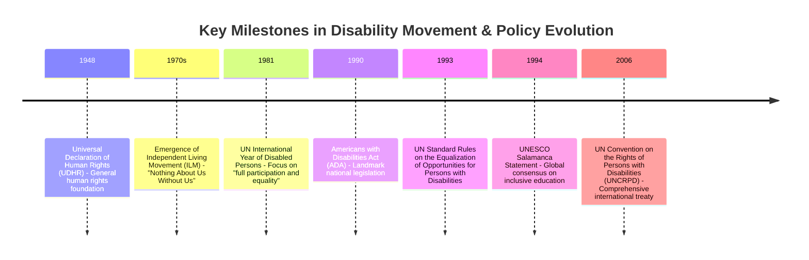

# Definition
Before proceeding, ensure you master [[Discrimination_Against_Persons_With_Disabilities]] and Relevant_Policy_And_Legal_Frameworks because the disability movement emerged as a direct response to discrimination and catalyzed the development of relevant policy and legal frameworks.
The disability movement refers to a global collective effort by persons with disabilities and their allies to challenge discrimination, advocate for human rights, and achieve full inclusion in society. This movement has been instrumental in shifting the perception of disability from a medical or charitable issue to a human rights issue, leading to significant evolution in policy and legal frameworks worldwide.

# The Mental Model
Imagine a group of people, each facing a unique challenge, realizing they share a common goal: to be seen, heard, and have their rights respected. They organize, raise their voices, and demand change, much like civil rights movements for other marginalized groups. Their collective efforts push governments and societies to create new rules and laws that protect and include them, slowly changing the landscape from one of exclusion to one of greater equity.

# Context & Framework
### The Problem: Why Did We Invent This?
The disability movement arose out of centuries of systemic discrimination, exclusion, and denial of basic human rights for persons with disabilities. Before the movement gained momentum, individuals with disabilities were often institutionalized, segregated, or treated as objects of charity, with little to no recognition of their autonomy or their rights to participate fully in society. This pervasive injustice served as the catalyst, driving disabled persons' organizations (DPOs) to mobilize and demand fundamental shifts in societal attitudes, policies, and laws.

# The Mastery Deep Dive
### The Problem: Why Did We Invent This?
Prior to the significant surge of the disability movement, the dominant paradigm viewed disability as a personal tragedy or a medical condition requiring 'cure' or 'care' in segregated settings. This led to policies centered on institutionalization and isolation, rather than integration and empowerment. The dire consequences included limited educational opportunities, unemployment, lack of accessible infrastructure, and widespread denial of political and social participation. The disability movement emerged precisely to dismantle these outdated views and structures, advocating for a rights-based approach that recognized persons with disabilities as active members of society.

### Version 1.0 vs. Today
The early "Version 1.0" of policies often involved segregated services and institutions, reflecting a medical model of disability. The focus was on "fixing" the individual or providing separate, specialized facilities. Today's approach, influenced by the disability movement, has evolved dramatically. It emphasizes **disability-mainstreamed policy and legal frameworks**, which means integrating disability considerations across all policy areas (e.g., general education, public transport, employment) rather than creating separate systems. This shift reflects a move towards a social model of disability, recognizing that barriers are often societal, not inherent in the individual.

### The "Same Story, Different Setting"
The struggle for disability rights shares common threads with other civil rights movements. Just as movements for racial or gender equality fought against systemic discrimination and demanded legal recognition of equal rights, the disability movement has campaigned for the recognition of persons with disabilities as equal citizens. The pattern of challenging existing power structures, advocating for legislative change, and demanding societal accommodation to ensure equal access and opportunity is a recurring narrative across various human rights struggles.


```text
// Scenario 1: Tracing the evolution of global disability policy
// Output:
// A timeline showing key dates and events:
// - 1948: Universal Declaration of Human Rights (UDHR) - General human rights foundation
// - 1970s: Emergence of Independent Living Movement (ILM) - "Nothing About Us Without Us"
// - 1981: UN International Year of Disabled Persons - Focus on "full participation and equality"
// - 1990: Americans with Disabilities Act (ADA) - Landmark national legislation
// - 1993: UN Standard Rules on the Equalization of Opportunities for Persons with Disabilities
// - 1994: UNESCO Salamanca Statement - Global consensus on inclusive education
// - 2006: UN Convention on the Rights of Persons with Disabilities (UNCRPD) - Comprehensive international treaty
```
*Note: This `timeline` illustrates the progressive development of key instruments and movements that shaped global disability policy.*

# Constraints & Limitations
### The Reality Check: Theory vs. Real Life
Despite significant advancements in policy and legal frameworks, the practical implementation of these mandates remains a considerable challenge. Theoretical legal rights often encounter real-world obstacles such as insufficient funding, lack of political will, inadequate infrastructure, and persistent societal attitudinal barriers. For instance, a law mandating accessible public transport might be in place, but if the budget for modifying buses or training staff is lacking, the theoretical right does not translate into practical accessibility for individuals. This gap between 'de jure' (by law) and 'de facto' (in practice) equality is a critical limitation.

# Significance & Application
The disability movement has fundamentally transformed how disability is understood and addressed globally. Its primary application lies in the continuous advocacy for, and development of, comprehensive policy and legal frameworks that uphold the human rights of persons with disabilities. This includes promoting `International_Legal_Frameworks_for_Inclusiveness` like the UNCRPD and influencing `Domestic_Policy_and_Legal_Frameworks_for_Inclusiveness_in_Ethiopia`. The movement’s impact is evident in the shift from institutionalization to independent living, from segregation to inclusion, and from charity to rights-based approaches across education, employment, and public life.

# The Worked Example
**Scenario:** Early 20th century, a child with a physical disability is denied enrollment in a local public school and is instead sent to a specialized institution far from home.

**Analysis through the lens of policy evolution:**
1.  **"Version 1.0" Policy:** This reflects an older paradigm where policies prioritized segregation and specialized care, often in institutions, rather than integrating individuals into mainstream society. The underlying belief was that the child's disability prevented them from benefiting from mainstream education or that their presence would hinder others.
2.  **Disability Movement Impact:** The disability movement, particularly post-mid-20th century, challenged such practices. It argued for the right to inclusive education, where children with disabilities attend local schools alongside their peers, with necessary accommodations and support. This led to policies like the UNESCO Salamanca Statement and later the UNCRPD, advocating for inclusive education systems.
3.  **Modern Policy Application:** In a modern context, informed by the movement's successes, denying enrollment in a local school and mandating institutionalization would be a clear violation of educational rights as enshrined in numerous international and domestic legal frameworks. The expectation would be for the local school to provide reasonable accommodations and support for the child's participation.

# The Proving Ground
*Test your mastery. Cover the solutions below to test yourself first.*

### Level 1: Understanding (The Basics)
**The Fact Check:** When did the disability movement gain significant momentum, pushing for disability-mainstreamed policies?
> **Solution:** The disability movement gained significant momentum as of the second half of the 20th century.

### Level 2: Competence (Application)
**The Trade-off:** Contrast the "specific/special needs" approach, often seen in earlier policies, with the "disability-mainstreamed" approach. Which is generally more effective in promoting true inclusiveness, and why?
> **Solution:** The "specific/special needs" approach tends to create separate services or policies solely for persons with disabilities, potentially leading to segregation. The "disability-mainstreamed" approach, however, integrates disability considerations into all general policies and services. The latter is generally more effective because it ensures that all systems are inherently inclusive, rather than requiring persons with disabilities to adapt to exclusionary systems or rely on separate, often under-resourced, services. It champions equality by design.

### Level 3: Mastery (The Crucible)
**The Lose-Lose Scenario:** A developing country, eager to comply with international disability rights, implements a national policy mandating full accessibility for all public buildings within five years. However, local municipalities lack the technical expertise and financial resources to modify existing structures or ensure new ones are built accessibly. This results in many public services closing rather than complying. What fundamental aspect of effective policy implementation, highlighted by the disability movement's advocacy, was overlooked here, leading to this 'lose-lose' situation?
> **Solution:** The fundamental aspect overlooked was the need for **strong commitment and proactive action** from governments, encompassing not just legislation but also the provision of **resources and capacity-building**. While the policy aims for compliance, the lack of support for local municipalities in terms of technical expertise and financial resources demonstrates an insufficient commitment to practical implementation. The disability movement emphasizes that legal frameworks alone are not enough; governments must actively facilitate the means for adherence to avoid creating unintended negative consequences like the closure of essential public services.

# Key Takeaways
*   The disability movement dramatically shifted the perception of disability from a medical issue to a human rights issue.
*   It led to the development of disability-mainstreamed policy and legal frameworks, moving away from segregated services.
*   Effective implementation requires strong commitment and proactive governmental action beyond mere legislation.

# Knowledge Graph Connections
| Concept                                                          | Connection / Relationship                                                                                                 |
| :
--------------------------------------------------------------- | :
-------------------------------------------------------------------------------------------------------------------------- |
| [[Discrimination_Against_Persons_With_Disabilities]]             | The disability movement emerged directly in response to widespread discrimination.                                        |
| [[International_Legal_Frameworks_for_Inclusiveness]]             | The movement propelled the creation and adoption of crucial international disability instruments.                           |
| [[Domestic_Policy_and_Legal_Frameworks_for_Inclusiveness_in_Ethiopia]] | The movement influenced national governments, including Ethiopia, to enact domestic disability policies.                  |
| Promoting_Inclusive_Culture                                  | The movement's advocacy fostered a broader understanding and promotion of inclusive culture.                               |
---