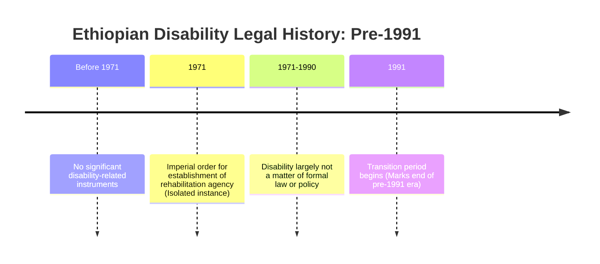

# Definition
Before proceeding, ensure you master [[Domestic_Policy_and_Legal_Frameworks_for_Inclusiveness_in_Ethiopia]] and [[Disability_Movement_and_Policy_Evolution]] because understanding Ethiopia's pre-1991 disability legal history provides a crucial historical context against which the development of modern domestic frameworks and the impact of the disability movement can be fully appreciated.
Ethiopia's disability legal history pre-1991 is characterized by a notable absence of comprehensive disability-related instruments. Prior to this period, there was little specific legislation or policy addressing the rights of persons with disabilities beyond a 1971 imperial order that provided for the establishment of a rehabilitation agency. This suggests that disability was largely not a matter of formal law and policy, reflecting a period where awareness and a rights-based approach to disability were still nascent in the country.

# The Mental Model
Imagine looking at old blueprints for a building. Before 1991, if you looked at Ethiopia's "legal blueprints" for society, you'd find hardly any sections specifically designed for people with disabilities. It's like they weren't explicitly on the drawing board when the rules were being made. There might have been a tiny note about a "rehab center," but no grand design for inclusion. This tells us that, for a long time, the country wasn't formally thinking about disability through laws or policies.

# Context & Framework
### The Problem: Why Did We Invent This?
The lack of significant disability-related legal and policy documents in Ethiopia before 1991 reflects a broader historical context where disability was often viewed through medical or charitable lenses, rather than as a human rights issue. This period predates the full international momentum of the `Disability_Movement_and_Policy_Evolution`, which began to gain global traction in the latter half of the 20th century. Consequently, persons with disabilities in Ethiopia, like in many parts of the world, likely faced widespread `Discrimination_Against_Persons_With_Disabilities` and exclusion without formal legal protection or policy guidance for their inclusion. The limited legal framework meant individuals had little recourse against discrimination and few provisions ensuring their rights.

# The Mastery Deep Dive
### The Problem: Why Did We Invent This?
Prior to 1991, the institutional and societal approach to disability in Ethiopia largely mirrored global trends before the widespread adoption of a human rights model. Disability was often perceived as a personal misfortune, leading to fragmented responses rooted in charity or rehabilitation, rather than comprehensive legal frameworks ensuring rights and participation. The single identified legal instrument, the 1971 imperial order for a rehabilitation agency, points to a focus on medical or vocational solutions for individuals, rather than systemic changes to address societal barriers. This historical context of minimal legal recognition underscores the profound shift that would occur in subsequent decades.

### Version 1.0 vs. Today
The "Version 1.0" of Ethiopia's approach to disability, specifically before 1991, was characterized by the absence of substantial legal and policy frameworks. Disability was largely an unspoken or informally addressed issue within the legal sphere. Today's approach, post-1991 and particularly after the adoption of the `Constitution_of_the_Federal_Democratic_Republic_of_Ethiopia_1995` and ratification of `International_Legal_Frameworks_for_Inclusiveness`, is vastly different. It features a robust and evolving set of `Domestic_Policy_and_Legal_Frameworks_for_Inclusiveness_in_Ethiopia` that explicitly recognize the rights of persons with disabilities across multiple sectors (e.g., education, employment, accessibility), reflecting a fundamental shift towards a rights-based and inclusive paradigm.


```text
// Scenario 1: Tracing early Ethiopian disability policy
// Output:
// (A visual representation of the timeline showing the distinct periods in Ethiopia's disability legal history before 1991.)
// - Before 1971: No significant disability-related instruments
// - 1971: Imperial order for establishment of rehabilitation agency (Isolated instance)
// - 1971-1990: Disability largely not a matter of formal law or policy
// - 1991: Transition period begins (Marks end of pre-1991 era)
```
*Note: This `timeline` illustrates the limited formal legal and policy engagement with disability in Ethiopia prior to 1991.*

# Constraints & Limitations
### The Reality Check: Theory vs. Real Life
The primary constraint of this historical period (pre-1991) was the **absence of a legal and policy framework** itself. This meant: (1) **Lack of Rights Enforcement:** Persons with disabilities had no formal legal recourse to challenge discrimination or demand rights. (2) **Limited State Responsibility:** The state's formal responsibility for ensuring the inclusion and rights of persons with disabilities was minimal, relying more on informal community support or charitable initiatives. (3) **Perpetuation of Stigma:** Without legal recognition and policy guidance, societal attitudes often remained stagnant, perpetuating stigma and exclusion. These limitations highlight the critical role that a strong legal and policy framework plays in driving social change and protecting human rights.

# Significance & Application
Understanding Ethiopia's disability legal history pre-1991 is significant for several reasons: (1) **Contextualization:** It provides a baseline for appreciating the dramatic advancements made in `Domestic_Policy_and_Legal_Frameworks_for_Inclusiveness_in_Ethiopia` post-1991. (2) **Highlighting Evolution:** It underscores the evolution from a period of minimal legal recognition to one of increasing policy engagement and rights protection, driven by global and national advocacy. (3) **Informing Future Actions:** By recognizing the historical vacuum, it reinforces the ongoing need for robust implementation and continuous improvement of current disability-inclusive policies. This historical perspective is crucial for understanding the journey towards a more inclusive Ethiopia.

# The Worked Example
**Scenario:** An elderly Ethiopian citizen recalls that in their youth (before 1991), a blind child in their village received education only through informal tutoring by a community elder, as there were no formal provisions for blind students in the local school system.

**Analysis through the lens of Ethiopia's pre-1991 legal history:**
1.  **Contextualization:** This scenario aligns with the characteristic of Ethiopia's pre-1991 disability legal history, which lacked comprehensive frameworks for inclusive education. Formal education systems were largely inaccessible to children with disabilities.
2.  **Absence of Policy:** The reliance on informal tutoring highlights the absence of formal state policy or legal mandates for inclusive education for children with visual impairments during that period. The limited `1971 imperial order` focused on rehabilitation, not systemic educational inclusion.
3.  **Implication:** This demonstrates that before 1991, the right to education for children with disabilities was often left to informal community efforts rather than being guaranteed and facilitated by state-led legal and policy frameworks. This situation starkly contrasts with later `1994_Education_and_Training_Policy_(Ethiopia)` which promoted more inclusive approaches.

# The Proving Ground
*Test your mastery. Cover the solutions below to test yourself first.*

### Level 1: Understanding (The Basics)
**The Fact Check:** What was the extent of disability-related legal and policy documents in Ethiopia before 1991, as mentioned in the unit?
> **Solution:** Before 1991, there was a notable absence of comprehensive disability-related instruments, with only a 1971 imperial order for a rehabilitation agency being identified.

### Level 2: Competence (Application)
**The Trade-off:** Explain how the period pre-1991 in Ethiopia, characterized by a lack of formal disability law, impacted the rights of persons with disabilities.
> **Solution:** The lack of formal disability law pre-1991 meant that persons with disabilities had limited or no legal recourse to challenge discrimination or demand their rights. The state's formal responsibility for ensuring their inclusion was minimal, leading to widespread `Discrimination_Against_Persons_With_Disabilities` and exclusion without specific legal protection or policy guidance, relying instead on informal support or charitable initiatives.

### Level 3: Mastery (The Crucible)
**The Lose-Lose Scenario:** Imagine a local Ethiopian administrator in the late 1980s faced with a parent demanding formal education for their child with a physical disability. Given the pre-1991 legal landscape, why might this administrator have been in a "lose-lose" situation regarding providing a legally mandated, inclusive educational solution?
> **Solution:** The administrator would have been in a "lose-lose" situation because, under Ethiopia's pre-1991 legal landscape, there was a **fundamental absence of comprehensive disability-related legal and policy frameworks** that mandated inclusive education. The administrator would likely have no specific laws or policies to reference that required mainstream schools to enroll or accommodate children with physical disabilities. While they might have desired to help, they would lack the legal mandate, budget, and resources that later policies (`1994_Education_and_Training_Policy_(Ethiopia)`) would provide, making it impossible to offer a legally mandated, inclusive solution, thus failing both the child's right and their own administrative capacity.

# Key Takeaways
*   Ethiopia's pre-1991 disability legal history was marked by a significant absence of comprehensive disability-related legal and policy instruments.
*   The period saw limited formal state responsibility, often relying on informal or charitable approaches to disability.
*   This historical context highlights the profound shift towards a rights-based approach in later domestic frameworks.

# Knowledge Graph Connections
| Concept                                                          | Connection / Relationship                                                                                                 |
| :
--------------------------------------------------------------- | :
-------------------------------------------------------------------------------------------------------------------------- |
| [[Domestic_Policy_and_Legal_Frameworks_for_Inclusiveness_in_Ethiopia]] | This historical period serves as the baseline for understanding the evolution of modern Ethiopian frameworks.               |
| [[Disability_Movement_and_Policy_Evolution]]                     | The limited pre-1991 legal framework reflects a time before the full impact of the disability movement in Ethiopia.       |
| [[Discrimination_Against_Persons_With_Disabilities]]             | The absence of legal frameworks during this period likely contributed to pervasive discrimination.                          |
| [[Constitution_of_the_Federal_Democratic_Republic_of_Ethiopia_1995]] | The 1995 Constitution marked a significant departure from this earlier period by enshrining human rights.                 |
---