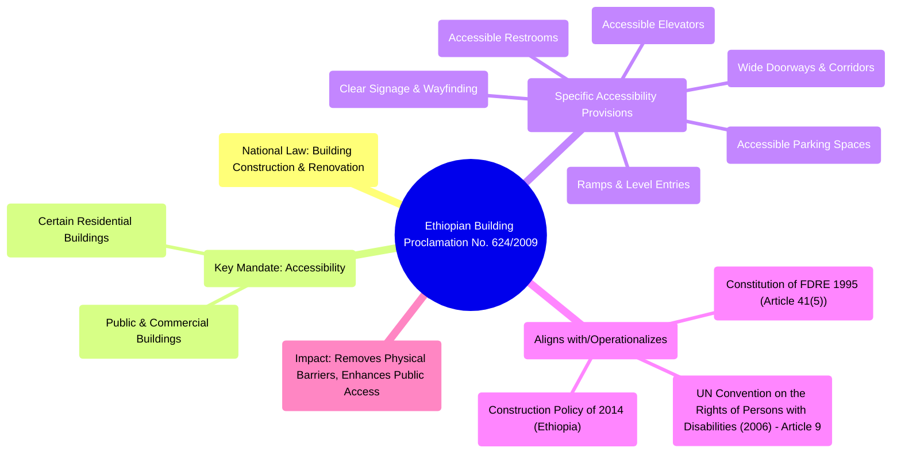

# Definition
Before proceeding, ensure you master [[Domestic_Policy_and_Legal_Frameworks_for_Inclusiveness_in_Ethiopia]] and Accessibility_And_Universal_Design because the Ethiopian Building Proclamation No. 624/2009 is a crucial domestic framework that mandates accessibility standards, aligning with universal design principles to ensure physical inclusiveness.
The Ethiopian Building Proclamation No. 624/2009 is a national law that sets out regulations and standards for building construction and renovation in Ethiopia. A key aspect of this proclamation, pertinent to inclusiveness, is its mandate for accessibility. It requires that public and commercial buildings, as well as certain residential buildings, are designed and constructed to be accessible to persons with disabilities. This includes provisions for ramps, accessible restrooms, elevators, and other features that remove physical barriers, thereby ensuring the right of persons with disabilities to access public facilities and services on an equal basis with others.

# The Mental Model
Imagine a country deciding that all new buildings, and even some old ones, must be designed so *everyone* can use them easily, regardless of whether they use a wheelchair, have trouble seeing, or are elderly. This "Building Law" (Proclamation 624/2009) is like a set of detailed instructions for architects and builders, saying "You *must* include ramps, accessible toilets, and wide doors." It's about literally building a more inclusive society, making sure no one is blocked from entering or using public spaces.

# Context & Framework
### How the Parts Talk to Each Other
The Ethiopian Building Proclamation No. 624/2009 operates under the authority of the `Constitution_of_the_Federal_Democratic_Republic_of_Ethiopia_1995`, which guarantees the right to access public facilities (Article 41(5)). This proclamation translates that constitutional principle into specific, legally binding construction standards for accessibility. It also aligns with Ethiopia's commitments under `International_Legal_Frameworks_for_Inclusiveness`, particularly Article 9 (Accessibility) of the `UN_Convention_on_the_Right_of_Persons_With_Disabilities_of_2006`. By mandating accessibility, the proclamation works in tandem with other `Domestic_Policy_and_Legal_Frameworks_for_Inclusiveness_in_Ethiopia` to create a physically inclusive environment, ensuring that buildings are not `Environmental_Barriers` but rather enablers of participation.

# The Mastery Deep Dive
### Where Does it Live? (The Map)
The Ethiopian Building Proclamation No. 624/2009 is dedicated to regulating various aspects of building construction. Its provisions relevant to inclusiveness are primarily found in sections mandating accessible design. Key areas covered include: requirements for ramps and elevators in multi-story buildings, accessible routes of travel within buildings, accessible restrooms, and clear signage. The proclamation aims to ensure that persons with disabilities can independently navigate and utilize buildings, thereby promoting their full participation in public life.


```text
// Scenario 1: Core components and impact of the Building Proclamation
// Output:
// (A visual representation of the mindmap showing "Ethiopian Building Proclamation No. 624/2009" as the root.)
// Key branches include: "National Law: Building Construction & Renovation", "Key Mandate: Accessibility" (for Public, Commercial, Residential buildings), "Specific Accessibility Provisions" (Ramps, Elevators, Restrooms, Signage, Doorways, Parking), "Aligns with/Operationalizes" (Constitution, UNCRPD, Construction Policy), and "Impact: Removes Physical Barriers, Enhances Public Access".
```
*Note: This `mindmap` illustrates the comprehensive nature of the Ethiopian Building Proclamation No. 624/2009 in mandating accessibility for persons with disabilities.*

# Constraints & Limitations
### The Reality Check: Theory vs. Real Life
Despite the clear mandate of Proclamation No. 624/2009, its implementation faces several limitations: (1) **Enforcement Challenges:** Monitoring and enforcing compliance, particularly for older buildings undergoing renovation or in remote areas, can be inconsistent due to limited inspection capacity and resources. (2) **Awareness Gaps:** Many contractors, developers, and even local authorities may lack full awareness or technical expertise regarding detailed accessibility standards. (3) **Cost Perception:** The perceived additional cost of accessible design can sometimes lead to resistance or attempts to circumvent regulations. (4) **Retrofitting Difficulties:** Retrofitting existing old buildings to be fully accessible can be technically complex and expensive. These factors contribute to a gap between the legal mandate for accessibility and its widespread realization on the ground.

# Significance & Application
The Ethiopian Building Proclamation No. 624/2009 is immensely significant for inclusiveness as it directly addresses a fundamental aspect of `Accessibility_and_Universal_Design` – the built environment. Its applications are critical for: (1) **Physical Access:** It ensures that public and commercial spaces are physically accessible, enabling persons with disabilities to participate in economic, social, and cultural life. (2) **Barrier Removal:** It legally mandates the removal of `Environmental_Barriers`, which are a major source of `Discrimination_Against_Persons_With_Disabilities`. (3) **Guiding Construction:** It provides clear legal standards for architects, engineers, and construction companies, guiding them towards inclusive design practices. The proclamation is thus a powerful tool for transforming Ethiopia's built environment into one that is truly inclusive and usable by all citizens, fulfilling the constitutional right to access public facilities.

# The Worked Example
**Scenario:** A newly constructed private clinic in a major Ethiopian city is found to have a main entrance with a steep staircase and no ramp or elevator.

**Analysis through the Building Proclamation lens:**
1.  **Violation of Proclamation:** The absence of a ramp or elevator at the main entrance of a newly constructed private clinic is a clear violation of the Ethiopian Building Proclamation No. 624/2009, which mandates accessibility for public and commercial buildings.
2.  **Barrier Created:** This design creates a significant `Environmental_Barrier` for persons with mobility impairments, effectively denying them access to essential healthcare services.
3.  **Required Action:** Under the proclamation, the building authority or relevant regulatory body can issue an order for the clinic to install a ramp or an accessible elevator, ensuring compliance. Failure to comply could result in penalties. This demonstrates the legal power of the proclamation to enforce accessibility standards.

# The Proving Ground
*Test your mastery. Cover the solutions below to test yourself first.*

### Level 1: Understanding (The Basics)
**The Fact Check:** What is a key mandate of the Ethiopian Building Proclamation No. 624/2009 regarding public and commercial buildings?
> **Solution:** A key mandate is to ensure that public and commercial buildings are designed and constructed to be accessible to persons with disabilities.

### Level 2: Competence (Application)
**The Sort:** Explain how the Ethiopian Building Proclamation No. 624/2009 operationalizes Article 41(5) of the `Constitution_of_the_Federal_Democratic_Republic_of_Ethiopia_1995` concerning access to public facilities.
> **Solution:** The Ethiopian Building Proclamation No. 624/2009 operationalizes Article 41(5) of the Ethiopian Constitution (which guarantees the right to access public facilities) by translating this broad constitutional principle into specific, legally binding construction standards for accessibility. It mandates features like ramps, accessible restrooms, and elevators in public and commercial buildings, thereby providing the detailed legal framework necessary for the practical realization and enforcement of the constitutional right to access public facilities for persons with disabilities.

### Level 3: Mastery (The Crucible)
**The Impostor:** A real estate developer, citing the Building Proclamation, argues that their new high-rise residential building, which has accessible common areas but completely inaccessible individual apartment units (e.g., narrow doorways, no accessible bathrooms), fully complies with the proclamation's accessibility requirements. Why is this claim an 'impostor'?
> **Solution:** This claim is an 'impostor' because while the common areas might be accessible, the completely inaccessible individual apartment units fundamentally undermine the spirit of accessibility and inclusion envisioned by the Ethiopian Building Proclamation No. 624/2009. The proclamation aims to ensure persons with disabilities can access *and utilize* facilities on an equal basis. If their private living spaces within a residential building remain inaccessible, it creates a severe `Environmental_Barrier` and effectively excludes them from independent living, despite accessible common areas. True compliance would require the possibility for individual units to be adaptable or built with baseline accessibility features, ensuring genuine and holistic access.

# Key Takeaways
*   The Ethiopian Building Proclamation No. 624/2009 mandates accessibility standards for public and commercial buildings.
*   It aims to remove physical barriers and ensures the right to access public facilities for persons with disabilities.
*   Implementation faces challenges with enforcement, awareness, perceived costs, and retrofitting difficulties.

# Knowledge Graph Connections
| Concept                                                          | Connection / Relationship                                                                                                 |
| :
--------------------------------------------------------------- | :
-------------------------------------------------------------------------------------------------------------------------- |
| [[Domestic_Policy_and_Legal_Frameworks_for_Inclusiveness_in_Ethiopia]] | This proclamation is a specific legal instrument within Ethiopia's domestic framework for building accessibility.         |
| [[Constitution_of_the_Federal_Democratic_Republic_of_Ethiopia_1995]] | It operationalizes Article 41(5) of the Constitution regarding the right to public access.                                  |
| Accessibility_And_Universal_Design                           | The proclamation aligns with and implements principles of accessibility and universal design in the built environment.      |
| [[Construction_Policy_of_2014_(Ethiopia)]]                       | The Building Proclamation provides the specific legal framework for accessibility that the broader Construction Policy would encompass. |
| Environmental_Barriers                                       | The proclamation directly aims to eliminate environmental barriers in the built environment.                                |
---