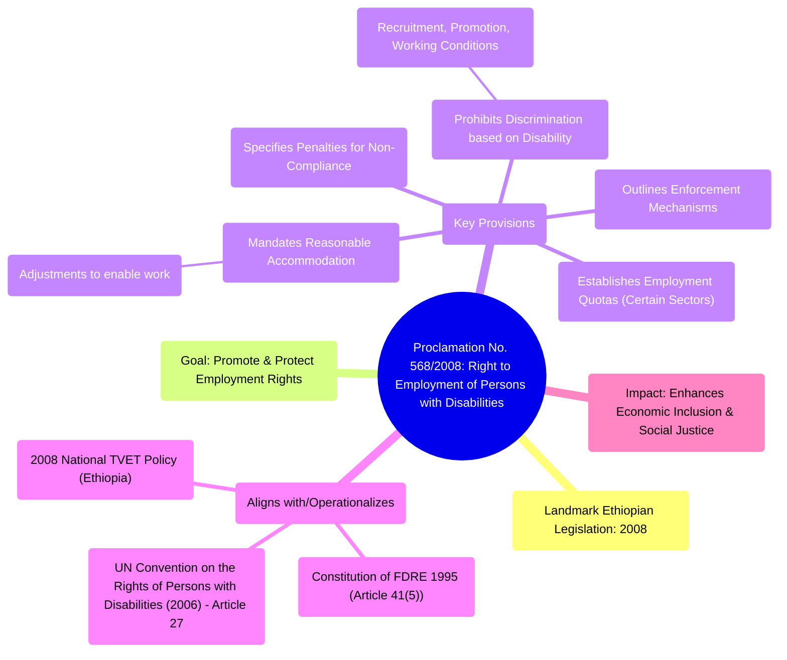

# Definition
Before proceeding, ensure you master [[Domestic_Policy_and_Legal_Frameworks_for_Inclusiveness_in_Ethiopia]] and [[Constitution_of_the_Federal_Democratic_Republic_of_Ethiopia_1995]] because this proclamation specifically operationalizes the constitutional right to employment for persons with disabilities, ensuring their integration into the workforce.
Proclamation No. 568/2008, also known as the Right to Employment of Persons with Disabilities Proclamation, is a landmark piece of legislation in Ethiopia. It was enacted to promote and protect the employment rights of persons with disabilities, aiming to ensure their equal opportunity and full participation in the labor market. The Proclamation prohibits discrimination in employment based on disability, mandates reasonable accommodation, and sets specific quotas for the employment of persons with disabilities in certain sectors, thereby directly addressing economic inclusion and social justice.

# The Mental Model
Imagine a formal promise from the government, written in a powerful book of laws, that says: "People with disabilities have the right to get jobs, just like everyone else!" This "Employment Law" (Proclamation 568/2008) not only stops employers from being unfair but also tells them they have to make necessary changes (like providing special tools or flexible hours) so people with disabilities can do their jobs well. It's about opening doors to work and ensuring everyone can contribute their talents.

# Context & Framework
### How the Parts Talk to Each Other
Proclamation No. 568/2008 operates directly under the authority of the `Constitution_of_the_Federal_Democratic_Republic_of_Ethiopia_1995`, specifically Article 41(5), which guarantees the right to support for employment for persons with disabilities. This proclamation translates the broad constitutional principle into concrete legal obligations for employers and provides a framework for enforcement. It also aligns with Ethiopia's international commitments under `International_Legal_Frameworks_for_Inclusiveness` such as the `UN_Convention_on_the_Right_of_Persons_With_Disabilities_of_2006` (Article 27 on Work and Employment). The proclamation thus works in conjunction with other `Domestic_Policy_and_Legal_Frameworks_for_Inclusiveness_in_Ethiopia`, like the `2008_National_TVET_Policy_(Ethiopia)`, to create an integrated approach to employment inclusion.

# The Mastery Deep Dive
### Where Does it Live? (The Map)
Proclamation No. 568/2008 is a comprehensive legal instrument with several key provisions that directly address the employment rights of persons with disabilities. These include: prohibiting discrimination in all aspects of employment (recruitment, promotion, working conditions), mandating reasonable accommodation to ensure equal opportunity, and establishing employment quotas for public and private organizations meeting certain criteria. The proclamation also outlines enforcement mechanisms and penalties for non-compliance, providing a robust legal framework to safeguard the right to work for persons with disabilities.


```text
// Scenario 1: Core components and impact of Proclamation No. 568/2008
// Output:
// (A visual representation of the mindmap showing "Proclamation No. 568/2008: Right to Employment of Persons with Disabilities" as the root.)
// Key branches include: "Landmark Ethiopian Legislation: 2008", "Goal: Promote & Protect Employment Rights", "Key Provisions" (Prohibits Discrimination, Mandates Reasonable Accommodation, Establishes Employment Quotas, Outlines Enforcement, Specifies Penalties), "Aligns with/Operationalizes" (Constitution, UNCRPD, TVET Policy), and "Impact: Enhances Economic Inclusion & Social Justice".
```
*Note: This `mindmap` illustrates the comprehensive nature of Proclamation No. 568/2008 in securing employment rights for persons with disabilities in Ethiopia.*

# Constraints & Limitations
### The Reality Check: Theory vs. Real Life
Despite its progressive nature, Proclamation No. 568/2008 faces limitations in achieving full implementation: (1) **Awareness Gaps:** Many employers and persons with disabilities themselves may not be fully aware of their rights and obligations under the proclamation. (2) **Enforcement Challenges:** Monitoring compliance, especially regarding reasonable accommodation and employment quotas in the private sector, can be challenging due to limited capacity and resources for oversight. (3) **Attitudinal Barriers:** Persistent `Discrimination_Against_Persons_With_Disabilities` and stereotypes among employers can hinder the hiring and retention of persons with disabilities, even with legal mandates. (4) **Skills Mismatch:** A mismatch between the skills of persons with disabilities and labor market demands can also pose a barrier, highlighting the need for effective TVET programs. These factors contribute to a gap between the legal right and its practical realization.

# Significance & Application
Proclamation No. 568/2008 is profoundly significant for inclusiveness in Ethiopia as it provides a robust legal framework to combat employment discrimination and promote economic empowerment for persons with disabilities. Its applications are direct: (1) **Legal Recourse:** It provides legal recourse for persons with disabilities who face discrimination in employment, enabling them to assert their rights. (2) **Employer Obligations:** It places clear legal obligations on employers to ensure non-discrimination, provide reasonable accommodation, and meet employment quotas where applicable. (3) **Policy Coherence:** It contributes to a coherent national framework for disability inclusion by directly linking employment rights to broader constitutional and international commitments, working alongside initiatives like the `National_Plan_of_Action_of_Persons_with_Disabilities_2012_2021`. The proclamation is thus a critical tool for fostering an inclusive labor market in Ethiopia.

# The Worked Example
**Scenario:** A qualified individual with a mild intellectual disability applies for a data entry position at a private company in Ethiopia. The company rejects the application, stating they "don't have roles for people like that."

**Analysis through Proclamation No. 568/2008 lens:**
1.  **Violation of Proclamation:** The company's rejection constitutes direct **discrimination based on disability**, which is explicitly prohibited by Proclamation No. 568/2008. The statement "don't have roles for people like that" is a clear discriminatory `attitudinal barrier`.
2.  **Employer Obligations:** The proclamation mandates that employers ensure equal opportunity and, where applicable, provide reasonable accommodation to enable persons with disabilities to perform job functions. The company failed to consider the individual's qualifications or explore potential accommodations.
3.  **Legal Recourse:** The individual has legal recourse under this proclamation to challenge the discriminatory rejection, potentially seeking reinstatement, compensation, or enforcement of the company's obligation to consider them fairly. This demonstrates the proclamation's power as a tool for justice.

# The Proving Ground
*Test your mastery. Cover the solutions below to test yourself first.*

### Level 1: Understanding (The Basics)
**The Fact Check:** What are two key provisions of Proclamation No. 568/2008 regarding the employment of persons with disabilities?
> **Solution:** Two key provisions are the prohibition of discrimination in employment based on disability and the mandate for reasonable accommodation.

### Level 2: Competence (Application)
**The Sort:** Explain how Proclamation No. 568/2008 operationalizes Article 41(5) of the `Constitution_of_the_Federal_Democratic_Republic_of_Ethiopia_1995`.
> **Solution:** Proclamation No. 568/2008 operationalizes Article 41(5) of the Ethiopian Constitution (which guarantees the right to support for employment) by translating this broad constitutional principle into concrete legal obligations. It specifies how discrimination is prohibited, what constitutes reasonable accommodation, and sets employment quotas, thereby providing the detailed legal framework necessary for the practical realization and enforcement of the constitutional right to employment for persons with disabilities.

### Level 3: Mastery (The Crucible)
**The Impostor:** A large manufacturing company in Ethiopia, subject to Proclamation No. 568/2008, states that it has met its obligations by simply posting job vacancies on a dedicated disability employment portal, even though its recruitment process remains inaccessible for visually impaired applicants (e.g., all forms are image-based, no screen-reader compatibility). Why is this approach an 'impostor' for true compliance with the proclamation?
> **Solution:** This approach is an 'impostor' because while posting vacancies on a dedicated portal addresses initial outreach, it fails to meet the proclamation's mandate for **non-discrimination** and **reasonable accommodation** across *all aspects of employment*, including the recruitment process. If recruitment forms are image-based and inaccessible to screen-reader users, it creates a significant `Institutional_Barrier` and `Environmental_Barrier` that effectively excludes visually impaired applicants. True compliance requires the *entire* recruitment process to be accessible, ensuring that qualified individuals with disabilities can *actually apply* and compete fairly, not just be aware of vacancies. This demonstrates a superficial interpretation that undermines the proclamation's intent to remove all forms of `Discrimination_Against_Persons_With_Disabilities`.

# Key Takeaways
*   Proclamation No. 568/2008 protects employment rights for persons with disabilities in Ethiopia.
*   It prohibits discrimination, mandates reasonable accommodation, and sets employment quotas.
*   Implementation faces challenges with awareness, enforcement, attitudinal barriers, and skills mismatch.

# Knowledge Graph Connections
| Concept                                                          | Connection / Relationship                                                                                                 |
| :
--------------------------------------------------------------- | :
-------------------------------------------------------------------------------------------------------------------------- |
| [[Domestic_Policy_and_Legal_Frameworks_for_Inclusiveness_in_Ethiopia]] | This proclamation is a specific legal instrument within Ethiopia's domestic framework for employment rights.              |
| [[Constitution_of_the_Federal_Democratic_Republic_of_Ethiopia_1995]] | It operationalizes Article 41(5) of the Constitution regarding the right to employment.                                     |
| [[2008_National_TVET_Policy_(Ethiopia)]]                         | The TVET policy provides the practical training necessary to realize the employment rights outlined in this proclamation. |
| [[Labor_Proclamation_No_1156_2019_(Ethiopia)]]]                   | This later labor proclamation would likely build upon or integrate principles from Proclamation No. 568/2008.           |
| [[Discrimination_Against_Persons_With_Disabilities]]             | The proclamation directly combats discrimination in employment based on disability.                                         |
---