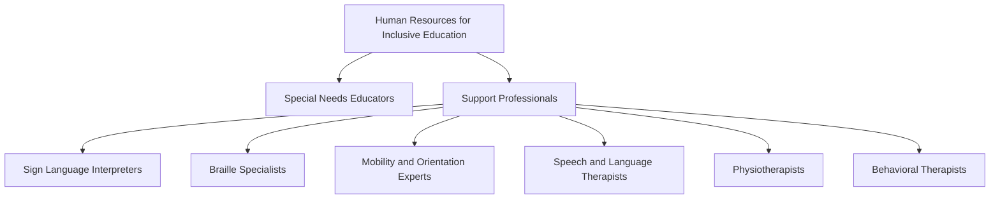
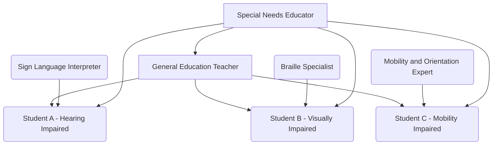

# Definition
Before proceeding, ensure you grasp [[Resources_for_Inclusion]] as human resources are a subset of these broader supports. **Human Resources for Inclusive Education** refers to the specialized personnel and support staff required to facilitate the learning and development of students with disabilities in an inclusive school environment. It's like having expert coaches for a diverse sports team, each specializing in different aspects to ensure every player, regardless of their unique abilities, can participate and excel.

# The Mental Model
Imagine a complex theatrical production where actors have diverse needs: some use wheelchairs, some communicate non-verbally, and others have learning differences. The human resources are the dedicated crew: the sign language interpreter for the audience, the mobility expert ensuring stage accessibility, the special needs educators who adapt scripts, and the speech therapist helping actors project. Each person's specialized skill ensures the entire production is inclusive and successful for everyone involved.


```text
// Scenario 1: Hierarchy of Human Resources in Inclusive Education.
// Output:
// A[Human Resources for Inclusive Education] is the main category.
// It branches into B[Special Needs Educators] and C[Support Professionals].
// C[Support Professionals] further branches into D[Sign Language Interpreters], E[Braille Specialists], F[Mobility and Orientation Experts], G[Speech and Language Therapists], H[Physiotherapists], and I[Behavioral Therapists].
```
*Note: This `graph TD` illustrates the various types of human resources that contribute to an inclusive educational environment, categorized by their primary roles.*

# Context & Framework
### The Family Tree
Human resources for inclusive education form a crucial "family tree" of support roles, with each branch addressing a specific area of need for students with disabilities. This includes professionals who adapt curriculum, facilitate communication, assist with mobility, and provide therapeutic interventions. The collective expertise of these individuals creates a multidisciplinary team capable of addressing the diverse and complex challenges students with special needs may encounter. This structured approach ensures that all aspects of a student's learning and well-being are supported.

# The Mastery Deep Dive
### The Family Tree
The "family tree" of human resources for inclusive education highlights the specialized expertise required to meet diverse student needs. At the core are Special_Needs_Educators, who adapt curriculum and teaching methods. Branching from them are various support professionals: Sign_Language_Interpreters facilitate communication for the hearing impaired, Braille_Specialists enable literacy for the visually impaired, and Mobility_And_Orientation_Experts assist with safe navigation. Additionally, allied health professionals like Speech_And_Language_Therapists, Physiotherapists, and Behavioral_Therapists address specific developmental, physical, and behavioral challenges, respectively. This comprehensive array of human resources ensures that every student receives tailored support, fostering both academic success and personal development within an inclusive setting.

### The Cheat Code: How to Remember This
Think of the "S.P.E.C.T.R.U.M." of human resources: **S**ign Language, **P**hysio, **E**ducators (Special Needs), **C**ommunity (Mobility), **T**herapists (Speech, Behavioral), **R**eading (Braille), **U**nity (Coordination), **M**ulti-disciplinary. While not perfectly encompassing every title, this helps group the diverse range of professionals. Another simple cheat code is to remember "The 3 Ps and the 2 Ss": **P**hysiotherapists, **P**sychologists/Behavioral Therapists, **P**arents (though not directly school staff, they are crucial human resources), **S**ign language interpreters, and **S**pecial needs educators.

# Constraints & Limitations
### The "Duh!" Moment (Intuitive Proof)
A significant limitation is the common oversight that one general educator cannot fulfill all roles. Expecting a single teacher to also be a Braille specialist, a sign language interpreter, and a speech therapist is unrealistic and unsustainable. This intuitive proof highlights the indispensable need for a diverse team of specialized human resources to effectively implement inclusive education, ensuring that students receive the specific expertise required for their unique learning profiles. Without such specialization, inclusive efforts risk becoming superficial and ineffective.

# Significance & Application
Human resources are the heart of inclusive education, transforming policy into practice. Academically, this defines critical roles in special education and educational psychology, informing training programs for various specialists. In practice, these professionals implement individualized education plans, adapt learning materials, provide therapeutic interventions, and facilitate communication, ensuring that students with disabilities can access the curriculum, participate in school life, and develop essential skills. Their expertise is crucial for addressing the diverse learning styles and characteristics of students, using multisensory and specialized approaches.

# The Worked Example
Consider a diverse classroom with students requiring various supports.


```text
// Scenario 1: Classroom support system with human resources.
// Output:
// The General Education Teacher interacts with Student A (Hearing Impaired), Student B (Visually Impaired), and Student C (Mobility Impaired).
// A Sign Language Interpreter provides support to Student A.
// A Braille Specialist provides support to Student B.
// A Mobility and Orientation Expert provides support to Student C.
// A Special Needs Educator supports the General Education Teacher and also directly assists Students A, B, and C by adapting content and strategies.
```
*Note: This `graph TD` visually depicts how different human resources collaborate to support students with various disabilities within an inclusive classroom, ensuring each student receives tailored assistance.*

# The Proving Ground
*Test your mastery. Cover the solutions below to test yourself first.*

### Level 1: The Sanity Check (Verification)
**The Neighbor Check:** Identify three types of human resources that directly assist students with special educational needs.
> **Solution:** Special Needs Educators, Sign Language Interpreters, and Braille Specialists (other valid answers include Mobility and Orientation Experts, Speech and Language Therapists, Physiotherapists, Behavioral Therapists).

### Level 2: The Crucible (Mastery & Edge Cases)
**The Impostor:** A school board decides to reduce costs by eliminating the roles of Braille specialists and mobility experts, arguing that "modern technology and general classroom aids can cover their functions." Explain why this decision is a 'false friend' to inclusive education, specifically highlighting the unique and indispensable expertise these human resources provide that technology alone cannot replace.
> **Solution:** This decision is a 'false friend' because it fundamentally misunderstands the irreplaceable, specialized expertise of Braille specialists and mobility experts. While technology like screen readers and GPS can assist, a **Braille specialist** doesn't just provide Braille materials; they teach Braille literacy, tactile reading strategies, and support the development of crucial cognitive skills for visually impaired students. A **Mobility and Orientation Expert** provides training in safe, independent travel and environmental awareness, often in complex, dynamic settings that technology cannot fully replicate. These roles involve pedagogical and practical skills, adapting to individual learning styles and characteristics, which are beyond the scope of general classroom aids or even advanced technology. The physical presence and specialized training by these professionals are essential for developing true independence and mastery, especially in real-world situations, addressing unique needs through multisensory and specialized approaches.

# Key Takeaways
*   Human resources are the specialized personnel, such as special needs educators, sign language interpreters, and therapists, who provide direct, tailored support to students with disabilities in inclusive settings.
*   These professionals are crucial for adapting curriculum, facilitating communication, assisting with mobility, and providing therapeutic interventions, addressing the diverse learning styles and characteristics of students.
*   The absence of adequate and specialized human resources severely compromises the effectiveness of inclusive education, as their expertise cannot be fully replaced by general educators or technology alone.

# Knowledge Graph Connections
| Concept                            | Connection / Relationship                                                                   |
| :
--------------------------------- | :
------------------------------------------------------------------------------------------ |
| [[Resources_for_Inclusion]]        | Human resources are a primary category of the broader concept of resources for inclusion. |
| [[Resource_Rooms_and_Pull_Out_Programs]] | Human resources, like special needs educators, are central to the functioning of resource rooms. |
| [[Planning_for_Inclusive_Services]]| Planning for inclusive services must strategically allocate and manage human resources. |
---