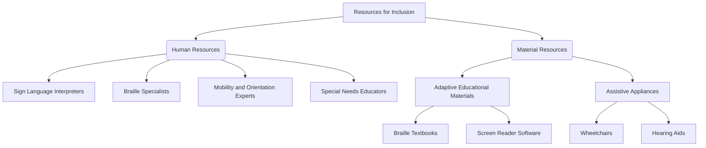
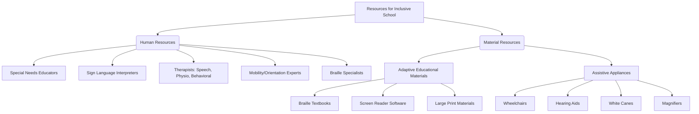

# Definition
Before proceeding, understand that **Resources for Inclusion** are the fundamental tools, personnel, and environmental adaptations essential for creating accessible and supportive environments. It's like building a strong, accessible house: you need the right bricks, tools, and skilled builders to make sure everyone can live comfortably and securely. Without these resources, individuals with disabilities face significant barriers, limiting their participation and potential.

# The Mental Model
Imagine trying to navigate a city if all the street signs were in a language you didn't understand, or if all the ramps were replaced with stairs. You'd feel lost, frustrated, and excluded. Resources for inclusion are like making sure there are signs in multiple languages, and ramps everywhere, so everyone can move freely and participate fully. It's about providing the necessary support so that an individual's impairment doesn't become a barrier to their activity or potential.


```text
// Scenario 1: Breakdown of resources
// Output:
// A[Resources for Inclusion] is the main concept.
// It branches into two main categories: B(Human Resources) and C(Material Resources).
// B(Human Resources) further branches into specific roles like D[Sign Language Interpreters], E[Braille Specialists], F[Mobility and Orientation Experts], and G[Special Needs Educators].
// C(Material Resources) branches into H[Adaptive Educational Materials] and I[Assistive Appliances].
// H[Adaptive Educational Materials] includes J[Braille Textbooks] and K[Screen Reader Software].
// I[Assistive Appliances] includes L[Wheelchairs] and M[Hearing Aids].
```
*Note: This `graph TD` illustrates the primary categories of resources necessary for fostering inclusion and provides examples within each category.*

# Context & Framework
### The Family Tree
Resources for inclusion can be broadly categorized into human and material resources, forming a "family tree" where the overarching concept branches into these two vital categories. Human resources encompass the specialized professionals and support staff who provide direct assistance, while material resources include the adaptive tools, equipment, and accessible environments that facilitate participation. This categorization helps in systematically addressing the diverse needs of individuals with disabilities and ensuring a comprehensive approach to inclusion. Understanding this structure is critical for effective planning and allocation.

# The Mastery Deep Dive
### The Family Tree
The "family tree" of resources for inclusion clearly delineates between the active, interactive support provided by individuals and the tangible, environmental support offered by objects and adaptations. Human resources, such as Special_Needs_Educators or Sign_Language_Interpreters, are dynamically responsive to individual needs, offering tailored instruction, communication facilitation, and therapeutic interventions. In contrast, material resources, ranging from Adaptive_Educational_Materials_And_Devices to Assistive_Appliances, provide the foundational accessibility and tools for independent functioning, often enabling access to information or physical spaces that would otherwise be inaccessible. Both are interdependent; for instance, a Braille specialist (human resource) leverages Braille textbooks (material resource).

### The Cheat Code: How to Remember This
Think of it as the "H-M" rule: "H" for Human, "M" for Material. Human resources are the *people* who help, like a helpful "Human" friend. Material resources are the *things* that help, like a helpful "Material" tool. This simple mnemonic helps categorize the broad spectrum of resources needed to support people with disabilities. The "H-M" distinction is crucial for remembering the two primary pillars of inclusive resource management.

# Constraints & Limitations
### The "Duh!" Moment (Intuitive Proof)
A critical limitation is the perception of "opportunistic cost." While providing resources for people with disabilities may incur initial expenses, neglecting these resources leads to greater long-term societal costs, including reduced productivity, increased dependency, and violations of human rights. Thus, investing in inclusive resources is not merely an expense but a strategic imperative that yields significant social and economic returns by enabling full participation and harnessing the potential of all individuals.

# Significance & Application
Resources for inclusion are fundamental to realizing the principles of equity and human rights. Academically, this understanding informs special education, disability studies, and public policy, highlighting the practical requirements for implementing inclusive legislation. In real-world applications, it guides the design of accessible infrastructure, the development of assistive technologies, and the provision of support services in diverse settings, ultimately fostering environments where people with disabilities can achieve their full potential and contribute meaningfully to society.

# The Worked Example
This concept is best understood by considering a concrete example of a resource breakdown in an inclusive school.


```text
// Scenario 1: Resource mapping for an inclusive school.
// Output:
// A[Resources for Inclusive School] is the main category.
// It branches into B(Human Resources) and C(Material Resources).
// B(Human Resources) details include B1[Special Needs Educators], B2[Sign Language Interpreters], B3[Therapists: Speech, Physio, Behavioral], B4[Mobility/Orientation Experts], and B5[Braille Specialists].
// C(Material Resources) details include C1[Adaptive Educational Materials] and C2[Assistive Appliances].
// C1[Adaptive Educational Materials] further breaks down into C1a[Braille Textbooks], C1b[Screen Reader Software], and C1c[Large Print Materials].
// C2[Assistive Appliances] further breaks down into C2a[Wheelchairs], C2b[Hearing Aids], C2c[White Canes], and C2d[Magnifiers].
```
*Note: This `graph TD` illustrates a comprehensive breakdown of human and material resources within an inclusive school setting. It visually represents the various types of support needed to ensure accessibility and tailored education.*

# The Proving Ground
*Test your mastery. Cover the solutions below to test yourself first.*

### Level 1: The Sanity Check (Verification)
**The Neighbor Check:** List the two primary categories into which resources for inclusion are typically divided.
> **Solution:** The two primary categories are Human Resources and Material Resources.

### Level 2: The Crucible (Mastery & Edge Cases)
**The Impostor:** A school administrator argues, "Investing in expensive assistive technology for only a few students is an 'opportunistic cost' we cannot afford when the budget is tight." Using the reasoning discussed in this note, explain why this perspective is flawed and how it overlooks the true value proposition of inclusive resource provision.
> **Solution:** The administrator's perspective is a 'false friend' because it views inclusive resources purely as an expense rather than a fundamental investment. While there's an initial cost, neglecting these resources leads to greater long-term societal costs, including reduced productivity, increased dependency, and violations of human rights. Investing in inclusive resources yields significant social and economic returns by enabling full participation and harnessing the potential of all individuals, thereby transforming a perceived "opportunistic cost" into a strategic imperative that benefits society as a whole. This aligns with the understanding that the occurrence of impairment requires mitigating the impact of activity limitation, enabling individuals to use their potential and capacity.

# Key Takeaways
*   Resources for inclusion, encompassing both human and material elements, are crucial for creating accessible and supportive environments that mitigate the impact of activity limitations caused by impairments.
*   The provision of these resources should be considered an essential investment, not an "opportunistic cost," enabling individuals with disabilities to participate fully and utilize their potential.
*   Effective resource management for inclusion requires a systematic approach, understanding the distinct roles of specialized personnel and adaptive tools in fostering equitable participation across all settings.

# Knowledge Graph Connections
| Concept                                       | Connection / Relationship                                                                 |
| :
-------------------------------------------- | :
---------------------------------------------------------------------------------------- |
| [[Human_Resources_for_Inclusive_Education]]   | Human resources are a primary category of resources for inclusion.                       |
| [[Material_Resources_for_Inclusive_Education]]| Material resources are a primary category of resources for inclusion.                    |
| [[Planning_for_Inclusive_Services]]           | Effective planning is essential for the strategic allocation of resources for inclusion. |
---