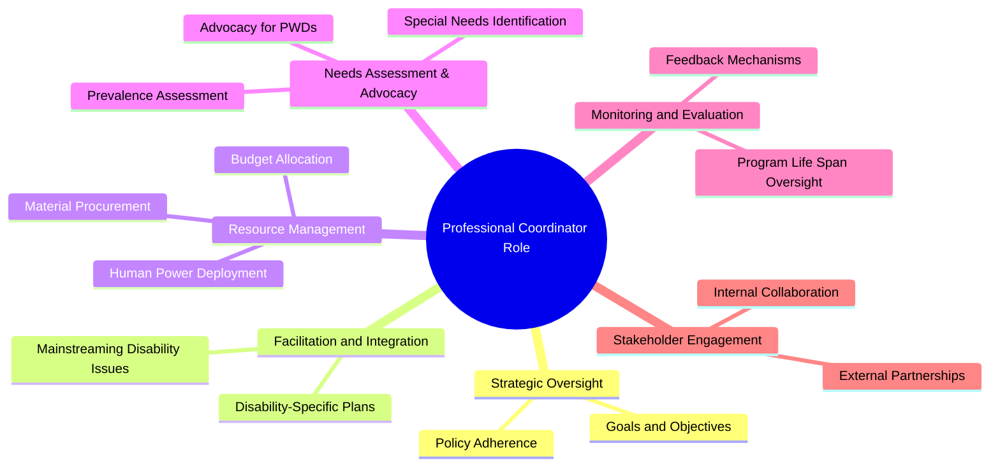

# Definition
Before proceeding, understand that this role is central to effective [[Planning_for_Inclusive_Services]]. The **Role of Professional Coordinators in Inclusive Planning** refers to the essential function of designated individuals responsible for overseeing, facilitating, and integrating disability issues across all stages of an institution's programs and services to ensure comprehensive inclusion. It's like having a project manager for accessibility: they ensure all parts of a complex project (from design to implementation) are aligned with inclusive goals, troubleshoot issues, and ensure everyone involved understands their role in creating an accessible outcome.

# The Mental Model
Imagine an orchestra with many talented musicians, but no conductor. Each musician might play beautifully, but without coordination, the performance would be chaotic. A professional coordinator in inclusive planning is like that conductor: they don't play every instrument, but they ensure all the different "sections" (departments, resource providers, planners) are in harmony, playing their part to create a cohesive and inclusive "symphony" of services for people with disabilities. They keep everyone on tempo and ensure the overall vision is realized.


```text
// Scenario 1: Key responsibilities of a Professional Coordinator.
// Output:
// The mindmap centers around "Professional Coordinator Role".
// Key branches include:
// - Strategic Oversight (Goals and Objectives, Policy Adherence)
// - Facilitation and Integration (Mainstreaming Disability Issues, Disability-Specific Plans)
// - Resource Management (Budget Allocation, Material Procurement, Human Power Deployment)
// - Needs Assessment & Advocacy (Prevalence Assessment, Special Needs Identification, Advocacy for PWDs)
// - Monitoring and Evaluation (Program Life Span Oversight, Feedback Mechanisms)
// - Stakeholder Engagement (Internal Collaboration, External Partnerships)
```
*Note: This `mindmap` visually outlines the multifaceted responsibilities and areas of influence of a professional coordinator in the context of inclusive planning.*

# Context & Framework
### Where Does it Live? (The Map)
The professional coordinator lives at the intersection of policy, planning, and implementation within an institution's organizational structure. Their role is not confined to a single department but spans across all relevant areas, acting as a central nexus for disability-related initiatives. They map the pathways for inclusive practices, connecting different stakeholders and ensuring a holistic approach to service delivery. This central positioning allows them to influence decisions and resource allocation at strategic and operational levels.

# The Mastery Deep Dive
### Where Does it Live? (The Map)
The professional coordinator in inclusive planning occupies a central, cross-functional position within an institution, bridging the gap between high-level policy and on-the-ground implementation. Their role is multifaceted, encompassing:
1.  **Strategic Oversight:** Ensuring that the issue of disability is rigorously **mainstreamed** into the general annual action plan and that **disability-specific action plans** are developed where necessary. This requires a deep understanding of the institution's mission and how disability inclusion aligns with it.
2.  **Resource Orchestration:** Facilitating the **allocation of ear-marked budgets**, procurement of appropriate [[Material_Resources_for_Inclusive_Education]], and deployment of skilled [[Human_Resources_for_Inclusive_Education]]. They act as a critical link in ensuring that the necessary tools and personnel are available.
3.  **Needs Assessment & Advocacy:** Overseeing the **assessment of the prevalence of PWDs and their special needs**, which is the prerequisite for all planning. They advocate for the needs of individuals with disabilities, ensuring their voices are heard and incorporated into planning.
4.  **Monitoring & Evaluation:** Ensuring that disability issues are considered at all stages of program lifecycle – planning, implementation, monitoring, and evaluation – thereby fostering continuous improvement and accountability. Their strategic position makes them indispensable for **ensuring adherence to all specified standards**.

### Who are the Neighbors?
The professional coordinator's closest "neighbors" include senior management (for policy endorsement and resource allocation), program managers (for integrating inclusive practices into specific projects), special education departments or HR (for identifying and deploying human resources), and finance/procurement departments (for managing budgets and acquiring material resources). Critically, they also interact directly with organizations representing persons with disabilities to ensure user-centered planning. These interconnected relationships are vital for the coordinator to effectively advocate, plan, and implement inclusive services.

# Constraints & Limitations
### The "Duh!" Moment (Intuitive Proof)
A fundamental limitation is the expectation that general staff, without specialized training or a designated role, can effectively champion and coordinate complex inclusive planning. It's intuitively clear that an issue as nuanced and multi-faceted as disability inclusion requires dedicated expertise and a specific mandate. Without a professional coordinator, efforts risk being fragmented, inconsistent, or overlooked, ultimately failing to achieve meaningful inclusion. This proves why all service-providing institutions are required to assign a professional coordinator.

# Significance & Application
The professional coordinator is the linchpin of an institution's commitment to inclusion. Academically, this role highlights the importance of leadership, advocacy, and interdisciplinary collaboration in disability studies and public policy implementation. In practice, they translate abstract inclusive policies into concrete actions, ensuring that all aspects of an institution's operations—from infrastructure to curriculum to human resources—are systematically adapted to serve persons with disabilities. Their presence ensures accountability, efficiency, and fidelity to inclusive principles, guaranteeing that the institution effectively meets its mandate for accessibility and equity.

# The Worked Example
Consider the steps a professional coordinator might take in an educational institution to ensure inclusive planning for a new academic year.

1.  **Assess Needs:** The coordinator initiates an assessment of the student body to identify the prevalence of PWDs and their specific academic and accessibility needs.
2.  **Develop Plan:** Based on the assessment, they work with department heads to draft both `Mainstreaming_vs_Disability_Specific_Action_Plans`. For example, ensuring all new online course materials meet accessibility standards (mainstreaming) and planning for the provision of Sign_Language_Interpreters for specific deaf students (disability-specific).
3.  **Allocate Resources:** They collaborate with the budget office to ensure an ear-marked budget is allocated for Adaptive_Educational_Materials_And_Devices and [[Human_Resources_for_Inclusive_Education]] like Braille_Specialists.
4.  **Monitor Progress:** Throughout the year, they track the implementation of inclusive programs, gathering feedback from students and staff to make necessary adjustments. For example, they might review feedback on [[Resource_Rooms_and_Pull_Out_Programs]] to ensure their effectiveness.
5.  **Report:** They prepare reports for senior management on the institution's progress toward inclusive goals and identify areas for future improvement.

*Note: This example illustrates the practical application of a professional coordinator's role, integrating various aspects of inclusive planning and resource management.*

# The Proving Ground
*Test your mastery. Cover the solutions below to test yourself first.*

### Level 1: The Sanity Check (Verification)
**The Neighbor Check:** Why are all service-providing institutions required to assign a professional coordinator for inclusive planning?
> **Solution:** To oversee, facilitate, and integrate disability issues across all stages of the institution's programs and services, ensuring comprehensive inclusion.

### Level 2: Competence (Application)
**The Sort:** Identify two key areas of responsibility that a professional coordinator would likely manage in the planning and implementation of disability-mainstreamed programs.
> **Solution:** Overseeing the assessment of needs and special needs of PWDs, and facilitating the allocation of earmarked budgets and appropriate resources (e.g., materials, skilled human power). (Other valid answers include ensuring mainstreaming/disability-specific plans, monitoring program lifecycle, engaging stakeholders).

### Level 3: Mastery (The Crucible)
**The Impostor:** A newly formed public service organization decides against hiring a dedicated professional coordinator for inclusive services, reasoning that "all staff will be trained in general disability awareness, making a specialized role redundant." Explain why this reasoning is a 'false friend' and detail how, without a coordinator, the organization is highly susceptible to the "Disaster Drill" scenario of fragmented and ineffective inclusive planning.
> **Solution:** This reasoning is a 'false friend' because while general disability awareness training is beneficial, it does not replace the specialized, strategic, and facilitative expertise of a professional coordinator. Without a coordinator, the organization is highly susceptible to the "Disaster Drill" scenario of fragmented and ineffective inclusive planning because:
    1.  **Lack of Centralized Oversight:** There will be no single individual to systematically ensure that disability issues are truly **mainstreamed** across all departments or that crucial **disability-specific action plans** are developed and implemented consistently.
    2.  **Ineffective Resource Allocation:** Without a dedicated coordinator to advocate for and manage **ear-marked budgets** and specialized [[Resources_for_Inclusion]] (both human and material), these resources are likely to be insufficient, misallocated, or overlooked entirely.
    3.  **Absence of Needs Assessment:** The critical prerequisite of assessing the **prevalence of PWDs and their special needs** will likely be skipped or poorly executed, leading to services that do not meet actual requirements.
    4.  **No Continuous Monitoring:** The crucial monitoring and evaluation of inclusive initiatives across the program lifecycle will be ad-hoc or absent, preventing systematic improvement and accountability.
In essence, without a professional coordinator, the responsibility is diffused, leading to a "tragedy of the commons" where crucial inclusive planning tasks fall through the cracks, resulting in superficial or failed inclusive efforts despite good intentions.

# Key Takeaways
*   Professional coordinators are essential for overseeing, facilitating, and integrating disability issues into an institution's planning, implementation, monitoring, and evaluation stages.
*   Their multifaceted role includes strategic oversight, resource orchestration, needs assessment and advocacy, and continuous monitoring, ensuring comprehensive adherence to inclusive principles.
*   The absence of a dedicated professional coordinator significantly compromises the effectiveness of inclusive planning, often leading to fragmented efforts and a failure to meet the specific needs of persons with disabilities.

# Knowledge Graph Connections
| Concept                                       | Connection / Relationship                                                                   |
| :
-------------------------------------------- | :
------------------------------------------------------------------------------------------ |
| [[Planning_for_Inclusive_Services]]           | Professional coordinators are explicitly required to oversee and facilitate inclusive planning. |
| [[Mainstreaming_vs_Disability_Specific_Action_Plans]] | The coordinator's role involves ensuring the effective implementation of both mainstreaming and disability-specific action plans. |
| [[Resources_for_Inclusion]]                   | Coordinators are critical in the strategic allocation and management of resources for inclusion. |
---