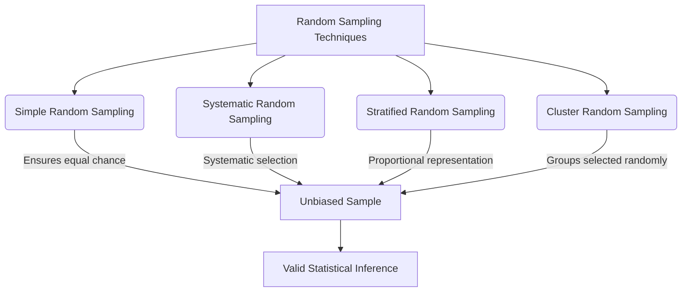

# Definition
Before proceeding, ensure you master [[Sampling_Techniques]] and Statistical_Inference.
**Random sampling techniques**, also known as probability sampling, are methods where every element (individual, item, etc.) in a population has a known, non-zero, and often equal chance of being selected for a [[Sample_and_Sampling_Error]]. This is crucial because it ensures the sample is unbiased and statistically representative of the entire population, allowing for the calculation of Sampling_Error and the valid generalization of findings from the sample to the population. These techniques are the cornerstone of robust statistical research, including methods like [[Simple_Random_Sampling]], [[Systematic_Random_Sampling]], [[Stratified_Random_Sampling]], and [[Cluster_Random_Sampling]]. Without random sampling, it would be difficult to make objective, data-driven decisions.

# The Mental Model
Imagine you want to pick a truly fair lottery winner from 1,000 tickets. "Random sampling techniques" are the methods that guarantee every single ticket has an exactly equal chance of being chosen (e.g., drawing from a well-mixed drum). If you just picked the top ticket, it wouldn't be fair. The goal is to avoid any personal influence or bias in the selection, so the winner is truly random.

*Note: This `graph TD` illustrates the four main types of random sampling techniques, showing how each contributes to creating an unbiased sample, which then allows for valid statistical inference.*

# Context & Framework
### The Engine of Generalizability
Within the broader framework of [[Sampling_Techniques]], random sampling techniques serve as the "engine of generalizability." They provide the statistical foundation for drawing conclusions about a large population based on observations from a smaller, carefully selected subset. For instance, a pharmaceutical company conducting a clinical trial must use random sampling to select patients for treatment groups from the target patient population. This ensures that any observed effects of the drug can be attributed to the treatment rather than to biases in patient selection, allowing for the reliable generalization of the drug's efficacy to the wider patient community. The rigorous application of these techniques is paramount for scientific validity and ethical research.

# The Mastery Deep Dive
### The Family Tree
**Random Sampling Techniques** form the most scientifically robust branch of sampling, ensuring that every element of the population has a calculable probability of being included. This family includes:
*   **Simple Random Sampling:** Every possible sample of a given size has an equal chance of being selected. It's like drawing names from a hat.
*   **Systematic Random Sampling:** Involves selecting elements from a list at a fixed, periodic interval, after a random start. For example, picking every 10th person.
*   **Stratified Random Sampling:** The population is divided into distinct subgroups (strata) based on shared characteristics, and then a random sample is taken from each stratum. This ensures representation of key subgroups.
*   **Cluster Random Sampling:** The population is divided into clusters, and then entire clusters are randomly selected. All individuals within the selected clusters are then surveyed. This is efficient for geographically dispersed populations.

Each technique offers different advantages depending on the nature of the population and the research objectives, but all share the common goal of unbiased, probability-based selection.

### The Translator: Hacker Slang to Exam Terms
When a data scientist says they "picked data without favoring anyone," the exam term is **unbiased sampling**. If they ensure "every piece of data could possibly be picked," that's the core principle of **random selection**. And when they say "we know how likely it was for any data point to show up," they're referring to the **known probability of selection** inherent in random sampling. The informal "making sure it's not biased" directly translates to the statistical goal of **minimizing sampling error** through probability-based methods. These precise academic terms enable clear communication of the rigor and validity of data collection processes.

# Constraints & Limitations
### The Engineering Trade-off
While offering superior statistical validity, random sampling techniques come with inherent "engineering trade-offs." They often require a **complete and accurate sampling frame** (a list of every element in the population), which can be costly, time-consuming, or impossible to obtain for very large or dynamic populations. The logistical effort involved in ensuring true randomness can also be substantial. For example, conducting [[Simple_Random_Sampling]] across a diverse, geographically dispersed population can be very expensive. Furthermore, if the randomly selected individuals are **unwilling or unable to participate** (leading to Non_Response_Error), the achieved sample may lose its random characteristics and become biased. These practical challenges mean that while random sampling is ideal in theory, its perfect implementation can be difficult and costly in real-world scenarios, sometimes pushing researchers towards [[Non_Random_Sampling_Techniques]] despite their statistical limitations.

# Significance & Application
Random sampling techniques are paramount in enabling **inferential statistics**, allowing researchers to make reliable generalizations about populations from sample data. Academically, they are a cornerstone of Quantitative_Research_Methods and Epidemiology. In real-world applications, they are extensively used in:
*   **Public Health:** To estimate disease prevalence or assess the effectiveness of health interventions across a population.
*   **Social Sciences:** To study societal trends, attitudes, and behaviors with statistical validity.
*   **Market Analysis:** To gauge consumer demand and preferences in a way that is generalizable to the entire target market.
*   **Government Statistics:** To collect reliable economic and demographic data for national planning and policy formulation.
The absence of random sampling often undermines the scientific credibility and practical utility of research findings.

# The Worked Example
*Test your mastery. Cover the solutions below to test yourself first.*

## The Pilot's Checklist (Do Not Skip)
A large online retailer with 1,000,000 active customers wants to understand their average monthly spending habits.

1.  **Define the Population:** Clearly state the entire group of interest.
    *   *Example:* "All 1,000,000 active customers of the online retailer."
2.  **State the Goal of Random Sampling:** Why is random selection important here?
    *   *Example:* "Random sampling is important to ensure that the selected sample of customers is representative of all active customers, allowing the retailer to accurately estimate the average monthly spending for the entire customer base without bias."
3.  **Propose a Simple Random Sampling approach:** How would this be implemented?
    *   *Example:* "Assign each customer a unique ID number, then use a random number generator to select 5,000 customer IDs for the survey."
4.  **Propose a Stratified Random Sampling approach (if relevant):** If the retailer suspects spending habits differ by customer loyalty tiers (e.g., Bronze, Silver, Gold), how would this be applied?
    *   *Example:* "Divide the 1,000,000 customers into strata based on their loyalty tier. Then, from each tier, randomly select a proportional number of customers for the sample (e.g., if 60% are Bronze, 60% of the sample comes from Bronze customers)."
5.  **Explain the Benefit:** What does random sampling allow that non-random sampling would not?
    *   *Example:* "Random sampling allows the retailer to calculate a margin of error for their average spending estimate, providing a quantifiable level of confidence in generalizing the findings to all 1,000,000 customers. This statistical inference is not possible with non-random methods."

# The Proving Ground
*Test your mastery. Cover the solutions below to test yourself first.*

### Level 1: The Sanity Check (Verification)
**The Question:** What is the defining characteristic of "random sampling techniques," and why is this important?
> **Solution:** The defining characteristic of random sampling techniques is that every element in the population has a known, non-zero, and often equal chance of being selected for the sample. This is important because it ensures the sample is unbiased and statistically representative, allowing for valid generalization of findings to the population and the calculation of sampling error.

### Level 2: The Crucible (Mastery & Edge Cases)
**The Scenario:** A university library wants to assess student satisfaction with its digital resources. They decide to use a random sampling technique. They have a complete list of all 20,000 enrolled students.
**The Challenge:**
(a) If they chose [[Simple_Random_Sampling]], what is a potential practical disadvantage compared to [[Systematic_Random_Sampling]] for a very large student body?
(b) If they instead used [[Stratified_Random_Sampling]] based on academic faculty (e.g., Arts, Science, Engineering), what specific benefit would this provide that simple random sampling might miss?
(c) The university's IT system experiences a glitch, and only students who logged into the digital library in the *last hour* are randomly selected. How does this immediate error compromise the "random" nature of the sample, even if the selection within that group was random?
> **Solution:**
(a) For a very large student body, a potential practical disadvantage of [[Simple_Random_Sampling]] is the need to generate and map individual random numbers to 20,000 students, which can be cumbersome and slightly less efficient to execute compared to the streamlined, interval-based selection of [[Systematic_Random_Sampling]].
(b) If they used [[Stratified_Random_Sampling]] based on academic faculty, the specific benefit would be ensuring **proportional representation** of students from each faculty. This is important because satisfaction with digital resources might vary significantly between Arts students (who might use humanities databases) and Engineering students (who might use engineering journals). Simple random sampling might, by chance, over- or under-represent certain faculties, leading to a less accurate overall picture of satisfaction across diverse academic needs.
(c) The error compromises the "random" nature of the sample because the initial selection of the sampling frame is biased. Even if students *within* the "logged in the last hour" group are randomly selected, this group is not representative of *all* 20,000 enrolled students. Students who haven't logged in recently (e.g., those who don't use digital resources, or those with technical issues) are systematically excluded, introducing a Sample_Frame_Error and a strong **Selection Bias**. The sample is no longer random with respect to the entire student population, only with respect to a biased subset of recent users.

# Key Takeaways
*   Random sampling ensures unbiased and representative samples, crucial for valid statistical inference.
*   Key types include simple, systematic, stratified, and cluster random sampling.
*   These techniques allow for the calculation of sampling error and robust generalizations to the population.

# Knowledge Graph Connections
| Concept                            | Connection / Relationship                                                                 |
| :
---------------------------------- | :
---------------------------------------------------------------------------------------- |
| [[Sampling_Techniques]]             | This is a major category of sampling techniques, emphasizing probability-based selection. |
| Statistical_Inference           | Random sampling forms the basis for making valid inferences about populations.            |
| [[Simple_Random_Sampling]]          | This is one of the foundational methods within random sampling.                           |
| [[Systematic_Random_Sampling]]      | This is a specific method, offering a structured approach to random selection.            |
| [[Stratified_Random_Sampling]]      | This method enhances representativeness by sampling proportionally from subgroups.        |
| [[Cluster_Random_Sampling]]         | This technique is efficient for geographically dispersed populations by sampling groups.  |
---