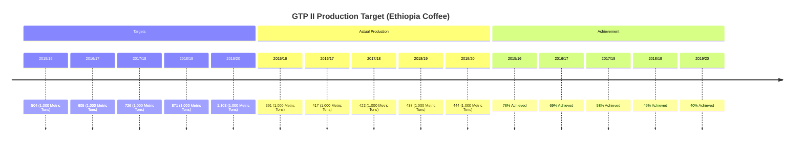

# Definition
Before proceeding, ensure you master [[Classification_and_Presentation_of_Statistical_Data]] and Data_Collection.
Chronological Classification is the process of arranging collected statistical data based on their time of occurrence. This type of classification is used when data changes or evolves over a period, creating a time series. It's like organizing your daily schedule, where each event is placed in order from earliest to latest (or vice versa) to show a sequence of activities over time.

# The Mental Model
Imagine you're tracking your personal fitness goals: daily step counts, weekly workout hours, or monthly weight changes. You don't just list these numbers randomly; you record them by date. This ordered sequence allows you to see trends: "Did my steps increase over the last month?" or "Is my weight going down over time?" The chronological classification is the method by which you organize this data, making it easy to spot progress, plateaus, or declines over specific periods.

*Note: This `timeline` diagram visually represents the chronological classification of coffee production targets, actual production, and achievement percentages over different years, highlighting trends and progress.*

# Context & Framework
### Where Does it Live? (The Map)
Chronological classification, akin to placing events on a linear map, focuses on the temporal dimension of data. It is inherently suitable for phenomena that are observed or measured at different points in time, such as population changes, economic indicators (e.g., inflation, GDP), sales figures, or climate data. The series obtained from this classification is known as a [[Time_Series]], which can be arranged in ascending order (earliest to latest) or descending order (latest to earliest). This framework provides a critical perspective for identifying trends, seasonality, cyclical patterns, and irregular fluctuations in data, which are essential for forecasting and historical analysis.

# The Mastery Deep Dive
### Who are the Neighbors? (Contextual Relationships)
In chronological classification, the "neighbors" are the data points immediately preceding and succeeding a given observation. Understanding these relationships is crucial because the value of a variable at one point in time is often influenced by its past values. For instance, classifying monthly sales data chronologically allows us to see how January's sales relate to December's, or how a quarter's performance compares to the previous one. This temporal proximity helps in identifying growth, decline, or stability, and can reveal the impact of events that occurred at specific times. Analyzing these relationships is key to understanding dynamics and making predictions about future trends.

### The Historical Blueprint: Detailed Time Intervals
A deeper dive into chronological classification involves carefully selecting and defining time intervals. This could range from macro-level classifications like decades or centuries, to micro-level classifications such as years, quarters, months, weeks, days, or even hours. The choice of interval depends on the phenomenon being studied; for instance, stock market data might require daily or hourly classification, while demographic shifts might be analyzed annually or biennially. This "historical blueprint" enables fine-grained analysis of temporal patterns, allowing for the detection of subtle shifts, short-term trends, and the precise timing of significant events that influence the data.

# Constraints & Limitations
### The Engineering Trade-off: Data Gaps
A significant challenge in chronological classification is dealing with "data gaps" or missing observations for certain time periods. If data is not consistently collected at regular intervals, it can distort trends, make accurate comparisons difficult, and introduce biases into any analysis. Interpolating missing data can introduce inaccuracies, while simply omitting incomplete periods can lead to a skewed view of the overall trend. This requires careful management and transparency regarding the completeness of the time series data. Furthermore, for very long time series, consistency in data collection methods over time can also become a limiting factor.

# Significance & Application
Chronological classification is fundamental for understanding dynamics and forecasting. In **finance**, it's used to analyze stock market performance, economic indicators, and investment returns over time. **Businesses** track sales, customer growth, and operational costs chronologically to identify trends and plan for the future. **Climate scientists** use time-series data to study long-term environmental changes. For **public health**, the chronological classification of disease incidence helps in monitoring outbreaks and evaluating intervention effectiveness. This method provides the critical temporal context necessary for virtually any data that evolves over time.

# The Worked Example
*Test your mastery. Cover the solutions below to test yourself first.*

Consider a simplified dataset of the average monthly temperature (in °C) for a city over six months:

*   January: 5°C
*   February: 7°C
*   March: 10°C
*   April: 14°C
*   May: 18°C
*   June: 22°C

**Goal:** Apply chronological classification to this data and present it clearly.

**Step 1: Classification**
The data is already inherently classified by its time of occurrence (month). The task is to organize and present these temporal groups.

**Step 2: Tabulation**
We can arrange this data into a simple table, listing each month in sequence and its corresponding average temperature.

| Month   | Average Temperature (°C) |
| :
------ | :
----------------------- |
| January | 5                        |
| February | 7                        |
| March   | 10                       |
| April   | 14                       |
| May     | 18                       |
| June    | 22                       |

**Step 3: Presentation (Mental Model of a Line Graph)**
Mentally, you would visualize a line graph where the x-axis represents the 'Month' (January to June) and the y-axis represents the 'Average Temperature'. A line would connect the temperature points for each month. This visual immediately reveals an upward trend in temperature over these months, indicating a seasonal change.

**Why this works:**
*   **Classification:** Grouped data by a chronological characteristic (month).
*   **Presentation:** The table and conceptual line graph clearly show the progression and trend of temperature over time, making temporal patterns easy to discern.

# The Proving Ground
*Test your mastery. Cover the solutions below to test yourself first.*

### Level 1: The Sanity Check (Verification)
**The Element ID:** A historian compiles a list of major world events, ordered from the earliest to the most recent. Is this an example of chronological classification?
> **Solution:** Yes, this is an example of chronological classification because the events are arranged based on their time of occurrence.

### Level 2: The Crucible (Mastery & Edge Cases)
**The Disaster Drill:** A researcher is analyzing the annual rainfall data for a specific region over 50 years. Due to record-keeping issues, data for five non-consecutive years is completely missing. If the researcher proceeds with a chronological classification that simply omits these missing years without acknowledgment, explain how this could lead to a "disaster drill" in interpreting long-term climate trends. What immediate recovery step should be taken?
> **Solution:** Omitting missing years without acknowledgment in a chronological classification creates a "disaster drill" by distorting the perceived continuity and rate of change in rainfall. Trends might appear steeper or flatter than they truly are, and significant climatic events could be misrepresented or missed entirely due to the artificial compression of the timeline. The immediate recovery step is to explicitly identify and flag the missing data points (e.g., using placeholders or footnotes) and, if possible, attempt to find alternative sources or use imputation techniques, while clearly stating the limitations of such methods. Transparency about data gaps is crucial for preventing misinterpretation.

# Key Takeaways
*   Chronological classification organizes data based on the time of its occurrence, creating a time series.
*   It is essential for analyzing trends, seasonality, and changes in phenomena over time.
*   Careful attention must be paid to data completeness and consistent time intervals to avoid misrepresentation.

# Knowledge Graph Connections
| Concept                                      | Connection / Relationship                                                          |
| :
------------------------------------------- | :
--------------------------------------------------------------------------------- |
| [[Classification_and_Presentation_of_Statistical_Data]] | A fundamental type of classification for organizing raw data.                       |
| [[Time_Series]]                              | The resulting ordered sequence of data when applying chronological classification.  |
| [[Line_Graph]]                               | The most common graphical representation for data classified chronologically.     |
| [[Other_Graphical_Representations_of_Statistical_Data]] | Forms the basis for various time-based charts and graphs.                           |
---