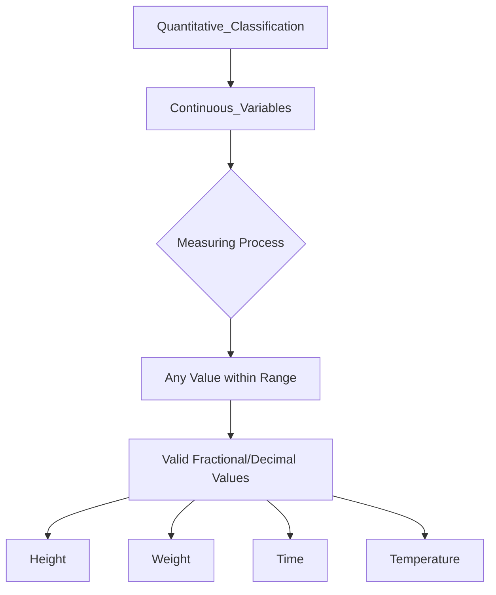

# Definition
Before proceeding, ensure you master [[Quantitative_Classification]] and Data_Collection.
Continuous Variables are a type of numerical data that can assume any numeric value within a given range and can be meaningfully split into smaller parts. They possess valid fractional and decimal values, and theoretically, there's an infinite number of potential values between any two points. These variables are generally obtained by measuring using a scale. Think of it like measuring your height; you can be 1.75 meters, or 1.753 meters, or even more precisely, as long as your measuring tool allows.

# The Mental Model
Imagine you're baking a cake and need to measure flour. You don't just count cups; you measure precisely. You could have 2 cups, 2.5 cups, 2.37 cups, or even 2.375 cups. The amount of flour can take on any value within a range, limited only by the precision of your scale. This "measuring" nature is the core mental model for continuous variables: they can be infinitely subdivided into smaller and smaller fractional or decimal values.

*Note: This `graph TD` illustrates the relationship of continuous variables to quantitative classification, emphasizing their derivation from measuring and the resulting ability to assume any value, including fractional and decimal, within a range.*

# Context & Framework
### The Family Tree
Continuous variables are a fundamental branch within the "family tree" of [[Quantitative_Classification]]. They represent measurable phenomena, contrasting directly with discrete variables which are countable. This distinction is crucial for selecting appropriate statistical methods and visualizations. For example, height, weight, length, time, temperature, or salary are all continuous. Understanding this categorization allows for proper data handling, such as using specific probability distributions designed for continuous data (e.g., Normal distribution).

# The Mastery Deep Dive
### The Exploded View: Infinite Precision
A deeper look into continuous variables emphasizes their theoretical "infinite precision." Between any two distinct values (e.g., 20 and 21 degrees Celsius), there exists an infinite number of possible intermediate values (e.g., 20.1, 20.01, 20.001, and so on). This "exploded view" highlights that continuous variables are not limited by integer steps but can take on any value along a continuum, restricted only by the limitations of the measuring instrument. This characteristic profoundly impacts how continuous data is recorded, analyzed, and often grouped into class intervals for frequency distributions, as individual values are rarely repeated exactly.

### Spot the Impostor (Don't be Fooled)
A common trap is to treat discrete data as continuous, or vice versa, especially when the scale or measurement seems to blur the lines. For example, "shoe size" might appear discrete (e.g., size 9, 9.5, 10), but if it's derived from foot length measurements, the *underlying* variable (foot length) is continuous. The "impostor" is the categorized or rounded value, which looks discrete, but the original phenomenon it represents is continuous. Always ask: can the underlying characteristic theoretically be measured with increasing precision to include infinitely many decimal places? If yes, it's continuous. Don't be fooled by how the data is presented or rounded.

# Constraints & Limitations
### The Engineering Trade-off: Measurement Error
A key limitation of continuous variables arises from the inherent "measurement error." While theoretically capable of infinite precision, in practice, measurements are always limited by the accuracy of the instruments used. This means that observed continuous data is always an approximation, not the true value. This "engineering trade-off" implies that while continuous variables offer rich detail, their accuracy is constrained by real-world tools, and analyses must account for the potential impact of measurement error on the data's integrity.

# Significance & Application
Continuous variables are vital in science, engineering, and everyday life. In **physics**, they describe quantities like speed, force, and energy. In **healthcare**, they measure blood pressure, temperature, and cholesterol levels. **Engineers** use them for dimensions, tolerances, and material properties. **Economists** analyze continuous variables such as GDP, interest rates, and commodity prices. These variables allow for sophisticated mathematical modeling and calculus-based analysis, providing deep insights into phenomena that exist on a spectrum rather than as distinct counts.

# The Worked Example
*Test your mastery. Cover the solutions below to test yourself first.*

Consider measuring the exact height of students in a class using a very precise measuring tape.

**Goal:** Determine if "student height" is a continuous variable and explain why.

**Step 1: Analyze the Nature of the Values**
Student height can be, for example, 1.70 meters, 1.705 meters, 1.7053 meters, and so on, depending on the precision of the measurement.

**Step 2: Check for Subdivisibility**
Between any two heights, say 1.70m and 1.71m, there are an infinite number of possible heights (e.g., 1.701m, 1.705m, 1.709m). The values can be meaningfully subdivided.

**Conclusion:**
Yes, "student height" is a [[Continuous_Variables]]. This is because it can assume any numeric value within a range, including fractional and decimal values, and is obtained by measurement, not counting.

# The Proving Ground
*Test your mastery. Cover the Cover the solutions below to test yourself first.*

### Level 1: The Sanity Check (Verification)
**The Variable ID:** Is the exact time it takes a runner to complete a marathon (e.g., 3 hours, 24 minutes, 15.7 seconds) a continuous variable?
> **Solution:** Yes, the time taken is a continuous variable because it can be measured with increasing precision, including fractional seconds.

### Level 2: The Crucible (Mastery & Edge Cases)
**The Impossible Case:** A chef is weighing ingredients for a recipe and notes down the weight of flour as exactly "250 grams." Another chef, using a more precise scale, measures the same flour as "250.003 grams." The first chef argues their measurement is discrete since it's a whole number. Explain why flour weight is fundamentally a continuous variable, and describe the "impossible case" that illustrates its continuous nature, even if a measurement appears discrete.
> **Solution:** The first chef is confused by the apparent discrete nature of their rounded measurement. Flour weight is fundamentally a [[Continuous_Variables]] because its true value can theoretically be measured with infinite precision (e.g., 250.003 grams, or 250.00345 grams, etc.). The "impossible case" that illustrates its continuous nature is that, between any two seemingly precise whole-number weights (like 250g and 251g), there exists an infinite number of possible fractional weights. The "250 grams" reading is simply a rounded or truncated representation of an underlying continuous measurement, limited by the scale's precision, not because the quantity itself is inherently discrete.

# Key Takeaways
*   Continuous variables can assume any numeric value within a range, including fractional and decimal values.
*   They are obtained by measurement and can be theoretically subdivided infinitely.
*   Their infinite precision is limited only by the accuracy of the measuring instruments.

# Knowledge Graph Connections
| Concept                         | Connection / Relationship                                                          |
| :
------------------------------ | :
--------------------------------------------------------------------------------- |
| [[Quantitative_Classification]] | Continuous variables are a fundamental sub-category of quantitative classification. |
| [[Discrete_Variables]]          | Directly contrasted with continuous variables based on divisibility of values.       |
| [[Grouped_Frequency_Distributions_GFD]] | Often requires grouping continuous variable values into class intervals for analysis. |
| [[Histogram]]                   | A common graphical representation for visualizing the distribution of continuous variables. |
---