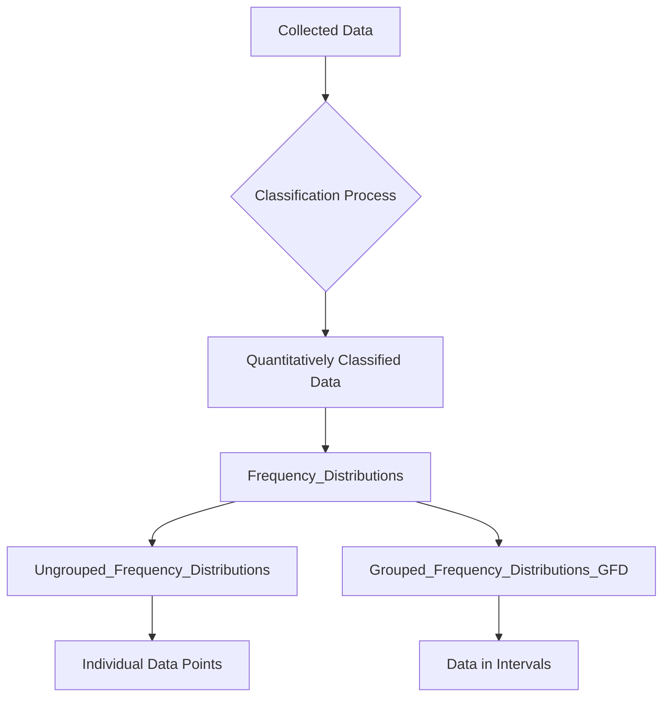

# Definition
Before proceeding, ensure you master [[Classification_and_Presentation_of_Statistical_Data]] and [[Quantitative_Classification]].
Frequency Distributions are tabular representations of quantitatively classified data, showing the number of times each distinct value (or range of values) of a variable occurs in a dataset. They systematically arrange data to show how frequently each score or item appears. Think of it like a voter count: a frequency distribution would show how many votes each candidate received, or how many people voted in each age bracket.

# The Mental Model
Imagine you've given a quiz to a class, and you have a long list of scores (e.g., 7, 8, 5, 7, 9, 6...). To make sense of this raw data, you create a frequency distribution. You list each possible score (e.g., 5, 6, 7, 8, 9, 10) and then count how many students received each score. This immediately tells you, "Ah, 5 students got a 7, and only 1 student got a 10." This mental organization reveals patterns in performance that were hidden in the raw list.

*Note: This `graph TD` illustrates the process from collected data through classification to the two main types of frequency distributions: ungrouped for individual points and grouped for intervals.*

# Context & Framework
### The Family Tree
Frequency distributions form a crucial branch within the "family tree" of data Presentation_Of_Statistical_Data, specifically for quantitatively classified data. They serve as the foundational step before creating many graphical representations like histograms or frequency polygons. There are two main types: [[Ungrouped_Frequency_Distributions]] for individual data points and [[Grouped_Frequency_Distributions_(GFD)]] for data organized into intervals. This framework provides a clear, concise summary of data, revealing the shape, spread, and central tendency of a dataset at a glance, and is essential for both descriptive and inferential statistics.

# The Mastery Deep Dive
### The Exploded View: Components of a Distribution
A frequency distribution, at its core, "explodes" a dataset into its constituent values and their respective counts. For an ungrouped distribution, this means listing every distinct data point ($x$) and its associated frequency ($f$). For a grouped distribution, it involves defining [[Class_Limits]], [[Class_Boundaries]], and a [[Class_Mark]] for each interval, along with the frequency for that interval. This detailed breakdown allows statisticians to observe not just the most common values, but also the range of values, the presence of outliers, and the symmetry or skewness of the data's spread. Understanding these components is critical for constructing accurate and informative distributions.

### Analyzing the Data's Signature
Beyond simple counts, a frequency distribution allows for the analysis of the data's "signature." By examining the frequencies, one can identify the mode (most frequent value), get a sense of the spread (range of values), and infer the approximate central tendency. For example, a distribution heavily concentrated at one end suggests a skewed dataset, while a distribution with frequencies spread evenly across values indicates uniformity. This qualitative analysis of the frequency pattern is invaluable for understanding the underlying characteristics of the data before applying more complex statistical measures.

# Constraints & Limitations
### The Engineering Trade-off: Loss of Individual Identity
A significant limitation, particularly with [[Grouped_Frequency_Distributions_GFD]], is the "loss of individual identity." Once raw data points are grouped into classes, the specific values of individual observations within a class are no longer known. For example, if a class interval is 10-19 with a frequency of 5, we know five observations fall into this range, but not their exact values (e.g., were they all 10s, all 19s, or spread evenly?). This "engineering trade-off" enhances readability and manageability for large datasets but sacrifices the granularity of the original data, which can limit certain types of detailed analysis.

# Significance & Application
Frequency distributions are the backbone of descriptive statistics. In **education**, they summarize student test scores, showing grade distributions. In **market research**, they tabulate customer demographics like age groups or income brackets. In **manufacturing**, they track the frequency of defects or product sizes. **Public health** uses them to count disease cases by age or geographical region. They provide the most basic yet powerful way to summarize raw data, making it comprehensible and facilitating subsequent calculations of measures of central tendency and dispersion.

# The Worked Example
*Test your mastery. Cover the solutions below to test yourself first.*

Consider the following raw data representing the number of daily sales calls made by 10 sales representatives: 12, 15, 12, 18, 15, 12, 19, 15, 18, 12.

**Goal:** Construct a frequency distribution for this data.

**Step 1: Identify Distinct Values**
The distinct values for the number of calls are 12, 15, 18, and 19.

**Step 2: Count Frequencies for Each Value**
*   12: Appears 4 times
*   15: Appears 3 times
*   18: Appears 2 times
*   19: Appears 1 time

**Step 3: Tabulate the Frequency Distribution**

| Number of Calls (x) | Frequency (f) |
| :
------------------ | :
------------ |
| 12                  | 4             |
| 15                  | 3             |
| 18                  | 2             |
| 19                  | 1             |
| **Total**           | **10**        |

**Why this works:**
*   **Classification:** The data is implicitly classified by the number of calls made.
*   **Presentation:** The frequency distribution table clearly shows how often each specific number of calls occurred, instantly revealing that 12 calls were the most frequent.

# The Proving Ground
*Test your mastery. Cover the solutions below to test yourself first.*

### Level 1: The Sanity Check (Verification)
**The Fact Check:** What is the primary purpose of a frequency distribution in statistics?
> **Solution:** The primary purpose of a frequency distribution is to organize and summarize quantitatively classified data by showing the number of times each distinct value or range of values occurs in a dataset.

### Level 2: The Crucible (Mastery & Edge Cases)
**The Impostor:** A market research report displays a list of the top 5 most popular car brands sold last month, along with the total revenue generated by each. The analyst claims this list is a "frequency distribution." Explain why this is an "impostor" frequency distribution and what essential component is missing to truly make it one.
> **Solution:** This is an "impostor" frequency distribution. While it presents data about car brands, it lacks the essential component of showing the *frequency of occurrence* (i.e., the *number of cars sold* for each brand). Instead, it shows "total revenue," which is an aggregate measure, not a count of individual occurrences. To be a true frequency distribution, it would need to list each car brand and the *number of units sold* (or the frequency of purchases for each brand), showing how often each category appeared in the sales data.

# Key Takeaways
*   Frequency distributions are tabular summaries of how often each data value or range occurs.
*   They are fundamental for organizing quantitative data into a meaningful and understandable form.
*   There are two main types: ungrouped for individual values and grouped for intervals.

# Knowledge Graph Connections
| Concept                                      | Connection / Relationship                                                          |
| :
------------------------------------------- | :
--------------------------------------------------------------------------------- |
| [[Classification_and_Presentation_of_Statistical_Data]] | Frequency distributions are a key method for presenting classified statistical data. |
| [[Quantitative_Classification]]              | They are specifically used to tabulate data that has been quantitatively classified. |
| [[Ungrouped_Frequency_Distributions]]        | A specific type of frequency distribution for individual data points.            |
| [[Grouped_Frequency_Distributions_GFD]]    | A specific type of frequency distribution for data grouped into intervals.       |
---