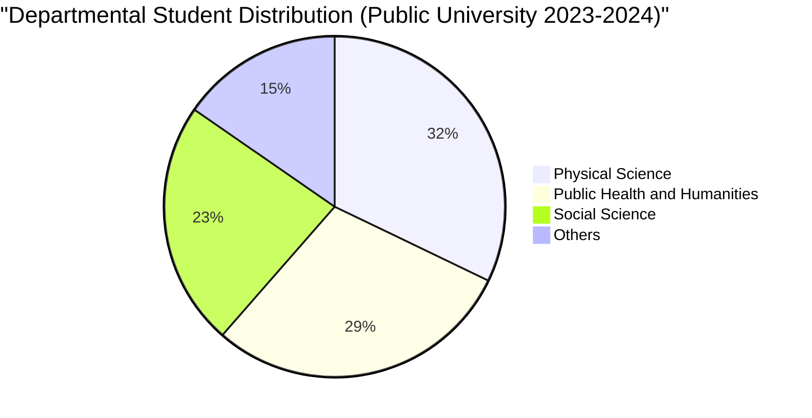

# Definition
Before proceeding, ensure you master [[Other_Graphical_Representations_of_Statistical_Data]] and [[Qualitative_Classification]].
A Pie Chart is a diagrammatic representation of categorical data on a circle, where the circle is partitioned into different sectors. Each sector's area (and corresponding central angle) is proportional to the relative frequency (or percentage) of the item it represents within the total. It is primarily used to show the composition of a whole or the proportion that each category contributes to an aggregate. Think of it as slicing a circular cake, where each slice's size represents a portion of the whole cake.

# The Mental Model
Imagine you have a company budget, and you want to see where all the money goes. A pie chart would be like a pizza cut into slices: one slice for marketing, one for salaries, one for operations, etc. The size of each slice immediately tells you its proportion of the total budget. This visual helps you instantly grasp which categories consume the largest or smallest portions of the whole, making the composition clear.

*Note: This `pie` chart visually represents the distribution of students across different departments in a public university, where the size of each slice is proportional to the number of students in that department, illustrating the composition of the student body.*

# Context & Framework
### Where do Users Get Stuck?
Users often "get stuck" with [[Pie_Chart]]s when there are too many categories or when categories have very similar proportions. With too many slices, the chart becomes cluttered and unreadable, making it difficult to differentiate between categories (e.g., more than 5-7 slices can be problematic). If two slices are very close in size (e.g., 24% vs. 26%), it can be hard for the eye to accurately compare their proportions without explicit labels. This "friction point" highlights that while pie charts are intuitive for simple part-to-whole comparisons, their effectiveness diminishes rapidly with increased complexity, making a [[Bar_Chart]] a better alternative in such cases.

# The Mastery Deep Dive
### The Exploded View: Angles of Proportion
The "exploded view" of a [[Pie_Chart]] reveals that its fundamental construction revolves around the calculation of angles for each sector. The angle of a sector is determined by its relative frequency (RF) multiplied by 360 degrees:
$$ \boxed{\displaystyle \text{Angle of a sector} = \text{Relative Frequency} \times 360^\circ} $$
*   **Relative Frequency (RF):** The frequency of a category divided by the total frequency.
This formula ensures that the area of each slice is directly proportional to its contribution to the whole. For example, if a category accounts for 25% of the total, its sector will have a central angle of 0.25 * 360° = 90°. This precise calculation of angles is what gives the pie chart its power in visually representing proportions, as the human eye is generally good at comparing areas of circles when the differences are significant.

### The "Don't Make Me Think" Rule
A [[Pie_Chart]] strongly adheres to the "Don't Make Me Think" rule by instantly conveying the part-to-whole relationship. When seeing a pie chart, the viewer's brain immediately processes the relative sizes of the slices, allowing for a quick judgment of which categories are dominant and which are minor. For example, a very large slice for "Salaries" in a budget pie chart instantly signals that salaries are the major expenditure, without needing to read exact percentages (though percentages are usually included for precision). This intuitive visual mapping of area to proportion makes the chart a highly efficient communication tool for compositional data.

# Constraints & Limitations
### The Engineering Trade-off: Difficulty with Precise Comparison
A significant "engineering trade-off" with a [[Pie_Chart]] is its "difficulty with precise comparison," especially when comparing slices of similar size or comparing parts of *two different* wholes. While easy to see which slice is largest, it's very hard for the human eye to accurately judge if a 24% slice is genuinely larger than a 23% slice without numerical labels. This limitation means that for granular comparisons, a [[Bar_Chart]] is often superior because people are better at comparing lengths than angles or areas. Thus, while visually appealing for broad compositions, pie charts sacrifice precision in detailed comparisons.

# Significance & Application
[[Pie_Chart]]s are ideal for displaying the composition of a whole, particularly for [[Qualitative_Classification]] data. They are widely used in **business** to show market share, budget allocation, or product category contributions to total sales. In **social sciences**, they can illustrate demographic proportions (e.g., percentage of population by marital status). In **education**, they might show the breakdown of student enrollment by faculty. Their strength lies in clearly communicating how each part contributes to the overall total, making them an effective tool for showcasing proportions in a clear and intuitive manner.

# The Worked Example
*Test your mastery. Cover the solutions below to test yourself first.*

Consider the grades of 40 students in a Statistics and Probability course:

| Grade | Number of Students |
| :
---- | :
----------------- |
| A     | 10                 |
| B     | 14                 |
| C     | 8                  |
| D     | 5                  |
| F     | 3                  |
| **Total** | **40**             |

**Goal:** Understand how a [[Pie_Chart]] would represent this grade distribution.

**Step 1: Calculate Relative Frequency (RF) for each Grade**
Formula: `RF = Number of Students / Total Students`

*   A: 10 / 40 = 0.25
*   B: 14 / 40 = 0.35
*   C: 8 / 40 = 0.20
*   D: 5 / 40 = 0.125
*   F: 3 / 40 = 0.075

**Step 2: Calculate Angle of Sector for each Grade**
Formula: `Angle = RF * 360°`

*   A: 0.25 * 360° = 90°
*   B: 0.35 * 360° = 126°
*   C: 0.20 * 360° = 72°
*   D: 0.125 * 360° = 45°
*   F: 0.075 * 360° = 27°
*   **Total Angles = 360°**

**Step 3: Visualize Slices (Mental Model)**
Imagine a circle divided into five slices. The 'B' grade slice would be the largest (126°), followed by 'A' (90°), then 'C' (72°), and so on.

**Why this works:**
*   **Part-to-Whole:** The pie chart clearly shows the proportion of students who received each grade, making it visually evident that 'B' is the most frequent grade and 'F' is the least frequent.
*   **Composition:** It directly illustrates the overall grade composition of the class.

# The Proving Ground
*Test your mastery. Cover the solutions below to test yourself first.*

### Level 1: The Sanity Check (Verification)
**The Element ID:** For what primary purpose is a [[Pie_Chart]] best suited in data visualization?
> **Solution:** A [[Pie_Chart]] is best suited for showing the composition of a whole, or the proportion that each category contributes to an aggregate.

### Level 2: The Crucible (Mastery & Edge Cases)
**The Friction Point:** A marketing team uses a [[Pie_Chart]] to compare the market share of ten different competitors. Many of the slices are very thin, and it's difficult to tell if Competitor A (7.8% market share) has a larger slice than Competitor B (7.5% market share) without reading the labels. Explain why this chart creates a "friction point" for accurate visual comparison and why, in this scenario, it fails the "Don't Make Me Think" rule.
> **Solution:** This [[Pie_Chart]] creates a significant "friction point" for accurate visual comparison because the human eye struggles to precisely differentiate between very thin slices or slices with very similar areas (e.g., 7.8% vs. 7.5%) without relying on numerical labels. This directly violates the "Don't Make Me Think" rule, as the viewer is forced to read and process numbers rather than intuitively grasping the proportions from the visual alone. In scenarios with many categories or subtle differences, the pie chart loses its effectiveness as a quick comparison tool, making it a poor choice for displaying such granular market share data. A [[Bar_Chart]] would likely be far more effective for this kind of precise comparison.

# Key Takeaways
*   Pie charts display categorical data as sectors of a circle, proportional to relative frequencies.
*   They are ideal for showing the composition of a whole or part-to-whole relationships.
*   Effectiveness diminishes with too many categories or very similar proportions.

# Knowledge Graph Connections
| Concept                                      | Connection / Relationship                                                          |
| :
------------------------------------------- | :
--------------------------------------------------------------------------------- |
| [[Other_Graphical_Representations_of_Statistical_Data]] | A specific type of graphical representation within the broader category.           |
| [[Qualitative_Classification]]               | Often used to visualize data classified qualitatively, especially for proportions. |
| [[Relative_Frequency_Distribution]]          | The calculation of relative frequencies is fundamental for determining sector angles. |
| [[Bar_Chart]]                                | Often used as a superior alternative to pie charts for comparing multiple categories or small proportional differences. |
---