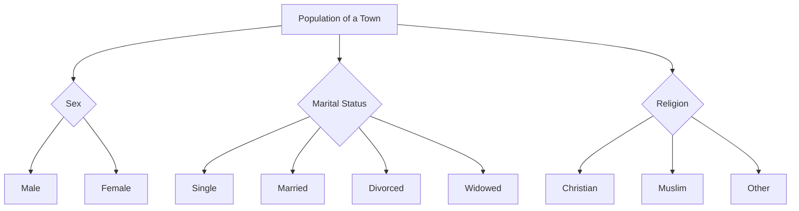

# Definition
Before proceeding, ensure you master [[Classification_and_Presentation_of_Statistical_Data]] and Data_Collection.
Qualitative Classification is the process of arranging statistical data based on certain descriptive characters or qualitative aspects of a phenomenon. These characteristics are non-numerical and cannot be measured numerically but can be categorized. Examples include sex, citizenship, qualification, marital status, religion, color, or opinion. It's like sorting people by hair color or favorite genre of music; you group them based on attributes that describe them rather than numbers.

# The Mental Model
Imagine you're a casting director for a play. You receive applications from many actors. You don't just list them; you classify them. You might group them by "Gender" (Male/Female/Non-binary), "Ethnicity" (various categories), or "Hair Color" (Blonde/Brunette/Black/Red). These are all qualitative characteristics. This classification helps you quickly see the composition of your applicant pool based on descriptive traits, rather than numerical data.

*Note: This `graph TD` illustrates the hierarchical classification of a town's population based on qualitative characteristics such as sex, marital status, and religion.*

# Context & Framework
### The Family Tree
Qualitative classification establishes a "family tree" based on non-numerical attributes. It's used when the distinguishing feature of the data is descriptive rather than measurable. For example, when analyzing customer feedback, responses might be classified by "Sentiment" (Positive, Negative, Neutral) or by "Type of Issue" (Billing, Technical Support, Product Feature). This framework is essential in social sciences, marketing, and human resources, where understanding attributes that define categories rather than quantities is paramount. It allows for the exploration of thematic patterns and the composition of groups based on shared characteristics.

# The Mastery Deep Dive
### The Exploded View: Levels of Detail in Qualitative Attributes
Qualitative attributes can exist at different levels of detail, which impacts how they are classified. A simple classification might group people by 'Marital Status' (Single, Married). A more detailed "exploded view" might further subdivide 'Married' into 'Legally Registered Couples' or 'Common-Law'. Similarly, 'Qualification' could be a broad category, but within that, 'High School Diploma', 'Bachelor's Degree', and 'Master's Degree' offer a finer classification. The choice of detail depends on the research question; a broader view provides an overview, while a more granular view reveals specific sub-groups within a qualitative category.

### The Nuance of Descriptive Grouping
Deeper engagement with qualitative classification involves recognizing the nuances and potential ambiguities in descriptive grouping. For instance, categories like "qualification" might seem straightforward, but if a dataset includes international qualifications, establishing equivalent categories requires careful consideration. Unlike numerical data where 20 is always 20, qualitative terms can have shades of meaning or cultural context. The skill lies in defining categories that are mutually exclusive (an item belongs to only one category) and exhaustive (all items can be placed in a category), ensuring that the descriptive groupings accurately reflect the underlying phenomenon and avoid overlap or ambiguity.

# Constraints & Limitations
### The Engineering Trade-off: Subjectivity and Ambiguity
A significant limitation of qualitative classification is the potential for subjectivity and ambiguity in defining categories. Unlike quantitative data, which has objective numerical values, descriptive characteristics can sometimes be open to interpretation. For example, classifying "customer satisfaction" as "High," "Medium," or "Low" can vary from one person's judgment to another without clear criteria. This can lead to inconsistencies in classification and affect the reliability of the analysis. Ensuring clear, well-defined, and mutually exclusive categories is crucial to mitigate this trade-off, but it often requires careful operationalization of the qualitative attributes.

# Significance & Application
Qualitative classification is indispensable for understanding populations, markets, and social phenomena. In **demography**, it helps in analyzing population structures based on gender, ethnicity, or religion. **Marketing research** uses it to segment customers by lifestyle, preferences, or brand loyalty. **Sociologists** classify survey respondents by socio-economic status or educational background. In **human resources**, employees might be classified by job role, department, or performance rating. This method provides rich, descriptive insights into the characteristics of groups, enabling targeted strategies and a deeper understanding of non-numerical attributes.

# The Worked Example
*Test your mastery. Cover the solutions below to test yourself first.*

Consider a simplified dataset of marital status for 50 employees in a factory:
*   Single: 26
*   Married: 43
*   Divorced: 11
*   Widowed: 8
*   Legally registered couples: 5

**Goal:** Apply qualitative classification to this data and present it clearly.

**Step 1: Classification**
The data is already classified by the qualitative characteristic of "Marital Status." The task is to organize and present these descriptive groups.

**Step 2: Tabulation**
We arrange this data into a table, listing each marital status and its corresponding number of employees. Note: "Married" and "Legally registered couples" represent overlapping categories in the raw data, which needs to be addressed for mutually exclusive classification. Assuming "Legally registered couples" is a subset of "Married" or a more specific category within it, for simplicity, we'll maintain the given categories as distinct counts in this example, but in a real scenario, this would require clarification from the source. For this example, we treat "Married" and "Legally registered couples" as potentially distinct reporting categories based on the source material.

| Marital Status           | Number of Employees |
| :
----------------------- | :
------------------ |
| Married                  | 43                  |
| Single                   | 26                  |
| Divorced                 | 11                  |
| Widowed                  | 8                   |
| Legally registered couples | 5                   |

**Step 3: Presentation (Mental Model of a Bar Chart)**
Mentally, you would visualize a bar chart where the x-axis represents the 'Marital Status' categories and the y-axis represents the 'Number of Employees'. Each category would have a bar corresponding to its frequency. This visual quickly shows which marital status is most common among the employees.

**Why this works:**
*   **Classification:** Grouped data by a qualitative characteristic (marital status).
*   **Presentation:** The table and conceptual bar chart clearly show the distribution of employees across different marital statuses, providing descriptive insights into the workforce.

# The Proving Ground
*Test your mastery. Cover the solutions below to test yourself first.*

### Level 1: The Sanity Check (Verification)
**The Fact Check:** A survey asks respondents to indicate their favorite color from a list of options. Is the data collected for "favorite color" suitable for qualitative classification?
> **Solution:** Yes, "favorite color" is a descriptive, non-numerical characteristic, making it perfectly suitable for qualitative classification.

### Level 2: The Crucible (Mastery & Edge Cases)
**The Impostor:** A health researcher classifies patient pain levels using a scale of 1 to 10, where 1 is "no pain" and 10 is "excruciating pain." The researcher claims this is a qualitative classification because it describes the *quality* of pain. Explain why this is an "impostor" qualitative classification and what its true nature is.
> **Solution:** This is an "impostor" qualitative classification. While pain *quality* is a descriptive concept, using a numerical scale from 1 to 10 makes this fundamentally a [[Quantitative_Classification]]. The numbers (1 to 10) have an inherent order and can be compared (e.g., 5 is more pain than 3), even if the intervals aren't necessarily equal (it's an ordinal scale). The true nature is quantitative, as the classification is based on numerical values, despite those values representing a qualitative experience. A genuinely qualitative classification for pain might use non-numerical categories like "Mild," "Moderate," and "Severe" without assigning numerical ranks.

# Key Takeaways
*   Qualitative classification organizes data based on descriptive, non-numerical characteristics.
*   It is crucial for understanding attributes like sex, marital status, religion, or opinions.
*   Careful definition of mutually exclusive and exhaustive categories is vital to avoid subjectivity and ambiguity.

# Knowledge Graph Connections
| Concept                                      | Connection / Relationship                                                          |
| :
------------------------------------------- | :
--------------------------------------------------------------------------------- |
| [[Classification_and_Presentation_of_Statistical_Data]] | A fundamental type of classification used to organize raw data.                       |
| [[Quantitative_Classification]]              | Often contrasted with qualitative classification, which focuses on numerical attributes. |
| [[Bar_Chart]]                                | A common graphical representation for displaying qualitative data frequencies.     |
| [[Pie_Chart]]                                | Another common graphical representation for showing proportions of qualitative categories. |
---