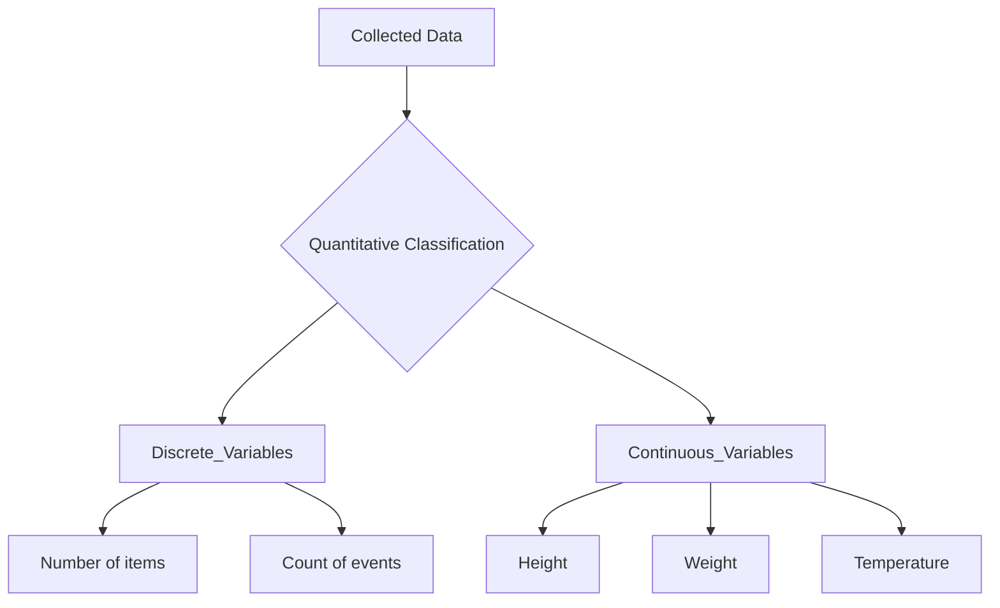

# Definition
Before proceeding, ensure you master [[Classification_and_Presentation_of_Statistical_Data]] and Data_Collection.
Quantitative Classification is the process of arranging collected statistical data based on certain quantifiable variables, meaning characteristics that can be expressed as numbers. These variables represent measurable quantities such as marks, income, expenditure, profit, loss, height, weight, age, price, or production. It's like sorting students by their exam scores or employees by their salary; you group them based on numerical values.

# The Mental Model
Imagine you're managing a shop and tracking daily sales. You wouldn't classify sales by "good" or "bad"; instead, you'd group them by numerical ranges: "$0-$100," "$101-$500," "$501-$1000," etc. This allows you to see how many days fall into each sales bracket, identifying patterns in revenue generation. Quantitative classification is the underlying method that enables you to categorize and understand data based purely on its numerical value.

*Note: This `graph TD` illustrates the primary subdivision of quantitative classification into discrete and continuous variables, with examples for each, showing a hierarchical grouping of numerical data.*

# Context & Framework
### The Family Tree
Quantitative classification creates a "family tree" where branches are defined by numerical ranges or values. This method is used when the characteristics being studied are inherently numerical and measurable, allowing for precise grouping. For example, classifying students by "Age" into categories like "18-20," "21-23," and so on, or classifying products by "Price Range." This framework is fundamental in economics, finance, engineering, and the natural sciences, where precise measurement and numerical comparison are critical. It allows for the analysis of distributions, central tendencies, and variations within numerical datasets.

# The Mastery Deep Dive
### The Exploded View: Precision in Numerical Grouping
Quantitative classification often demands a precise "exploded view" of the numerical ranges. For example, classifying income might start with broad brackets like "Low," "Medium," "High." However, a more detailed quantitative approach would use specific, non-overlapping numerical intervals: "$0-$20,000," "$20,001-$50,000," "$50,001-$100,000," and so forth. The art here lies in selecting appropriate class intervals that are both manageable for analysis and sufficiently granular to reveal meaningful patterns without losing critical detail. This is particularly important for variables like "marks" or "production," where small numerical differences can signify important distinctions.

### The Nuance of Numerical Interpretation
Deeper engagement with quantitative classification involves understanding the nuances of how numerical data is interpreted within categories. For instance, when classifying "age," a group "20-29 years old" implies that all individuals within this range share a similar developmental stage. However, care must be taken to ensure that the chosen numerical intervals truly represent homogeneous groups for the purpose of the study. The method also requires clear rules for handling boundary cases (e.g., does "30" belong to "20-30" or "30-40"? This is typically resolved by defining exclusive upper bounds like "20 up to, but not including, 30"). This precision prevents misclassification and ensures the integrity of numerical comparisons between groups.

# Constraints & Limitations
### The Engineering Trade-off: Arbitrary Boundaries
A significant limitation of quantitative classification is the potential for arbitrary boundaries when defining class intervals. The choice of where to start and end numerical ranges (e.g., "ages 20-30" vs. "ages 21-31") can influence the appearance of the data distribution and potentially lead to different interpretations. If intervals are too wide, important details might be obscured; if too narrow, the data might appear overly complex. This arbitrary aspect means that the classification itself can introduce a subjective element, even though the underlying data is numerical. Careful consideration and justification of interval choices are crucial to mitigate this trade-off.

# Significance & Application
Quantitative classification is paramount for any field relying on numerical measurements. In **economics**, it's used to classify income brackets, GDP growth rates, or inflation levels. **Education** uses it to categorize student grades, test scores, or attendance rates. **Manufacturing** classifies products by defect rates, production volumes, or cost. **Healthcare** categorizes patients by blood pressure readings, weight, or cholesterol levels. This method transforms raw numerical data into structured categories, enabling statistical analysis, identification of patterns, and evidence-based decision-making.

# The Worked Example
*Test your mastery. Cover the solutions below to test yourself first.*

Consider a simplified dataset of 20 student marks (out of 25) in a Statistics and Probability course: 18, 20, 15, 22, 19, 17, 21, 16, 23, 18, 14, 20, 19, 21, 17, 22, 16, 18, 20, 15.

**Goal:** Apply quantitative classification to this data by grouping marks into intervals.

**Step 1: Classification**
Identify the numerical variable: Student marks. We need to define class intervals for these numerical values.

**Step 2: Define Class Intervals (Example with 3 classes)**
*   Smallest mark: 14
*   Largest mark: 23
*   Range = 23 - 14 = 9
*   If we choose 3 classes, width ≈ 9/3 = 3.
*   Let's use class width of 3.

Class Intervals:
*   14-16
*   17-19
*   20-22
*   23-25 (This would capture the maximum value)

**Step 3: Tabulation (Creating a Grouped Frequency Distribution)**
Count how many marks fall into each interval.

| Class Limit (Marks) | Frequency |
| :
------------------ | :
-------- |
| 14 – 16             | 4         |
| 17 – 19             | 7         |
| 20 – 22             | 7         |
| 23 – 25             | 2         |
| **Total**           | **20**    |

**Why this works:**
*   **Classification:** Grouped numerical data (marks) into defined intervals.
*   **Presentation:** The grouped frequency distribution table provides a clear overview of how student marks are distributed across different performance ranges, making it easier to identify clusters (e.g., 17-22 marks are most common).

# The Proving Ground
*Test your mastery. Cover the solutions below to test yourself first.*

### Level 1: The Sanity Check (Verification)
**The Fact Check:** A public health agency collects data on the body mass index (BMI) of individuals and groups them into categories like "Underweight," "Normal Weight," "Overweight," and "Obese" based on numerical BMI ranges. Is this an example of quantitative classification?
> **Solution:** Yes, this is quantitative classification because the categories ("Underweight," "Normal Weight," etc.) are derived from underlying numerical BMI values, which are quantifiable variables.

### Level 2: The Crucible (Mastery & Edge Cases)
**The Impostor:** A data analyst classifies customer ages into "Young," "Middle-Aged," and "Senior." They argue that this is a qualitative classification because the labels are descriptive. Explain why this is an "impostor" qualitative classification and why it is, in fact, a quantitative classification, even with descriptive labels.
> **Solution:** This is an "impostor" qualitative classification. Despite using descriptive labels ("Young," "Middle-Aged," "Senior"), the underlying characteristic, "age," is a numerical variable. These descriptive labels represent predefined numerical ranges (e.g., "Young" = 18-30 years, "Middle-Aged" = 31-55 years). Therefore, the grouping is based on quantifiable values, making it fundamentally a [[Quantitative_Classification]]. The "impostor" aspect lies in masking a numerical grouping with qualitative-sounding tags, which doesn't change the underlying quantitative nature of the data.

# Key Takeaways
*   Quantitative classification organizes data based on measurable numerical variables.
*   It is used for characteristics like income, height, age, or production.
*   The choice of class intervals is crucial for effective representation and avoiding misinterpretation.

# Knowledge Graph Connections
| Concept                                      | Connection / Relationship                                                          |
| :
------------------------------------------- | :
--------------------------------------------------------------------------------- |
| [[Classification_and_Presentation_of_Statistical_Data]] | A fundamental type of classification for organizing raw data.                       |
| [[Qualitative_Classification]]               | Often contrasted with quantitative classification, which focuses on descriptive attributes. |
| [[Discrete_Variables]]                       | A subtype of quantitative classification, representing countable values.          |
| [[Continuous_Variables]]                     | A subtype of quantitative classification, representing measurable values.         |
---