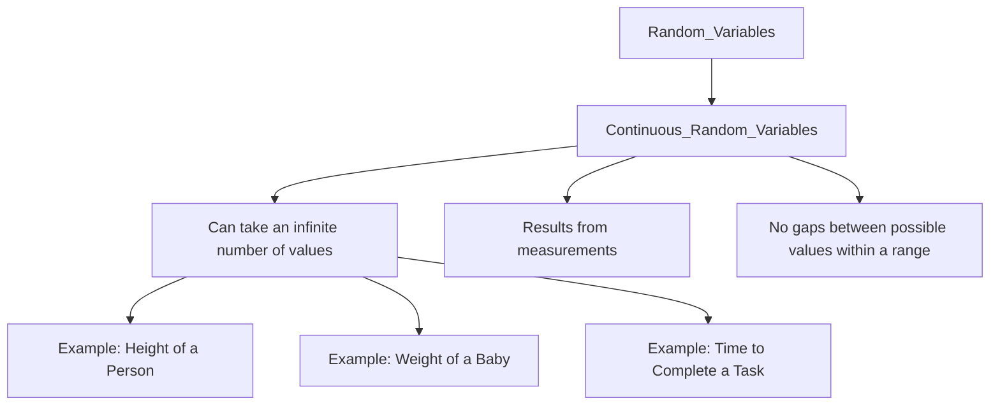

# Definition
Before proceeding, ensure you master [[Random_Variables]] because continuous random variables are a specific type of random variable, characterized by their measurable nature.
A continuous random variable is a **random variable that can take on any infinite number of possible values within a given interval or range**. These values typically arise from measurements rather than counting. The "continuous" aspect means that between any two possible values, there is an infinite number of other possible values, with no discernible gaps. A simpler way to think about it: if you can measure something to an arbitrary level of precision (e.g., length, weight, time), then you're dealing with a continuous random variable. It's like measuring a person's height – they could be 170 cm, 170.5 cm, 170.53 cm, and so on.

# The Mental Model
Imagine painting a continuous line on a wall. You can pick any point along that line, and there's an infinite number of points between any two points you choose. This is how continuous random variables behave. They represent quantities that are measured, not counted. For example, the time it takes to run a race could be 10.5 seconds, 10.53 seconds, 10.538 seconds, and so on. The variable can "flow" smoothly through an entire range of values.


```text
// Scenario 1: Hierarchical classification and examples of Continuous Random Variables.
// Output:
// (A visual graph diagram illustrating the classification of Continuous Random Variables under Random Variables.)
// The diagram shows "Random_Variables" leading to "Continuous_Random_Variables".
// From "Continuous_Random_Variables", branches explain its characteristics: "Can take an infinite number of values", "Results from measurements", "No gaps between possible values within a range".
// Further examples branch from "Can take an infinite number of values": "Height of a Person", "Weight of a Baby", "Time to Complete a Task".
```
*Note: This `graph TD` illustrates the hierarchical classification and key characteristics of continuous random variables, along with typical examples.*

# Context & Framework
### Measuring the Unpredictable: Infinite Possibilities
Continuous random variables arise in situations where the outcomes are measured rather than counted. The values can fall anywhere within a specified interval, limited only by the precision of the measuring instrument.
Examples include:
*   The **weight of a baby at birth**. A baby's weight could be 3.5 kg, 3.51 kg, 3.512 kg, etc., within a certain range.
*   The **time needed to finish a task**. Time can be measured to fractions of seconds.
*   The **life of an individual in a community**. A lifespan can be 0 years, 70 years, or any value in between (e.g., 65.34 years).
*   The **voltage of an electrical current**.
These examples demonstrate that continuous random variables take any value within a range. For continuous random variables, we use a **Probability Density Function (PDF)**, rather than a PMF, to describe their probabilities. The probability of a continuous random variable taking on *any exact single value* is theoretically zero; instead, we talk about the probability of the variable falling within an *interval*.

# The Mastery Deep Dive
### Taxonomist: Categorizing Measurable Events
Continuous random variables are fundamentally characterized by the **measurability of their outcomes** within an interval. This means that if you were to plot the possible values on a number line, they would form a continuous segment or interval without any gaps. This is a direct contrast to discrete variables, which only take on isolated values.
The formal distinction lies in the mathematical concept of uncountability. The set of possible values for a continuous random variable is uncountable, meaning its elements cannot be put into a one-to-one correspondence with the set of natural numbers.
This characteristic significantly impacts how probabilities are assigned and calculated for these variables. For continuous random variables, we use a **Probability Density Function (PDF)**, denoted as $f(x)$. The probability of $X$ falling within an interval $[a, b]$ is found by integrating the PDF over that interval: $P(a \le X \le b) = \int_a^b f(x) dx$. The total area under the PDF curve must equal 1.

# Constraints & Limitations
### The "Oops!" List: Zero Probability for Single Points
A common pitfall with continuous random variables is the idea that the probability of the variable taking on any *exact single value* is zero. For example, the probability that a person's height is *exactly* 170.000... cm is infinitesimally small, effectively zero. We always calculate probabilities over *intervals*. Misinterpreting this can lead to incorrect calculations, such as attempting to assign a non-zero probability to a single point. This is a fundamental conceptual difference from discrete random variables, where single values can have positive probabilities.

# Significance & Application
Continuous random variables are indispensable for modeling phenomena where measurements can be arbitrarily precise. In academic fields, they are central to concepts like the Normal, Exponential, and Uniform distributions, which are widely used in advanced statistics, calculus-based probability, and hypothesis testing involving measured data. In the real world, continuous random variables are applied in diverse scenarios:
*   **Engineering:** The lifespan of a component, the exact breaking point of a material.
*   **Environmental Science:** Daily temperature, rainfall amounts.
*   **Finance:** Returns on investments, changes in interest rates.
*   **Medicine:** Blood pressure, cholesterol levels.
By providing a framework for quantifying uncertainties that span continuous ranges, these variables enable sophisticated modeling and analysis in fields requiring precise measurements.

# The Worked Example
Consider the experiment of measuring the exact temperature in a room at a random moment.

1.  **Define the Experiment:** Measuring the temperature in a room at a random instant.
2.  **Define a Random Variable (Y):** Let $Y$ be the temperature in degrees Celsius.
3.  **Identify Possible Values of Y:**
    The temperature could theoretically be any value within a given range (e.g., between 15°C and 25°C). It could be 20.0°C, 20.1°C, 20.05°C, 20.0001°C, etc.
    So, $Y \in$ (or whatever the relevant range is, it's an interval).
4.  **Confirm Continuous Nature:**
    The values are not distinct or countable; they can take on any real number within an interval. Therefore, $Y$ is a continuous random variable.

# The Proving Ground
*Test your mastery. Cover the solutions below to test yourself first.*

### Level 1: The Sanity Check (Verification)
**The Question:** Is the amount of time a customer waits in a queue a continuous random variable? Explain why.
> **Solution:** Yes, it is a continuous random variable because time can be measured to any degree of precision (e.g., 2.5 minutes, 2.53 seconds, etc.) within a given interval.

### Level 2: The Crucible (Mastery & Edge Cases)
**The Scenario:** A scientist is measuring the pH of a solution, which can range from 0 to 14. Is the measured pH a continuous random variable? Justify.
> **Solution:** Yes, the measured pH is a continuous random variable. pH is a measurement that can take on any value within its theoretical range (0 to 14), limited only by the precision of the measuring instrument. There are infinitely many possible pH values between, for example, 7.0 and 7.1.

# Key Takeaways
*   Continuous random variables take on an infinite number of values within a given interval, typically from measurements.
*   There are no gaps between possible values; they form a continuous range.
*   Probabilities are calculated over intervals using a Probability Density Function (PDF), not for single points.

# Knowledge Graph Connections
| Concept                     | Connection / Relationship                                                                   |
| :
-------------------------- | :
------------------------------------------------------------------------------------------ |
| [[Random_Variables]]        | Is a specific type of random variable, distinguishing it from discrete variables.          |
| [[Discrete_Random_Variables]] | Provides a contrast by defining the other major type of random variable based on countability. |
| [[Normal_Distribution]]     | Is a probability distribution specifically for continuous random variables.                  |
| [[Standard_Normal_Distribution]] | Is a specific type of continuous probability distribution derived from the normal distribution. |
---