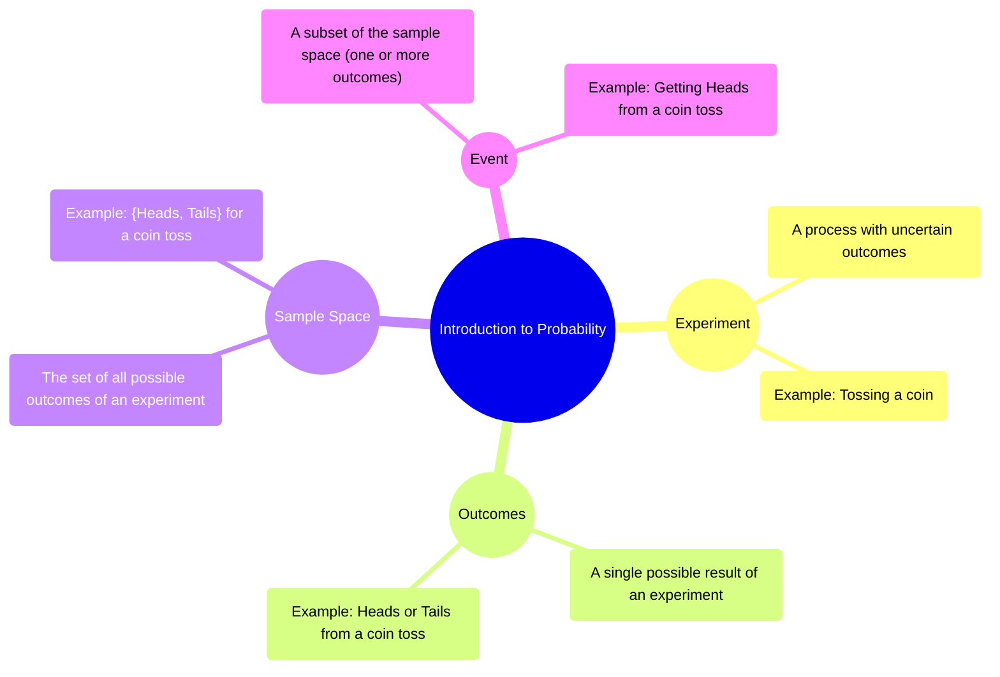

# Definition
Before proceeding, understand that [[Random_Variables]] will be explored later, building upon these foundational definitions of chance.
At its core, probability quantifies the likelihood of an event occurring. It is the branch of mathematics that deals with uncertainty, providing a systematic way to analyze random phenomena. Imagine setting up a game: the initial actions, potential results, and specific conditions you're looking for all fall under probability. A simpler way to think about it is like predicting whether it will rain today: it might, or it might not, and probability gives us a number between 0 (impossible) and 1 (certain) to express this chance.

# The Mental Model
Imagine you are playing a game with a standard six-sided die. The act of rolling the die is your **experiment**. The specific number that lands face-up after the roll (e.g., a 3, a 6) is an **outcome**. The entire collection of all possible outcomes when you roll the die once (numbers 1, 2, 3, 4, 5, 6) is the **sample space**. If you're hoping to roll an even number (2, 4, or 6), that specific collection of outcomes is an **event**. Probability helps us quantify how likely that event is.


```text
// Scenario 1: Conceptual understanding of probability terms.
// Output:
// (A visual mindmap illustrating the core concepts of Introduction to Probability.)
// The mindmap will show "Introduction to Probability" as the central theme.
// Branches will extend to "Experiment" (defined as a process with uncertain outcomes, e.g., tossing a coin).
// "Outcomes" (single possible results, e.g., Heads or Tails).
// "Sample Space" (all possible outcomes, e.g., {Heads, Tails}).
// "Event" (a subset of the sample space, e.g., Getting Heads).
```
*Note: This `mindmap` visually organizes the fundamental terms in probability, showing their hierarchical relationships.*

# Context & Framework
### Unpacking the Elements of Chance
To navigate the realm of probability, it is essential to first establish a common vocabulary. An **experiment** is any process that yields an observable outcome that cannot be predicted with certainty. For instance, flipping a coin, rolling a die, or drawing a card are all experiments. The individual results of an experiment are called **outcomes**. When you flip a coin, "heads" is an outcome, and "tails" is another. The **sample space**, denoted by $S$, is the complete set of all possible outcomes of an experiment. For a single coin flip, $S = \{Heads, Tails\}$. An **event** is any subset of the sample space; it can be a single outcome or a collection of outcomes. For example, in a coin flip, "getting heads" is an event, as is "getting tails." These foundational definitions provide the structural 'Lego' pieces for building more complex probabilistic models.

# The Mastery Deep Dive
### Mapping the Landscape: Interconnected Concepts
Understanding the relationships between these core concepts is critical. An **experiment** *produces* **outcomes**. The collection of *all* possible **outcomes** forms the **sample space**. An **event** is then simply a *specific collection* of these outcomes, a subset of the sample space, that we are interested in. This hierarchy ensures that every probabilistic statement is grounded in a clearly defined context. For instance, if the experiment is drawing a card from a deck, a specific outcome might be the "Ace of Spades." The sample space would be all 52 cards. An event could be "drawing an Ace" (comprising 4 outcomes) or "drawing a red card" (comprising 26 outcomes).

### The Rigorous Translator: From Idea to Notation
Translating intuitive probabilistic ideas into formal mathematical notation is crucial for precise analysis and communication. The sample space is typically denoted by the capital letter $S$. Individual outcomes are often represented by lowercase letters, such as $\omega$ (omega). Events are usually represented by capital letters like $A, B, C$, etc. The probability of an event $A$ is written as $P(A)$. When an event $A$ can happen in $h$ ways out of a total of $n$ equally likely outcomes in the sample space $S$, the probability of event $A$ is formally defined as:
$$ \boxed{\displaystyle P(A) = \frac{\text{Number of favorable outcomes for A}}{\text{Total number of possible outcomes in S}} = \frac{n(A)}{n(S)}} $$
This formula serves as the fundamental bridge between the conceptual understanding of chance and its quantitative expression.

# Constraints & Limitations
### The Illusory Certainty: Common Pitfalls
A common pitfall in grasping basic probability is the incorrect identification of the sample space or the outcomes. If the sample space is not exhaustively defined, or if outcomes are not treated as equally likely (when they should be), then all subsequent probability calculations will be flawed. For example, when rolling two dice, simply listing "sums" as outcomes (e.g., sum of 2, sum of 3, etc.) without considering the individual die combinations (e.g., (1,1), (1,2), (2,1)) leads to an incorrect assumption of equally likely outcomes. Another error is confusing an event with an outcome; an event can be a collection, while an outcome is a single result.

# Significance & Application
The principles of probability are foundational to virtually all quantitative fields. In academic settings, it underpins statistics, enabling hypothesis testing, data analysis, and predictive modeling in research across sciences, social sciences, and engineering. In the real world, probability is indispensable for risk assessment in insurance, financial modeling, quality control in manufacturing, predictive analytics in marketing, and even in daily decision-making like evaluating medical test results. It provides the essential framework for understanding and making informed decisions in an uncertain world.

# The Worked Example
Consider an experiment of rolling a single, fair six-sided die once.

1.  **Define the Experiment:** The act of rolling the die.
2.  **List Possible Outcomes:** The numbers that can land face-up. These are 1, 2, 3, 4, 5, 6.
3.  **Identify the Sample Space (S):** The set of all possible outcomes. $S = \{1, 2, 3, 4, 5, 6\}$.
4.  **Define an Event (A):** Let event A be "rolling an even number."
5.  **Identify Outcomes for Event A:** The outcomes for event A are 2, 4, 6. So, $A = \{2, 4, 6\}$.
6.  **Calculate the Probability of Event A ($P(A)$):**
    *   Number of favorable outcomes for A, $n(A) = 3$.
    *   Total number of possible outcomes in S, $n(S) = 6$.
    *   Using the formula $P(A) = \frac{n(A)}{n(S)}$:
        $$ \displaystyle P(A) = \frac{3}{6} = \frac{1}{2} = 0.5 $$
    So, the probability of rolling an even number is 0.5 or 50%.

# The Proving Ground
*Test your mastery. Cover the solutions below to test yourself first.*

### Level 1: The Sanity Check (Verification)
**The Question:** Define the term "sample space" in the context of a probability experiment.
> **Solution:** The sample space is the set of all possible outcomes of a probability experiment.

### Level 2: The Crucible (Mastery & Edge Cases)
**The Scenario:** You have a bag containing 3 red balls, 2 blue balls, and 1 green ball. You perform an experiment of drawing one ball at random.
(a) List all the individual outcomes of this experiment.
(b) Identify the sample space for this experiment.
(c) Define an event "drawing a primary color" and list its outcomes.
> **Solution:**
> (a) The individual outcomes are: Red, Red, Red, Blue, Blue, Green.
> (b) The sample space $S = \{Red, Blue, Green\}$. (Note: Even though there are multiple red balls, "Red" is a single distinct outcome in terms of color).
> (c) The event "drawing a primary color" would include: Red, Blue. Its outcomes are $\{Red, Blue\}$.

# Key Takeaways
*   Probability quantifies the likelihood of events, built upon defining experiments, outcomes, sample spaces, and specific events.
*   The sample space is the complete set of all possible results of an experiment, while an event is a particular subset of these outcomes.
*   The probability of an event is calculated as the ratio of favorable outcomes to the total possible outcomes, assuming equal likelihood.

# Knowledge Graph Connections
| Concept                     | Connection / Relationship                                                                   |
| :
-------------------------- | :
------------------------------------------------------------------------------------------ |
| [[Random_Variables]]        | Provides the fundamental concepts for defining and understanding random variables.           |
| [[Mutually_Exclusive_and_Non_Mutually_Exclusive_Events]] | Defines the core events on which these probability classifications are built. |
| [[Addition_Rule_of_Probability]] | Explains the fundamental principles for combining probabilities of different events.         |
| [[Dependent_and_Independent_Events]] | Introduces the nature of relationships between events that influence their probabilities. |
| [[Tree_Diagrams]]           | Utilizes the foundational definitions of outcomes and events to visualize sequences.        |
---