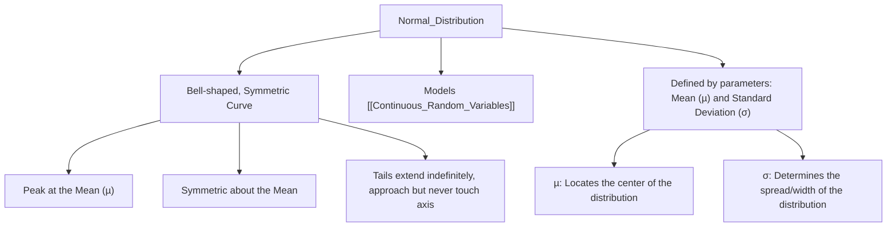
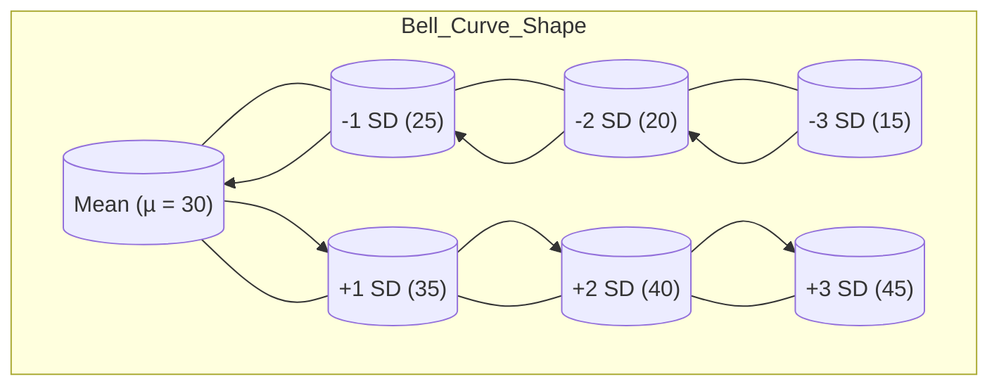

# Definition
Before proceeding, ensure you master [[Types_of_Probability_Distributions_Overview]] and [[Continuous_Random_Variables]] because the normal distribution is the most important continuous probability distribution.
The Normal Distribution, also known as the **Gaussian distribution** or the **"bell curve,"** is a **continuous probability distribution** that is symmetric about its mean. It is characterized by its distinctive bell-shaped curve, where the majority of data points cluster around the mean, and the frequency of data points gradually decreases as one moves further away from the mean. It is defined by two parameters: its mean ($\mu$) and its standard deviation ($\sigma$). A simpler way to think about it: imagine a natural phenomenon like human height. Most people are "average" height, fewer are very tall, and fewer still are very short. When you plot these heights, you get a beautiful, smooth, bell-shaped curve – that's the normal distribution.

# The Mental Model
Imagine a perfectly balanced seesaw (the mean). People of varying weights are trying to sit on it. Most people are near the center, making it stable. As you move further out, fewer people can sit there without tipping the seesaw. The shape formed by the distribution of people on the seesaw (with the most in the middle and fewer at the ends) perfectly mimics the bell curve. The mean is the center, and the standard deviation tells you how "spread out" the people are on the seesaw.


```text
// Scenario 1: Conceptual understanding of the Normal Distribution's characteristics.
// Output:
// (A visual graph diagram illustrating the characteristics of the Normal Distribution.)
// The diagram shows "Normal_Distribution" branching to "Bell-shaped, Symmetric Curve", "Models Continuous_Random_Variables", and "Defined by parameters: Mean (µ) and Standard Deviation (σ)".
// Further branches elaborate on "Bell-shaped, Symmetric Curve": "Peak at the Mean (µ)", "Symmetric about the Mean", "Tails extend indefinitely, approach but never touch axis".
// And on "Parameters": "µ: Locates the center of the distribution", "σ: Determines the spread/width of the distribution".
```
*Note: This `graph TD` visually organizes the key characteristics and defining parameters of the Normal Distribution.*

# Context & Framework
### The Universal Pattern: A Natural Phenomenon
The normal distribution is arguably the most important distribution in statistics due to its ubiquitous presence in natural, social, and physical phenomena. Many variables (e.g., height, blood pressure, measurement errors, IQ scores) tend to be normally distributed, or at least approximately so. Its importance is further cemented by the Central Limit Theorem, which states that the distribution of sample means will be approximately normal, regardless of the population distribution, provided the sample size is sufficiently large.
Key characteristics of a Normal Distribution:
1.  **Bell Shape and Symmetry:** The curve is bell-shaped and perfectly symmetrical around its mean ($\mu$). Half of the total area under the curve lies to the left of the mean, and half lies to the right.
2.  **Mean, Median, Mode Coincidence:** For a perfectly normal distribution, the mean, median, and mode are all equal and located at the center of the distribution.
3.  **Total Area = 1 (or 100%):** The entire area under the probability density curve is equal to 1, representing the total probability of all possible outcomes.
4.  **Asymptotic Tails:** The tails of the curve extend indefinitely in both directions, approaching (but never touching) the horizontal axis. Although they never touch, the area beyond $\mu \pm 3\sigma$ (mean plus/minus three standard deviations) is considered virtually zero for practical purposes.

# The Mastery Deep Dive
### The Axiom: Probability Density Function (PDF)
The probability density function (PDF) for a normal distribution, denoted as $f(x)$, describes the relative likelihood for a continuous random variable $X$ to take on a given value $x$. The formula is:
$$ \boxed{\displaystyle f(x) = \frac{1}{\sigma \sqrt{2\pi}} e^{-\frac{1}{2}\left(\frac{x-\mu}{\sigma}\right)^2}} $$
Where:
*   $f(x)$ is the probability density at value $x$.
*   $\mu$ (mu) is the mean of the distribution, which is also its center and peak.
*   $\sigma$ (sigma) is the standard deviation of the distribution, which measures its spread.
*   $\pi$ (pi) is the mathematical constant (approximately 3.14159).
*   $e$ is Euler's number (approximately 2.71828).

This formula dictates the precise shape of the bell curve. The term $(x-\mu)/\sigma$ is particularly important, as it standardizes the distance of $x$ from the mean in terms of standard deviations, a concept central to the [[Standard_Normal_Distribution]]. The function never actually reaches zero, illustrating the asymptotic nature of the tails.

| Symbol      | Name                     | Unit/Description | Analogy                                   |
| :
---------- | :
----------------------- | :
--------------- | :
---------------------------------------- |
| $f(x)$      | Probability Density      | Density          | Relative likelihood of a specific value.  |
| $\mu$       | Mean                     | Unit of $x$      | The average or central value.             |
| $\sigma$    | Standard Deviation       | Unit of $x$      | How spread out the data is from the mean. |
| $\pi$       | Pi                       | Constant         | Circle constant, fundamental in many areas. |
| $e$         | Euler's Number           | Constant         | Base of natural logarithms, used in growth. |

# Constraints & Limitations
### The "Oops!" List: Deviations from Normality
A common mistake is assuming that all continuous data is normally distributed. While many phenomena approximate normality, some datasets are heavily skewed, bimodal, or have extremely heavy tails, making the normal distribution an inappropriate model. Applying normal distribution tests or inferences to non-normal data can lead to incorrect conclusions. Tools like histograms, Q-Q plots, and statistical tests (e.g., Shapiro-Wilk) should always be used to check for normality before proceeding with normal-based analyses. Additionally, the probability of an *exact single value* for a continuous variable is zero, a concept often difficult for new learners.

# Significance & Application
The normal distribution is foundational to inferential statistics, allowing for robust hypothesis testing, confidence interval construction, and prediction. In academic disciplines:
*   **Psychology/Education:** Modeling IQ scores, test results.
*   **Biology:** Analyzing population characteristics like height, weight.
*   **Economics:** Modeling financial data (e.g., stock returns) (though often with caveats for tail behavior).
In the real world:
*   **Manufacturing:** Quality control (e.g., ensuring product dimensions are within acceptable ranges).
*   **Healthcare:** Tracking health metrics like blood pressure or cholesterol levels.
*   **Social Sciences:** Analyzing survey data and demographics.
Its pervasive applicability makes it an indispensable tool for understanding variability and making statistically sound inferences from data.

# The Worked Example
Consider a dataset that is normally distributed with a mean ($\mu$) of 30 and a standard deviation ($\sigma$) of 5.

1.  **Visualize the Distribution:** The curve will be bell-shaped, centered at 30.
2.  **Interpret Spread:** Most of the data will fall between $30 - 3\sigma$ and $30 + 3\sigma$.
    *   One standard deviation from the mean: $[30-5, 30+5] =$
    *   Two standard deviations from the mean: $[30-10, 30+10] =$
    *   Three standard deviations from the mean: $[30-15, 30+15] =$
This means roughly 68% of data falls between 25 and 35, 95% between 20 and 40, and 99.7% between 15 and 45.


```text
// Scenario 1: Visualizing a Normal Distribution with its mean and standard deviations.
// Output:
// (A visual graph diagram illustrating the Normal Distribution's key points.)
// The diagram shows "Mean (µ = 30)" as the center.
// Branches extend to standard deviation points: "-1 SD (25)", "+1 SD (35)", "-2 SD (20)", "+2 SD (40)", "-3 SD (15)", "+3 SD (45)".
// The "Bell_Curve_Shape" subgraph visually connects these points, emphasizing the symmetry and spread around the mean.
//
// This visualization demonstrates how the mean and standard deviation define the center and spread of the normal distribution, respectively.
```
*Note: This `graph TD` illustrates the symmetric nature of the normal distribution, centered around the mean ($\mu$), with key points at each standard deviation ($\sigma$) marking its spread.*

# The Proving Ground
*Test your mastery. Cover the solutions below to test yourself first.*

### Level 1: The Sanity Check (Verification)
**The Question:** What two parameters define any normal distribution?
> **Solution:** The mean ($\mu$) and the standard deviation ($\sigma$).

### Level 2: The Crucible (Mastery & Edge Cases)
**The Scenario:** A new drug is being tested, and its effect on blood pressure is expected to be normally distributed. However, due to a measurement error, the standard deviation is reported as zero. Explain why a normal distribution with a standard deviation of zero is a theoretically "impossible case" for a continuous random variable and what it would imply.
> **Solution:** A normal distribution with a standard deviation ($\sigma$) of zero is theoretically impossible for a *continuous* random variable. Standard deviation measures the spread or variability of data. If $\sigma=0$, it implies that all data points are identical and equal to the mean ($\mu$). For a continuous random variable, this would mean that the variable can only take on *one exact value* with 100% probability, contradicting the definition of a continuous variable (which can take an infinite number of values within a range). It would essentially collapse into a discrete point mass.

# Key Takeaways
*   The Normal Distribution is a continuous, symmetric, bell-shaped probability distribution.
*   It is defined by its mean ($\mu$) and standard deviation ($\sigma$).
*   The mean, median, and mode coincide at the center of the distribution.

# Knowledge Graph Connections
| Concept                     | Connection / Relationship                                                                   |
| :
-------------------------- | :
------------------------------------------------------------------------------------------ |
| [[Types_of_Probability_Distributions_Overview]] | Is the most prominent continuous probability distribution, building on its overview. |
| [[Continuous_Random_Variables]] | Specifically models this type of random variable, dealing with measurable outcomes.        |
| [[Standard_Normal_Distribution]] | Is a special case of the normal distribution, with specific mean and standard deviation values. |
| [[Empirical_Rule_and_Z_Score_Conversion]] | These concepts are directly applicable to the normal distribution to interpret data spread. |
---